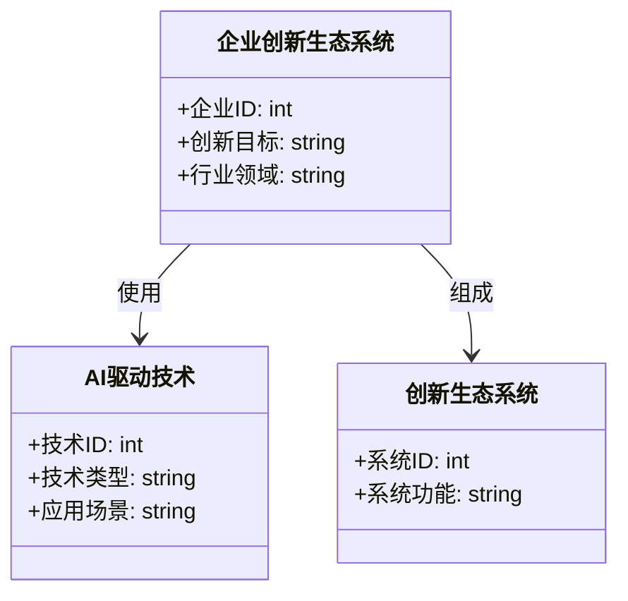

                 


# 构建AI驱动的企业创新生态系统分析平台

## 关键词：AI、企业创新、生态系统分析平台、机器学习、自然语言处理、系统架构

## 摘要：  
随着企业创新的复杂化和数据化的推进，构建一个基于AI的创新生态系统分析平台成为必然趋势。本文详细阐述了该平台的背景、核心概念、算法原理、系统架构、项目实现及最佳实践，为企业的创新管理提供了新的思路和解决方案。

---

## 第一章：AI驱动的企业创新生态系统概述

### 1.1 问题背景与描述

#### 1.1.1 企业创新生态系统的核心问题
在当今快速变化的商业环境中，企业创新生态系统需要高效整合内部资源、外部合作伙伴以及客户反馈，以实现创新目标。然而，传统方法依赖人工分析，效率低下且难以捕捉复杂关系。

#### 1.1.2 当前企业创新面临的挑战
- 数据孤岛：企业内部和外部数据分散，难以整合。
- 创新速度：市场变化快，企业难以快速响应。
- 资源分配：难以精准匹配资源与创新需求。

#### 1.1.3 AI技术在企业创新中的潜力
AI能够通过数据挖掘、模式识别和知识图谱构建，帮助企业发现潜在创新机会，优化资源配置，提升创新效率。

### 1.2 问题解决与边界

#### 1.2.1 AI驱动的解决方案
通过机器学习和自然语言处理，构建一个智能化的分析平台，实时监控创新生态系统中的各项指标，提供数据支持和决策建议。

#### 1.2.2 系统的边界与外延
- 边界：平台专注于分析创新生态系统，不涉及企业内部的生产流程。
- 外延：平台可以与企业战略规划、市场营销等系统集成。

#### 1.2.3 核心要素与组成结构
- 数据采集模块：整合企业内外部数据。
- 分析模块：利用AI技术进行预测和优化。
- 可视化模块：提供直观的分析结果。

---

## 第二章：AI驱动的企业创新生态系统核心概念

### 2.1 核心概念与原理

#### 2.1.1 AI驱动的定义与特征
- **定义**：AI驱动是指利用机器学习、深度学习等技术，通过数据驱动的方式进行决策和优化。
- **特征**：自动化、数据驱动、实时性。

#### 2.1.2 企业创新生态系统的构成
- **内部资源**：企业内部的研发能力、人力资源。
- **外部合作伙伴**：供应商、客户、第三方机构。
- **客户反馈**：市场需求、客户满意度。

#### 2.1.3 两者的关联与协同
AI驱动技术能够将企业创新生态系统中的各项要素进行整合，形成一个动态优化的系统。

### 2.2 核心概念对比表

| **对比维度** | **AI驱动** | **传统驱动** |
|--------------|------------|--------------|
| 驱动力       | 数据驱动   | 人工驱动     |
| 效率         | 高          | 低            |
| 响应速度     | 快          | 慢            |

### 2.3 ER实体关系图

```mermaid
er
    entity 企业创新生态系统 {
        key(企业ID)
        attribute(企业名称)
        attribute(行业领域)
        attribute(创新目标)
    }
    entity AI驱动技术 {
        key(技术ID)
        attribute(技术类型)
        attribute(应用场景)
    }
    entity 创新生态系统 {
        key(系统ID)
        attribute(系统名称)
        attribute(系统功能)
    }
    relationship 关联关系 {
        from 企业创新生态系统
        to 创新生态系统
        association 拥有
    }
    relationship 技术支持 {
        from AI驱动技术
        to 创新生态系统
        association 提供支持
    }
```

---

## 第三章：算法原理

### 3.1 算法选择与实现

#### 3.1.1 机器学习算法
- 使用随机森林和XGBoost进行预测分析。
- 代码示例：
  ```python
  from sklearn.ensemble import RandomForestClassifier
  model = RandomForestClassifier()
  model.fit(X_train, y_train)
  ```

#### 3.1.2 自然语言处理
- 使用BERT模型进行文本分析。
- 代码示例：
  ```python
  from transformers import BertTokenizer, BertModel
  tokenizer = BertTokenizer.from_pretrained('bert-base-uncased')
  model = BertModel.from_pretrained('bert-base-uncased')
  ```

#### 3.1.3 数学模型
- 预测模型公式：
  $$ y = \beta_0 + \beta_1x_1 + \beta_2x_2 + \epsilon $$

---

## 第四章：系统分析与架构设计

### 4.1 系统架构设计

#### 4.1.1 领域模型


#### 4.1.2 系统架构图


---

## 第五章：项目实战

### 5.1 环境安装

#### 5.1.1 Python环境
- 安装Python 3.8及以上版本。
- 安装必要的库：
  ```bash
  pip install numpy pandas scikit-learn transformers
  ```

### 5.2 核心实现

#### 5.2.1 数据采集
- 使用API获取企业数据。
- 代码示例：
  ```python
  import requests
  response = requests.get('http://api.example.com/data')
  data = response.json()
  ```

#### 5.2.2 分析模块
- 实现预测功能：
  ```python
  def predict(innovation_target):
      return model.predict([[innovation_target]])
  ```

### 5.3 案例分析
- 以一家科技公司为例，展示平台的应用效果。

---

## 第六章：总结与展望

### 6.1 最佳实践

#### 6.1.1 数据质量管理
- 确保数据的准确性和完整性。

#### 6.1.2 系统维护
- 定期更新模型和优化算法。

### 6.2 小结

本文详细介绍了AI驱动的企业创新生态系统分析平台的构建过程，从背景分析到算法实现，再到系统设计和项目实战，为企业的创新管理提供了新的思路。

### 6.3 注意事项

- 系统上线前进行充分测试。
- 定期收集用户反馈，优化系统功能。

### 6.4 拓展阅读

推荐阅读《机器学习实战》和《深度学习入门》。

---

## 作者：AI天才研究院/AI Genius Institute & 禅与计算机程序设计艺术/Zen And The Art of Computer Programming

