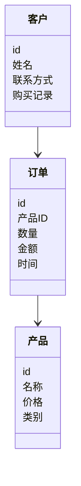
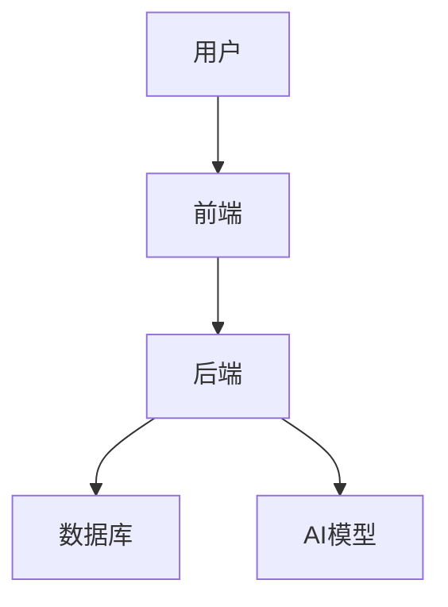
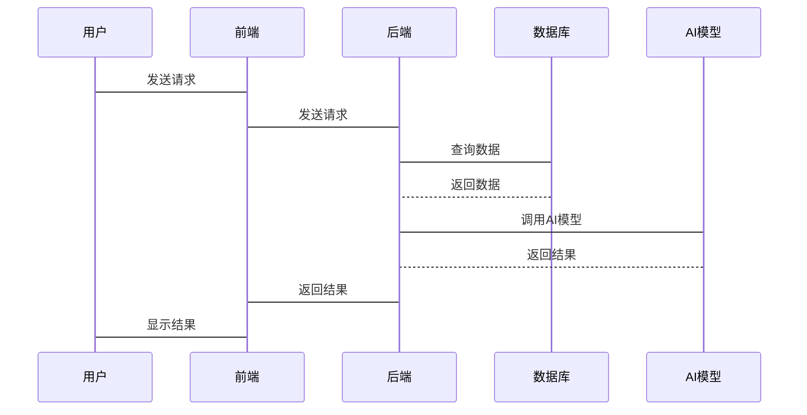

                 


# 构建AI驱动的企业客户关系管理(CRM)系统

> 关键词：AI驱动，CRM系统，客户关系管理，人工智能，机器学习，自然语言处理

> 摘要：本文将详细探讨如何利用人工智能技术构建高效、智能的企业客户关系管理（CRM）系统。通过分析AI在CRM中的应用场景、核心算法原理、系统架构设计以及实际项目实现，帮助读者全面理解AI驱动CRM的核心思想和实现方法。

---

# 第一部分：AI驱动的企业客户关系管理(CRM)系统概述

## 第1章：企业客户关系管理(CRM)概述

### 1.1 CRM的定义与核心功能

#### 1.1.1 CRM的定义
客户关系管理（CRM）是一种以客户为中心的管理方法，旨在通过优化与客户的互动，提高客户满意度和忠诚度，从而实现企业业务目标。

#### 1.1.2 CRM的核心功能模块
- 客户信息管理：包括客户的基本信息、联系方式、交易记录等。
- 销售管理：包括销售机会、销售预测、订单管理等。
- 市场营销：包括市场活动策划、客户细分、营销自动化等。
- 客户服务：包括客户支持、问题跟踪、反馈管理等。

#### 1.1.3 CRM在企业中的作用与价值
- 提高客户满意度和忠诚度
- 提升销售效率和团队协作
- 优化市场营销策略
- 支持数据驱动的决策

### 1.2 AI技术与CRM的结合

#### 1.2.1 AI技术的基本概念
人工智能（AI）是指计算机系统模拟人类智能的能力，包括学习、推理、自我改进等。

#### 1.2.2 AI在CRM中的应用场景
- 自动化客户支持：通过聊天机器人解决客户问题。
- 智能预测：预测客户行为、销售趋势等。
- 个性化推荐：基于客户数据推荐产品或服务。

#### 1.2.3 AI驱动CRM的优势与挑战
- 优势：提高效率、降低成本、增强客户体验。
- 挑战：数据隐私问题、模型精度限制、技术门槛高。

### 1.3 本章小结
本章介绍了CRM的基本概念、核心功能以及AI技术在CRM中的应用，为后续内容奠定了基础。

---

# 第二部分：AI驱动CRM的核心概念与技术原理

## 第2章：AI驱动CRM的核心概念

### 2.1 数据驱动的客户洞察

#### 2.1.1 数据采集与处理
- 数据来源：CRM系统、社交媒体、在线调查等。
- 数据清洗：去除重复数据、处理缺失值、标准化数据。

#### 2.1.2 客户画像与行为分析
- 客户画像：通过数据分析构建客户的三维画像。
- 行为分析：分析客户的购买习惯、浏览路径等。

#### 2.1.3 数据驱动的决策支持
- 数据可视化：通过图表展示数据分析结果。
- 预测模型：利用机器学习模型预测客户行为。

### 2.2 自然语言处理在CRM中的应用

#### 2.2.1 NLP的基本原理
- 分词：将文本分割成词语。
- 词性标注：给每个词语标注词性。
- 句法分析：分析句子的语法结构。

#### 2.2.2 常见NLP任务在CRM中的应用
- 情感分析：分析客户反馈的情感倾向。
- 实体识别：识别客户文本中的关键实体。
- 信息提取：从客户文本中提取有用信息。

#### 2.2.3 NLP模型的训练与优化
- 数据预处理：分词、去停用词等。
- 模型训练：使用深度学习模型（如BERT）进行训练。
- 模型优化：通过调整超参数提高模型性能。

### 2.3 智能推荐与预测

#### 2.3.1 推荐算法的基本原理
- 基于协同过滤的推荐：根据用户相似性推荐产品。
- 基于内容的推荐：根据产品特征推荐相似产品。

#### 2.3.2 预测模型的构建与应用
- 预测客户流失：通过机器学习模型预测客户流失概率。
- 预测销售机会：预测销售机会的转化率。

#### 2.3.3 智能推荐系统的实现
- 数据采集：收集客户行为数据。
- 模型训练：训练推荐模型。
- 系统部署：将推荐系统集成到CRM系统中。

### 2.4 本章小结
本章详细介绍了AI驱动CRM中的核心概念，包括数据驱动的客户洞察、自然语言处理的应用以及智能推荐与预测。

---

# 第三部分：AI驱动CRM的算法原理与数学模型

## 第3章：AI驱动CRM的算法原理

### 3.1 机器学习在CRM中的应用

#### 3.1.1 机器学习的基本概念
- 监督学习：根据带标签的数据进行学习。
- 无监督学习：从无标签数据中发现模式。
- 强化学习：通过与环境交互学习策略。

#### 3.1.2 常见机器学习算法在CRM中的应用
- 线性回归：预测客户购买概率。
- 支持向量机（SVM）：分类客户类型。
- 随机森林：分类和回归任务。

#### 3.1.3 机器学习模型的训练与优化
- 数据预处理：特征选择、数据归一化。
- 模型训练：使用训练数据训练模型。
- 模型评估：通过交叉验证评估模型性能。

### 3.2 深度学习在CRM中的应用

#### 3.2.1 深度学习的基本概念
- 神经网络：由多个层次的神经元构成。
- 卷积神经网络（CNN）：擅长处理图像数据。
- 循环神经网络（RNN）：擅长处理序列数据。

#### 3.2.2 常见深度学习模型在CRM中的应用
- 情感分析：使用LSTM进行文本情感分析。
- 客户画像：使用深度学习模型进行客户画像。

#### 3.2.3 深度学习模型的训练与优化
- 数据预处理：文本数据的分词和向量化。
- 模型训练：使用GPU加速训练。
- 模型优化：调整学习率、批量大小等超参数。

### 3.3 自然语言处理算法在CRM中的应用

#### 3.3.1 NLP算法的基本原理
- 词向量：将词语转换为向量表示。
- 句子表示：将句子转换为向量表示。
- 文档表示：将文档转换为向量表示。

#### 3.3.2 常见NLP算法在CRM中的应用
- 情感分析：判断客户反馈的情感倾向。
- 实体识别：识别客户文本中的关键实体。
- 信息提取：从客户文本中提取有用信息。

#### 3.3.3 NLP模型的训练与优化
- 数据预处理：分词、去停用词等。
- 模型训练：使用预训练模型（如BERT）进行微调。
- 模型优化：通过调整超参数提高模型性能。

### 3.4 本章小结
本章详细介绍了AI驱动CRM中的算法原理，包括机器学习、深度学习和自然语言处理的应用。

---

## 第4章：AI驱动CRM的系统架构设计

### 4.1 问题场景介绍
- 客户数据分散：客户信息分布在不同的系统中。
- 数据分析困难：难以从大量数据中提取有用信息。
- 客户互动效率低：客户支持响应慢，个性化推荐不足。

### 4.2 系统功能设计

#### 4.2.1 领域模型设计


#### 4.2.2 系统架构设计


### 4.3 系统接口设计
- 用户接口：提供图形化界面供用户操作。
- 数据接口：提供API供其他系统调用。
- AI模型接口：提供API供前端调用AI模型。

### 4.4 系统交互设计



### 4.5 本章小结
本章详细介绍了AI驱动CRM系统的架构设计，包括系统功能设计、架构设计、接口设计和交互设计。

---

## 第5章：AI驱动CRM的项目实战

### 5.1 环境安装

#### 5.1.1 安装Python
```bash
python --version
pip install --upgrade pip
```

#### 5.1.2 安装机器学习库
```bash
pip install numpy
pip install scikit-learn
pip install transformers
pip install torch
```

#### 5.1.3 安装NLP库
```bash
pip install nltk
pip install spacy
```

### 5.2 系统核心实现源代码

#### 5.2.1 数据预处理代码
```python
import pandas as pd
import numpy as np

# 读取数据
data = pd.read_csv('data.csv')

# 数据清洗
data.dropna(inplace=True)
data = data.drop_duplicates()
```

#### 5.2.2 机器学习模型实现
```python
from sklearn.model_selection import train_test_split
from sklearn.linear_model import LogisticRegression

# 划分数据集
X_train, X_test, y_train, y_test = train_test_split(data.drop('label', axis=1), data['label'], test_size=0.2)

# 训练模型
model = LogisticRegression()
model.fit(X_train, y_train)

# 预测
y_pred = model.predict(X_test)
```

#### 5.2.3 深度学习模型实现
```python
import torch
import torch.nn as nn

# 定义模型
class Model(nn.Module):
    def __init__(self):
        super(Model, self).__init__()
        self.fc1 = nn.Linear(10, 5)
        self.fc2 = nn.Linear(5, 1)

    def forward(self, x):
        x = self.fc1(x)
        x = self.fc2(x)
        return x

# 训练模型
model = Model()
criterion = nn.BCELoss()
optimizer = torch.optim.Adam(model.parameters(), lr=0.001)

for epoch in range(100):
    outputs = model(X_train)
    loss = criterion(outputs, y_train)
    optimizer.zero_grad()
    loss.backward()
    optimizer.step()
```

### 5.3 代码解读与分析
- 数据预处理代码：读取数据并进行清洗。
- 机器学习模型实现：使用逻辑回归模型进行分类。
- 深度学习模型实现：定义一个简单的神经网络并进行训练。

### 5.4 实际案例分析
- 数据来源：客户购买记录、客户反馈等。
- 模型应用：预测客户流失、推荐产品等。

### 5.5 项目小结
本章通过实际项目展示了AI驱动CRM系统的实现过程，包括环境安装、代码实现和案例分析。

---

## 第6章：AI驱动CRM的最佳实践

### 6.1 小结
- 本章总结了AI驱动CRM的核心思想和实现方法。

### 6.2 注意事项
- 数据隐私保护：确保客户数据的安全。
- 模型优化：持续优化模型以提高性能。
- 技术选型：根据需求选择合适的AI技术。

### 6.3 拓展阅读
- 推荐书籍：《机器学习实战》、《深度学习入门》。
- 推荐博客：人工智能领域知名博客。

### 6.4 本章小结
本章总结了AI驱动CRM系统的最佳实践，包括小结、注意事项和拓展阅读。

---

# 第四部分：附录

## 附录A：AI驱动CRM系统相关API文档

### A.1 REST API接口
- GET /customers：获取所有客户信息。
- POST /predict：调用AI模型进行预测。

## 附录B：工具推荐

### B.1 数据分析工具
- Pandas
- NumPy
- Matplotlib

### B.2 机器学习框架
- Scikit-learn
- TensorFlow
- PyTorch

### B.3 自然语言处理工具
- NLTK
- SpaCy
- Hugging Face Transformers

## 附录C：参考文献

1. 周志华. 《机器学习实战》. 清华大学出版社, 2016.
2. LeCun Y, Bengio Y, Hinton G. Deep learning. Nature, 2015.
3. 王立新. 《自然语言处理入门》. 人民邮电出版社, 2020.

---

# 作者：AI天才研究院/AI Genius Institute & 禅与计算机程序设计艺术 /Zen And The Art of Computer Programming

