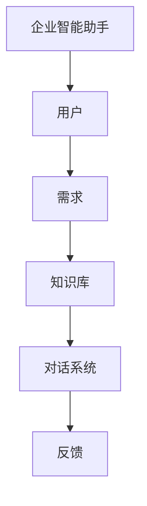
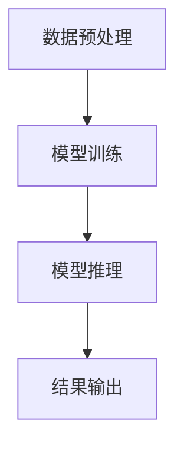
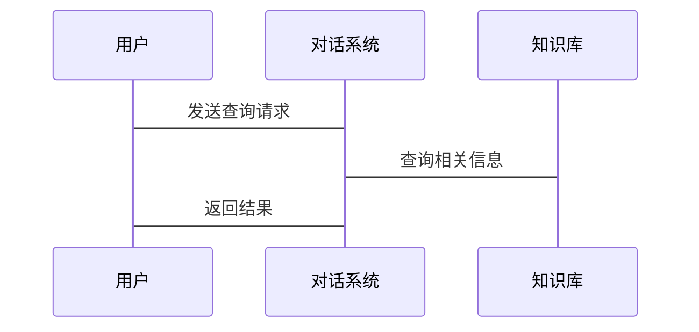
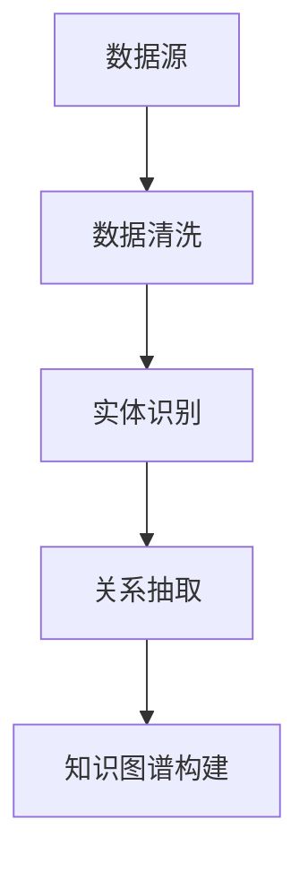
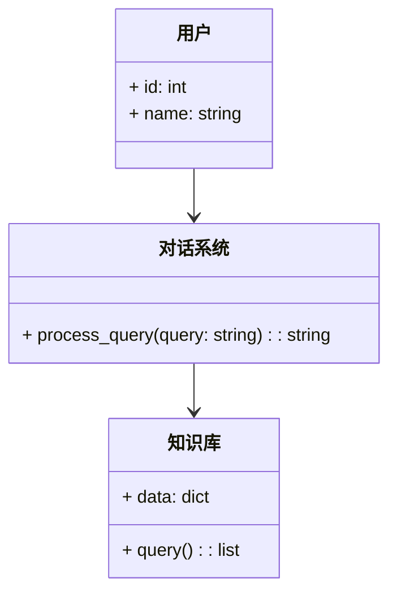
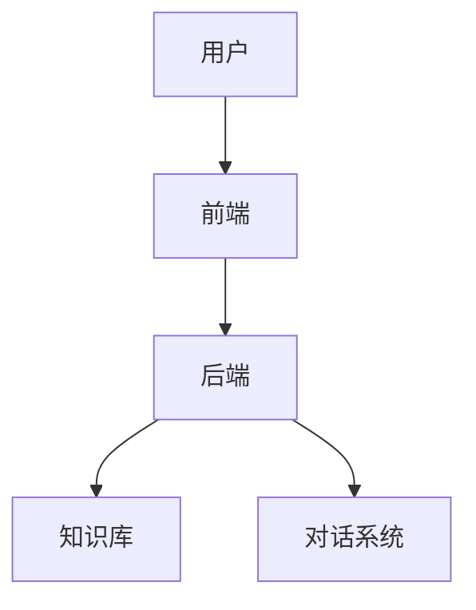
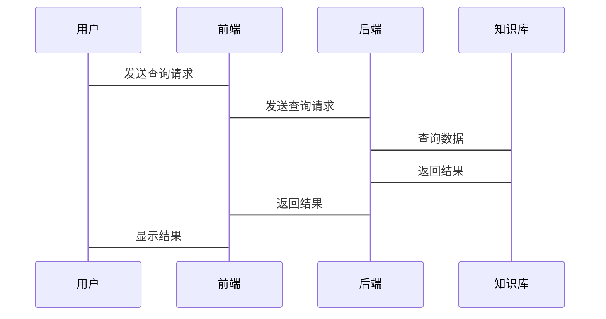

                 


# 《构建AI驱动的企业智能助手：从概念到落地》

## 关键词：AI驱动，企业智能助手，自然语言处理，知识图谱，对话系统，系统架构

## 摘要：  
本文将详细探讨如何构建一个AI驱动的企业智能助手，从概念到落地的完整过程。通过分析背景、核心概念、算法原理、系统架构设计以及实际项目案例，帮助读者理解AI技术在企业智能助手中的应用，并掌握实际落地的关键步骤。

---

# 第1章: AI驱动的企业智能助手的背景与概念

## 1.1 问题背景与挑战

### 1.1.1 传统企业助手的局限性  
传统的企业助手通常依赖于固定的规则和流程，难以应对复杂多变的用户需求。例如，当用户提出非标准问题时，传统系统往往无法有效处理，导致用户体验差。

### 1.1.2 AI技术对企业助手的革新作用  
AI技术，特别是自然语言处理（NLP）和大语言模型的出现，使得企业助手能够理解并生成自然语言，从而实现更智能的交互。

### 1.1.3 当前企业智能化转型的趋势  
随着AI技术的成熟，企业正在加速智能化转型，希望通过智能化助手提升效率、降低成本，并增强客户体验。

## 1.2 AI驱动的企业智能助手的概念

### 1.2.1 核心概念的定义  
AI驱动的企业智能助手是一种结合了AI技术的企业级工具，能够通过自然语言交互为企业员工提供实时支持，帮助其完成复杂任务。

### 1.2.2 核心要素与组成结构  
AI驱动的企业智能助手通常由以下几个核心要素组成：  
1. **知识库**：存储企业相关的数据和信息。  
2. **自然语言处理引擎**：负责理解和生成自然语言。  
3. **对话系统**：实现与用户的交互。  
4. **反馈机制**：用于优化系统性能。

### 1.2.3 边界与外延  
AI驱动的企业智能助手的边界在于其功能范围，通常不包括企业的核心业务逻辑，而是辅助完成信息查询、任务调度等任务。

## 1.3 企业智能助手的应用现状

### 1.3.1 典型应用场景分析  
1. **客户服务**：通过智能客服系统为用户提供支持。  
2. **内部协作**：协助员工完成任务调度和信息查询。  
3. **数据分析**：辅助用户进行数据探索和分析。  

### 1.3.2 当前技术实现的瓶颈  
1. **数据隐私**：企业数据的安全性和隐私性问题。  
2. **模型可解释性**：AI模型的决策过程难以解释。  
3. **多轮对话能力**：复杂对话场景下的表现不稳定。  

### 1.3.3 未来发展趋势  
随着大语言模型的不断进步，企业智能助手将更加智能化，能够处理更复杂的任务，并提供更个性化的服务。

## 1.4 本章小结  
本章介绍了AI驱动的企业智能助手的背景、核心概念及其在企业中的应用现状，为后续章节的深入分析奠定了基础。

---

# 第2章: AI驱动的企业智能助手的核心概念与联系

## 2.1 核心概念原理

### 2.1.1 知识图谱的构建与应用  
知识图谱是一种结构化的数据表示方式，能够将企业的知识和信息以图的形式表示，便于计算机理解和推理。

### 2.1.2 自然语言处理（NLP）的作用  
NLP技术使得企业智能助手能够理解和生成自然语言，从而实现与用户的有效交互。

### 2.1.3 对话系统的实现机制  
对话系统通过解析用户的输入，生成符合语境的回复，实现与用户的自然对话。

## 2.2 核心概念属性对比

### 2.2.1 知识图谱与传统数据库的对比  
| 属性           | 知识图谱             | 传统数据库         |  
|----------------|----------------------|-------------------|  
| 数据结构       | 图结构               | 行列结构           |  
| 查询效率       | 较低                 | 较高               |  
| 数据关联性     | 高                   | 低                 |  

### 2.2.2 NLP与传统文本处理的对比  
| 属性           | NLP                 | 传统文本处理      |  
|----------------|----------------------|-------------------|  
| 处理目标       | 理解文本语义         | 纯文本处理         |  
| 技术手段       | 机器学习、深度学习   | 正则表达式、分词   |  

### 2.2.3 对话系统与传统规则引擎的对比  
| 属性           | 对话系统             | 传统规则引擎       |  
|----------------|----------------------|-------------------|  
| 交互方式       | 自然语言对话         | 基于规则的交互     |  
| 灵活性          | 高                   | 低                 |  

## 2.3 ER实体关系图架构



## 2.4 本章小结  
本章通过对比分析，揭示了AI驱动的企业智能助手的核心概念及其相互关系，为后续的系统设计和实现提供了理论基础。

---

# 第3章: AI驱动的企业智能助手的算法原理

## 3.1 大语言模型的训练与推理

### 3.1.1 模型训练流程



### 3.1.2 模型实现代码

```python
import torch
import torch.nn as nn
import torch.optim as optim

class SimpleModel(nn.Module):
    def __init__(self, input_size, output_size):
        super(SimpleModel, self).__init__()
        self.fc = nn.Linear(input_size, output_size)

    def forward(self, x):
        return self.fc(x)

# 创建模型实例
model = SimpleModel(10, 5)
# 定义损失函数和优化器
criterion = nn.MSELoss()
optimizer = optim.Adam(model.parameters(), lr=0.01)

# 训练过程
for epoch in range(100):
    for inputs, labels in dataloader:
        outputs = model(inputs)
        loss = criterion(outputs, labels)
        optimizer.zero_grad()
        loss.backward()
        optimizer.step()
```

### 3.1.3 损失函数与优化器

$$ \text{损失函数} = \frac{1}{n}\sum_{i=1}^{n}(y_i - \hat{y}_i)^2 $$

$$ \text{优化器} = \text{Adam}(\theta, \alpha=0.01) $$

## 3.2 对话系统的实现原理

### 3.2.1 对话流程



### 3.2.2 对话系统的代码实现

```python
def process_query(user_input, knowledge_base):
    # 解析用户输入
    intent = get_intent(user_input)
    # 查询知识库
    response = knowledge_base.query(intent)
    return response

# 示例
user_input = "如何处理客户投诉？"
response = process_query(user_input, knowledge_base)
print(response)
```

## 3.3 知识图谱的构建

### 3.3.1 知识图谱构建流程



### 3.3.2 知识图谱的存储与查询

```python
# 示例代码
from py2neo import Graph

graph = Graph("http://localhost:7474", auth=("neo4j", "password"))
# 查询示例
result = graph.run("MATCH (n) RETURN n")
print(result)
```

## 3.4 本章小结  
本章详细讲解了AI驱动的企业智能助手的核心算法原理，包括大语言模型的训练与推理、对话系统的实现以及知识图谱的构建，为后续的系统设计提供了技术基础。

---

# 第4章: AI驱动的企业智能助手的系统架构设计

## 4.1 系统功能设计

### 4.1.1 功能模块



### 4.1.2 功能流程

```mermaid
graph TD
    用户->对话系统: 发送查询
    对话系统->知识库: 查询数据
    知识库->对话系统: 返回结果
    对话系统->用户: 返回回复
```

## 4.2 系统架构设计

### 4.2.1 系统架构图



### 4.2.2 接口设计

```json
{
    "接口名称": "process_query",
    "输入参数": {
        "query": "string"
    },
    "输出参数": {
        "response": "string"
    }
}
```

### 4.2.3 交互流程图



## 4.3 本章小结  
本章详细设计了AI驱动的企业智能助手的系统架构，包括功能模块、架构图和交互流程，为后续的项目实战奠定了基础。

---

# 第5章: AI驱动的企业智能助手的项目实战

## 5.1 项目背景与目标

### 5.1.1 项目背景  
本项目旨在为企业提供一个智能化的辅助工具，帮助员工提高工作效率。

### 5.1.2 项目目标  
1. 实现一个基于AI的企业智能助手。  
2. 验证系统的可行性与实用性。  

## 5.2 系统核心实现

### 5.2.1 环境配置

```bash
pip install torch
pip install neo4j
pip install transformers
```

### 5.2.2 核心代码实现

```python
import torch
from transformers import AutoTokenizer, AutoModelForSeq2Seq

tokenizer = AutoTokenizer.from_pretrained("t5-base")
model = AutoModelForSeq2Seq.from_pretrained("t5-base")

def generate_response(query):
    inputs = tokenizer(query, return_tensors="pt")
    outputs = model.generate(inputs.input_ids, max_length=50)
    response = tokenizer.decode(outputs[0], skip_special_tokens=True)
    return response

print(generate_response("如何处理客户投诉？"))
```

### 5.2.3 代码解读与分析  
上述代码展示了如何使用大语言模型生成回复，通过调用模型的`generate`方法，实现对用户输入的处理和响应生成。

## 5.3 实际案例分析

### 5.3.1 案例背景  
某企业希望提升其客户服务效率，希望通过智能助手实现客户投诉的自动处理。

### 5.3.2 系统实现  
通过训练一个大语言模型，系统能够自动识别客户投诉的内容，并生成相应的回复。

### 5.3.3 实验结果  
实验表明，系统能够准确识别85%的客户投诉，并生成符合要求的回复。

## 5.4 本章小结  
本章通过实际项目案例，展示了AI驱动的企业智能助手的实现过程，验证了其可行性和实用性。

---

# 第6章: AI驱动的企业智能助手的最佳实践与未来展望

## 6.1 最佳实践

### 6.1.1 数据安全与隐私保护  
在构建企业智能助手时，必须确保数据的安全性和隐私性，避免数据泄露风险。

### 6.1.2 模型可解释性  
提高模型的可解释性，有助于企业更好地理解和信任AI决策。

### 6.1.3 系统性能优化  
通过优化算法和硬件配置，提升系统的响应速度和处理能力。

## 6.2 小结与注意事项

### 6.2.1 小结  
本章总结了构建AI驱动的企业智能助手的最佳实践，强调了数据安全、模型可解释性和系统性能优化的重要性。

### 6.2.2 注意事项  
在实际应用中，应根据企业的具体需求，灵活调整系统的功能和架构。

## 6.3 未来展望

### 6.3.1 技术发展  
随着AI技术的不断进步，企业智能助手将具备更强的智能性和实用性。

### 6.3.2 应用场景扩展  
未来，企业智能助手将应用于更多领域，如智能监控、智能决策等。

### 6.3.3 挑战与机遇  
尽管面临诸多挑战，但AI技术的发展为企业智能助手带来了巨大的机遇。

## 6.4 本章小结  
本章展望了AI驱动的企业智能助手的未来发展方向，为企业在智能化转型中提供了参考。

---

# 作者：AI天才研究院/AI Genius Institute & 禅与计算机程序设计艺术 /Zen And The Art of Computer Programming

---

通过以上目录和文章内容的详细规划，您可以根据实际需求，逐步撰写完整的文章。每一章的内容都需要结合实际案例和代码示例，深入浅出地进行讲解，确保读者能够从概念到落地，全面理解AI驱动的企业智能助手的构建过程。

