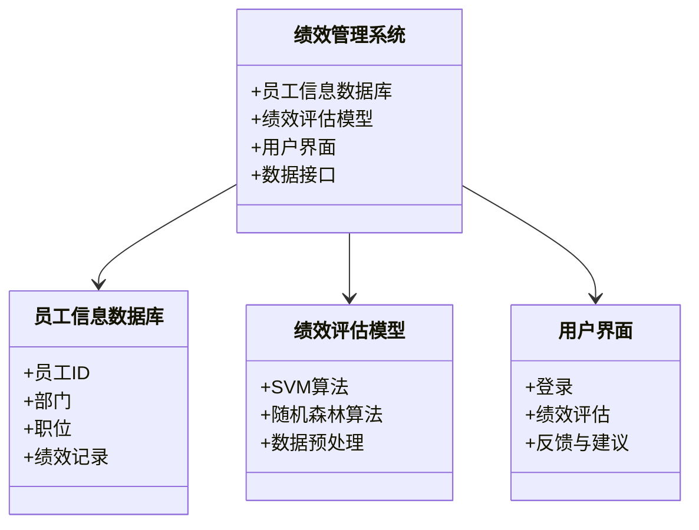

                 


# 构建AI驱动的企业绩效管理系统

## 关键词：AI, 绩效管理, 机器学习, 数据分析, 系统架构

## 摘要：  
本文探讨了如何利用人工智能技术构建企业绩效管理系统，通过结合机器学习算法和数据分析技术，优化企业绩效管理流程，提升决策效率和准确性。文章从背景、核心概念、算法原理、系统架构设计到项目实战，全面解析了AI驱动的绩效管理系统的构建过程，为企业数字化转型提供了理论和实践指导。

---

# 第一部分: AI驱动的企业绩效管理概述

## 第1章: 企业绩效管理的背景与挑战

### 1.1 企业绩效管理的定义与重要性

#### 1.1.1 绩效管理的核心概念  
绩效管理是指通过设定目标、评估员工或团队的工作成果，并根据评估结果进行反馈、奖励或改进的过程。它是企业管理中的核心环节，直接影响企业战略目标的实现和员工的工作积极性。

#### 1.1.2 绩效管理在企业管理中的作用  
- **目标设定**：确保员工工作与企业战略目标一致。  
- **绩效评估**：量化员工的工作成果，为薪酬、晋升提供依据。  
- **反馈与改进**：通过反馈帮助员工提升能力，优化团队表现。  

#### 1.1.3 数字化绩效管理的必要性  
随着企业规模扩大和业务复杂化，传统的手工绩效管理方式效率低、成本高且容易出错。数字化绩效管理通过自动化、智能化的方式，能够提高管理效率、降低人为误差，并为企业决策提供数据支持。

---

### 1.2 传统绩效管理的局限性

#### 1.2.1 传统绩效管理的流程与问题  
- **流程繁琐**：手工填写评估表、计算得分，耗时且效率低。  
- **主观性高**：评估结果受评估者的主观因素影响，可能导致不公平。  
- **数据孤岛**：各部门数据分散，难以形成统一的评估标准。  

#### 1.2.2 人工评估的主观性和不准确性  
- **主观判断**：评估者可能因个人偏见影响评估结果。  
- **数据不一致**：不同评估者对同一员工的评估可能差异较大。  

#### 1.2.3 数据孤岛与信息不透明的挑战  
- **信息分散**：员工绩效数据分散在各个部门，难以统一管理。  
- **信息不透明**：员工对评估结果缺乏透明度，容易引发不满。  

---

### 1.3 AI驱动绩效管理的潜力与价值

#### 1.3.1 AI在绩效管理中的应用场景  
- **数据驱动评估**：利用AI分析大量数据，提供客观的评估结果。  
- **实时反馈**：通过实时数据分析，快速生成反馈建议。  
- **个性化推荐**：根据员工表现和能力，个性化推荐培训和发展计划。  

#### 1.3.2 AI驱动绩效管理的优势  
- **提高效率**：自动化处理数据，减少人工操作时间。  
- **增强客观性**：通过算法消除主观因素，确保评估结果的公平性。  
- **数据整合与分析**：统一整合多源数据，提供更全面的绩效分析。  

#### 1.3.3 企业的数字化转型趋势  
随着企业数字化转型的推进，AI技术在企业管理中的应用越来越广泛。AI驱动的绩效管理系统能够帮助企业更好地应对市场竞争，提升管理效率和员工满意度。

---

## 1.4 本章小结  
本章介绍了企业绩效管理的背景、传统绩效管理的局限性以及AI驱动绩效管理的潜力与价值。通过分析，我们看到AI技术在绩效管理中的应用能够显著提升管理效率和决策的准确性，为企业数字化转型提供了重要支持。

---

# 第二部分: AI驱动绩效管理的核心概念与技术

## 第2章: AI与绩效管理的结合原理

### 2.1 AI技术在绩效管理中的核心作用

#### 2.1.1 数据分析与预测  
AI技术可以通过分析历史数据，预测员工未来的绩效表现。例如，利用机器学习算法预测员工在特定岗位上的表现，帮助企业优化人员配置。  

#### 2.1.2 自然语言处理在反馈中的应用  
自然语言处理（NLP）技术可以分析员工的反馈文本，提取关键信息并生成改进建议。例如，通过分析员工的满意度调查文本，识别出员工的主要不满点，并提出改进建议。  

#### 2.1.3 机器学习在绩效评估中的应用  
机器学习算法可以自动学习员工绩效的模式和特征，建立绩效评估模型，并根据模型预测员工的绩效得分。  

---

### 2.2 绩效管理中的数据流与AI处理流程

#### 2.2.1 数据采集与预处理  
- **数据来源**：员工的工作记录、销售数据、客户反馈、考勤记录等。  
- **数据预处理**：清洗数据、去除噪声、标准化处理。  

#### 2.2.2 数据分析与建模  
- **数据分析**：通过统计分析和可视化工具，识别数据中的模式和趋势。  
- **模型建立**：利用机器学习算法（如支持向量机、随机森林）建立绩效评估模型。  

#### 2.2.3 结果反馈与优化  
- **结果反馈**：将AI生成的评估结果反馈给员工和管理者。  
- **模型优化**：根据新的数据和反馈，不断优化模型，提高预测准确性。  

---

### 2.3 AI驱动绩效管理的系统架构

#### 2.3.1 数据层  
- **数据来源**：整合来自不同部门的数据，形成统一的数据源。  
- **数据存储**：将数据存储在数据库中，便于后续处理和分析。  

#### 2.3.2 模型层  
- **算法选择**：根据具体需求选择合适的机器学习算法。  
- **模型训练**：利用训练数据对模型进行训练，生成绩效评估模型。  

#### 2.3.3 应用层  
- **用户界面**：设计友好的用户界面，方便用户查看评估结果和反馈。  
- **实时分析**：通过实时数据分析，提供即时反馈和建议。  

---

## 2.4 本章小结  
本章详细介绍了AI技术在绩效管理中的核心作用，包括数据分析与预测、自然语言处理在反馈中的应用以及机器学习在绩效评估中的应用。同时，还描述了AI驱动绩效管理的系统架构，为后续章节的系统设计奠定了基础。

---

# 第三部分: AI驱动绩效管理的算法与数学模型

## 第3章: 支持向量机（SVM）在绩效预测中的应用

### 3.1 支持向量机的基本原理

#### 3.1.1 SVM的定义与核心思想  
支持向量机（Support Vector Machine, SVM）是一种监督学习算法，主要用于分类和回归问题。其核心思想是通过找到一个超平面，将数据点分成不同的类别。  

#### 3.1.2 SVM的数学模型  
$$ \text{目标函数: } \min_{w,b,\xi} \frac{1}{2}||w||^2 + C\sum_{i=1}^n \xi_i $$
其中，$w$ 是法向量，$b$ 是偏置项，$\xi_i$ 是松弛变量，$C$ 是惩罚参数。  

#### 3.1.3 SVM的优化过程  
通过求解拉格朗日对偶问题，将原始优化问题转化为对偶问题，从而简化计算。  

---

### 3.2 SVM在绩效预测中的应用

#### 3.2.1 数据准备与特征选择  
- **数据准备**：收集员工绩效相关的数据，包括销售业绩、出勤率、客户满意度等。  
- **特征选择**：选择对绩效影响最大的特征，如销售业绩、团队合作能力等。  

#### 3.2.2 模型训练与评估  
- **模型训练**：利用训练数据对SVM模型进行训练，生成绩效预测模型。  
- **模型评估**：通过测试数据评估模型的准确率、召回率等指标，确保模型的性能。  

#### 3.2.3 模型优化  
- **参数调优**：通过调整惩罚参数$C$和核函数参数，优化模型性能。  
- **交叉验证**：利用交叉验证方法评估模型的泛化能力，防止过拟合。  

---

### 3.3 SVM的代码实现与案例分析

#### 3.3.1 环境配置  
- **Python版本**：Python 3.8及以上  
- **依赖库安装**：`scikit-learn`, `numpy`, `pandas`  

#### 3.3.2 代码实现  
```python
from sklearn import svm
from sklearn.metrics import accuracy_score
from sklearn.model_selection import train_test_split

# 数据准备
data = [...]  # 包含员工绩效相关特征的数据
target = [...]  # 绩效评分标签（0或1）

# 数据分割
X_train, X_test, y_train, y_test = train_test_split(data, target, test_size=0.2)

# 模型训练
model = svm.SVC(C=1, kernel='linear')
model.fit(X_train, y_train)

# 模型预测
y_pred = model.predict(X_test)

# 模型评估
print("准确率:", accuracy_score(y_test, y_pred))
```

#### 3.3.3 案例分析  
假设我们有一个包含销售业绩、出勤率、客户满意度等特征的数据集，目标是预测员工的绩效等级。通过SVM模型，我们可以训练出一个绩效预测模型，并在测试数据上评估其准确性。  

---

## 3.4 本章小结  
本章通过实例详细讲解了支持向量机（SVM）在绩效预测中的应用，包括SVM的基本原理、模型训练与优化以及代码实现。通过案例分析，展示了如何利用SVM算法提高绩效预测的准确性。

---

# 第四部分: 系统分析与架构设计

## 第4章: AI驱动绩效管理系统的架构设计

### 4.1 问题场景介绍  
本章将通过一个具体的案例，介绍如何设计一个AI驱动的企业绩效管理系统。假设我们有一个中型制造企业，希望通过AI技术优化其绩效管理流程。  

---

### 4.2 系统功能设计

#### 4.2.1 领域模型设计  
通过Mermaid类图展示系统的各个模块及其关系：  


---

### 4.3 系统架构设计

#### 4.3.1 系统架构图  
通过Mermaid架构图展示系统的整体架构：  


---

### 4.4 系统接口设计  
- **数据接口**：提供RESTful API接口，用于与其他系统（如HR系统、销售系统）对接，获取员工数据。  
- **用户接口**：提供Web界面，供管理者查看绩效评估结果和员工查看反馈。  

---

### 4.5 系统交互设计  
通过Mermaid序列图展示系统交互流程：  
```mermaid
sequenceDiagram
    actor 用户
    participant 系统: 绩效管理系统
    participant 数据库: 员工信息数据库
    participant 模型: 绩效评估模型

    用户 -> 系统: 请求绩效评估
    系统 -> 数据库: 查询员工信息
    数据库 --> 系统: 返回员工信息
    系统 -> 模型: 调用绩效评估模型
    模型 --> 系统: 返回评估结果
    系统 -> 用户: 返回评估结果
```

---

## 4.6 本章小结  
本章通过具体的案例，详细介绍了AI驱动绩效管理系统的架构设计，包括领域模型设计、系统架构图、接口设计和交互流程设计。通过这些设计，我们可以清晰地看到AI技术在绩效管理中的具体应用和实现方式。

---

# 第五部分: 项目实战

## 第5章: AI驱动绩效管理系统的实现

### 5.1 环境安装与配置

#### 5.1.1 安装Python和依赖库  
- **Python**：确保安装了Python 3.8及以上版本。  
- **依赖库**：安装`scikit-learn`, `pandas`, `numpy`, `flask`。  

#### 5.1.2 安装开发工具  
- **IDE**：推荐使用PyCharm或VS Code。  
- **版本控制**：使用Git进行代码管理。  

---

### 5.2 系统核心实现

#### 5.2.1 数据采集与预处理  
```python
import pandas as pd
import numpy as np

# 数据加载
data = pd.read_csv('performance_data.csv')

# 数据预处理
data = data.dropna()  # 删除缺失值
data = pd.get_dummies(data)  # 对分类变量进行独热编码
```

#### 5.2.2 绩效评估模型训练  
```python
from sklearn.model_selection import train_test_split
from sklearn.svm import SVC
from sklearn.metrics import accuracy_score

# 数据分割
X = data.drop('performance_score', axis=1)
y = data['performance_score']
X_train, X_test, y_train, y_test = train_test_split(X, y, test_size=0.2)

# 模型训练
model = SVC(C=1, kernel='linear')
model.fit(X_train, y_train)

# 模型预测
y_pred = model.predict(X_test)
print("准确率:", accuracy_score(y_test, y_pred))
```

#### 5.2.3 系统接口开发  
```python
from flask import Flask, jsonify, request

app = Flask(__name__)

@app.route('/api/performace_assessment', methods=['POST'])
def performance_assessment():
    data = request.json
    # 数据预处理
    processed_data = preprocess(data)
    # 调用模型进行评估
    prediction = model.predict(processed_data)
    return jsonify({'performance_score': prediction[0]})

if __name__ == '__main__':
    app.run(debug=True)
```

---

### 5.3 代码应用解读与分析  
- **数据采集与预处理**：通过读取CSV文件并进行数据清洗和特征工程，确保数据质量。  
- **模型训练**：利用支持向量机算法训练绩效评估模型，并评估模型的性能。  
- **系统接口开发**：通过Flask框架开发RESTful API接口，提供绩效评估服务。  

---

### 5.4 案例分析与详细讲解  
假设我们有一个包含以下字段的员工数据集：  
- `employee_id`：员工ID  
- `department`：部门  
- `position`：职位  
- `sales业绩`：销售业绩  
- `attendance`：出勤率  
- `customer_satisfaction`：客户满意度  

通过上述代码实现，我们可以训练出一个基于SVM的绩效评估模型，并通过API接口提供绩效评估服务。  

---

## 5.5 项目小结  
本章通过实际案例，详细讲解了AI驱动绩效管理系统的实现过程，包括环境配置、数据处理、模型训练以及系统接口开发。通过这些步骤，我们可以快速搭建一个基于AI的绩效管理系统，并将其应用到实际的企业管理中。

---

# 第六部分: 最佳实践与总结

## 第6章: 最佳实践与总结

### 6.1 最佳实践

#### 6.1.1 数据预处理的重要性  
- 确保数据的完整性和一致性，避免噪声数据对模型的影响。  

#### 6.1.2 模型选择与调优  
- 根据具体场景选择合适的算法，并通过交叉验证和超参数优化提高模型性能。  

#### 6.1.3 系统集成与安全性  
- 确保系统的数据安全和权限管理，防止数据泄露和未授权访问。  

---

### 6.2 小结与注意事项

#### 6.2.1 小结  
- AI技术在绩效管理中的应用能够显著提高管理效率和决策准确性。  
- 通过数据驱动的方式，企业可以更好地实现绩效目标，并为员工提供个性化的反馈与建议。  

#### 6.2.2 注意事项  
- 在实际应用中，需要注意数据隐私和合规性问题。  
- 系统的可解释性和透明度是确保员工信任的重要因素。  

---

### 6.3 拓展阅读

#### 6.3.1 推荐书籍  
- 《机器学习实战》  
- 《企业级应用架构设计》  

#### 6.3.2 在线资源  
- [scikit-learn官方文档](https://scikit-learn.org/stable/index.html)  
- [Mermaid图表工具](https://mermaid-js.github.io/mermaid-live-editor/)  

---

## 作者：AI天才研究院/AI Genius Institute & 禅与计算机程序设计艺术/Zen And The Art of Computer Programming  

---

# 本文到此结束，感谢您的阅读！

