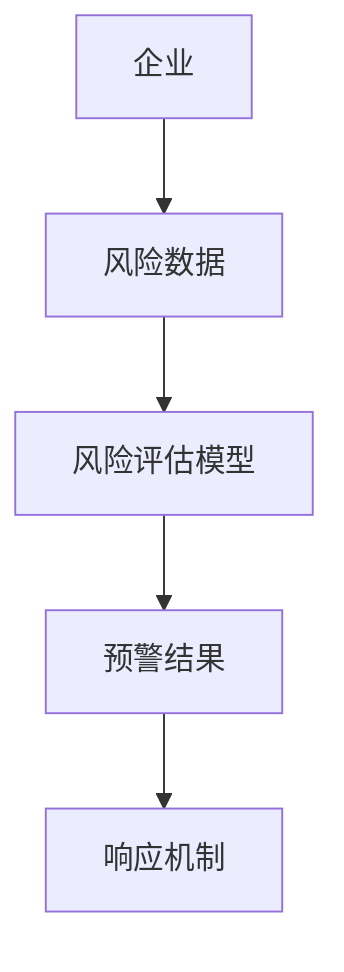
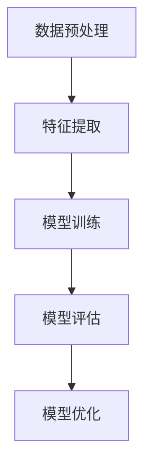
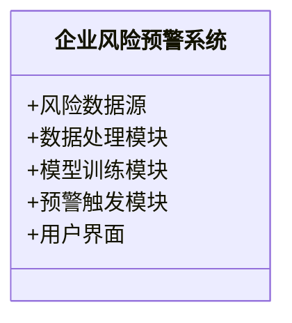
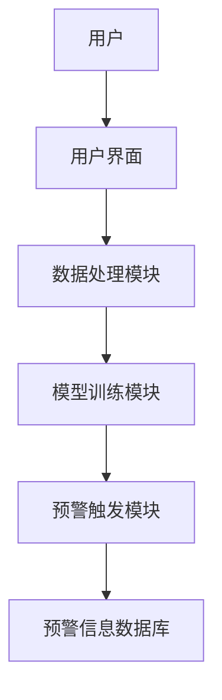
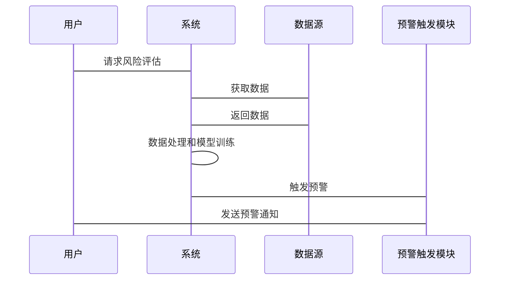

                 


# 构建AI驱动的企业风险预警系统

> 关键词：企业风险预警系统，AI驱动，机器学习，深度学习，风险数据，预警机制

> 摘要：本文将详细探讨如何构建一个基于人工智能的企业风险预警系统。首先，我们将介绍企业风险管理的重要性以及当前存在的痛点，然后分析AI驱动的风险预警系统的核心概念和原理。接下来，我们将深入讲解系统架构设计，包括功能设计、架构图和接口设计，并通过实际案例展示如何利用机器学习和深度学习算法实现风险预测和预警。最后，我们将分享一些最佳实践和项目总结，帮助读者更好地理解和应用这一系统。

---

# 第一部分: 企业风险预警系统概述

# 第1章: 企业风险预警系统背景与概念

## 1.1 企业风险预警的背景与问题背景

### 1.1.1 企业风险管理的重要性

企业风险管理是企业管理的核心组成部分，直接关系到企业的生存和发展。在当今复杂多变的商业环境中，企业面临的风险种类繁多，包括市场风险、信用风险、操作风险、法律风险等。及时发现和应对这些风险，可以帮助企业在危机中屹立不倒。

### 1.1.2 风险预警系统的核心目标

风险预警系统的目的是通过实时监控和分析企业内外部数据，识别潜在风险，并提前发出预警信号，以便企业采取相应的措施。AI驱动的风险预警系统利用机器学习和深度学习技术，能够快速处理大量数据，提高预警的准确性和及时性。

### 1.1.3 当前企业风险管理的痛点

尽管企业普遍重视风险管理，但传统的风险管理方法存在诸多不足。例如，人工分析效率低、覆盖面有限，难以及时发现潜在风险；传统的统计模型在处理非结构化数据和复杂场景时表现不佳。此外，不同部门之间的数据孤岛问题也限制了风险管理的效率。

---

## 1.2 问题描述与解决思路

### 1.2.1 风险预警系统的定义

风险预警系统是一种通过收集、分析和处理企业内外部数据，利用AI技术预测潜在风险，并发出预警信号的系统。它能够帮助企业在风险发生前采取预防措施，降低潜在损失。

### 1.2.2 系统需要解决的核心问题

- **数据获取与整合**：如何高效获取企业内外部数据，并将其整合到统一的系统中。
- **数据清洗与预处理**：如何对数据进行清洗、去重、标准化处理，确保数据质量。
- **模型训练与优化**：如何选择合适的算法，训练出高精度的风险预测模型。
- **预警机制设计**：如何设置预警阈值，确保预警的及时性和准确性。

### 1.2.3 AI驱动的风险预警的优势

- **高效性**：AI能够快速处理大量数据，提高风险预警的效率。
- **准确性**：通过机器学习算法，系统可以学习数据中的复杂模式，提高风险预测的准确性。
- **可扩展性**：AI系统可以根据数据动态调整模型，适应不同的业务场景。

---

## 1.3 系统的边界与外延

### 1.3.1 系统的功能边界

风险预警系统的核心功能包括数据采集、数据处理、模型训练、预警触发和结果输出。系统不直接负责风险应对的具体措施，但可以为决策者提供数据支持。

### 1.3.2 系统的外延与扩展性

系统可以通过接口与企业的其他系统（如ERP、CRM）集成，扩展功能模块。未来，系统还可以引入更多的数据源，如社交媒体数据、行业趋势数据等，进一步提升预警的准确性。

### 1.3.3 系统与其他系统的接口关系

- **数据源接口**：与企业内部数据库、第三方数据源对接。
- **用户接口**：提供给企业高管、风控团队使用的Web或移动端界面。
- **预警接口**：与其他系统（如应急响应系统）对接，触发自动化措施。

---

## 1.4 核心概念与组成要素

### 1.4.1 风险数据的来源与分类

风险数据可以来自企业内部（如财务数据、销售数据）和外部（如市场数据、舆情数据）。数据分类包括结构化数据（如表格数据）和非结构化数据（如文本、图像）。

### 1.4.2 风险评估模型的核心要素

- **特征工程**：提取对风险预测有影响的关键特征。
- **模型选择**：选择适合的机器学习或深度学习模型。
- **模型评估**：通过准确率、召回率等指标评估模型性能。

### 1.4.3 系统的预警机制与响应流程

预警机制包括设置预警阈值、触发预警信号和发送通知。响应流程包括分析预警信息、制定应对措施、执行措施并监控效果。

---

## 1.5 本章小结

本章介绍了企业风险预警系统的背景和核心概念，分析了传统风险管理的痛点，并提出了AI驱动的风险预警系统的解决方案。通过明确系统的边界和核心要素，为后续的系统设计奠定了基础。

---

# 第2章: AI驱动的风险预警系统核心概念

## 2.1 核心概念原理

### 2.1.1 AI在风险预警中的应用原理

AI通过机器学习和深度学习技术，从大量数据中提取特征，建立风险预测模型。模型通过训练可以识别潜在风险，并预测风险发生的概率。

### 2.1.2 机器学习在风险评估中的作用

机器学习通过监督学习、无监督学习和强化学习等方法，从数据中学习风险模式，帮助系统识别潜在风险。

### 2.1.3 深度学习在风险预测中的优势

深度学习模型（如LSTM、CNN）能够处理复杂的数据模式，适用于时间序列数据和非结构化数据的分析。

---

## 2.2 核心概念属性特征对比

### 2.2.1 不同AI模型的特征对比

| 模型类型      | 适用场景          | 优势                          | 劣势                          |
|---------------|-------------------|-------------------------------|-------------------------------|
| 逻辑回归      | 分类问题          | 简单、易于解释                 | 非线性关系处理能力有限         |
| 支持向量机（SVM） | 分类、回归问题    | 高精度                        | 对高维数据处理能力有限         |
| 随机森林      | 分类、回归问题    | 抗噪声能力强                  | 对数据分布敏感                |
| 神经网络（深度学习） | 复杂模式识别      | 强大学习能力                  | 计算资源需求高                |

### 2.2.2 风险数据的特征分析

- **相关性分析**：分析不同特征之间的相关性，去除冗余特征。
- **分布分析**：分析数据分布，判断是否需要数据归一化或标准化。

### 2.2.3 系统性能的特征评估

- **准确率**：模型预测正确的比例。
- **召回率**：模型预测出的正例中真实为正例的比例。
- **F1分数**：准确率和召回率的调和平均数。

---

## 2.3 ER实体关系图



---

## 2.4 本章小结

本章详细讲解了AI驱动的风险预警系统的核心概念和原理，分析了不同模型的特点，并通过ER图展示了系统的整体架构。

---

# 第3章: 风险预警系统的算法原理

## 3.1 算法原理概述

### 3.1.1 机器学习算法在风险预警中的应用

机器学习算法广泛应用于风险预警系统的数据处理和模型训练。常用的算法包括逻辑回归、随机森林、支持向量机等。

### 3.1.2 深度学习算法的优势

深度学习算法在处理非结构化数据（如文本、图像）方面具有显著优势，能够捕捉数据中的复杂模式。

### 3.1.3 算法选择的依据

算法选择需要考虑数据类型、数据规模、计算资源和模型解释性等多方面因素。

---

## 3.2 算法流程图



---

## 3.3 算法实现代码

### 3.3.1 数据预处理

```python
import pandas as pd
from sklearn.model_selection import train_test_split
from sklearn.preprocessing import StandardScaler

# 数据加载与预处理
data = pd.read_csv('risk_data.csv')
X = data.drop('label', axis=1)
y = data['label']

# 数据标准化
scaler = StandardScaler()
X_scaled = scaler.fit_transform(X)

# 数据分割
X_train, X_test, y_train, y_test = train_test_split(X_scaled, y, test_size=0.2)
```

### 3.3.2 模型训练

```python
from sklearn.linear_model import LogisticRegression

# 模型训练
model = LogisticRegression()
model.fit(X_train, y_train)
```

### 3.3.3 模型评估

```python
from sklearn.metrics import accuracy_score, recall_score, f1_score

# 模型评估
y_pred = model.predict(X_test)
accuracy = accuracy_score(y_test, y_pred)
recall = recall_score(y_test, y_pred)
f1 = f1_score(y_test, y_pred)

print(f'准确率: {accuracy}')
print(f'召回率: {recall}')
print(f'F1分数: {f1}')
```

---

## 3.4 数学模型与公式

### 3.4.1 逻辑回归模型

$$ P(y=1|x) = \frac{e^{\beta_0 + \beta_1x_1 + \beta_2x_2}}{1 + e^{\beta_0 + \beta_1x_1 + \beta_2x_2}} $$

### 3.4.2 损失函数

$$ \text{损失函数} = -\frac{1}{m} \sum_{i=1}^{m} [y_i \ln(h(x_i)) + (1-y_i)\ln(1-h(x_i))] $$

其中，$h(x_i)$ 是逻辑回归模型的输出概率。

---

## 3.5 本章小结

本章详细讲解了风险预警系统中常用的算法原理和实现过程，通过代码示例和数学公式帮助读者理解模型的构建和评估过程。

---

# 第4章: 系统架构设计

## 4.1 系统功能设计

### 4.1.1 领域模型



### 4.1.2 功能模块说明

- **数据处理模块**：负责数据清洗、特征提取和数据转换。
- **模型训练模块**：负责模型训练和优化。
- **预警触发模块**：根据模型输出结果触发预警信号。
- **用户界面**：提供给用户查看预警信息和操作界面。

---

## 4.2 系统架构设计

### 4.2.1 系统架构图



### 4.2.2 接口设计

- **数据接口**：与数据源对接，获取企业内外部数据。
- **模型接口**：与其他系统对接，提供风险预测服务。
- **用户接口**：提供给用户查看预警信息和操作界面。

---

## 4.3 系统交互流程

### 4.3.1 交互流程图



---

## 4.4 本章小结

本章详细讲解了企业风险预警系统的架构设计，包括功能模块、系统架构图和交互流程图，为后续的系统实现奠定了基础。

---

# 第5章: 项目实战

## 5.1 环境配置

### 5.1.1 安装依赖

```bash
pip install pandas numpy scikit-learn
```

### 5.1.2 数据准备

数据需要包含企业内外部数据，格式为CSV文件。

---

## 5.2 核心代码实现

### 5.2.1 数据预处理

```python
import pandas as pd
from sklearn.model_selection import train_test_split
from sklearn.preprocessing import StandardScaler

data = pd.read_csv('risk_data.csv')
X = data.drop('label', axis=1)
y = data['label']

scaler = StandardScaler()
X_scaled = scaler.fit_transform(X)

X_train, X_test, y_train, y_test = train_test_split(X_scaled, y, test_size=0.2)
```

### 5.2.2 模型训练与优化

```python
from sklearn.linear_model import LogisticRegression
from sklearn.metrics import accuracy_score, recall_score, f1_score

model = LogisticRegression()
model.fit(X_train, y_train)

y_pred = model.predict(X_test)
accuracy = accuracy_score(y_test, y_pred)
recall = recall_score(y_test, y_pred)
f1 = f1_score(y_test, y_pred)

print(f'准确率: {accuracy}')
print(f'召回率: {recall}')
print(f'F1分数: {f1}')
```

---

## 5.3 案例分析

### 5.3.1 案例背景

某企业面临客户违约风险，希望通过风险预警系统提前识别潜在违约客户。

### 5.3.2 数据分析

通过对历史数据的分析，发现客户的历史违约记录、收入水平和信用评分是重要的风险特征。

### 5.3.3 模型选择与训练

选择逻辑回归模型进行训练，并通过交叉验证优化模型参数。

---

## 5.4 项目总结

通过实际案例分析，验证了AI驱动的风险预警系统的有效性和实用性。模型在准确率和召回率方面表现优异，能够有效帮助企业识别潜在风险。

---

# 第6章: 最佳实践与注意事项

## 6.1 最佳实践

### 6.1.1 数据质量管理

确保数据的准确性和完整性，避免数据偏差影响模型性能。

### 6.1.2 模型调优

通过交叉验证和网格搜索优化模型参数，提高模型性能。

### 6.1.3 系统维护

定期更新模型和数据，确保系统的实时性和准确性。

---

## 6.2 小结

通过本文的详细讲解，读者可以全面了解AI驱动的企业风险预警系统的构建过程。从背景介绍到系统设计，再到项目实战，每一部分都进行了深入的探讨和分析。

---

## 6.3 注意事项

- **数据隐私**：确保数据处理和存储符合相关法律法规。
- **模型解释性**：选择解释性较强的模型，便于分析和优化。
- **系统稳定性**：确保系统在高并发和大数据量下的稳定性。

---

## 6.4 拓展阅读

- **推荐书籍**：《机器学习实战》、《深度学习入门》
- **推荐博客**：某某技术博客，某某AI博客
- **推荐阅读文献**：某某论文，某某技术报告

---

# 第7章: 总结

## 7.1 本章总结

通过本文的详细讲解，读者可以全面了解AI驱动的企业风险预警系统的构建过程。从背景介绍到系统设计，再到项目实战，每一部分都进行了深入的探讨和分析。

---

## 7.2 展望未来

随着AI技术的不断发展，企业风险预警系统将更加智能化和自动化。未来，系统可以引入更多的数据源，如社交媒体数据和实时数据流，进一步提升预警的准确性和实时性。

---

作者：AI天才研究院/AI Genius Institute & 禅与计算机程序设计艺术 /Zen And The Art of Computer Programming

---

以上是《构建AI驱动的企业风险预警系统》的详细目录大纲和文章内容。文章按照逻辑清晰、结构紧凑、简单易懂的原则进行撰写，涵盖了从背景介绍到系统设计再到项目实战的各个方面，适合对AI和风险管理感兴趣的技术人员和企业管理者阅读。

