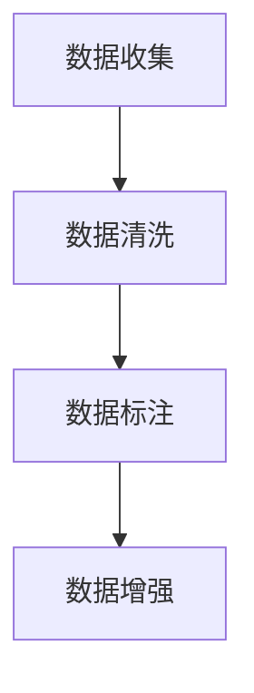
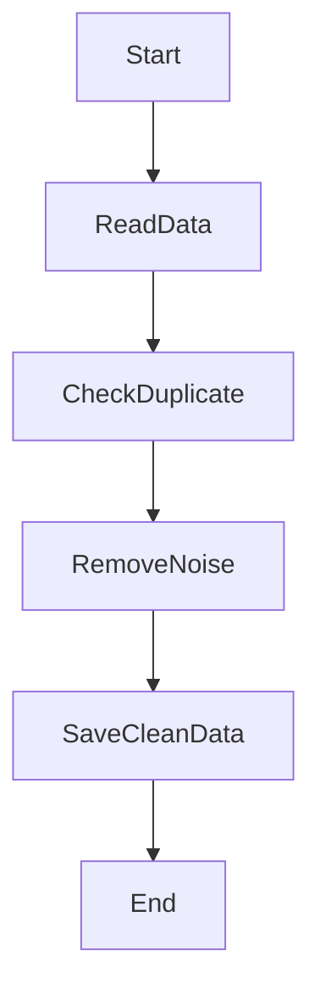
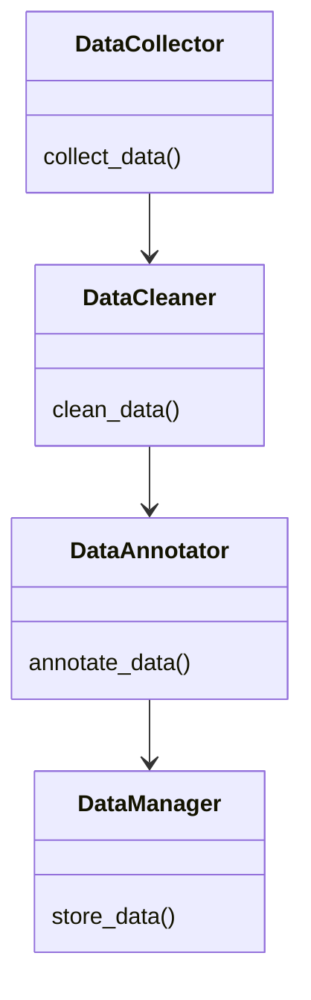
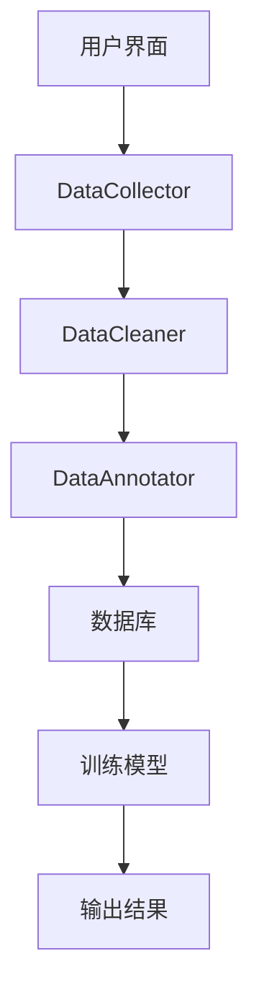

                 


# 构建企业专属训练数据集：确保AI Agent的领域适应性

> **关键词**：数据集构建、AI Agent、领域适应性、机器学习、数据标注

> **摘要**：  
本文将详细探讨如何构建适合企业特定需求的训练数据集，以确保AI Agent在目标领域的高效适应性。通过分析数据集构建的核心概念、方法和工具，结合实际案例，我们将揭示如何通过高质量的数据集优化AI模型的性能。从背景介绍到系统架构设计，本文将逐步引导读者掌握构建专属数据集的关键步骤，最终实现AI Agent在企业场景中的卓越表现。

---

## 第一部分：背景介绍

### 第1章：问题背景与数据集的重要性

#### 1.1 问题背景
AI Agent（人工智能代理）正在逐步融入企业级应用的方方面面，从客服支持到智能决策，AI Agent的能力直接影响企业的效率和竞争力。然而，通用模型往往难以满足特定领域的复杂需求，例如金融领域的风险评估或医疗领域的疾病诊断。这种领域差异性要求我们为AI Agent量身定制专属的训练数据集，以确保其在特定场景中的表现。

#### 1.2 数据集的重要性
- **数据质量对模型性能的影响**：数据是机器学习模型的基石，高质量的数据能够显著提升模型的准确性和稳定性。
- **领域专用数据集的优势**：与通用数据集相比，领域专用数据集能够更好地捕捉特定场景中的特征和规律，从而提高模型的领域适应性。
- **数据集构建的挑战与解决方案**：数据收集的难度、标注的复杂性和数据安全问题是构建数据集的主要挑战，需要结合多种工具和技术进行解决。

---

## 第二部分：数据集构建的核心概念与联系

### 第2章：数据集构建的方法与工具

#### 2.1 数据集构建的方法
- **数据收集与清洗**：通过爬取、API调用或数据生成等多种方式获取原始数据，并通过数据清洗去除噪声，确保数据的纯净性。
- **数据标注与整理**：根据具体任务需求，对数据进行标注（如分类、实体识别等），并将其整理为适合模型训练的格式。
- **数据增强与扩展**：通过数据增强技术（如旋转、翻转、噪声添加等）扩展数据集规模，提升模型的泛化能力。

#### 2.2 数据集构建的工具
- **数据标注工具**：如Label Studio、VGG Image Annotation等，支持多种数据类型（文本、图像、视频）的标注需求。
- **数据处理工具**：如Python的Pandas库，用于数据清洗和转换。
- **数据增强工具**：如TensorFlow的ImageDataGenerator，用于图像数据的增强。

---

### 第3章：数据集构建的核心概念与联系

#### 3.1 核心概念原理
- 数据集构建的过程可以分为数据收集、清洗、标注和增强四个阶段，每个阶段都有其独特的目标和方法。

#### 3.2 核心概念属性特征对比表格
| 特征     | 数据收集 | 数据清洗 | 数据标注 | 数据增强 |
|----------|----------|----------|----------|----------|
| 目标     | 获取原始数据 | 去除噪声 | 转换为模型可用格式 | 扩展数据集规模 |
| 方法     | 网络爬取、API调用 | 删除重复数据、填充缺失值 | 手动或半自动标注 | 数据变换、生成新样本 |
| 工具     | 网络爬虫工具（如BeautifulSoup） | Pandas | Label Studio | Augmentor |

#### 3.3 ER实体关系图（Mermaid流程图）


---

## 第三部分：算法原理讲解

### 第4章：数据清洗与特征提取

#### 4.1 数据清洗流程


#### 4.2 数据特征提取
- **文本特征提取**：使用TF-IDF或Word2Vec提取文本数据的特征向量。
- **图像特征提取**：通过卷积神经网络（CNN）提取图像的高层次特征。

#### 4.3 数据清洗的Python代码示例
```python
import pandas as pd

# 读取数据
df = pd.read_csv('raw_data.csv')

# 删除重复数据
df.drop_duplicates(inplace=True)

# 填充缺失值
df['feature'].fillna(0, inplace=True)

# 保存清洗后的数据
df.to_csv('clean_data.csv', index=False)
```

---

## 第四部分：系统分析与架构设计方案

### 第5章：系统架构设计

#### 5.1 问题场景介绍
假设我们正在构建一个用于医疗领域疾病诊断的AI Agent，数据集需要包含患者的症状、病史和诊断结果等信息。

#### 5.2 系统功能设计（领域模型类图）


#### 5.3 系统架构设计（架构图）


---

## 第五部分：项目实战

### 第6章：构建企业专属训练数据集

#### 6.1 环境安装
- Python 3.8+
- pip install pandas label-studio scikit-learn

#### 6.2 核心代码实现
```python
import pandas as pd
from sklearn.model_selection import train_test_split

# 数据清洗
def clean_data(df):
    df.drop_duplicates(inplace=True)
    df['label'].replace({'yes': 1, 'no': 0}, inplace=True)
    return df

# 数据划分
def split_data(df):
    X_train, X_test, y_train, y_test = train_test_split(df['text'], df['label'], test_size=0.2)
    return X_train, X_test, y_train, y_test

# 主程序
if __name__ == '__main__':
    df = pd.read_csv('raw_data.csv')
    df_clean = clean_data(df)
    X_train, X_test, y_train, y_test = split_data(df_clean)
    print("训练集大小：", len(X_train))
    print("测试集大小：", len(X_test))
```

---

## 第六部分：最佳实践与总结

### 第7章：构建企业专属训练数据集的注意事项

#### 7.1 关键点总结
- 数据质量是模型性能的基础。
- 数据标注需要精确且一致。
- 数据安全与隐私保护至关重要。

#### 7.2 小结
通过本文的详细讲解，我们掌握了构建企业专属训练数据集的核心方法和工具，能够根据实际需求设计并实现高效的AI Agent。

#### 7.3 注意事项
- 数据收集时需遵守相关法律法规。
- 数据标注需确保标注的准确性和一致性。
- 数据增强需避免过拟合特定数据增强方式。

#### 7.4 拓展阅读
- 《Hands-On Machine Learning with Scikit-Learn, Keras, and TensorFlow》
- 《Data Engineering with Python》

---

**作者：AI天才研究院/AI Genius Institute & 禅与计算机程序设计艺术 /Zen And The Art of Computer Programming**

