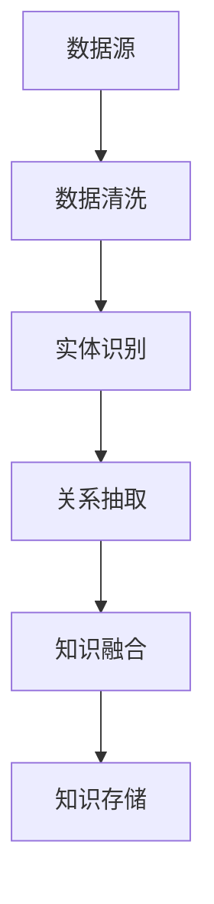
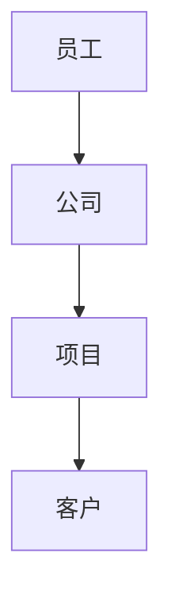
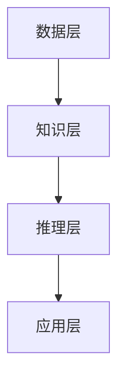

                 


# 构建企业知识库：为AI Agent提供专业领域支持

## 关键词：企业知识库、AI Agent、知识图谱、自然语言处理、机器学习、领域知识、数据工程

## 摘要：  
随着人工智能技术的快速发展，企业知识库在支持AI Agent（人工智能代理）中的作用日益重要。企业知识库不仅是企业智能化转型的核心基础设施，更是AI Agent实现专业领域任务的关键知识支持系统。本文将从企业知识库的构建背景、核心概念、算法原理、系统架构到项目实战，全面解析如何为企业AI Agent构建高效、专业的知识库支持系统。通过本文的阐述，读者将深入了解企业知识库的设计与实现方法，掌握如何利用知识图谱、自然语言处理和机器学习等技术，构建支持AI Agent的智能知识库。

---

## 第一章：企业知识库与AI Agent概述

### 1.1 企业知识库的基本概念
企业知识库是一种以结构化方式存储和管理企业知识的系统，旨在为企业智能化应用（如AI Agent）提供知识支持。它不同于传统数据库，更注重知识的语义化表示、关联性和可推理性。

#### 1.1.1 知识库的定义与类型
知识库可以是通用的（如百科全书）或专业的（如医疗知识库）。企业知识库通常专注于企业的特定领域知识，例如产品知识、行业术语和业务流程。

#### 1.1.2 企业知识库的重要性
企业知识库是AI Agent的核心知识来源，能够帮助AI Agent理解企业的业务流程、产品特性以及行业规则，从而实现智能化的决策和执行。

#### 1.1.3 企业知识库与AI Agent的关系
AI Agent需要依赖企业知识库来完成任务，例如回答用户问题、推荐解决方案或优化业务流程。企业知识库则是AI Agent的“知识大脑”。

---

### 1.2 企业知识库的构建背景
#### 1.2.1 当前企业知识管理的挑战
企业面临知识分散、知识更新慢、知识难以复用等问题，传统知识管理方式难以满足AI Agent的需求。

#### 1.2.2 AI Agent对企业知识库的需求
AI Agent需要快速获取准确的知识，支持复杂场景下的决策和执行。企业知识库的构建是实现这一目标的关键。

#### 1.2.3 企业知识库的演进历程
从简单的数据存储到复杂的知识图谱，企业知识库的构建经历了从数据化到知识化的演进过程。

---

### 1.3 企业知识库的核心要素
#### 1.3.1 知识表示方法
知识表示是将企业知识转化为计算机可理解的形式，常见的表示方法包括概念图、实体-关系图和语义网络。

#### 1.3.2 知识组织方式
知识组织需要遵循一定的结构和规则，例如层次化组织、网络化组织和语义化组织。

#### 1.3.3 知识检索与推理机制
企业知识库需要支持高效的检索和推理能力，例如基于规则的推理和基于图的推理。

---

## 第二章：企业知识库的核心概念与联系

### 2.1 知识表示与知识图谱
知识图谱是一种以图结构表示知识的方法，能够有效地描述实体之间的关系。以下是知识图谱的构建流程：

#### 2.1.1 知识表示的基本原理
知识表示需要将实体、属性和关系进行形式化描述。例如，实体“公司”可以表示为`Company`，属性包括“公司名称”和“成立时间”，关系包括“公司-员工”和“公司-产品”。

#### 2.1.2 知识图谱的构建方法
知识图谱的构建通常包括数据抽取、实体识别、关系抽取和知识融合等步骤。以下是构建知识图谱的流程图：



#### 2.1.3 知识图谱的属性与关系
知识图谱中的属性可以是单值（如“公司名称”）或多值（如“公司地址”），关系可以是简单关系（如“公司-员工”）或复杂关系（如“公司-项目-员工”）。

---

### 2.2 企业知识库的结构设计
#### 2.2.1 知识库的层次结构
企业知识库通常采用层次化的结构设计，例如：

- **顶层**：领域知识（如医疗、金融）
- **中层**：具体业务知识（如医疗领域的疾病知识）
- **底层**：具体实例知识（如具体的疾病名称和症状）

#### 2.2.2 知识库的模块划分
企业知识库可以划分为以下几个模块：
1. **知识抽取模块**：负责从企业数据中提取知识。
2. **知识存储模块**：负责存储抽取的知识。
3. **知识检索模块**：负责根据查询条件检索相关知识。
4. **知识推理模块**：负责基于知识图谱进行推理。

#### 2.2.3 知识库的标准化与规范化
知识的标准化和规范化是确保知识库质量的关键，通常需要遵循特定的标准（如ISO标准）和行业规范。

---

## 第三章：企业知识库的算法原理

### 3.1 知识抽取与表示算法
#### 3.1.1 知识抽取算法
知识抽取算法主要包括基于规则的抽取和基于深度学习的抽取。以下是一个简单的基于规则的抽取示例：

```python
def extract_entity(text, pattern):
    import re
    matches = re.finditer(pattern, text)
    entities = []
    for match in matches:
        entities.append(match.group(1))
    return entities
```

#### 3.1.2 知识表示与嵌入算法
知识表示可以通过Word2Vec或BERT等模型实现。以下是Word2Vec的数学模型：

$$
\text{Word2Vec} = \arg\max \theta \sum_{i=1}^n \log p(w_i | w_{i-1}, \theta)
$$

其中，$\theta$是模型参数，$p(w_i | w_{i-1}, \theta)$是条件概率。

---

### 3.2 知识推理与检索算法
#### 3.2.1 基于规则的推理
基于规则的推理是一种简单的推理方法，适用于知识库中的简单关系推理。例如：

$$
\text{如果 A 是 B 的子类，那么 A 具有 B 的所有属性}
$$

#### 3.2.2 基于图的推理
基于图的推理是一种复杂的关系推理方法，适用于知识图谱中的复杂关系推理。以下是基于图的推理流程图：



---

## 第四章：企业知识库的系统架构设计

### 4.1 系统功能设计
企业知识库的系统功能设计通常包括以下几个方面：
1. **知识抽取**：从企业数据中提取知识。
2. **知识存储**：存储抽取的知识。
3. **知识检索**：根据查询条件检索相关知识。
4. **知识推理**：基于知识图谱进行推理。

---

### 4.2 系统架构设计
企业知识库的系统架构通常采用分层架构，包括数据层、知识层、推理层和应用层。以下是系统架构图：



---

## 第五章：企业知识库的项目实战

### 5.1 项目背景
本项目旨在为企业AI Agent构建一个支持医疗领域的知识库，帮助AI Agent回答医疗相关问题。

### 5.2 核心代码实现
以下是知识抽取模块的代码示例：

```python
import re

def extract_medical_entities(text):
    patterns = [
        r'\b疾病\b',
        r'\b症状\b',
        r'\b药物\b'
    ]
    entities = []
    for pattern in patterns:
        matches = re.finditer(pattern, text)
        for match in matches:
            entities.append(match.group())
    return entities
```

### 5.3 项目总结
通过本项目，我们成功构建了一个支持医疗领域的知识库，验证了知识库构建方法的有效性。

---

## 第六章：企业知识库的最佳实践与未来趋势

### 6.1 最佳实践
1. **数据质量管理**：确保数据的准确性和完整性。
2. **技术选型**：根据需求选择合适的技术和工具。
3. **动态更新**：定期更新知识库，确保知识的时效性。

### 6.2 未来趋势
1. **多模态知识库**：结合文本、图像等多种数据形式。
2. **知识图谱的动态更新**：支持实时更新和增量学习。
3. **知识库的智能化**：结合强化学习和自适应技术，实现知识库的自优化。

---

## 作者：AI天才研究院 & 禅与计算机程序设计艺术

