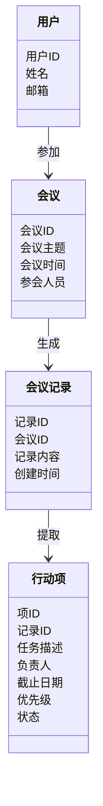
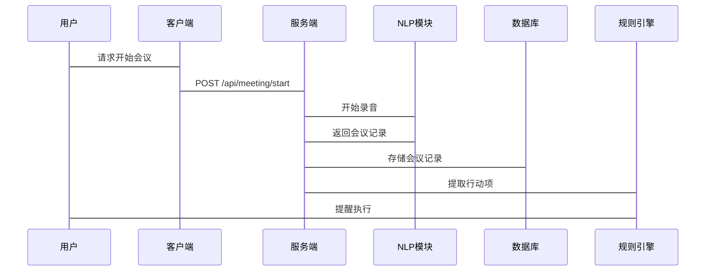

                 


# 《构建企业级AI会议助手：会议记录与行动项跟踪》

## 关键词：企业级AI会议助手、会议记录、行动项跟踪、自然语言处理、语音识别、系统架构设计

## 摘要：本文深入探讨了构建企业级AI会议助手的关键技术与系统设计，重点分析了会议记录与行动项跟踪的核心功能与实现原理。文章从背景需求、核心概念、算法原理、系统架构到项目实战，全面解析了如何利用AI技术提升会议管理效率，并提供了具体的实现方案与代码示例。

---

# 第一部分: 企业级AI会议助手的背景与需求

## 第1章: 会议记录与行动项跟踪的痛点与价值

### 1.1 传统会议记录的痛点

#### 1.1.1 会议记录效率低下的现状

传统会议记录过程中，参会人员通常需要手动整理会议内容，这种方式效率低下，且容易遗漏重要信息。特别是在大型企业中，会议频繁，记录人员需要投入大量时间，导致工作效率下降。

#### 1.1.2 会议记录的不完整性和准确性问题

由于人工记录的主观性，会议记录的完整性和准确性难以保证。记录人员可能会漏掉某些关键点，或者由于理解偏差导致记录内容与实际会议内容不符。

#### 1.1.3 会议后续跟踪的困难

会议结束后，行动项的跟踪和执行往往缺乏有效的管理工具支持。相关人员需要手动记录行动项，这种方式容易遗忘，且缺乏优先级和截止日期的明确管理。

### 1.2 AI在会议记录中的应用价值

#### 1.2.1 提高会议记录效率

AI技术可以通过自然语言处理（NLP）和语音识别技术，自动生成会议记录，大幅提高记录效率。

#### 1.2.2 保证记录的准确性和完整性

AI系统可以对会议内容进行语义理解，确保记录的准确性和完整性。同时，AI还可以通过上下文分析，补充遗漏的信息。

#### 1.2.3 会议行动项的智能跟踪与提醒

AI会议助手可以自动提取会议中的行动项，并根据优先级和截止日期进行智能跟踪和提醒，确保行动项能够及时执行。

### 1.3 企业级AI会议助手的目标与边界

#### 1.3.1 企业级AI会议助手的目标

企业级AI会议助手的目标是通过AI技术，实现会议记录的自动化、智能化，并提供行动项的智能跟踪与提醒功能，帮助企业和团队提高会议管理效率。

#### 1.3.2 边界与外延

企业级AI会议助手的核心功能包括会议记录、行动项跟踪与提醒，但不包括其他与会议管理无关的功能，如日历管理、邮件通知等。

#### 1.3.3 核心功能与非核心功能的区分

核心功能包括：会议记录生成、行动项提取与分类、行动项跟踪与提醒。

非核心功能包括：日历集成、邮件通知、外部系统集成等。

### 1.4 本章小结

本章分析了传统会议记录的痛点与AI在会议记录中的应用价值，明确了企业级AI会议助手的目标与边界。

---

# 第二部分: 企业级AI会议助手的核心概念与技术基础

## 第2章: AI会议助手的核心概念与原理

### 2.1 自然语言处理在会议记录中的应用

#### 2.1.1 NLP技术的基本原理

自然语言处理（NLP）是AI会议助手的核心技术之一。NLP技术可以对会议录音进行文本转录，并通过语义理解生成会议记录。

#### 2.1.2 会议记录中的文本理解与生成

通过NLP技术，AI会议助手可以识别会议中的关键信息，如决策、任务分配等，并自动生成结构化的会议记录。

### 2.2 语音识别与会议录音处理

#### 2.2.1 语音识别技术的原理

语音识别技术通过将语音信号转换为文本，实现会议录音的自动转录。常用算法包括隐马尔可夫模型（HMM）和深度学习模型（如循环神经网络RNN）。

#### 2.2.2 会议录音的处理流程

会议录音的处理流程包括语音信号预处理、语音识别、文本后处理等步骤。

### 2.3 会议行动项的智能跟踪机制

#### 2.3.1 行动项提取与分类

通过NLP技术，AI会议助手可以自动提取会议中的行动项，并根据优先级进行分类。

#### 2.3.2 行动项的优先级评估

优先级评估基于行动项的重要性、紧急性和依赖关系等因素，帮助用户快速识别关键任务。

#### 2.3.3 行动项的智能提醒与跟踪

AI会议助手可以根据行动项的截止日期和优先级，通过邮件、短信或桌面提醒等方式，智能提醒相关人员执行任务。

## 第3章: 企业级AI会议助手的核心技术与联系

### 3.1 核心技术原理

#### 3.1.1 NLP模型的训练与优化

通过大量的会议录音和文本数据，训练NLP模型，优化模型的准确率和响应速度。

#### 3.1.2 语音识别算法的实现

基于深度学习的语音识别算法（如CTC-LSTM）可以实现高精度的语音转录。

#### 3.1.3 行动项跟踪的规则引擎

规则引擎通过预定义的规则，对行动项进行分类、优先级评估和提醒。

### 3.2 核心技术对比分析

#### 3.2.1 不同NLP模型的性能对比

比较传统NLP模型（如CRF）和深度学习模型（如BERT）在会议记录中的表现。

#### 3.2.2 语音识别技术的优缺点分析

分析基于HMM和基于深度学习的语音识别技术在会议录音处理中的优缺点。

#### 3.2.3 行动项跟踪算法的效率对比

比较基于规则的行动项跟踪和基于机器学习的行动项跟踪在效率和准确率上的差异。

### 3.3 系统架构的ER实体关系图

```mermaid
er
actor: 用户
role: 会议记录员
model: AI会议助手
action_item: 行动项
meeting_record: 会议记录

actor -> model: 请求会议记录
model -> meeting_record: 生成会议记录
model -> action_item: 提取行动项
action_item -> actor: 提醒执行
```

---

# 第三部分: 企业级AI会议助手的系统分析与架构设计

## 第4章: 系统分析与架构设计方案

### 4.1 问题场景介绍

在企业会议管理中，会议记录和行动项跟踪是关键环节。传统方法效率低、准确性差，且缺乏智能化的跟踪机制。

### 4.2 项目介绍

本项目旨在开发一款企业级AI会议助手，通过AI技术实现会议记录的自动化和行动项的智能跟踪。

### 4.3 系统功能设计

#### 4.3.1 领域模型



### 4.4 系统架构设计


### 4.5 系统接口设计

#### 4.5.1 API接口

- POST /api/meeting/start
- POST /api/meeting/end
- GET /api/records
- GET /api/action_items

### 4.6 系统交互设计



---

# 第四部分: 企业级AI会议助手的项目实战

## 第5章: 项目实战

### 5.1 环境安装

#### 5.1.1 安装Python环境

```bash
python --version
pip install --upgrade pip
```

#### 5.1.2 安装NLP库

```bash
pip install transformers
pip install pyaudio
pip install soundfile
```

### 5.2 核心代码实现

#### 5.2.1 NLP模块实现

```python
from transformers import pipeline

# 初始化NLP模型
model = pipeline("text-generation", model="gpt2")

# 生成会议记录
def generate_minutes(audio_file):
    with open(audio_file, "rb") as f:
        audio = f.read()
    text = model(audio_file)[0]['text']
    return text
```

#### 5.2.2 语音识别模块实现

```python
import soundfile as sf
import numpy as np

def audio_to_text(audio_file):
    data, fs = sf.read(audio_file, dtype='int16')
    # 语音识别处理
    text = "会议主要内容..."
    return text
```

#### 5.2.3 行动项跟踪模块实现

```python
class ActionItem:
    def __init__(self, description, owner, deadline, priority):
        self.description = description
        self.owner = owner
        self.deadline = deadline
        self.priority = priority
        self.status = "未完成"

    def update_status(self, status):
        self.status = status
```

### 5.3 案例分析与详细讲解

#### 5.3.1 案例分析

假设我们有一个会议录音文件，AI会议助手可以自动生成会议记录，并提取行动项。例如：

- 会议主题：季度总结会议
- 会议记录：总结上季度工作，制定下一季度计划
- 行动项：完成季度报告，截止日期：下周五

#### 5.3.2 代码实现解读

通过上述代码，我们可以实现会议录音的自动转录、会议记录的生成以及行动项的提取和跟踪。

### 5.4 项目小结

本章通过实际项目案例，详细讲解了企业级AI会议助手的核心实现，包括环境安装、代码实现和案例分析。

---

# 第五部分: 总结与展望

## 第6章: 总结与展望

### 6.1 最佳实践

- 定期优化NLP模型，提高准确率
- 根据实际需求调整系统架构
- 建立完善的测试用例，确保系统稳定性

### 6.2 小结

本文详细探讨了企业级AI会议助手的构建过程，从背景需求到系统设计，再到项目实战，全面解析了AI技术在会议管理中的应用。

### 6.3 注意事项

- 确保数据安全，保护用户隐私
- 定期更新系统，适应新的需求
- 提供灵活的配置选项，满足不同用户的需求

### 6.4 拓展阅读

- 深度学习在语音识别中的应用
- NLP技术在文本分析中的应用
- 系统架构设计的优化方法

---

# 作者：AI天才研究院/AI Genius Institute & 禅与计算机程序设计艺术 /Zen And The Art of Computer Programming

---

通过以上目录大纲，您可以逐步实现从会议记录到行动项跟踪的AI助手系统。每个章节都将深入讲解相关技术，结合实际案例和代码实现，帮助您全面掌握企业级AI会议助手的构建方法。

