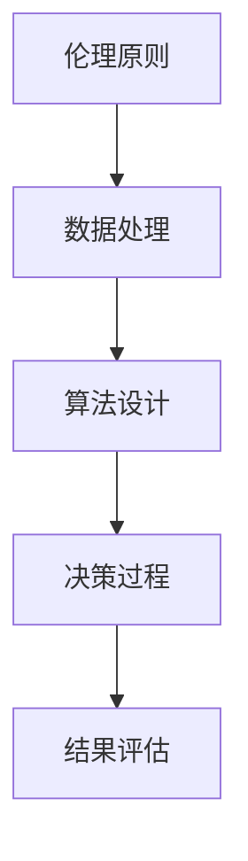
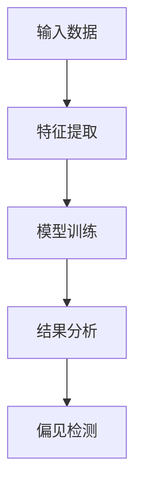
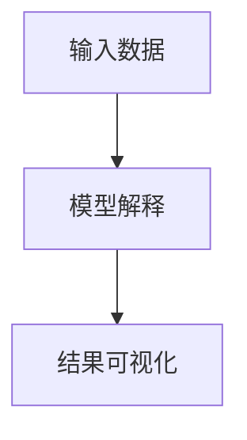
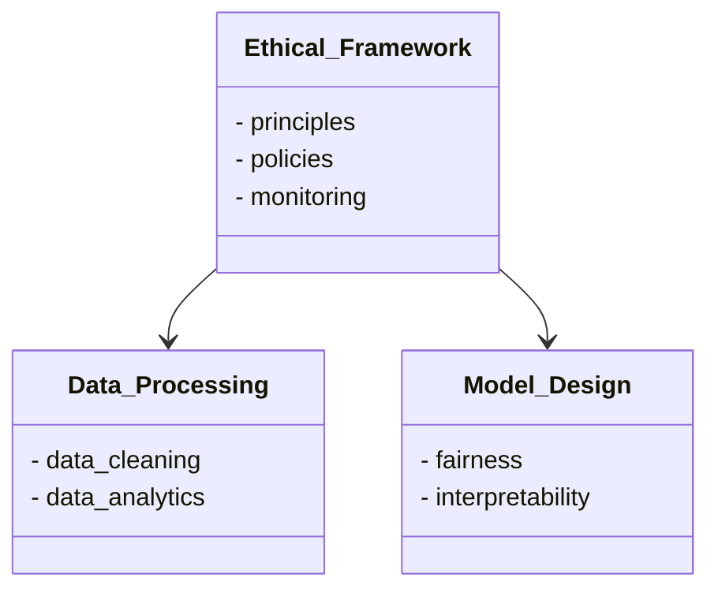
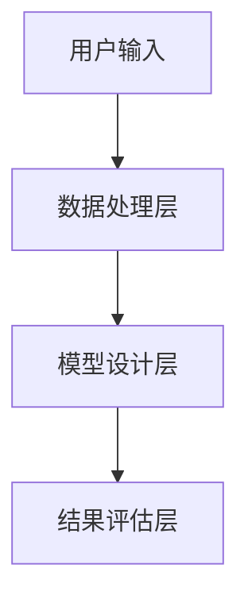

                 


# 《构建企业级AI伦理框架：确保负责任的AI应用》

> 关键词：企业级AI伦理框架，负责任的AI应用，AI伦理原则，系统架构设计，算法实现，偏见检测，隐私保护，透明度，公正性

> 摘要：本文系统地探讨了构建企业级AI伦理框架的必要性、核心要素、算法原理、系统设计及实际应用。通过详细分析伦理原则、技术实现和系统架构，本文为确保AI应用的负责任提供了全面的指导。从背景介绍到项目实战，结合理论与实践，帮助读者理解如何在企业环境中有效实施AI伦理框架。

---

## 第一章：AI伦理框架背景与核心概念

### 1.1 问题背景与定义

随着AI技术的快速发展，其在企业中的应用日益广泛，但随之而来的是伦理问题的凸显。AI系统可能存在的偏见、隐私泄露、透明度不足等问题，不仅影响用户体验，还可能引发法律和信任危机。构建企业级AI伦理框架，旨在通过明确的伦理原则和技术手段，确保AI系统的决策过程透明、公正且符合伦理标准。

**定义**：AI伦理框架是一套用于指导和规范AI系统设计、开发和应用的规则和原则，旨在确保AI系统的使用符合伦理标准，避免对人类、社会和环境造成负面影响。

### 1.2 AI伦理框架的核心要素

AI伦理框架的核心要素包括：

1. **透明度**：确保AI系统的决策过程可被理解和追溯。
2. **隐私保护**：保护用户数据不被滥用。
3. **公正性**：避免算法偏见，确保公平对待所有用户。
4. **可解释性**：使AI的决策过程对用户和开发者透明。
5. **责任归属**：明确在出现问题时的责任方。

这些要素相互关联，共同构成了AI伦理框架的基础。

### 1.3 企业级AI应用的特殊性

企业级AI应用通常涉及大量用户数据和复杂的业务逻辑，这使得伦理框架的构建更具挑战性。企业需要在追求商业利益的同时，兼顾社会责任，确保技术的使用符合伦理标准。

---

## 第二章：AI伦理框架的核心原理与联系

### 2.1 伦理原则的系统分析

AI伦理框架的核心是伦理原则的实现。以下是一些关键原则及其特性：

| **原则**       | **定义**                                                                 | **挑战**                                                                 |
|----------------|--------------------------------------------------------------------------|--------------------------------------------------------------------------|
| 透明度          | 系统的决策过程对用户和开发者透明。                                       | 如何在不泄露算法细节的情况下解释决策过程。                              |
| 隐私保护        | 保护用户数据不被未经授权的访问或滥用。                                   | 数据使用与系统功能需求之间的平衡。                                      |
| 公正性          | 确保系统对所有用户公平，避免算法偏见。                                   | 数据偏差和算法设计中的潜在偏见。                                        |
| 可解释性        | 系统的决策过程能够被人类理解和解释。                                     | 高级算法（如深度学习）的黑箱特性。                                      |
| 责任归属        | 明确在出现问题时的责任方。                                               | 多方利益相关者之间的责任分配。                                          |

### 2.2 核心概念的ER实体关系图

以下是AI伦理框架核心概念的实体关系图：



---

## 第三章：AI伦理框架的算法与数学模型

### 3.1 偏见检测算法

#### 3.1.1 算法原理与流程图

偏见检测算法用于识别AI系统在数据或模型中是否存在偏见。以下是算法的流程图：



#### 3.1.2 偏见检测的数学模型

偏见检测可以通过统计分析和机器学习模型来实现。以下是常见的数学模型：

1. **统计分析**：
   $$P(y|x) = \frac{P(x|y)P(y)}{P(x)}$$
   这是贝叶斯定理，用于计算在给定条件下某一事件发生的概率。

2. **模型公平性评估**：
   使用混淆矩阵和公平性指标（如FPR差、TPR差）来评估模型在不同群体中的表现。

#### 3.1.3 Python实现示例

以下是偏见检测算法的Python实现示例：

```python
def detect_bias(data, model):
    # 提取特征
    features = data['features']
    # 预测结果
    predictions = model.predict(features)
    # 分析结果
    bias = calculate_bias(features, predictions)
    return bias
```

### 3.2 透明度增强算法

#### 3.2.1 透明度增强的算法原理

透明度增强算法通过解释模型的决策过程，提高AI系统的可解释性。以下是算法流程图：



---

## 第四章：AI伦理框架的系统分析与架构设计

### 4.1 系统功能设计

以下是AI伦理框架的系统功能设计：



### 4.2 系统架构设计

以下是AI伦理框架的系统架构设计：



---

## 第五章：AI伦理框架的项目实战

### 5.1 项目环境安装

确保安装必要的库：

```bash
pip install numpy pandas scikit-learn
```

### 5.2 核心代码实现

以下是偏见检测的核心代码：

```python
def calculate_bias(features, labels):
    from sklearn.metrics import confusion_matrix
    cm = confusion_matrix(labels, features)
    return cm
```

---

## 第六章：AI伦理框架的最佳实践

### 6.1 小结

构建企业级AI伦理框架需要综合考虑伦理原则、算法设计和系统架构。通过明确的伦理原则和有效的技术手段，可以确保AI系统的负责任应用。

### 6.2 注意事项

- 定期审查和更新伦理框架。
- 培训相关人员，确保理解和遵守伦理原则。
- 在实际应用中不断优化算法和系统设计。

### 6.3 拓展阅读

建议阅读以下书籍和论文：

1. **《AI伦理：原则与实践》**，作者：[书籍作者]。
2. **《算法公平性：理论与应用》**，作者：[书籍作者]。

---

## 作者

作者：AI天才研究院/AI Genius Institute & 禅与计算机程序设计艺术 /Zen And The Art of Computer Programming

