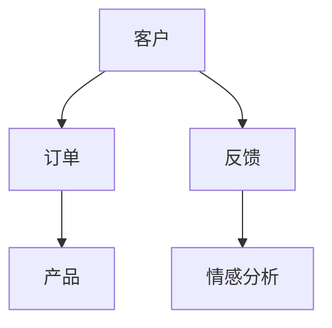
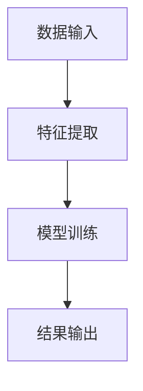
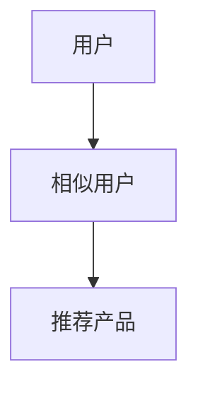
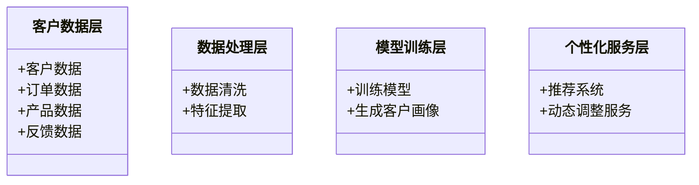
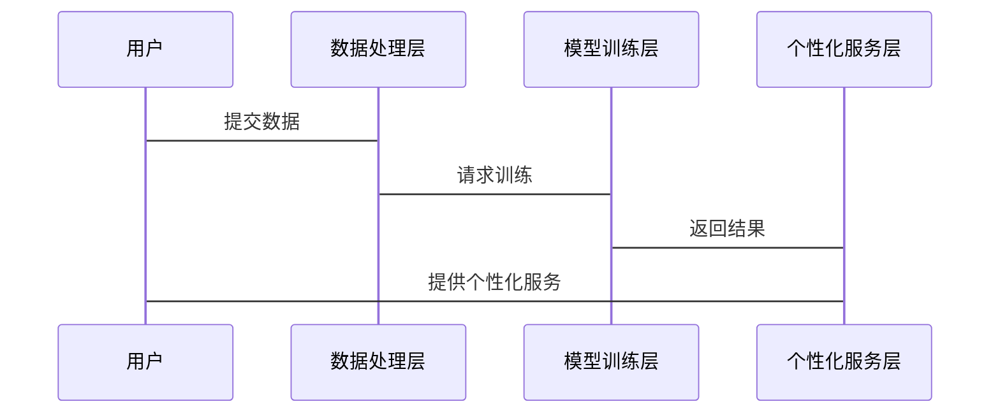

                 


# 构建企业级AI客户洞察助手：深度分析与个性化服务

## 关键词：企业级AI，客户洞察，个性化服务，深度分析，系统架构，算法原理

## 摘要

随着企业对客户洞察和个性化服务需求的增加，AI技术的应用变得至关重要。本文详细探讨了构建企业级AI客户洞察助手的过程，包括深度分析算法、个性化服务算法、系统架构设计、项目实战等内容。通过数学模型、算法流程图和代码示例，本文为读者提供了从理论到实践的全面指导，帮助企业在竞争中占据优势。

---

# 第一部分: 企业级AI客户洞察助手的背景与概念

## 第1章: 问题背景与描述

### 1.1 问题背景

#### 1.1.1 客户洞察在企业中的重要性

客户洞察是企业在市场竞争中制胜的关键。通过分析客户行为、偏好和需求，企业能够制定精准的营销策略，提升客户满意度和忠诚度。传统方法依赖人工分析，效率低且容易出错，而AI技术的引入显著提升了分析的效率和准确性。

#### 1.1.2 当前客户洞察的主要挑战

- 数据量大：企业每天产生海量数据，人工分析难以处理。
- 数据复杂：数据来源多样，格式不一，难以整合。
- 个性化需求：客户期望得到个性化的服务，但传统方法难以满足。
- 成本高昂：传统客户洞察需要大量资源，企业难以负担。

#### 1.1.3 AI技术如何解决这些问题

AI技术能够快速处理大量数据，识别模式和趋势，帮助企业在短时间内做出决策。通过机器学习和自然语言处理，AI能够自动化分析客户数据，提供深度洞察，并推荐个性化服务，降低成本，提升客户体验。

### 1.2 问题描述

#### 1.2.1 客户数据的复杂性

客户数据来源多样，包括交易数据、社交媒体数据、客服记录等。这些数据通常格式不一，需要清洗和预处理才能进行分析。

#### 1.2.2 个性化服务的需求

客户期望得到量身定制的服务，包括推荐产品、个性化优惠和定制化沟通方式。这需要系统能够实时分析客户需求，并动态调整服务策略。

#### 1.2.3 企业级AI系统的构建目标

构建一个能够处理海量数据，提供深度分析，并实时生成个性化服务的企业级AI系统。该系统需要具备高扩展性、高可用性和高安全性，能够在复杂环境中稳定运行。

### 1.3 问题解决思路

#### 1.3.1 数据驱动的客户洞察

通过收集和分析客户数据，识别客户的潜在需求和行为模式，为决策提供支持。

#### 1.3.2 AI技术的应用场景

- 客户画像构建：通过机器学习算法分析客户数据，生成客户画像。
- 预测客户行为：利用深度学习模型预测客户的购买意愿和行为。
- 自然语言处理：分析客户反馈，识别情感倾向和关键词。

#### 1.3.3 个性化服务的实现路径

- 数据分析：收集和处理客户数据，提取特征。
- 模型训练：训练机器学习模型，生成客户画像和推荐策略。
- 服务部署：将模型部署到生产环境，实时提供个性化服务。

## 第2章: 核心概念与联系

### 2.1 核心概念原理

#### 2.1.1 AI客户洞察助手的核心要素

- 数据采集：收集客户交易、互动和反馈数据。
- 数据处理：清洗、转换和预处理数据，提取特征。
- 模型训练：训练机器学习和深度学习模型，生成客户画像和预测结果。
- 个性化服务：根据模型输出，推荐产品和服务，优化客户体验。

#### 2.1.2 深度分析与个性化服务的关系

深度分析是个性化服务的基础。通过深度分析，系统能够理解客户的复杂需求，生成个性化的服务方案。个性化服务则将分析结果转化为实际的服务，提升客户满意度和忠诚度。

#### 2.1.3 企业级系统的特点

- 高扩展性：能够处理海量数据，支持大规模并发访问。
- 高可用性：系统具备容错和自我修复能力，确保持续运行。
- 高安全性：保护客户数据，防止数据泄露和滥用。

### 2.2 核心概念对比表格

| 对比维度 | 传统客户洞察 | AI客户洞察 |
|----------|--------------|------------|
| 数据处理 | 人工处理，效率低 | 自动化处理，高效准确 |
| 分析深度 | 浅层分析，不够精准 | 深度分析，精准洞察 |
| 个性化服务 | 难以实现，成本高 | 易实现，成本低 |

### 2.3 ER实体关系图



---

# 第三部分: 深度分析与个性化服务的算法原理

## 第4章: 深度分析算法

### 4.1 深度分析算法原理

#### 4.1.1 算法流程图



#### 4.1.2 算法实现代码

```python
def deep_analysis(data):
    # 特征提取
    features = extract_features(data)
    # 模型训练
    model = train_model(features)
    return model.predict(data)
```

### 4.2 数学模型与公式

#### 4.2.1 特征提取公式

$$ features = f(data) $$

#### 4.2.2 模型训练公式

$$ model = \text{train}(features) $$

---

## 第5章: 个性化服务算法

### 5.1 个性化服务算法原理

#### 5.1.1 协同过滤推荐算法

协同过滤是一种常用的推荐算法，通过分析用户的行为和偏好，找到相似的用户群体，推荐相似的产品或服务。

#### 5.1.2 算法流程图



#### 5.1.3 算法实现代码

```python
def collaborative_filtering(user_id):
    # 找到相似用户
    similar_users = find_similar_users(user_id)
    # 推荐产品
    recommendations = recommend_products(similar_users)
    return recommendations
```

### 5.2 数学模型与公式

#### 5.2.1 相似度计算公式

$$ \text{相似度} = \frac{\sum (x_i - \mu)(y_i - \mu)}{\sqrt{\sum (x_i - \mu)^2} \sqrt{\sum (y_i - \mu)^2}} $$

---

# 第四部分: 系统架构设计

## 第6章: 系统架构设计

### 6.1 系统架构设计

#### 6.1.1 系统架构类图



#### 6.1.2 系统交互序列图



---

## 第7章: 项目实战

### 7.1 环境安装与配置

安装必要的开发工具和库，如Python、Jupyter Notebook、TensorFlow、Scikit-learn等。

### 7.2 核心代码实现

#### 7.2.1 客户数据处理

```python
import pandas as pd

def process_customer_data(data):
    # 数据清洗
    data.dropna()
    # 特征提取
    features = data[['age', 'gender', 'purchase_history']]
    return features
```

#### 7.2.2 模型训练

```python
from sklearn.model

