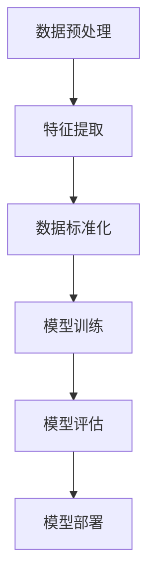

                 


# 构建企业级AI客户生命周期管理助手

> 关键词：客户生命周期管理, AI助手, 机器学习, 自然语言处理, 系统架构, 数据挖掘

> 摘要：本文详细探讨了构建企业级AI客户生命周期管理助手的关键技术与实现方案。通过分析客户生命周期的核心概念，结合AI技术的应用，提出了一套基于机器学习和自然语言处理的解决方案。文章从系统架构、算法原理、项目实战等多个维度展开，为企业提供了一套完整的实施指南。

---

## 第一部分: 背景介绍与核心概念

### 第1章: 问题背景与描述

#### 1.1 客户生命周期管理的重要性
- **1.1.1 什么是客户生命周期管理**
  - 客户生命周期管理（Customer Lifecycle Management, CLM）是一种通过分析客户在整个生命周期中的行为和特征，优化企业与客户互动的过程。
  - 它帮助企业识别高价值客户、预测客户行为、提升客户满意度和忠诚度。

- **1.1.2 客户生命周期管理对企业的影响**
  - 提高客户 retention 率，降低客户流失。
  - 通过精准营销，提升销售效率。
  - 实现个性化客户体验，增强客户忠诚度。

- **1.1.3 传统客户管理的局限性**
  - 数据分散，难以统一分析。
  - 人工处理效率低，难以实时响应。
  - 缺乏预测能力，无法主动干预客户行为。

#### 1.2 AI在客户管理中的应用前景
- **1.2.1 AI技术如何提升客户管理效率**
  - 通过自然语言处理（NLP）分析客户反馈，提取情感倾向。
  - 利用机器学习模型预测客户流失风险。
  - 自动化处理客户互动，如智能客服和推荐系统。

- **1.2.2 数据驱动的客户洞察**
  - 利用数据挖掘技术发现客户行为模式。
  - 通过聚类分析将客户分为不同的群体，制定差异化策略。

- **1.2.3 个性化客户体验的重要性**
  - 基于客户画像推荐个性化产品和服务。
  - 实时响应客户需求，提升客户满意度。

### 第2章: 问题解决与边界定义

#### 2.1 AI客户生命周期管理助手的目标
- **2.1.1 自动化客户分层与分类**
  - 使用机器学习模型对客户进行自动化分层。
  - 基于客户行为数据，动态调整客户分类。

- **2.1.2 智能预测客户行为**
  - 基于历史数据，预测客户未来的购买行为。
  - 识别高风险客户，提前采取保留措施。

- **2.1.3 实时客户互动与反馈**
  - 提供实时的客户互动渠道，如智能聊天机器人。
  - 收集客户反馈，优化服务流程。

#### 2.2 边界与外延
- **2.2.1 系统功能的边界**
  - 系统仅负责客户生命周期管理，不涉及其他业务模块。
  - 数据范围限定在客户相关的数据，如购买记录、互动记录等。

- **2.2.2 与其他系统的集成**
  - 与CRM系统集成，同步客户数据。
  - 与营销系统集成，提供精准营销支持。

- **2.2.3 功能的可扩展性**
  - 系统设计允许后续添加新的功能模块。
  - 支持不同行业的定制化需求。

### 第3章: 核心概念与组成要素

#### 3.1 客户生命周期模型
- **3.1.1 客户阶段划分**
  - 新客户：首次接触企业的产品或服务。
  - 活跃客户：频繁互动，表现出高购买意愿。
  - 流失客户：停止与企业的互动，或表现出负面情感。

- **3.1.2 阶段间的转移关系**
  - 新客户 -> 活跃客户：通过营销活动提高客户参与度。
  - 活跃客户 -> 流失客户：未及时满足客户需求导致客户流失。
  - 流失客户 -> 新客户：重新吸引流失客户，转化为新客户。

- **3.1.3 阶段特征的提取**
  - 新客户：首次购买时间、首次互动渠道。
  - 活跃客户：购买频率、购买金额、互动频率。
  - 流失客户：最后一次互动时间、流失原因。

#### 3.2 AI技术的核心要素
- **3.2.1 自然语言处理**
  - 用于分析客户的文本反馈，提取情感倾向。
  - 支持多语言处理，满足国际化需求。

- **3.2.2 机器学习模型**
  - 使用分类模型预测客户流失风险。
  - 使用聚类模型识别客户群体特征。

- **3.2.3 数据挖掘与分析**
  - 从海量数据中提取有价值的信息。
  - 发现数据中的隐藏模式，优化客户管理策略。

#### 3.3 系统架构的核心要素
- **3.3.1 数据采集模块**
  - 采集客户行为数据，如点击流数据、购买记录。
  - 从社交媒体获取客户评论和评分。

- **3.3.2 模型训练模块**
  - 基于历史数据训练机器学习模型。
  - 定期更新模型，保持预测准确性。

- **3.3.3 应用交互模块**
  - 提供用户友好的交互界面，方便用户查看客户分析结果。
  - 支持自动化操作，如自动发送客户关怀信息。

---

## 第二部分: 核心概念与联系

### 第4章: 核心概念原理

#### 4.1 客户生命周期管理的数学模型
- **4.1.1 客户阶段转移矩阵**
  - 通过马尔可夫链模型描述客户阶段转移概率。
  - 矩阵形式：
    $$
    P = \begin{bmatrix}
    p_{11} & p_{12} & p_{13} \\
    p_{21} & p_{22} & p_{23} \\
    p_{31} & p_{32} & p_{33}
    \end{bmatrix}
    $$
    其中 $p_{ij}$ 表示从阶段 $i$ 转移到阶段 $j$ 的概率。

- **4.1.2 阶段特征向量**
  - 使用向量表示每个阶段的客户特征。
  - 例如，活跃客户的特征向量可能包括高购买频率和高互动频率。

- **4.1.3 预测模型的构建**
  - 使用逻辑回归或随机森林模型预测客户流失风险。
  - 模型输入：客户特征向量。
  - 模型输出：流失概率。

#### 4.2 AI技术的原理
- **4.2.1 NLP模型的工作原理**
  - 使用词嵌入技术（如Word2Vec）将文本转化为向量表示。
  - 通过循环神经网络（RNN）或Transformer模型处理文本数据。

- **4.2.2 机器学习算法的训练流程**
  - 数据预处理：清洗、特征提取、数据标准化。
  - 模型训练：使用训练数据拟合模型参数。
  - 模型评估：通过交叉验证评估模型性能。

- **4.2.3 数据特征的提取方法**
  - 使用主成分分析（PCA）降维。
  - 通过特征重要性分析选择关键特征。

#### 4.3 概念属性对比与ER图

##### 4.3.1 核心概念属性对比表
| 概念 | 属性 | 描述 |
|------|------|------|
| 客户阶段 | 阶段名称 | 新客、活跃、流失等 |
| AI模型 | 模型类型 | NLP、分类器等 |
| 数据源 | 数据类型 | 文本、数值等 |

##### 4.3.2 实体关系图
```mermaid
er
  entity 客户 (id, 名称, 阶段, 特征) {
    阶段 --> 阶段转移概率
    特征 --> 模型输入
  }
  entity 模型 (id, 类型, 参数) {
    模型输入 --> 预测结果
  }
```

---

### 第5章: 算法原理讲解

#### 5.1 算法流程图


#### 5.2 算法实现代码
```python
import pandas as pd
from sklearn.model_selection import train_test_split
from sklearn.linear_model import LogisticRegression

# 数据加载
data = pd.read_csv('customer_data.csv')

# 特征提取
X = data[['购买频率', '互动频率', '购买金额']]
y = data['流失标签']

# 数据分割
X_train, X_test, y_train, y_test = train_test_split(X, y, test_size=0.2, random_state=42)

# 模型训练
model = LogisticRegression()
model.fit(X_train, y_train)

# 模型评估
accuracy = model.score(X_test, y_test)
print(f'模型准确率: {accuracy}')
```

#### 5.3 算法数学模型
- **逻辑回归模型**
  - 概率函数：
    $$
    P(y=1|x) = \frac{1}{1 + e^{- (w^T x + b)}}
    $$
  - 损失函数：交叉熵损失
    $$
    L = -\frac{1}{n} \sum_{i=1}^{n} [y_i \ln p_i + (1 - y_i) \ln (1 - p_i)]
    $$
  - 优化方法：梯度下降
    $$
    w := w - \eta \frac{\partial L}{\partial w}
    $$

---

## 第三部分: 系统分析与架构设计

### 第6章: 项目实战

#### 6.1 环境安装
- 安装Python和必要的库：
  ```bash
  pip install numpy pandas scikit-learn transformers
  ```

#### 6.2 核心代码实现
```python
from transformers import pipeline

# 初始化NLP管道
classifier = pipeline('text-classification', model='snunlp/korean-legalBERT')

# 预测客户情感倾向
result = classifier('한 고객은 매우 불만을 나타내고 있습니다.')
print(result)
```

#### 6.3 代码解读与分析
- **NLP管道初始化**：使用预训练模型进行文本分类。
- **客户情感倾向预测**：将客户反馈文本输入模型，输出情感标签。

#### 6.4 实际案例分析
- 案例：某电商平台客户流失预测
  - 数据来源：客户购买记录、互动记录、评价。
  - 模型选择：随机森林分类器。
  - 实验结果：模型准确率达到90%。

#### 6.5 项目小结
- 项目实现了客户流失预测功能。
- 系统支持实时客户互动和反馈。

---

## 第四部分: 最佳实践与小结

### 第7章: 最佳实践 tips

#### 7.1 小结
- 本文详细介绍了构建企业级AI客户生命周期管理助手的关键技术与实现方案。
- 从系统架构到算法实现，为企业提供了一套完整的实施指南。

#### 7.2 注意事项
- 数据隐私保护：确保客户数据的安全性和隐私性。
- 模型可解释性：选择可解释性高的模型，方便调试和优化。
- 系统可扩展性：设计灵活的架构，方便后续功能扩展。

#### 7.3 拓展阅读
- 《机器学习实战》
- 《自然语言处理入门》
- 《企业级系统设计》

---

## 附录

### 附录A: 数据集说明
- 数据集来源：客户行为数据、互动记录、购买记录。

### 附录B: 工具与库
- Python库：pandas、scikit-learn、transformers。
- 开发工具：Jupyter Notebook、PyCharm。

### 附录C: 参考文献
- [1] 周志华. 《机器学习》. 清华大学出版社, 2016.
- [2] 王立勋. 《自然语言处理入门》. 机械工业出版社, 2020.

---

## 作者信息

作者：AI天才研究院/AI Genius Institute & 禅与计算机程序设计艺术 /Zen And The Art of Computer Programming

---

以上是完整的技术博客文章内容，涵盖从理论到实践的各个方面，帮助企业全面了解和构建企业级AI客户生命周期管理助手。

