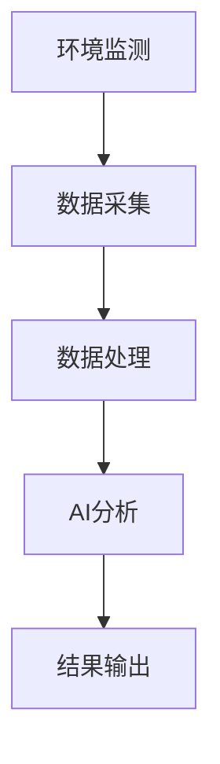
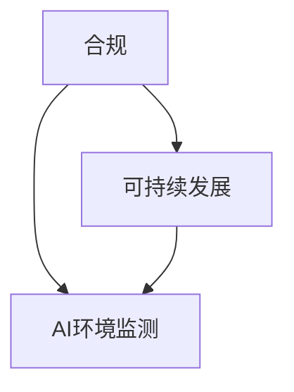

                 


# 构建企业级AI环境监测助手：合规与可持续发展

## 关键词：企业级AI，环境监测，合规，可持续发展，算法，系统架构

## 摘要：  
随着人工智能技术的快速发展，企业级AI环境监测助手在合规与可持续发展方面发挥着越来越重要的作用。本文将深入探讨企业级AI环境监测助手的背景、核心概念、算法原理、系统架构、项目实战以及合规与可持续发展的最佳实践，为企业构建高效、合规且可持续的AI环境监测系统提供全面的指导。

---

# 第1章: 企业级AI环境监测助手的背景与问题背景

## 1.1 问题背景

### 1.1.1 企业级AI环境监测的必要性  
企业级AI环境监测助手是利用人工智能技术对企业环境进行实时监测和分析的工具。随着企业对环境合规要求的日益严格，传统的环境监测方法已难以满足需求。AI技术的应用能够提高监测效率、降低成本，并确保监测结果的准确性。

### 1.1.2 当前环境监测的主要挑战  
1. 数据量大：环境监测涉及大量的传感器数据，传统方法难以处理如此庞大的数据量。  
2. 数据多样性：环境数据包括温度、湿度、空气质量等多种类型，需要复杂的处理方法。  
3. 实时性要求高：企业需要快速响应环境问题，AI技术能够实现实时监测和预警。  
4. 成本高：传统环境监测系统需要大量的人力和物力，AI技术能够降低成本。  

### 1.1.3 AI技术在环境监测中的应用潜力  
AI技术可以通过深度学习、自然语言处理等方法，对环境数据进行分析和预测，帮助企业更好地应对环境挑战。

## 1.2 问题描述

### 1.2.1 环境监测的主要目标  
环境监测的主要目标是确保企业生产过程中的环境合规性，减少对环境的负面影响。  

### 1.2.2 AI在环境监测中的应用场景  
1. 实时监测：利用AI技术对环境数据进行实时分析，发现异常情况。  
2. 数据预测：通过历史数据预测未来的环境趋势。  
3. 自动化响应：AI系统可以根据监测结果自动触发相应的应对措施。  

### 1.2.3 企业级AI环境监测助手的核心功能  
1. 数据采集与处理：从传感器或其他数据源获取环境数据，并进行预处理。  
2. AI模型训练与部署：利用机器学习算法训练模型，并将其部署到生产环境。  
3. 实时监测与预警：对环境数据进行实时分析，并在发现异常时发出预警。  
4. 报告生成：生成环境监测报告，供企业决策者参考。  

## 1.3 问题解决

### 1.3.1 AI技术如何解决环境监测问题  
1. 高效性：AI技术可以快速处理大量数据，提高监测效率。  
2. 准确性：AI模型能够通过学习历史数据，提高监测结果的准确性。  
3. 自适应性：AI系统可以根据环境变化自动调整监测策略。  

### 1.3.2 企业级AI环境监测助手的解决方案框架  
1. 数据采集：通过传感器或其他数据源获取环境数据。  
2. 数据预处理：清洗数据，去除噪声。  
3. 模型训练：利用机器学习算法训练AI模型。  
4. 实时监测：将AI模型部署到生产环境，进行实时监测。  
5. 预警与报告：根据监测结果发出预警，并生成报告。  

### 1.3.3 边界与外延  
企业级AI环境监测助手的边界包括传感器数据的采集、数据处理和AI模型的应用。外延则包括与企业其他系统的集成，如ERP、CRM等。

## 1.4 概念结构与核心要素

### 1.4.1 核心概念的组成  
1. 数据采集：传感器、数据库等数据源。  
2. 数据处理：数据清洗、特征提取等。  
3. AI模型：机器学习算法、深度学习模型等。  
4. 实时监测：对环境数据进行实时分析。  
5. 预警与报告：发出预警信号并生成报告。  

### 1.4.2 核心要素的特征对比  
| 核心要素 | 特征1 | 特征2 | 特征3 |  
|---------|--------|--------|--------|  
| 数据采集 | 实时性 | 多样性 | 高成本 |  
| 数据处理 | 高效性 | 准确性 | 低延迟 |  
| AI模型 | 高准确性 | 高适应性 | 高复杂性 |  

### 1.4.3 概念结构图  


---

# 第2章: 合规与可持续发展的核心概念

## 2.1 合规与可持续发展的定义

### 2.1.1 合规的定义与重要性  
合规是指企业行为符合相关法律法规和行业标准。在环境监测中，合规性是确保企业不违反环境法规的重要保障。

### 2.1.2 可持续发展的定义与目标  
可持续发展是指在满足当前需求的同时，不损害未来世代的需求。在环境监测中，可持续发展要求企业采用环保技术和方法，减少对环境的负面影响。

### 2.1.3 AI在环境监测中的合规与可持续性要求  
1. 合规性：AI环境监测助手必须符合相关法律法规和行业标准。  
2. 可持续性：AI系统应具备高效、低能耗的特点，减少对环境的负担。  

## 2.2 企业级AI环境监测助手的特点

### 2.2.1 功能特点  
1. 实时监测：快速响应环境变化。  
2. 高准确性：确保监测结果的可靠性。  
3. 可扩展性：适应不同规模和类型的企业。  

### 2.2.2 技术特点  
1. 高效性：AI技术能够快速处理大量数据。  
2. 智能性：AI系统能够自主学习和优化。  
3. 可集成性：能够与其他企业系统无缝集成。  

### 2.2.3 业务特点  
1. 高合规性：确保企业行为符合法规要求。  
2. 高可持续性：减少对环境的负面影响。  
3. 高经济效益：通过优化资源利用降低成本。  

## 2.3 合规与可持续发展的关系

### 2.3.1 合规对可持续发展的影响  
合规是实现可持续发展的基础，只有在合规的前提下，企业才能实现可持续发展。

### 2.3.2 可持续发展对合规的要求  
可持续发展要求企业在环境监测中采用环保技术和方法，这需要符合相关法规和标准。

### 2.3.3 两者的协同关系  
合规与可持续发展相辅相成，合规是可持续发展的前提，而可持续发展则是合规的延伸。

---

## 2.4 合规与可持续发展的关系图



---

# 第3章: AI环境监测助手的算法原理

## 3.1 算法原理概述

### 3.1.1 机器学习算法的选择  
在AI环境监测中，常用的机器学习算法包括线性回归、支持向量机（SVM）、随机森林等。

### 3.1.2 算法原理的数学模型  
以线性回归为例，其数学模型为：  
$$ y = \beta_0 + \beta_1x + \epsilon $$  
其中，$y$ 是目标变量，$x$ 是自变量，$\beta_0$ 和 $\beta_1$ 是模型参数，$\epsilon$ 是误差项。

### 3.1.3 算法实现步骤  
1. 数据预处理：清洗数据，处理缺失值和异常值。  
2. 特征工程：提取特征，选择重要的特征变量。  
3. 模型训练：利用训练数据训练模型。  
4. 模型评估：通过交叉验证等方法评估模型性能。  
5. 模型部署：将模型部署到生产环境，进行实时监测。  

## 3.2 算法实现代码

### 3.2.1 线性回归实现代码

```python
import numpy as np
from sklearn.linear_model import LinearRegression

# 生成数据
X = np.array([1, 2, 3, 4, 5]).reshape(-1, 1)
y = np.array([2, 4, 5, 4, 6])

# 训练模型
model = LinearRegression()
model.fit(X, y)

# 预测
print(model.predict(X))
```

### 3.2.2 支持向量机实现代码

```python
from sklearn.svm import SVC
from sklearn.datasets import make_classification
from sklearn.model_selection import train_test_split

# 生成数据
X, y = make_classification(n_samples=100, n_features=2, n_classes=2, random_state=42)

# 数据分割
X_train, X_test, y_train, y_test = train_test_split(X, y, test_size=0.2, random_state=42)

# 训练模型
model = SVC()
model.fit(X_train, y_train)

# 预测
print(model.score(X_test, y_test))
```

## 3.3 算法优化与调优

### 3.3.1 参数调优  
通过网格搜索（Grid Search）等方法，找到最优的模型参数，提高模型性能。

### 3.3.2 模型评估  
通过准确率、召回率、F1分数等指标，评估模型的性能。

### 3.3.3 模型部署  
将优化后的模型部署到生产环境，进行实时监测。

---

## 总结

企业级AI环境监测助手的构建需要综合考虑合规与可持续发展的要求。通过合理的算法选择和系统架构设计，能够实现高效、合规且可持续的环境监测。未来，随着AI技术的不断发展，企业级AI环境监测助手将在更多领域发挥重要作用。

---

**作者：AI天才研究院/AI Genius Institute & 禅与计算机程序设计艺术 /Zen And The Art of Computer Programming**

