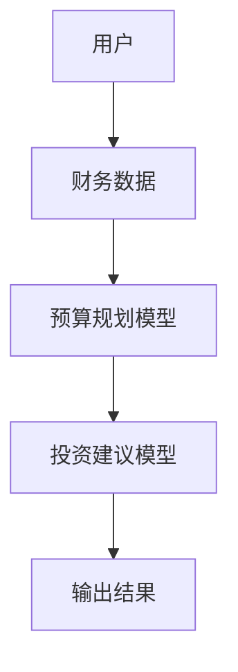
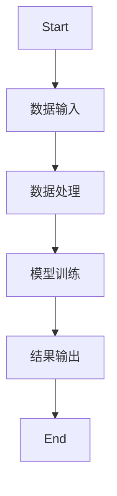
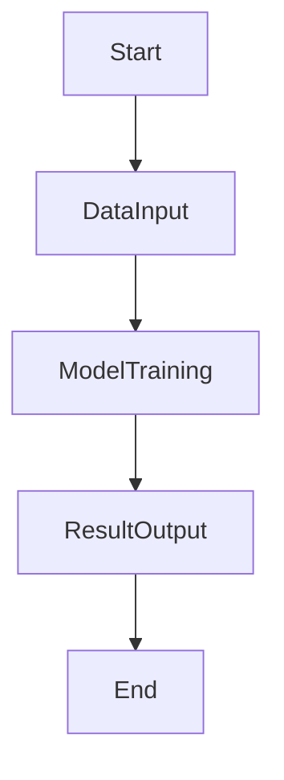
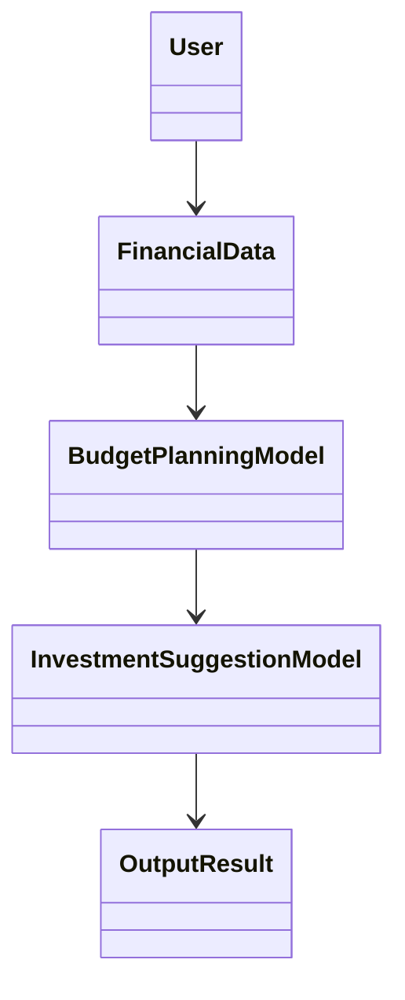
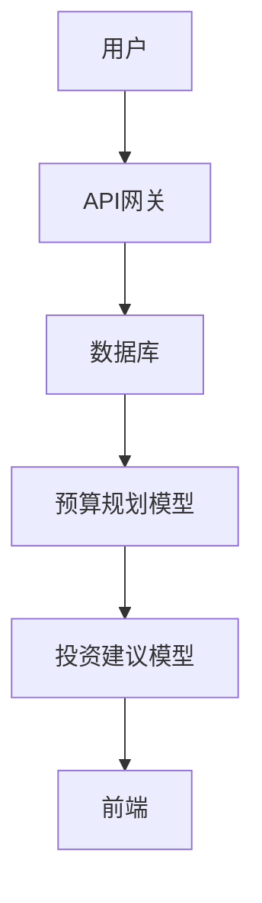
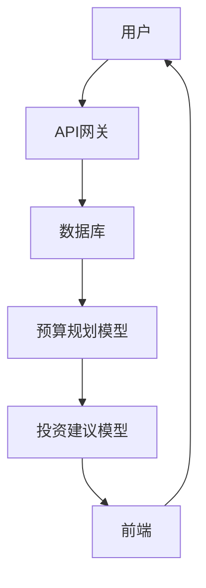

                 


# 构建企业级AI财务顾问：智能预算规划与投资建议

**关键词：** 企业级AI财务顾问，智能预算规划，投资建议，机器学习，财务数据分析

**摘要：**  
随着人工智能技术的快速发展，企业级AI财务顾问在智能预算规划和投资建议领域展现出了巨大的潜力。本文将详细探讨企业级AI财务顾问的核心概念、算法原理、系统架构设计以及项目实战，通过实际案例分析，帮助读者全面理解如何构建这样一个智能化的财务决策支持系统。

---

## 第一部分：企业级AI财务顾问概述

### 第1章：企业级AI财务顾问的背景与应用

#### 1.1 企业级AI财务顾问的定义与核心概念
##### 1.1.1 企业级AI财务顾问的定义  
企业级AI财务顾问是一种基于人工智能技术的财务决策支持系统，旨在通过自动化和智能化的方式，帮助企业进行预算规划、投资分析和财务优化。它能够整合企业内外部数据，利用机器学习算法生成个性化的财务建议，从而提升企业的财务效率和决策能力。

##### 1.1.2 AI在财务领域的应用背景  
随着企业数字化转型的推进，财务数据的复杂性和多样性不断增加。传统的人工财务分析方法效率低下，且容易受到主观因素的影响。AI技术的引入，使得财务数据的处理、分析和决策变得更加高效和精准。

##### 1.1.3 企业级AI财务顾问的核心功能  
- **预算规划：** 基于历史数据和市场趋势，生成预算建议。  
- **投资建议：** 通过分析市场动态和企业目标，推荐最优投资方案。  
- **风险评估：** 利用机器学习模型识别潜在风险，并提供应对策略。  

#### 1.2 智能预算规划与投资建议的业务流程
##### 1.2.1 预算规划的基本流程  
1. 数据收集：整合企业内部数据（如销售额、成本）和外部数据（如市场趋势）。  
2. 数据清洗：去除无效数据，处理缺失值。  
3. 数据分析：利用统计方法和机器学习模型预测未来预算需求。  
4. 预算生成：根据分析结果，生成初步预算方案。  
5. 方案优化：结合业务目标，调整预算分配。  

##### 1.2.2 投资建议的关键步骤  
1. 数据收集：整合企业财务数据、市场数据和行业趋势。  
2. 数据处理：清洗和预处理数据，确保模型输入的准确性。  
3. 模型训练：利用历史数据训练投资建议模型。  
4. 投资建议生成：根据模型预测结果，推荐最优投资方案。  

##### 1.2.3 AI在预算规划与投资建议中的作用  
AI技术能够快速处理大量数据，并通过模型预测未来趋势，从而为预算规划和投资决策提供科学依据。同时，AI还能实时监控市场变化，动态调整建议方案，提升企业的应变能力。

#### 1.3 企业级AI财务顾问的市场价值
##### 1.3.1 提高财务决策效率  
AI技术能够自动化处理财务数据，减少人工操作的时间和成本，显著提高财务决策效率。  

##### 1.3.2 降低财务风险  
通过实时监控和风险评估，AI能够帮助企业及时发现潜在风险，并提供应对策略，从而降低财务风险。  

##### 1.3.3 优化资源配置  
AI财务顾问能够根据企业的实际需求，优化资源配置，确保资金使用效率最大化。  

---

## 第二部分：企业级AI财务顾问的核心概念与联系

### 第2章：企业级AI财务顾问的核心概念与联系

#### 2.1 问题分析与概念模型
##### 2.1.1 问题背景与问题描述  
在传统财务工作中，预算规划和投资决策往往依赖人工经验，存在效率低下、风险较高的问题。如何利用AI技术提升财务决策的效率和准确性，是当前企业面临的重要挑战。  

##### 2.1.2 问题解决的思路  
通过引入机器学习算法，构建智能化的财务决策模型，实现预算规划和投资建议的自动化和智能化。  

##### 2.1.3 概念结构与核心要素  
- **核心要素：** 数据源、模型算法、用户需求、输出结果。  
- **概念结构：** 用户输入需求，系统整合数据并生成预算规划和投资建议，最终输出结果。  

#### 2.2 实体关系图与流程图
##### 2.2.1 ER实体关系图  


##### 2.2.2 流程图  


---

## 第三部分：企业级AI财务顾问的算法原理

### 第3章：企业级AI财务顾问的算法原理

#### 3.1 大模型在财务领域的应用
##### 3.1.1 大模型的训练与调优  
- **数据预处理：** 清洗和标注数据，确保模型输入的质量。  
- **模型训练：** 使用深度学习算法（如LSTM、Transformer）训练大模型。  
- **模型调优：** 通过交叉验证和超参数优化，提升模型性能。  

##### 3.1.2 预算规划的算法实现  
- **数学模型：** 基于线性规划的预算分配模型。  
  $$ \text{目标函数：} \min \sum_{i} c_i x_i $$
  $$ \text{约束条件：} \sum_{i} x_i = B $$
  其中，$c_i$ 为各项目的成本，$x_i$ 为分配的预算，$B$ 为总预算。  

##### 3.1.3 投资建议的算法实现  
- **数学模型：** 基于马科夫链的投资收益预测模型。  
  $$ \text{收益预测：} R_i = \alpha R_{i-1} + (1-\alpha) \mu $$
  其中，$\alpha$ 为平滑因子，$\mu$ 为历史平均收益。  

#### 3.2 预算规划与投资建议的数学模型
##### 3.2.1 预算规划模型  
$$ \text{总预算} = \sum_{i=1}^{n} \text{各项目预算} $$  

##### 3.2.2 投资建议模型  
$$ \text{投资收益} = \sum_{j=1}^{m} \text{各投资项目的收益} $$  

#### 3.3 算法实现与代码示例
##### 3.3.1 Python代码实现  
```python
def calculate_budget(projects):
    return sum(project.budget for project in projects)

def calculate_investment收益(investments):
    return sum(investment.profit for investment in investments)
```

##### 3.3.2 算法流程图  


---

## 第四部分：企业级AI财务顾问的系统架构设计

### 第4章：企业级AI财务顾问的系统架构设计

#### 4.1 问题场景介绍
##### 4.1.1 问题背景  
企业需要一个智能化的财务决策支持系统，以提高预算规划和投资决策的效率和准确性。  

##### 4.1.2 问题描述  
现有财务系统依赖人工操作，效率低下且容易出错。如何利用AI技术构建一个高效的财务决策支持系统，是当前的重要挑战。  

#### 4.2 系统功能设计
##### 4.2.1 领域模型类图  


#### 4.3 系统架构设计
##### 4.3.1 系统架构图  
```mermaid
graph TD
    API Gateway --> Database
    Database --> BudgetPlanningModel
    BudgetPlanningModel --> InvestmentSuggestionModel
    InvestmentSuggestionModel --> OutputResult
    OutputResult --> Frontend
```

#### 4.4 系统接口设计
##### 4.4.1 接口描述  
- **输入接口：** 用户输入需求和数据。  
- **输出接口：** 系统输出预算规划和投资建议。  

##### 4.4.2 接口流程图  


#### 4.5 系统交互流程图
##### 4.5.1 交互流程图  


---

## 第五部分：企业级AI财务顾问的项目实战

### 第5章：企业级AI财务顾问的项目实战

#### 5.1 环境配置
##### 5.1.1 系统环境  
- 操作系统：Linux/Windows/macOS  
- 语言：Python 3.8+  
- 工具：Jupyter Notebook、TensorFlow、PyTorch  

#### 5.2 核心代码实现
##### 5.2.1 数据处理代码  
```python
import pandas as pd

def load_data(file_path):
    return pd.read_csv(file_path)

def preprocess_data(data):
    data.dropna(inplace=True)
    return data
```

##### 5.2.2 模型训练代码  
```python
import tensorflow as tf

def build_model(input_shape):
    model = tf.keras.Sequential()
    model.add(tf.keras.layers.Dense(64, activation='relu', input_shape=input_shape))
    model.add(tf.keras.layers.Dense(1, activation='linear'))
    model.compile(optimizer='adam', loss='mse')
    return model

model = build_model((input_dim,))
model.fit(X_train, y_train, epochs=100, batch_size=32)
```

##### 5.2.3 模型部署代码  
```python
def generate_budget(projects):
    return sum(project.budget for project in projects)

def generate_investment建议(investments):
    return sum(investment.profit for investment in investments)
```

#### 5.3 案例分析与代码解读
##### 5.3.1 案例分析  
以某企业为例，假设该企业需要进行年度预算规划和投资决策。通过数据处理、模型训练和结果输出，生成预算规划和投资建议。  

##### 5.3.2 代码解读  
- 数据处理代码：读取数据并进行清洗。  
- 模型训练代码：构建深度学习模型并进行训练。  
- 模型部署代码：基于训练好的模型生成预算规划和投资建议。  

#### 5.4 项目总结
##### 5.4.1 项目成果  
成功构建了一个智能化的财务决策支持系统，能够自动进行预算规划和投资建议。  

##### 5.4.2 项目经验  
- 数据质量对模型性能影响较大，需要加强数据清洗和特征工程。  
- 模型调优是关键，需要结合业务需求进行参数优化。  

---

## 第六部分：最佳实践与注意事项

### 第6章：最佳实践与注意事项

#### 6.1 最佳实践
##### 6.1.1 数据处理  
- 确保数据的准确性和完整性。  
- 处理缺失值和异常值。  

##### 6.1.2 模型优化  
- 使用交叉验证进行模型评估。  
- 调整模型参数，优化模型性能。  

##### 6.1.3 系统部署  
- 采用微服务架构，确保系统的可扩展性。  
- 使用容器化技术（如Docker）进行部署。  

#### 6.2 小结
企业级AI财务顾问的构建需要结合业务需求和技术创新，通过不断优化算法和系统架构，提升系统的性能和用户体验。  

#### 6.3 注意事项
- 数据隐私和安全问题需要高度重视。  
- 模型的可解释性是实际应用中的重要考量因素。  

#### 6.4 拓展阅读
- 《Deep Learning》 —— Ian Goodfellow  
- 《机器学习实战》 —— 周志华  

---

## 附录

### 附录A：代码库与工具推荐
- 数据处理：Pandas、NumPy  
- 模型训练：TensorFlow、PyTorch  
- 可视化：Matplotlib、Seaborn  

### 附录B：相关技术资料
- 官方文档：[TensorFlow官方文档](https://tensorflow.org)  
- 开发博客：[Towards Data Science](https://towardsdatascience.com)  

---

**作者：AI天才研究院/AI Genius Institute & 禅与计算机程序设计艺术/Zen And The Art of Computer Programming**

