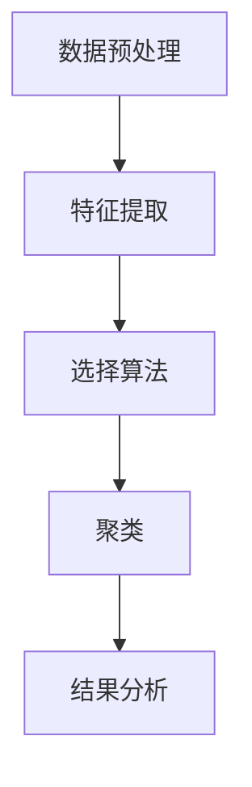
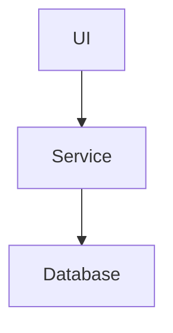
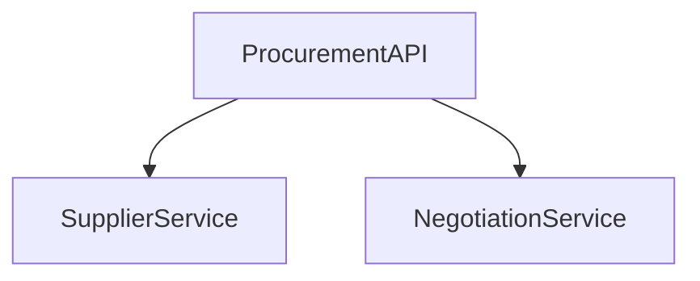
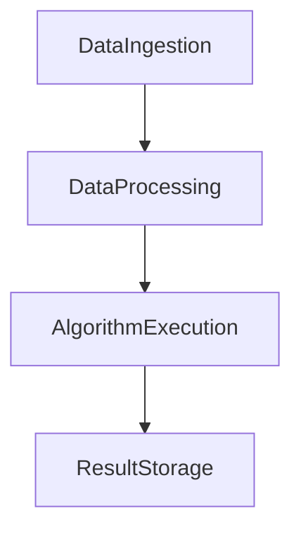

                 


---

# 构建企业级AI采购助手：优化供应商选择与谈判

> **关键词：** 企业级AI采购助手，供应商选择，AI算法，采购谈判，系统架构设计

> **摘要：** 本文详细探讨了构建企业级AI采购助手的过程，从问题背景到系统设计，再到项目实战，全面解析了如何利用AI技术优化供应商选择与采购谈判流程。文章结合具体案例，深入分析了协同过滤、聚类分析等算法的应用，以及系统架构设计的细节，为读者提供了从理论到实践的全面指导。

---

## 第1章: 企业级AI采购助手的背景与问题描述

### 1.1 问题背景

#### 1.1.1 传统采购流程的痛点
传统的采购流程通常依赖人工经验，存在以下痛点：
- **信息不对称**：采购人员难以全面掌握市场动态和供应商资质。
- **效率低下**：手动筛选供应商和谈判过程耗时耗力。
- **决策风险**：缺乏数据支持，可能导致采购成本增加或质量问题。

#### 1.1.2 供应商选择的复杂性
供应商选择涉及多个维度，如价格、质量、交货期、信誉等，传统方法难以量化和优化。

#### 1.1.3 谈判过程中的信息不对称
谈判过程中，供应商可能隐藏关键信息，导致企业利益受损。

### 1.2 问题描述

#### 1.2.1 供应商选择的多维度评估
供应商评估需要综合考虑多个维度，包括历史交易数据、供应商资质、市场评价等。

#### 1.2.2 谈判过程中的策略优化
谈判策略需要基于实时数据和市场趋势，制定最优报价和条款。

#### 1.2.3 数据驱动的采购决策需求
通过数据分析，优化采购策略，降低采购成本，提高采购效率。

### 1.3 问题解决与边界

#### 1.3.1 AI技术在采购中的应用潜力
- **数据挖掘**：分析历史采购数据，发现潜在供应商。
- **机器学习**：预测供应商表现，优化选择过程。
- **自然语言处理**：分析供应商文档，提取关键信息。

#### 1.3.2 边界与外延
- **边界**：仅关注供应商选择与谈判过程。
- **外延**：不涉及采购后的供应链管理。

#### 1.3.3 核心要素与组成结构
- 核心要素：数据采集、算法模型、系统架构。
- 组成结构：数据层、算法层、系统层。

## 第2章: 企业级AI采购助手的核心概念与联系

### 2.1 核心概念原理

#### 2.1.1 数据驱动的采购决策
- 数据来源：历史采购记录、供应商评价、市场趋势。
- 数据处理：清洗、特征提取、数据建模。

#### 2.1.2 AI算法在供应商选择中的应用
- **协同过滤**：基于相似供应商推荐。
- **聚类分析**：将供应商分为不同类别，便于选择。

#### 2.1.3 自然语言处理在谈判支持中的作用
- **信息提取**：从供应商文档中提取关键信息。
- **情感分析**：分析供应商谈判中的情绪，制定应对策略。

### 2.2 核心概念对比表

| 比较维度 | 协同过滤 | 聚类分析 | 分类算法 |
|----------|----------|----------|----------|
| 适用场景 | 推荐相似供应商 | 组织供应商类别 | 预测供应商资质 |
| 算法复杂度 | 中等 | 较高 | 较低 |
| 数据需求 | 高 | 高 | 中等 |

### 2.3 ER实体关系图

```mermaid
erDiagram
    supplier(SID, SName, SLocation, SRating) {
        supplier <---|{m:n} purchase_order
        supplier <---|{m:n} negotiation_record
    }
    purchase_order(POID, PID, SID, PODate, Amount) {
        purchase_order -->|{1} product
    }
    negotiation_record(NIID, PID, SID, Negotiator, Terms, Result) {
        negotiation_record -->|{1} supplier
    }
    product(PID, PName, PDescription, PPrice)
```

---

## 第3章: 供应商选择与谈判的算法原理

### 3.1 算法原理概述

#### 3.1.1 协同过滤算法
协同过滤基于用户或供应商的相似性推荐相关供应商。

**数学模型：**
$$ sim(i,j) = \frac{\sum_{k} r_{ik} r_{jk}}{\sqrt{\sum_{k} r_{ik}^2} \sqrt{\sum_{k} r_{jk}^2}} $$

#### 3.1.2 聚类分析算法
聚类分析将供应商分为不同类别，便于选择。

**流程图：**


#### 3.1.3 分类算法
分类算法用于预测供应商的资质。

**Python实现示例：**
```python
from sklearn.linear_model import LogisticRegression
model = LogisticRegression()
model.fit(X_train, y_train)
y_pred = model.predict(X_test)
```

### 3.2 算法优缺点分析

#### 3.4.1 协同过滤算法优缺点
- **优点**：推荐结果相关性高。
- **缺点**：计算复杂度较高。

#### 3.4.2 聚类分析算法优缺点
- **优点**：便于分类管理。
- **缺点**：对噪声数据敏感。

#### 3.4.3 分类算法优缺点
- **优点**：预测准确性高。
- **缺点**：需要大量训练数据。

---

## 第4章: 采购助手的系统分析与架构设计

### 4.1 系统功能设计

#### 4.1.1 数据采集模块
- 采集供应商数据，清洗处理。

#### 4.1.2 供应商评估模块
- 应用算法模型评估供应商。

#### 4.1.3 谈判支持模块
- 提供谈判策略建议。

#### 4.1.4 数据可视化模块
- 展示采购数据和分析结果。

### 4.2 系统架构设计

#### 4.2.1 分层架构设计


#### 4.2.2 微服务架构设计


#### 4.2.3 数据流设计


### 4.3 系统接口设计

#### 4.3.1 数据接口
- 数据导入接口：`POST /api/import`

#### 4.3.2 用户接口
- 供应商评估页面：`GET /procurement/supplier`

#### 4.3.3 API接口
- 谈判结果预测：`POST /negotiation/predict`

---

## 第5章: 项目实战

### 5.1 环境安装

#### 5.1.1 安装Python依赖
```bash
pip install numpy pandas scikit-learn
```

#### 5.1.2 安装Jupyter Notebook
```bash
pip install jupyter
```

### 5.2 系统核心实现

#### 5.2.1 数据预处理代码
```python
import pandas as pd

df = pd.read_csv('suppliers.csv')
df.dropna(inplace=True)
```

#### 5.2.2 模型训练代码
```python
from sklearn.cluster import KMeans

kmeans = KMeans(n_clusters=3)
kmeans.fit(X)
```

### 5.3 实际案例分析

#### 5.3.1 数据分析
- 数据清洗：去除无效数据。
- 特征提取：提取供应商的关键特征。

#### 5.3.2 结果分析
- 聚类结果：供应商分为三个类别，分别对应高中低资质。

### 5.4 项目小结

- **成功经验**：算法选择和系统设计的成功经验。
- **问题总结**：项目中遇到的问题及解决方案。

---

## 第6章: 最佳实践与注意事项

### 6.1 最佳实践
- 数据质量是关键，确保数据清洗和预处理。
- 选择合适的算法，结合业务需求。

### 6.2 注意事项
- 避免过度依赖算法，结合人工审核。
- 定期更新数据和模型，保持准确性。

### 6.3 拓展阅读
- 《机器学习实战》
- 《数据驱动的采购管理》

---

## 作者：AI天才研究院 & 禅与计算机程序设计艺术

---

**总结：** 本文从背景到系统设计，再到项目实战，全面解析了构建企业级AI采购助手的过程。通过详细分析算法原理和系统架构，为读者提供了从理论到实践的全面指导，助力企业优化供应商选择与谈判流程。

