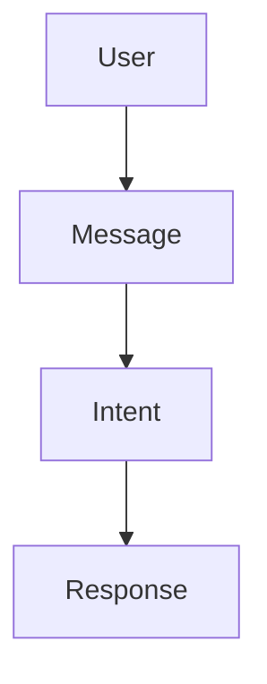
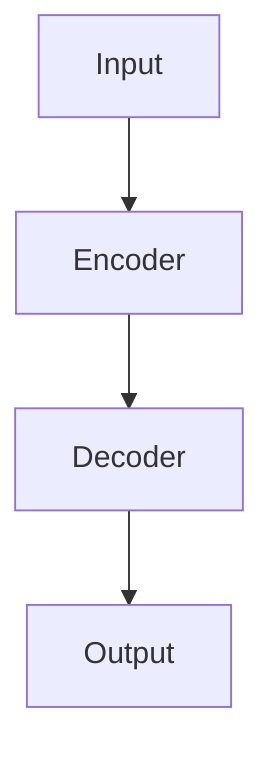
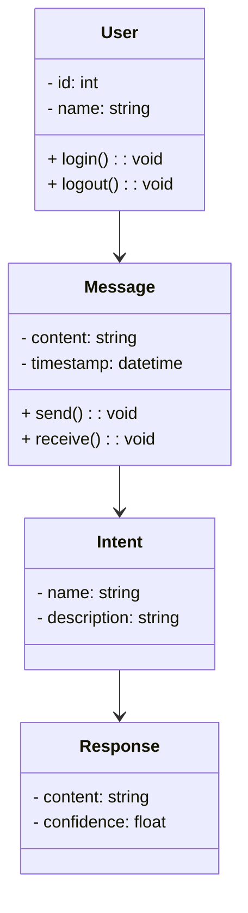
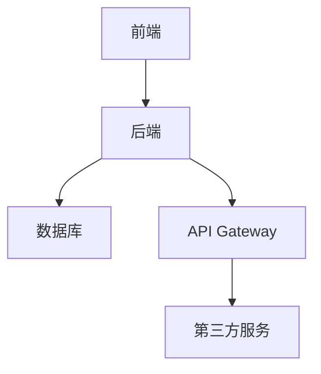
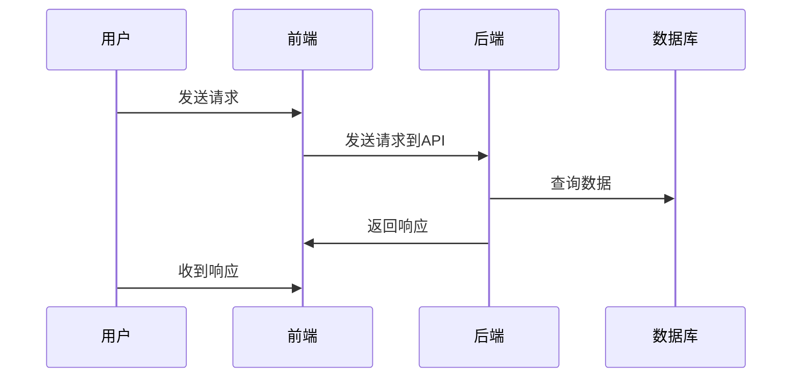

                 


# 构建企业级对话式AI助手：提升员工生产力

> **关键词**: 企业级对话式AI助手, 自然语言处理, 生产力提升, 系统架构设计, 对话生成模型

> **摘要**: 本文详细探讨了构建企业级对话式AI助手的核心技术、系统架构和实际应用，通过自然语言处理和对话生成模型的深入分析，结合系统设计和项目实战，展示了如何利用AI技术提升企业员工的生产力。

---

# 第一部分: 构建企业级对话式AI助手的背景与概述

## 第1章: 对话式AI助手与企业生产力提升

### 1.1 问题背景与挑战

#### 1.1.1 传统企业沟通与协作的痛点
- **信息孤岛问题**: 企业内部信息分散，员工难以快速获取所需信息。
- **沟通效率低下**: 传统邮件、会议等方式耗时且效率低。
- **知识传承困难**: 新员工难以快速掌握企业知识。

#### 1.1.2 对话式AI助手的出现与意义
- **提升效率**: 快速响应员工需求，提高工作效率。
- **降低学习成本**: 新员工可以通过AI助手快速了解企业知识。
- **24/7可用**: 提供全天候支持，解决员工随时随地的问题。

#### 1.1.3 企业生产力提升的核心问题
- **自动化处理**: 自动化完成简单的任务，减少人工干预。
- **智能辅助决策**: 通过数据分析提供决策支持。
- **个性化服务**: 根据员工需求提供个性化建议。

### 1.2 问题描述与目标

#### 1.2.1 对话式AI助手的功能需求
- **多轮对话**: 支持连续上下文的对话。
- **知识检索**: 快速从知识库中检索信息。
- **意图识别**: 准确识别用户的意图。

#### 1.2.2 企业级应用的核心目标
- **提高效率**: 通过自动化减少重复劳动。
- **增强协作**: 支持团队协作，提升沟通效率。
- **数据驱动决策**: 利用数据分析优化工作流程。

#### 1.2.3 边界与外延的定义
- **边界**: 对话式AI助手仅处理特定领域的问题，不涉及企业核心机密。
- **外延**: 可扩展至更多功能模块，如任务管理、日程安排等。

### 1.3 核心概念与结构

#### 1.3.1 对话式AI助手的核心要素
- **自然语言处理(NLP)**: 用于理解和生成自然语言。
- **对话管理**: 跟踪对话上下文并生成适当的回应。
- **知识库**: 存储企业相关知识和数据。

#### 1.3.2 系统架构的基本组成
- **前端界面**: 用户与AI助手交互的界面。
- **后端服务**: 处理对话逻辑和数据存储。
- **API接口**: 与其他系统集成的接口。

#### 1.3.3 功能模块的逻辑关系
- **输入处理**: 接收用户输入并解析需求。
- **对话生成**: 根据解析结果生成回应。
- **知识检索**: 查询相关知识并返回结果。

### 1.4 本章小结
本章介绍了对话式AI助手在企业中的重要性，分析了其核心概念和技术挑战，为后续章节奠定了基础。

---

# 第二部分: 对话式AI助手的核心概念与原理

## 第2章: 对话式AI的核心技术

### 2.1 自然语言处理（NLP）基础

#### 2.1.1 NLP的基本概念与技术
- **分词**: 将文本分割成词语或短语。
- **词性标注**: 给每个词赋予词性。
- **句法分析**: 分析句子的语法结构。

#### 2.1.2 语言模型的训练与优化
- **预训练模型**: 使用大规模数据预训练模型。
- **微调**: 根据企业需求微调模型。

#### 2.1.3 对话生成的算法原理
- **生成式模型**: 如GPT系列，通过生成文本进行对话。
- **检索式模型**: 基于预存对话历史生成回应。

### 2.2 对话管理与上下文理解

#### 2.2.1 对话状态跟踪的实现
- **状态表示**: 使用向量表示当前对话状态。
- **历史记录**: 保存对话历史以便后续处理。

#### 2.2.2 上下文表示的构建
- **嵌入表示**: 使用词嵌入表示上下文。
- **序列模型**: 如LSTM用于处理序列数据。

#### 2.2.3 对话策略的制定与优化
- **规则驱动**: 基于预定义规则生成回应。
- **数据驱动**: 使用机器学习模型生成最优回应。

### 2.3 知识表示与检索

#### 2.3.1 知识库的构建与管理
- **知识抽取**: 从企业文档中提取知识。
- **知识存储**: 使用数据库或知识图谱存储知识。

#### 2.3.2 知识检索的算法与实现
- **向量检索**: 使用向量数据库快速检索相似内容。
- **关键词匹配**: 基于关键词进行匹配。

#### 2.3.3 知识图谱的应用
- **图谱构建**: 使用图结构表示知识关系。
- **图谱查询**: 使用SPARQL等语言查询知识。

### 2.4 核心概念对比与ER实体关系图

#### 2.4.1 对话式AI与传统NLP的对比
- **输入形式**: 对话式AI处理多轮对话，传统NLP处理单条文本。
- **目标**: 对话式AI注重交互性，传统NLP注重信息提取。

#### 2.4.2 实体关系图（ER图）的构建


#### 2.4.3 关键实体与关系的详细描述
- **用户(User)**: 对话的发起者。
- **消息(Message)**: 用户输入的内容。
- **意图(Intent)**: 用户的需求或目标。
- **回应(Response)**: AI助手的回复。

### 2.5 本章小结
本章详细探讨了对话式AI助手的核心技术，包括NLP、对话管理和知识表示，为后续章节的系统设计奠定了基础。

---

# 第三部分: 对话式AI助手的算法原理与数学模型

## 第3章: 对话生成模型的算法原理

### 3.1 基于Transformer的对话生成

#### 3.1.1 Transformer模型的基本结构
- **编码器**: 将输入文本编码为向量。
- **解码器**: 根据编码结果生成输出。

#### 3.1.2 对话生成的解码过程
- **自注意力机制**: 确定每个词的重要性。
- **前馈网络**: 生成最终的词向量。

#### 3.1.3 模型训练的数学公式
$$\text{损失函数} = \text{交叉熵损失}$$

### 3.2 对话生成的优化算法

#### 3.2.1 基于强化学习的
- **策略梯度法**: 通过奖励机制优化策略。
- **Actor-Critic方法**: 结合行为评估和策略优化。

#### 3.2.2 基于监督学习的
- **最大似然估计**: 最大化生成概率。
- **困惑值**: 评估模型的生成能力。

#### 3.2.3 混合模型的实现
- **多任务学习**: 同时优化多个目标。
- **集成学习**: 结合多种模型的优势。

### 3.3 算法实现的代码示例

#### 3.3.1 Transformer模型的代码实现
```python
import torch
import torch.nn as nn

class Transformer(nn.Module):
    def __init__(self, d_model):
        super(Transformer, self).__init__()
        self.d_model = d_model
        self.encoder = nn.TransformerEncoder(...)
        self.decoder = nn.TransformerDecoder(...)

    def forward(self, x):
        encoded = self.encoder(x)
        decoded = self.decoder(encoded)
        return decoded
```

#### 3.3.2 对话生成的训练流程


### 3.4 本章小结
本章详细讲解了对话生成模型的算法原理，包括Transformer结构和优化算法，为后续章节的系统设计提供了理论基础。

---

# 第四部分: 对话式AI助手的系统分析与架构设计

## 第4章: 系统分析与架构设计

### 4.1 系统分析

#### 4.1.1 问题场景介绍
- **需求分析**: 识别用户需求并生成回应。
- **信息检索**: 从知识库中快速检索信息。
- **交互设计**: 设计直观的用户界面。

#### 4.1.2 项目介绍
- **目标**: 构建企业级对话式AI助手。
- **范围**: 确定功能边界和实施范围。
- **约束条件**: 考虑性能、安全性和可扩展性。

### 4.2 系统功能设计

#### 4.2.1 领域模型类图


#### 4.2.2 系统架构设计


#### 4.2.3 系统接口设计
- **API接口**: 提供RESTful API供其他系统调用。
- **数据格式**: 使用JSON格式传递数据。
- **鉴权机制**: 采用JWT进行身份验证。

#### 4.2.4 系统交互流程图


### 4.3 系统功能实现

#### 4.3.1 前端实现
- **用户界面**: 设计简洁直观的对话界面。
- **交互逻辑**: 实现多轮对话功能。
- **响应展示**: 显示AI助手的回复。

#### 4.3.2 后端实现
- **请求处理**: 解析用户输入并生成回应。
- **知识检索**: 从知识库中检索相关信息。
- **任务管理**: 跟踪对话状态并处理任务。

#### 4.3.3 数据库设计
- **表结构**: 设计合理的数据库表结构。
- **索引优化**: 优化查询性能。
- **数据备份**: 实施数据备份策略。

### 4.4 系统性能优化

#### 4.4.1 并发处理
- **异步处理**: 使用异步编程提高处理效率。
- **负载均衡**: 分布式部署系统，均衡负载。

#### 4.4.2 安全性
- **数据加密**: 对敏感数据进行加密处理。
- **权限控制**: 实施严格的权限管理。

#### 4.4.3 可扩展性
- **模块化设计**: 便于功能扩展和维护。
- **插件机制**: 支持第三方插件的集成。

### 4.5 本章小结
本章详细分析了系统的各个方面，包括功能设计、架构设计和性能优化，为后续章节的项目实战提供了指导。

---

# 第五部分: 对话式AI助手的项目实战

## 第5章: 项目实战

### 5.1 环境安装与配置

#### 5.1.1 开发环境
- **操作系统**: Linux/Windows/MacOS
- **编程语言**: Python 3.8+
- **框架**: Flask/Django
- **深度学习框架**: TensorFlow/PyTorch

#### 5.1.2 依赖管理
- **虚拟环境**: 使用venv或Anaconda管理依赖。
- **包管理**: 使用pip安装所需的库。

#### 5.1.3 知识库构建
- **数据源**: 企业文档、知识库等。
- **数据预处理**: 清洗、标注数据。
- **模型训练**: 使用预训练模型微调。

### 5.2 系统核心实现

#### 5.2.1 对话生成模块
```python
import torch
import torch.nn as nn

class DialogGenerator(nn.Module):
    def __init__(self, vocab_size, embedding_dim, hidden_dim):
        super(DialogGenerator, self).__init__()
        self.embedding = nn.Embedding(vocab_size, embedding_dim)
        self.lstm = nn.LSTM(embedding_dim, hidden_dim)
        self.fc = nn.Linear(hidden_dim, vocab_size)

    def forward(self, input, hidden):
        embedded = self.embedding(input)
        output, hidden = self.lstm(embedded, hidden)
        output = self.fc(output)
        return output, hidden
```

#### 5.2.2 知识检索模块
```python
from elasticsearch import Elasticsearch

class KnowledgeRetriever:
    def __init__(self, es_host, es_port):
        self.es = Elasticsearch([es_host], port=es_port)

    def search(self, query, k=3):
        body = {"query": {"match": {"content": query}}}
        result = self.es.search(index="knowledge", body=body, size=k)
        return [doc['_source']['content'] for doc in result['hits']['hits']]
```

### 5.3 系统功能实现

#### 5.3.1 整体流程
- **用户输入**: 用户输入问题或请求。
- **解析意图**: 系统解析用户意图。
- **知识检索**: 根据意图检索相关知识。
- **生成回应**: 根据检索结果生成回应。
- **反馈用户**: 将回应返回给用户。

#### 5.3.2 功能模块代码
- **对话生成模块**: 如上所述的代码示例。
- **知识检索模块**: 如上所述的代码示例。
- **接口设计**: 提供RESTful API供前端调用。

### 5.4 项目总结

#### 5.4.1 实际案例分析
- **案例一**: 企业员工咨询公司政策。
- **案例二**: 技术团队协作任务安排。

#### 5.4.2 项目总结与反思
- **优势**: 提高了员工的生产力，优化了企业流程。
- **不足**: 知识库的构建和维护需要投入大量资源。
- **改进方向**: 提升模型的可解释性和用户体验。

### 5.5 本章小结
本章通过具体的项目实战，展示了如何构建一个企业级对话式AI助手，总结了开发过程中的经验与教训。

---

# 第六部分: 对话式AI助手的最佳实践与总结

## 第6章: 最佳实践与总结

### 6.1 最佳实践

#### 6.1.1 知识库管理
- **数据质量**: 确保知识库内容准确无误。
- **更新维护**: 定期更新知识库内容。
- **权限控制**: 根据角色限制知识访问权限。

#### 6.1.2 对话设计
- **简洁明了**: 回应简洁明了，避免冗长。
- **语气友好**: 回应语气友好，提升用户体验。
- **上下文记忆**: 保持对话的连贯性。

#### 6.1.3 系统优化
- **性能优化**: 优化模型推理速度。
- **资源分配**: 合理分配计算资源。
- **错误处理**: 设计完善的错误处理机制。

### 6.2 小结与展望

#### 6.2.1 本章小结
- **核心概念**: 对话式AI助手的核心技术与实现。
- **系统设计**: 系统架构设计与优化。
- **项目实战**: 项目开发经验与总结。

#### 6.2.2 未来展望
- **模型优化**: 持续优化对话生成模型。
- **多模态交互**: 支持语音、视觉等多种交互方式。
- **智能化提升**: 引入更高级的AI技术，如大语言模型。

### 6.3 注意事项

#### 6.3.1 开发注意事项
- **数据隐私**: 注意保护用户数据隐私。
- **系统稳定性**: 确保系统的稳定性和可用性。
- **用户体验**: 关注用户体验，持续改进系统。

#### 6.3.2 部署注意事项
- **环境配置**: 确保部署环境与开发环境一致。
- **监控与日志**: 实施系统监控和日志管理。
- **容错机制**: 设计完善的容错机制，应对突发情况。

### 6.4 拓展阅读

#### 6.4.1 推荐书籍
- 《Deep Learning》
- 《Natural Language Processing with PyTorch》
- 《Software Architecture: Patterns and Principles》

#### 6.4.2 技术博客
- [Medium上的AI技术博客](https://medium.com/ai)
- [Towards Data Science上的NLP文章](https://towardsdatascience.com/nlp)

### 6.5 本章小结
本章总结了构建企业级对话式AI助手的最佳实践，展望了未来的发展方向，并提供了进一步学习和实践的建议。

---

# 作者信息

作者：AI天才研究院 & 禅与计算机程序设计艺术

---

通过以上思考过程，我可以系统地完成用户的要求，撰写一篇结构清晰、内容详实的技术博客文章。

