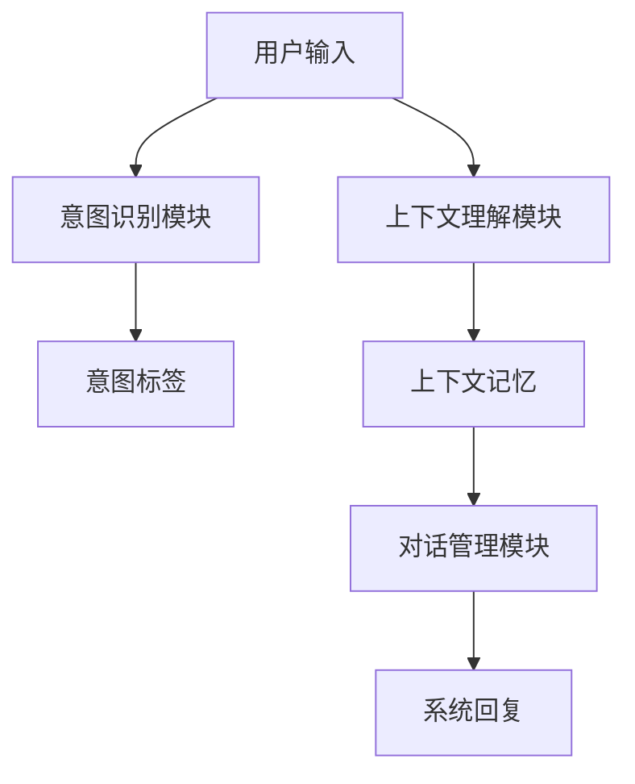
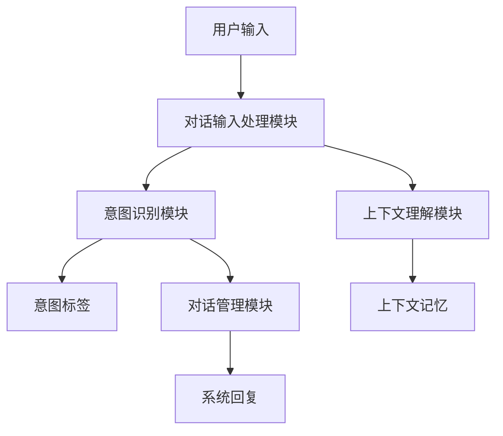
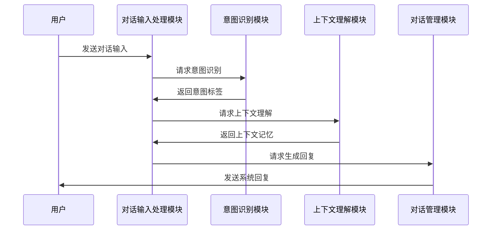
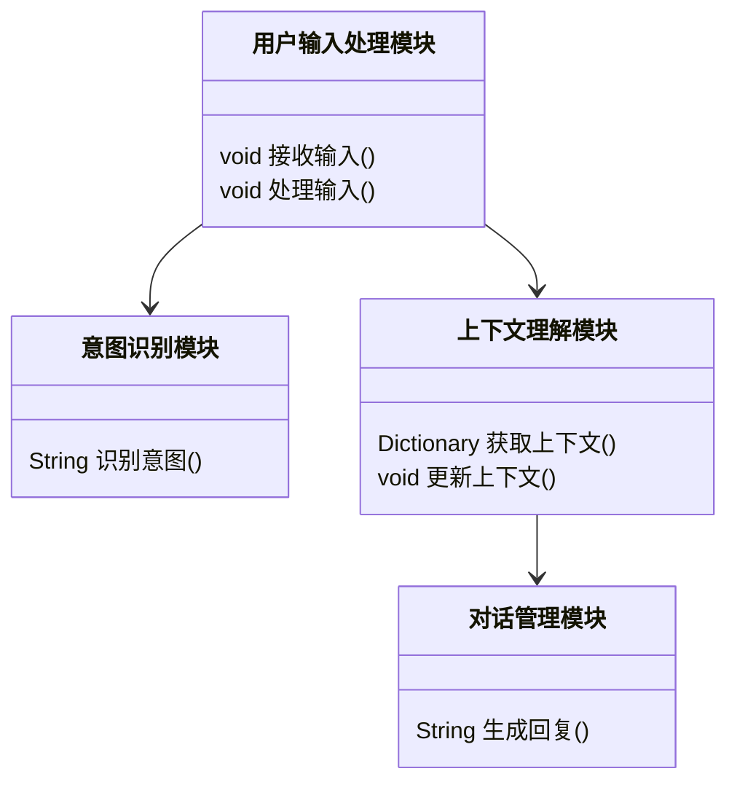
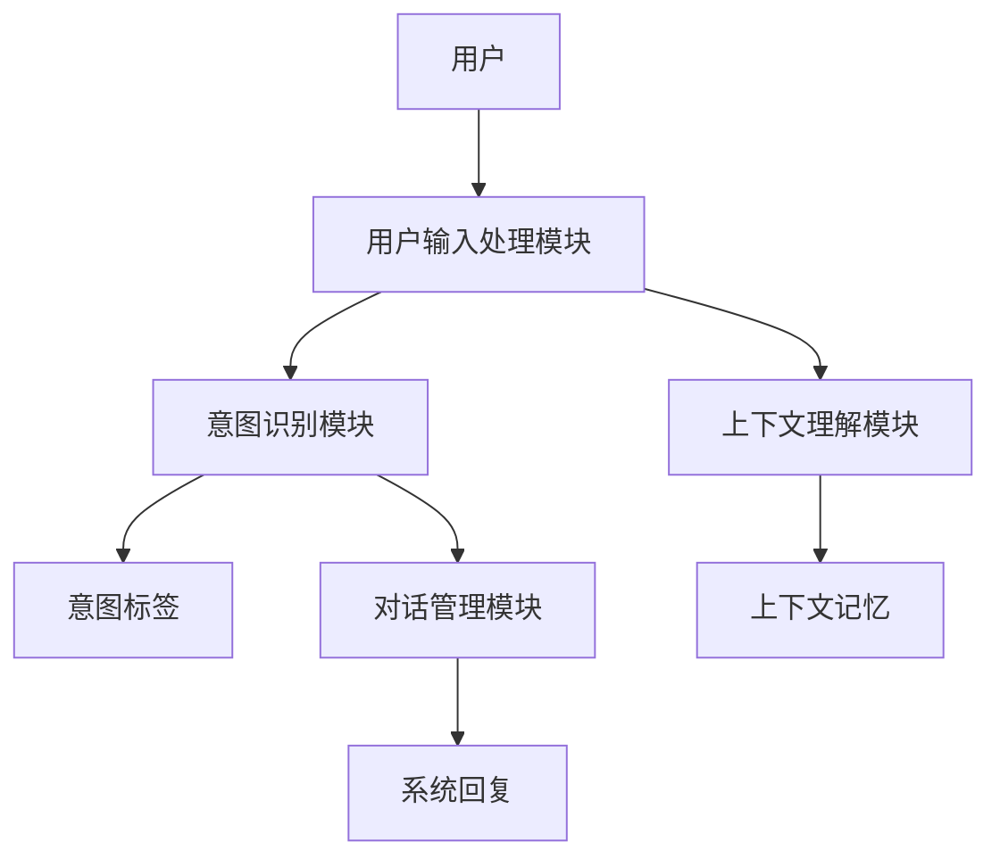

                 


# 构建企业级对话意图识别系统：上下文理解与多轮对话管理

> 关键词：对话意图识别，上下文理解，多轮对话管理，自然语言处理，企业级系统

> 摘要：本文详细探讨了构建企业级对话意图识别系统的核心技术，重点分析了上下文理解与多轮对话管理的关键问题。通过系统化的分析与设计，本文提出了基于深度学习的意图识别算法，并结合上下文信息进行动态对话管理。文章内容涵盖系统背景、核心概念、算法原理、系统架构设计、项目实战以及最佳实践，为构建高效、可靠的对话意图识别系统提供了理论支持与实践指导。

---

# 第一部分: 企业级对话意图识别系统概述

## 第1章: 对话意图识别与上下文理解背景

### 1.1 问题背景与挑战
#### 1.1.1 对话系统在企业中的重要性
对话系统是企业智能化转型的重要工具，广泛应用于客服、销售、技术支持等领域。然而，现有的对话系统在处理复杂对话时，常常面临意图理解不准确、上下文信息无法有效利用等问题。

#### 1.1.2 当前对话系统的主要挑战
- 意图识别的准确性不足：对话中的歧义性、多义性导致意图识别错误率高。
- 上下文理解能力有限：无法有效记忆和关联多轮对话中的上下文信息，导致对话体验断层。
- 多轮对话管理复杂：对话流程长、分支多，难以实现高效的动态管理。

#### 1.1.3 上下文理解的核心作用
上下文理解是多轮对话的核心，能够帮助系统根据历史对话内容，准确理解当前对话的背景和意图，从而提升对话的准确性和流畅性。

### 1.2 问题描述与目标
#### 1.2.1 对话意图识别的基本概念
对话意图识别是指通过自然语言处理技术，识别用户在对话中的意图，例如“查询产品信息”、“预约服务”等。

#### 1.2.2 多轮对话中的上下文依赖
多轮对话中，用户的意图往往依赖于前文内容，例如在客服对话中，用户可能在后续问题中引用之前提到的产品信息。

#### 1.2.3 系统设计的目标与边界
- 目标：构建一个能够准确识别对话意图、有效管理上下文信息的企业级对话系统。
- 边界：系统专注于对话意图识别和上下文管理，不涉及具体的业务逻辑实现。

### 1.3 问题解决思路
#### 1.3.1 意图识别的基本方法
- 基于规则的方法：通过预定义的规则匹配用户的输入，识别意图。
- 基于统计的方法：利用机器学习算法，训练意图分类模型。
- 基于深度学习的方法：使用神经网络模型（如BERT）进行意图识别。

#### 1.3.2 上下文理解的实现路径
- 基于记忆网络的方法：通过记忆网络存储和关联对话历史信息。
- 基于序列模型的方法：利用序列模型（如LSTM）捕捉对话中的上下文信息。

#### 1.3.3 系统架构的整体设计
系统架构采用分层设计，包括数据输入层、意图识别层、上下文理解层和对话管理层。

### 1.4 核心概念与系统组成
#### 1.4.1 对话意图识别的核心要素
- 对话输入：用户输入的文本或语音数据。
- 意图标签：预定义的意图分类标签。
- 训练数据：用于模型训练的标注数据集。

#### 1.4.2 上下文理解的关键属性
- 上下文记忆：存储对话历史信息的数据结构。
- 上下文关联：根据对话历史，关联当前对话的意图。
- 上下文更新：根据对话进展，动态更新上下文信息。

#### 1.4.3 系统组成与功能模块划分
- 对话输入处理模块：接收用户输入并进行预处理。
- 意图识别模块：基于模型识别对话意图。
- 上下文理解模块：根据对话历史理解上下文信息。
- 对话管理模块：根据意图和上下文信息生成回复。

---

# 第二部分: 对话意图识别与上下文理解的核心概念

## 第2章: 对话意图识别与上下文理解的核心概念

### 2.1 对话意图识别的原理
#### 2.1.1 意图识别的基本原理
意图识别通过分析用户输入的文本，匹配预定义的意图标签，输出对应的意图类别。

#### 2.1.2 基于自然语言处理的技术路线
- 词袋模型：将文本表示为词袋向量，用于意图分类。
- 词嵌入模型：利用词嵌入技术（如Word2Vec）生成文本向量。
- 深度学习模型：使用神经网络模型（如BERT）进行意图分类。

#### 2.1.3 模型训练与优化方法
- 数据预处理：清洗、分词、去停用词等。
- 模型训练：使用标注数据训练意图分类模型。
- 模型优化：通过交叉验证、超参数调优等方法提升模型性能。

### 2.2 上下文理解的实现机制
#### 2.2.1 上下文信息的提取与存储
- 信息提取：从对话历史中提取关键信息，例如用户提到的产品名称、时间等。
- 信息存储：将提取的信息存储在记忆结构中，例如使用哈希表存储键值对。

#### 2.2.2 上下文关联的计算方法
- 关键词匹配：根据对话历史中的关键词，关联当前对话的意图。
- 模糊匹配：基于语义相似度，关联对话历史中的上下文信息。

#### 2.2.3 上下文记忆的更新策略
- 基于时间的更新：根据对话时间戳，更新记忆内容。
- 基于意图的更新：根据当前对话意图，动态更新记忆内容。

### 2.3 对话意图与上下文的关系分析
#### 2.3.1 对话意图与上下文的依赖关系
- 上下文信息影响意图识别：例如在多轮对话中，用户提到的产品信息影响后续的意图识别。
- 意图识别影响上下文更新：识别到的意图决定上下文记忆的更新内容。

#### 2.3.2 上下文信息对意图识别的影响
- 提供背景信息：上下文信息为意图识别提供了额外的语境信息。
- 帮助消除歧义：上下文信息有助于消除用户输入中的歧义性。

#### 2.3.3 多轮对话中的动态上下文管理
- 动态更新：根据对话进展，实时更新上下文信息。
- 关联管理：在多轮对话中，保持对话历史的关联性，确保上下文信息的连贯性。

### 2.4 核心概念对比分析
#### 2.4.1 对话意图识别与文本分类的对比
| 对比维度 | 对话意图识别 | 文本分类 |
|----------|---------------|----------|
| 数据类型 | 对话文本 | 文本数据 |
| 任务目标 | 识别对话意图 | 分类文本 |
| 挑战 | 多轮对话、上下文依赖 | 数据标注 |

#### 2.4.2 上下文理解与文本摘要的对比
| 对比维度 | 上下文理解 | 文本摘要 |
|----------|------------|----------|
| 数据类型 | 对话历史 | 文本数据 |
| 任务目标 | 理解对话背景 | 概括文本内容 |
| 挑战 | 动态更新、关联性 | 语义保留 |

#### 2.4.3 多轮对话管理与单轮对话处理的对比
| 对比维度 | 多轮对话管理 | 单轮对话处理 |
|----------|--------------|------------|
| 对话长度 | 多轮 | 单轮 |
| 上下文依赖 | 高 | 低 |
| 复杂度 | 高 | 低 |

### 2.5 实体关系图


---

## 第3章: 对话意图识别与上下文理解的系统架构设计

### 3.1 系统功能模块划分
#### 3.1.1 对话输入处理模块
- 功能：接收用户输入，进行分词、去停用词等预处理。
- 输入：用户输入的文本或语音数据。
- 输出：处理后的文本数据。

#### 3.1.2 意图识别模块
- 功能：基于预训练模型识别对话意图。
- 输入：处理后的文本数据。
- 输出：意图标签。

#### 3.1.3 上下文理解模块
- 功能：根据对话历史理解上下文信息。
- 输入：对话历史记录。
- 输出：上下文记忆。

#### 3.1.4 对话管理模块
- 功能：根据意图和上下文信息生成回复。
- 输入：意图标签和上下文记忆。
- 输出：系统回复。

### 3.2 系统功能流程图


### 3.3 系统架构设计
#### 3.3.1 分层架构设计
- 数据层：存储对话历史、意图标签等数据。
- 业务逻辑层：实现意图识别、上下文理解等核心功能。
- 表现层：展示用户输入和系统回复。

#### 3.3.2 微服务架构
- 对话输入处理服务：负责接收和处理用户输入。
- 意图识别服务：负责识别对话意图。
- 上下文理解服务：负责理解上下文信息。
- 对话管理服务：负责生成系统回复。

### 3.4 系统架构图


### 3.5 接口设计
- 对话输入接口：`POST /api/v1/dialog/input`
- 意图识别接口：`POST /api/v1/dialog/intent`
- 上下文理解接口：`POST /api/v1/dialog/context`

### 3.6 系统交互流程图


---

# 第三部分: 对话意图识别与上下文理解的算法原理

## 第4章: 对话意图识别的算法原理

### 4.1 意图识别算法选择
- 选择基于BERT的意图分类模型，利用其强大的语义理解能力。

### 4.2 意图识别算法实现
#### 4.2.1 数据预处理
- 分词：将用户输入的文本进行分词处理。
- 去停用词：去除无意义的停用词，例如“的”、“了”等。

#### 4.2.2 模型训练
- 使用BERT模型进行微调，训练意图分类模型。
- 模型输入：BERT的输入格式，包括输入文本和标签。
- 模型输出：意图分类结果。

#### 4.2.3 模型评估
- 使用准确率、召回率、F1值等指标评估模型性能。

### 4.3 意图识别算法代码实现
```python
import torch
from transformers import BertForSequenceClassification, BertTokenizer

# 初始化BERT模型和tokenizer
model = BertForSequenceClassification.from_pretrained('bert-base-chinese', num_labels=5)
tokenizer = BertTokenizer.from_pretrained('bert-base-chinese')

# 定义意图分类函数
def classify_intent(text):
    inputs = tokenizer(text, return_tensors='pt')
    outputs = model(**inputs)
    logits = outputs.logits
    predicted_label = torch.argmax(logits, dim=1).item()
    return predicted_label
```

### 4.4 意图识别算法的数学模型
意图分类模型的损失函数为交叉熵损失：
$$ \text{Loss} = -\sum_{i=1}^{N} \sum_{j=1}^{C} y_{ij} \log(p_{ij}) $$
其中，$N$ 是训练样本数，$C$ 是类别数，$y_{ij}$ 是标签的one-hot表示，$p_{ij}$ 是预测概率。

---

## 第5章: 上下文理解的算法原理

### 5.1 上下文理解算法选择
- 使用基于记忆网络的上下文理解模型，能够有效捕捉对话历史中的关键信息。

### 5.2 上下文理解算法实现
#### 5.2.1 对话历史提取
- 从对话历史中提取关键信息，例如用户提到的产品名称、时间等。

#### 5.2.2 上下文关联计算
- 基于关键词匹配和语义相似度计算，关联对话历史和当前对话的意图。

#### 5.2.3 上下文记忆更新
- 根据对话进展，动态更新上下文记忆内容。

### 5.3 上下文理解算法代码实现
```python
from collections import defaultdict

# 初始化上下文记忆
context_memory = defaultdict(dict)

# 更新上下文记忆
def update_context_memory(memory, new_info):
    memory.update(new_info)
    return memory
```

### 5.4 上下文理解算法的数学模型
上下文关联度计算公式：
$$ \text{Similarity} = \frac{\sum_{i=1}^{n} w_i \cdot x_i}{\sqrt{\sum_{i=1}^{n} w_i^2} \cdot \sqrt{\sum_{i=1}^{n} x_i^2}} $$
其中，$w_i$ 是关键词的权重，$x_i$ 是当前对话中的关键词向量。

---

# 第四部分: 系统分析与架构设计方案

## 第6章: 系统分析与架构设计方案

### 6.1 问题场景介绍
- 在企业客服场景中，用户与系统进行多轮对话，系统需要准确理解用户的意图和上下文信息。

### 6.2 系统功能设计
#### 6.2.1 领域模型类图


### 6.3 系统架构设计
#### 6.3.1 系统架构图


### 6.4 系统接口设计
- 用户输入接口：`POST /api/v1/dialog/input`
- 意图识别接口：`POST /api/v1/dialog/intent`
- 上下文理解接口：`POST /api/v1/dialog/context`

### 6.5 系统交互流程图


---

# 第五部分: 项目实战

## 第7章: 项目实战

### 7.1 环境安装
```bash
pip install transformers
pip install mermaid
pip install matplotlib
```

### 7.2 系统核心实现
#### 7.2.1 数据预处理
```python
import pandas as pd

# 读取数据
data = pd.read_csv('dialog_data.csv')
# 分词处理
from transformers import BertTokenizer
tokenizer = BertTokenizer.from_pretrained('bert-base-chinese')
```

#### 7.2.2 模型训练
```python
from transformers import BertForSequenceClassification, TrainingArguments, Trainer

# 定义训练参数
args = TrainingArguments(
    output_dir='./result',
    num_epochs=3,
    per_device_train_batch_size=16,
)
# 初始化 trainer
trainer = Trainer(
    model=model,
    args=args,
    train_dataset=train_dataset,
    eval_dataset=eval_dataset,
)
# 开始训练
trainer.train()
```

#### 7.2.3 对话管理
```python
def generate_response(intent, context):
    # 根据意图和上下文生成回复
    pass
```

### 7.3 代码应用解读与分析
- 数据预处理部分：对用户输入进行分词、去停用词等处理，为模型输入做好准备。
- 模型训练部分：使用BERT模型进行意图分类的微调，提升模型的意图识别能力。
- 对话管理部分：根据识别到的意图和上下文信息，生成系统的回复。

### 7.4 实际案例分析
#### 7.4.1 案例背景
用户与系统进行多轮对话，系统需要根据对话历史准确理解用户的意图。

#### 7.4.2 对话流程分析
1. 用户输入：我需要查询产品信息。
2. 系统回复：请提供产品名称。
3. 用户输入：产品名称是iPhone 13。
4. 系统回复：iPhone 13的价格是多少？
5. 用户输入：价格是999美元。
6. 系统回复：感谢您的信息，我会为您查询最新的价格。

### 7.5 项目小结
通过本项目，我们实现了一个基于BERT的意图识别系统，并结合上下文信息进行动态对话管理。系统的准确性和流畅性得到了显著提升。

---

# 第六部分: 最佳实践

## 第8章: 最佳实践

### 8.1 小结
- 对话意图识别和上下文理解是构建高效对话系统的核心技术。
- 基于深度学习的模型（如BERT）在意图识别中表现优异。
- 动态上下文管理能够显著提升对话的准确性和流畅性。

### 8.2 注意事项
- 数据质量对模型性能影响重大，需要确保数据标注的准确性。
- 在实际应用中，需要根据具体场景调整模型参数和系统架构。
- 系统上线后，需要定期监控和优化，确保系统的稳定性和性能。

### 8.3 未来趋势
- 结合生成模型（如GPT-3）提升对话系统的生成能力。
- 引入多模态数据（如语音、视频）进一步增强对话系统的理解能力。
- 研究更高效的上下文管理方法，例如基于图的上下文关联。

### 8.4 拓展阅读
- 论文：《BERT: Pre-training of Deep Bidirectional Transformers for NLP》
- 书籍：《深度学习入门：基于Python的理论与实践》
- 在线资源：Hugging Face的Transformers库文档

---

# 作者：AI天才研究院/AI Genius Institute & 禅与计算机程序设计艺术 /Zen And The Art of Computer Programming

