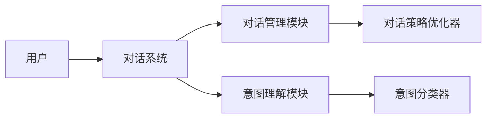
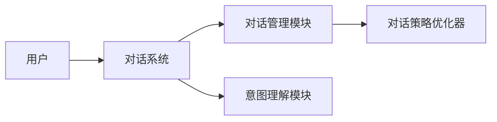
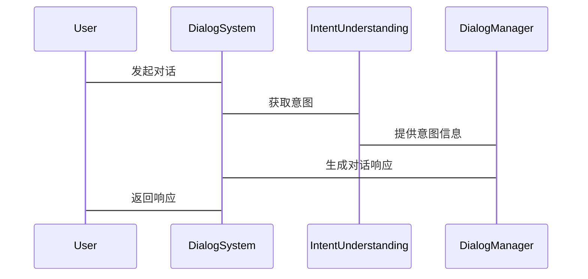

                 


# 《构建企业级对话系统：多轮对话管理与意图理解》

> 关键词：企业级对话系统，多轮对话管理，意图理解，对话状态表示，对话策略优化，自然语言处理（NLP）

> 摘要：本文将深入探讨企业级对话系统的核心构建技术，重点分析多轮对话管理和意图理解的关键问题及解决方案。通过结合实际案例和算法原理，详细讲解对话系统的设计与实现，帮助读者掌握构建高效、智能的企业级对话系统的方法。

---

# 第一部分：企业级对话系统概述

## 第1章：对话系统的发展与重要性

### 1.1 对话系统的发展历程

#### 1.1.1 从单轮对话到多轮对话的演进
- 单轮对话的局限性：无法处理连续上下文，无法支持复杂交互。
- 多轮对话的崛起：通过维护对话历史和上下文，实现更复杂的用户交互。

#### 1.1.2 企业级对话系统的崛起
- 企业级对话系统的定义：为企业提供智能化对话服务的系统，支持多轮交互、意图理解、个性化服务。
- 企业级对话系统的应用场景：客户支持、销售咨询、内部协作、用户服务等。

#### 1.1.3 当前对话系统的应用场景
- 智能客服：通过对话系统实现自动化问题解答。
- 电子商务：通过对话系统实现购物推荐、订单跟踪。
- 金融服务：通过对话系统实现理财咨询、账户管理。

### 1.2 多轮对话管理的核心问题

#### 1.2.1 对话历史的重要性
- 对话历史的作用：记录用户意图、上下文信息，帮助系统理解当前对话的背景。
- 对话历史的存储方式：基于文本、基于结构化数据、基于向量表示。

#### 1.2.2 对话状态的表示方法
- 对话状态的定义：包括用户意图、对话历史、系统状态等。
- 常见的对话状态表示方法：基于规则的表示、基于向量的表示、基于图的表示。

#### 1.2.3 对话策略的制定与优化
- 对话策略的目标：最大化用户满意度，实现对话目标。
- 常见的对话策略优化方法：基于规则的策略优化、基于强化学习的策略优化。

### 1.3 意图理解的挑战与解决方案

#### 1.3.1 意图理解的基本概念
- 意图的定义：用户在对话中期望实现的目标或需求。
- 意图理解的挑战：意图的多样性、模糊性、上下文依赖性。

#### 1.3.2 多轮对话中的意图变化
- 意图的变化：用户在多轮对话中可能修改或补充意图。
- 意图变化的处理方法：动态意图跟踪、意图重定义。

#### 1.3.3 意图理解的常见技术
- 基于规则的意图理解：通过预定义规则匹配用户输入。
- 基于统计的意图理解：通过机器学习模型学习用户意图。
- 基于深度学习的意图理解：通过神经网络模型捕捉用户意图。

---

## 第2章：对话系统的核心概念与联系

### 2.1 对话管理与意图理解的关系

#### 2.1.1 对话管理的定义与作用
- 对话管理的定义：通过对对话历史和上下文的分析，生成合适的对话响应。
- 对话管理的作用：维护对话状态、协调对话流程、优化对话策略。

#### 2.1.2 意图理解的定义与作用
- 意图理解的定义：通过分析用户输入，识别用户的意图。
- 意图理解的作用：为对话管理提供输入，支持对话策略的制定。

#### 2.1.3 两者之间的协同关系
- 对话管理依赖意图理解：对话管理需要意图理解的结果作为输入。
- 意图理解依赖对话管理：意图理解需要对话管理提供的对话历史和上下文信息。

### 2.2 对话状态表示的核心要素

#### 2.2.1 对话历史的记录方式
- 文本记录：直接记录用户和系统的对话内容。
- 结构化记录：将对话内容转化为结构化的数据，例如JSON格式。
- 向量表示：将对话内容转化为向量形式，用于深度学习模型的处理。

#### 2.2.2 对话上下文的构建
- 上下文的定义：对话过程中积累的信息，包括用户意图、对话历史等。
- 上下文的构建方法：基于规则的构建、基于模型的构建。

#### 2.2.3 对话目标的设定
- 对话目标的定义：对话过程中需要实现的目标，例如解决问题、完成任务。
- 对话目标的动态调整：根据对话进展，实时调整对话目标。

### 2.3 意图理解的关键属性对比

#### 2.3.1 不同意图理解方法的对比
| 方法 | 优点 | 缺点 |
|------|------|------|
| 基于规则 | 实现简单，易于解释 | 需要手动编写规则，难以扩展 |
| 基于统计 | 可以处理大量数据，泛化能力强 | 需要大量标注数据，准确率依赖数据质量 |
| 基于深度学习 | 表达能力强，准确率高 | 计算资源消耗大，实现复杂 |

#### 2.3.2 基于规则与基于模型的意图理解
- 基于规则的意图理解：通过预定义的规则匹配用户输入，例如关键词匹配。
- 基于模型的意图理解：通过机器学习模型（如SVM、随机森林）或深度学习模型（如LSTM、Transformer）预测用户意图。

#### 2.3.3 意图理解的准确率与响应时间
- 意图理解的准确率：准确率高可以提高用户体验，但需要更多的计算资源。
- 意图理解的响应时间：响应时间短可以提高用户体验，但可能需要牺牲准确率。

### 2.4 实体关系图（ER图）展示



---

## 第3章：多轮对话管理的算法原理

### 3.1 基于隐马尔可夫模型（HMM）的对话管理

#### 3.1.1 HMM的基本原理
- 隐马尔可夫模型：通过观察数据推断隐含状态的模型。
- HMM的三要素：状态转移概率、观测概率、初始状态概率。

#### 3.1.2 在对话管理中的应用
- 对话管理中的状态表示：将对话状态表示为HMM的隐状态。
- 对话管理中的状态转移：通过HMM的状态转移概率生成对话响应。

#### 3.1.3 示例代码实现
```python
import numpy as np

class HMM:
    def __init__(self, states, obs_vocabulary):
        self.states = states
        self.obs_vocabulary = obs_vocabulary
        self.A = np.zeros((len(states), len(states)))
        self.B = np.zeros((len(states), len(obs_vocabulary)))
        self.pi = np.zeros(len(states))
    
    def train(self, observations, align=True):
        # 简单的训练方法，仅用于示例
        pass
    
    def predict(self, observations):
        # 简单的预测方法，仅用于示例
        pass
```

#### 3.1.4 HMM在对话管理中的数学模型
$$ P(\text{状态转移}) = A_{i,j} $$
$$ P(\text{观测}) = B_{j,k} $$
$$ P(\text{初始状态}) = \pi_i $$

---

### 3.2 基于条件随机场（CRF）的意图理解

#### 3.2.1 CRF的基本原理
- 条件随机场：一种用于序列标注的无向图模型。
- CRF的优势：考虑全局上下文信息，建模能力强。

#### 3.2.2 在意图理解中的应用
- 意图理解的序列标注问题：将用户输入的序列标注为多个意图。
- CRF在意图理解中的建模：通过CRF建模意图的上下文依赖关系。

#### 3.2.3 示例代码实现
```python
import numpy as np

class CRF:
    def __init__(self, vocab):
        self.vocab = vocab
        self.tag_map = {'B-I': 0, 'I-I': 1, 'O': 2}
    
    def train(self, sentences):
        # 简单的训练方法，仅用于示例
        pass
    
    def predict(self, sentence):
        # 简单的预测方法，仅用于示例
        return 'O' * len(sentence)
```

#### 3.2.4 CRF在意图理解中的数学模型
$$ P(\text{标签序列}| \text{观测序列}) = \frac{1}{Z} \prod_{i=1}^{n} \text{score}(i) $$

---

## 第4章：对话系统架构与设计

### 4.1 系统分析与架构设计

#### 4.1.1 问题场景介绍
- 对话系统的应用场景：智能客服、电子商务、金融服务等。
- 对话系统的用户需求：高效、准确、智能化的对话服务。

#### 4.1.2 项目介绍
- 项目目标：构建一个支持多轮对话和意图理解的企业级对话系统。
- 项目范围：包括对话管理、意图理解、对话策略优化等功能。

#### 4.1.3 系统功能设计
- 系统功能模块：对话管理模块、意图理解模块、对话策略优化模块。
- 系统功能流程：用户输入 -> 意图理解 -> 对话管理 -> 系统响应。

#### 4.1.4 系统架构设计
- 系统架构分层：数据层、业务逻辑层、用户接口层。
- 系统架构图：


#### 4.1.5 系统接口设计
- 系统接口定义：RESTful API，包括启动对话、获取对话状态、生成对话响应等接口。
- 系统接口实现：基于HTTP协议，使用JSON格式传递数据。

#### 4.1.6 系统交互设计
- 系统交互流程：用户发起对话 -> 系统接收输入 -> 系统处理输入 -> 系统生成响应。
- 系统交互图：


---

## 第5章：项目实战与应用

### 5.1 环境安装与配置

#### 5.1.1 安装Python环境
- 安装Python：建议使用Python 3.8或更高版本。
- 安装依赖库：使用pip安装numpy、tensorflow、transformers等库。

#### 5.1.2 安装对话系统框架
- 推荐使用Rasa框架：安装Rasa、Rasa-sdk等。

#### 5.1.3 配置开发环境
- 配置IDE：推荐使用PyCharm或VS Code。
- 配置虚拟环境：创建虚拟环境并安装依赖库。

### 5.2 系统核心实现

#### 5.2.1 对话管理模块实现
- 对话管理模块代码：
```python
class DialogManager:
    def __init__(self):
        self.dialog_states = {}
    
    def process_input(self, user_id, input_text):
        # 获取意图
        intent = self.intent_understanding.get_intent(user_id, input_text)
        # 更新对话状态
        self.dialog_states[user_id] = self.update_dialog_state(self.dialog_states[user_id], intent)
        # 生成响应
        response = self.generate_response(user_id, intent)
        return response
```

#### 5.2.2 意图理解模块实现
- 意图理解模块代码：
```python
class IntentUnderstanding:
    def __init__(self):
        self.models = {}
    
    def get_intent(self, user_id, text):
        # 加载模型
        model = self.models.get(user_id, None)
        if not model:
            model = self.train_model(user_id)
            self.models[user_id] = model
        # 预测意图
        intent = self.predict_intent(model, text)
        return intent
```

#### 5.2.3 对话策略优化实现
- 对话策略优化代码：
```python
class DialogStrategyOptimizer:
    def __init__(self):
        self.strategy_map = {}
    
    def optimize_strategy(self, dialog_state, possible_responses):
        # 选择最优的对话策略
        return self.strategy_map.get(dialog_state, possible_responses[0])
```

### 5.3 实际案例分析与解读

#### 5.3.1 案例背景
- 案例名称：智能客服对话系统。
- 案例目标：实现智能客服的多轮对话管理和意图理解功能。

#### 5.3.2 案例分析
- 用户输入：用户提出问题“如何修改密码？”。
- 意图理解：系统识别用户的意图是“修改密码”。
- 对话管理：系统生成响应“请提供您的账户信息以验证身份。”。

#### 5.3.3 代码实现解读
- 对话管理模块：处理用户输入，生成对话响应。
- 意图理解模块：识别用户意图，提供给对话管理模块。
- 对话策略优化：选择最优的对话策略，确保对话顺利进行。

### 5.4 项目总结与经验分享

#### 5.4.1 项目小结
- 项目实现的关键点：对话管理、意图理解、对话策略优化。
- 项目实现的难点：对话状态的动态更新、意图理解的准确率提升。

#### 5.4.2 最佳实践
- 数据质量：高质量的训练数据是意图理解的关键。
- 模型调优：通过不断测试和优化，提升对话系统的性能。
- 系统维护：定期更新对话系统，适应用户需求的变化。

---

## 第6章：总结与展望

### 6.1 核心知识点回顾

#### 6.1.1 对话管理的关键技术
- 对话状态表示、对话策略优化、对话历史记录。

#### 6.1.2 意图理解的核心技术
- 基于规则的意图理解、基于统计的意图理解、基于深度学习的意图理解。

### 6.2 最佳实践与小结

#### 6.2.1 最佳实践
- 数据质量：确保训练数据的多样性和代表性。
- 模型选择：根据具体场景选择合适的意图理解方法。
- 系统维护：定期更新对话系统，优化用户体验。

#### 6.2.2 注意事项
- 避免过度优化：在对话策略优化中，避免过度复杂化。
- 注意隐私保护：在处理用户数据时，确保用户隐私安全。

### 6.3 拓展阅读与深入学习

#### 6.3.1 深入学习资源
- 推荐书籍：《自然语言处理实战》、《深度学习入门：基于Python的理论与实现》。
- 推荐论文：阅读最新的对话系统相关论文，了解前沿技术。

#### 6.3.2 技术趋势
- 对话系统的智能化：基于大模型（如GPT-3）的对话系统。
- 对话系统的个性化：基于用户画像的个性化对话服务。
- 对话系统的多模态化：结合视觉、听觉等多模态信息的对话系统。

---

# 作者：AI天才研究院 / AI Genius Institute  
#  & 禅与计算机程序设计艺术 / Zen And The Art of Computer Programming

