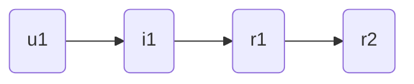
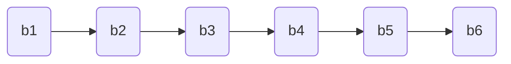
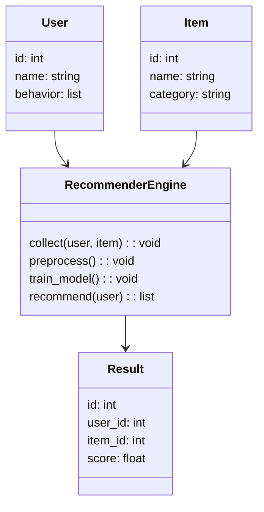
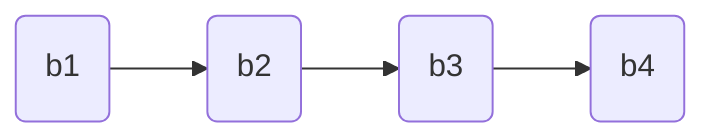
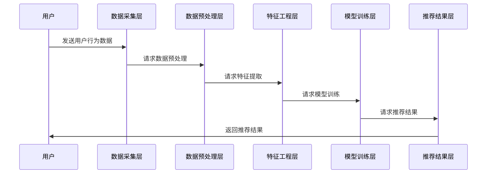

                 


# 构建企业级推荐引擎：跨平台用户行为分析与个性化推荐

> 关键词：企业级推荐引擎，跨平台用户行为分析，个性化推荐，推荐算法，系统架构设计，用户行为分析，机器学习

> 摘要：企业级推荐引擎是现代互联网系统中的核心组件，它通过分析用户的跨平台行为数据，提供个性化推荐服务。本文从推荐引擎的背景、核心概念、算法原理、系统架构设计、项目实战等多个方面进行详细阐述，结合实际案例分析，深入探讨如何构建高效、准确、稳定的推荐系统。

---

# 第一部分: 背景与概述

# 第1章: 构建企业级推荐引擎的背景与概述

## 1.1 推荐引擎的背景与重要性

### 1.1.1 推荐引擎的定义与核心价值

推荐引擎是一种基于用户行为数据，利用算法和模型，为用户推荐相关内容或产品的技术系统。其核心价值在于通过个性化推荐提高用户体验、增加用户粘性和产品转化率。

### 1.1.2 企业级推荐引擎的应用场景

企业级推荐引擎广泛应用于电商、视频、音乐、社交网络等多个领域。例如，在电商系统中，推荐引擎可以为用户推荐相关商品；在视频平台中，推荐引擎可以为用户推荐个性化内容。

### 1.1.3 跨平台用户行为分析的必要性

在多平台（PC、移动端、Web）环境下，用户的使用习惯和行为模式存在差异。跨平台用户行为分析可以整合不同平台的数据，为推荐引擎提供更全面的用户画像。

## 1.2 问题背景与目标

### 1.2.1 用户行为分析的核心问题

用户行为分析的核心问题是如何从海量数据中提取有用的特征，从而理解用户的兴趣和需求。

### 1.2.2 个性化推荐的目标与挑战

个性化推荐的目标是为每个用户推荐最相关的物品或内容。其挑战在于如何平衡推荐的精准性与多样性，同时确保推荐系统的实时性和可扩展性。

### 1.2.3 企业级推荐引擎的边界与外延

企业级推荐引擎的边界包括数据源、推荐目标和推荐场景。其外延则涉及数据预处理、特征工程、模型训练和结果输出等环节。

## 1.3 本章小结

---

# 第二部分: 核心概念与原理

# 第2章: 推荐引擎的核心概念与联系

## 2.1 推荐引擎的核心概念

### 2.1.1 用户行为分析的核心要素

用户行为分析的核心要素包括用户标识、行为类型、行为时间、行为场景和行为结果。

### 2.1.2 个性化推荐的实现机制

个性化推荐的实现机制包括基于协同过滤、基于内容的推荐和基于混合模型的推荐。

## 2.2 核心概念的原理与联系

### 2.2.1 用户行为分析的模型与方法

用户行为分析的模型包括基于时间序列的模型、基于聚类的模型和基于深度学习的模型。

### 2.2.2 个性化推荐的算法与策略

个性化推荐的算法包括基于用户的协同过滤、基于物品的协同过滤、矩阵分解和深度学习模型（如神经网络协同过滤）。

## 2.3 实体关系图与流程图

### 2.3.1 用户-物品-推荐引擎的ER图



### 2.3.2 推荐引擎的核心流程图



## 2.4 本章小结

---

# 第三部分: 算法原理与实现

# 第3章: 推荐算法的核心原理

## 3.1 协同过滤算法

### 3.1.1 基于用户的协同过滤

基于用户的协同过滤算法通过寻找与当前用户兴趣相似的其他用户，将其行为数据作为推荐依据。

$$ 相似度计算公式：sim(u_i, u_j) = \frac{\sum_{k} (r_{u_i,k} - \bar{r_{u_i}})(r_{u_j,k} - \bar{r_{u_j}})}}{\sqrt{\sum_{k} (r_{u_i,k} - \bar{r_{u_i}})^2} \cdot \sqrt{\sum_{k} (r_{u_j,k} - \bar{r_{u_j}})^2}}} $$

### 3.1.2 基于物品的协同过滤

基于物品的协同过滤算法通过分析用户对物品的评分，找到与当前物品相似的其他物品，将其推荐给用户。

$$ 相似度计算公式：sim(i_j, i_k) = \frac{\sum_{u} (r_{u,i_j} - \bar{r_{i_j}})(r_{u,i_k} - \bar{r_{i_k}})}}{\sqrt{\sum_{u} (r_{u,i_j} - \bar{r_{i_j}})^2} \cdot \sqrt{\sum_{u} (r_{u,i_k} - \bar{r_{i_k}})^2}}} $$

### 3.1.3 混合推荐算法

混合推荐算法结合了基于用户和基于物品的协同过滤算法，通过加权的方式提高推荐的准确性和多样性。

## 3.2 基于矩阵分解的推荐算法

### 3.2.1 矩阵分解的数学模型

矩阵分解是一种常用的推荐算法，其核心思想是将用户-物品评分矩阵分解为用户特征矩阵和物品特征矩阵的乘积。

$$ 矩阵分解公式：R = P \cdot Q^T $$

其中，R是用户-物品评分矩阵，P是用户特征矩阵，Q是物品特征矩阵。

### 3.2.2 矩阵分解的实现步骤

1. 初始化用户特征矩阵P和物品特征矩阵Q。
2. 通过梯度下降或交替最小二乘法优化P和Q，使预测评分与实际评分的误差最小。
3. 输出最终的P和Q矩阵，用于推荐计算。

## 3.3 基于深度学习的推荐算法

### 3.3.1 神经网络协同过滤

神经网络协同过滤是一种基于深度学习的推荐算法，通过构建神经网络模型，学习用户和物品的非线性特征表示。

### 3.3.2 基于注意力机制的推荐算法

注意力机制通过关注用户行为中重要的部分，提高推荐的准确性和相关性。

---

# 第四部分: 系统分析与架构设计

# 第4章: 系统架构设计与实现

## 4.1 问题场景介绍

### 4.1.1 系统功能模块

推荐系统主要功能模块包括用户行为数据采集、数据预处理、特征工程、模型训练和结果输出。

### 4.1.2 项目介绍

以一个电商推荐系统为例，介绍推荐系统的建设背景、目标和需求。

## 4.2 系统功能设计

### 4.2.1 领域模型设计

领域模型设计包括用户、物品、推荐引擎和推荐结果四个核心实体。



### 4.2.2 系统架构设计

系统架构设计采用分层架构，包括数据层、业务逻辑层和表现层。



### 4.2.3 系统接口设计

系统接口设计包括数据接口、模型接口和结果接口。

### 4.2.4 系统交互设计

系统交互设计通过序列图展示用户、推荐引擎和结果的交互流程。



## 4.3 本章小结

---

# 第五部分: 项目实战

# 第5章: 项目实战与案例分析

## 5.1 环境安装与配置

### 5.1.1 安装Python环境

安装Python 3.8或更高版本，并安装必要的库（如numpy、pandas、scikit-learn等）。

### 5.1.2 安装推荐算法库

安装推荐算法库，如surprise、tensorflow等。

## 5.2 核心功能实现

### 5.2.1 数据预处理

对用户行为数据进行清洗、特征提取和格式转换。

### 5.2.2 模型训练

基于协同过滤或矩阵分解算法，训练推荐模型。

### 5.2.3 推荐结果输出

根据训练好的模型，为用户生成推荐列表。

## 5.3 代码实现与解读

### 5.3.1 协同过滤算法实现

```python
from surprise import Dataset, Reader, CollaborativeFiltering

# 加载数据集
data = Dataset.load_from_file('rating.csv', format='csv', sep=',', header=None)

# 初始化协同过滤算法
cf = CollaborativeFiltering()

# 训练模型
cf.fit(data.build_full_trainset())

# 预测结果
testset = data.build_testset()
predictions = cf.test(testset)

# 输出预测结果
for uid, iid, true_r, est in predictions:
    print(f"User {uid} for item {iid}推荐分数为: {est}")
```

### 5.3.2 矩阵分解算法实现

```python
import numpy as np

# 初始化矩阵
P = np.random.rand(n_users, n_factors)
Q = np.random.rand(n_items, n_factors)

# 定义损失函数和梯度下降优化函数
def loss(X, P, Q):
    return np.mean((X - np.dot(P, Q.T))**2)

def optimize(X, P, Q, learning_rate=0.1):
    for i in range(X.shape[0]):
        for j in range(X.shape[1]):
            if X[i, j] > 0:
                error = X[i, j] - np.dot(P[i], Q[j])
                P[i] += learning_rate * error * Q[j]
                Q[j] += learning_rate * error * P[i]
    return P, Q

# 训练模型
for _ in range(epochs):
    P, Q = optimize(X, P, Q)

# 输出推荐结果
推荐结果 = np.dot(P, Q.T)
```

## 5.4 案例分析与详细解读

以电商推荐系统为例，详细分析推荐引擎的实现过程，包括数据采集、特征提取、模型训练和结果输出。

## 5.5 本章小结

---

# 第六部分: 总结与展望

# 第6章: 总结与展望

## 6.1 本章总结

总结全文，回顾推荐引擎的核心概念、算法原理和系统架构设计。

## 6.2 未来展望

展望推荐引擎的发展方向，包括更高效的算法、更智能的模型和更广泛的应用场景。

## 6.3 最佳实践 tips

### 6.3.1 推荐系统设计的关键点

- 数据质量：确保数据的完整性和准确性。
- 模型选择：根据实际场景选择合适的推荐算法。
- 系统优化：优化推荐系统的性能和用户体验。

### 6.3.2 项目开发中的注意事项

- 数据隐私：保护用户数据隐私。
- 系统可扩展性：设计可扩展的系统架构。
- 模型评估：建立科学的评估指标。

### 6.3.3 拓展阅读

推荐相关书籍和论文，如《集体智慧编程》、《推荐系统实践》等。

## 6.4 本章小结

---

作者：AI天才研究院/AI Genius Institute & 禅与计算机程序设计艺术 /Zen And The Art of Computer Programming

