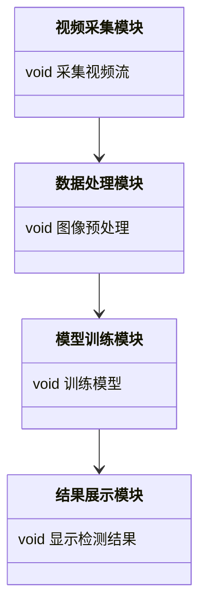
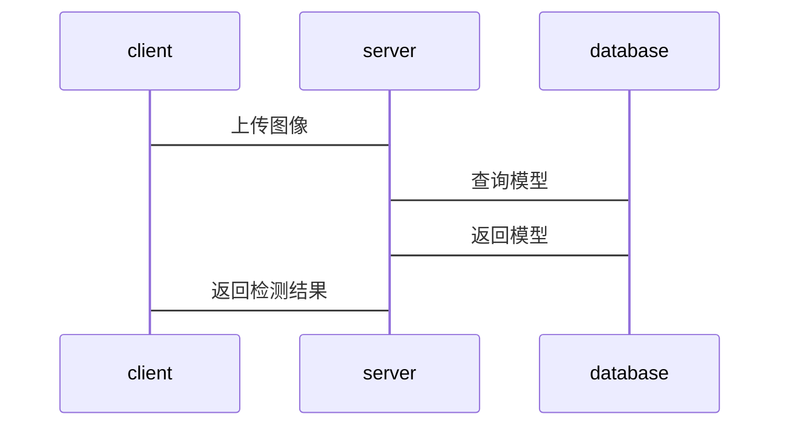

                 


# 构建企业级机器视觉平台：质量控制与安全监测

---

## 关键词：
- 机器视觉
- 企业级平台
- 质量控制
- 安全监测
- 深度学习
- 图像处理
- 系统架构

---

## 摘要：
本文详细探讨了构建企业级机器视觉平台在质量控制与安全监测中的应用。通过分析机器视觉的核心技术、算法原理、系统架构设计以及实际项目案例，本文为读者提供了从理论到实践的全面指导。文章还结合了深度学习和图像处理技术，详细讲解了如何利用这些技术实现高效的视觉检测与安全监控，并提供了最佳实践和未来发展的展望。

---

# 第1章: 机器视觉与企业应用背景

## 1.1 机器视觉的基本概念

### 1.1.1 机器视觉的定义与核心原理
机器视觉是通过计算机模拟人类视觉系统的能力，利用图像处理、模式识别和深度学习等技术对图像进行分析和理解。其核心原理包括图像采集、预处理、特征提取和目标识别等步骤。

### 1.1.2 机器视觉在企业中的应用领域
机器视觉在工业制造、医疗健康、安防监控等领域有广泛应用。例如，在工业制造中，机器视觉可以用于自动检测产品质量，提高生产效率。

### 1.1.3 机器视觉技术的优势与挑战
优势包括高精度、高效率和24小时不间断工作能力。挑战则包括复杂环境适应性不足和高昂的部署成本。

## 1.2 企业级机器视觉平台的背景

### 1.2.1 企业级平台的定义与特点
企业级机器视觉平台是指为大型企业设计的集成化视觉解决方案，具有高可用性、可扩展性和强安全性等特点。

### 1.2.2 机器视觉在质量控制中的作用
通过自动化检测，减少人工干预，提高检测效率和准确性。例如，在制造业中，可以实时检测产品的缺陷。

### 1.2.3 机器视觉在安全监测中的应用
在安防监控中，利用人脸识别、行为分析等技术，实时监测潜在的安全威胁。

## 1.3 机器视觉技术的发展趋势

### 1.3.1 人工智能与机器视觉的结合
深度学习的引入显著提升了机器视觉的识别精度和适应性。

### 1.3.2 深度学习在机器视觉中的应用
深度学习技术如CNN和RCNN在图像识别和目标检测中表现优异。

### 1.3.3 未来机器视觉技术的演进方向
未来将更加注重实时性、轻量化和多模态感知能力的提升。

## 1.4 本章小结
本章介绍了机器视觉的基本概念、应用场景及其在企业中的重要性，并展望了未来的发展趋势。

---

# 第2章: 机器视觉的核心技术

## 2.1 图像处理基础

### 2.1.1 图像采集与预处理
图像采集是机器视觉的第一步，预处理包括灰度化、二值化和滤波等操作。

### 2.1.2 图像特征提取
通过提取边缘、纹理和颜色等特征，为后续识别提供基础。

### 2.1.3 图像分割与识别
图像分割将图像划分为多个区域，图像识别则是对这些区域进行分类。

## 2.2 深度学习在机器视觉中的应用

### 2.2.1 卷积神经网络（CNN）简介
CNN通过卷积层提取图像特征，常用于图像分类任务。

### 2.2.2 基于深度学习的目标检测
目标检测算法如YOLO和Faster R-CNN在工业检测中应用广泛。

### 2.2.3 图像分割与语义理解
图像分割技术如U-Net在医学图像处理中具有重要作用。

## 2.3 机器视觉中的关键技术

### 2.3.1 目标检测与跟踪
目标检测用于识别图像中的物体，目标跟踪则用于动态监测。

### 2.3.2 图像识别与分类
图像分类技术如ResNet在工业质检中应用广泛。

### 2.3.3 三维视觉与点云处理
三维视觉技术在机器人导航和虚拟现实中有重要应用。

## 2.4 核心技术对比与选择

### 2.4.1 各种技术的优缺点对比
例如，YOLO目标检测速度快但精度较低，Faster R-CNN精度高但速度较慢。

### 2.4.2 选择合适技术的策略
根据应用场景的需求选择合适的技术组合。

### 2.4.3 技术的适用场景分析
例如，实时性要求高的场景选择YOLO，精度要求高的场景选择Faster R-CNN。

## 2.5 本章小结
本章详细介绍了机器视觉中的核心技术，包括图像处理、深度学习算法及其应用场景。

---

# 第3章: 机器视觉算法原理与实现

## 3.1 基于CNN的目标检测算法

### 3.1.1 CNN的基本结构
CNN由卷积层、池化层和全连接层组成。

### 3.1.2 目标检测算法（如Faster R-CNN）
Faster R-CNN由RPN网络生成候选框，然后进行目标分类和定位。

### 3.1.3 算法流程图
```mermaid
graph TD
A[Input Image] -> B[RPN网络] -> C[生成候选框] -> D[目标分类] -> E[输出结果]
```

## 3.2 图像分割算法

### 3.2.1 U-Net架构
U-Net由编码器和解码器组成，常用于医学图像分割。

### 3.2.2 图像分割流程
```mermaid
graph TD
A[Input Image] -> B[编码器] -> C[解码器] -> D[分割结果]
```

## 3.3 算法实现与优化

### 3.3.1 Python代码实现
```python
import tensorflow as tf
from tensorflow.keras import layers

model = tf.keras.Sequential([
    layers.Conv2D(32, (3,3), activation='relu'),
    layers.MaxPooling2D((2,2)),
    layers.Conv2D(64, (3,3), activation='relu'),
    layers.MaxPooling2D((2,2)),
    layers.Flatten(),
    layers.Dense(128, activation='relu'),
    layers.Dense(10, activation='softmax')
])
```

### 3.3.2 算法优化策略
包括数据增强、学习率调整和模型剪枝等技术。

## 3.4 本章小结
本章通过具体算法和代码示例，详细讲解了机器视觉中的算法实现与优化策略。

---

# 第4章: 机器视觉系统架构设计

## 4.1 系统功能设计

### 4.1.1 功能模块划分
包括图像采集、数据处理、模型训练和结果展示等模块。

### 4.1.2 领域模型设计


## 4.2 系统架构设计

### 4.2.1 分层架构设计


### 4.2.2 关键模块设计
包括前端界面、后端服务和数据库等模块。

## 4.3 系统接口设计

### 4.3.1 API接口设计
例如，提供RESTful API用于图像上传和结果查询。

### 4.3.2 接口交互流程


## 4.4 系统交互设计

### 4.4.1 用户界面设计
包括图像预览、检测结果展示和参数设置界面。

### 4.4.2 交互流程优化
例如，优化图像上传和结果反馈的速度。

## 4.5 本章小结
本章详细介绍了机器视觉系统的架构设计，包括功能模块、系统架构和接口设计。

---

# 第5章: 项目实战

## 5.1 项目背景与目标

### 5.1.1 项目背景
以工业产品质量检测为例，构建一个基于机器视觉的自动检测系统。

### 5.1.2 项目目标
实现对产品的自动检测，提高检测效率和准确性。

## 5.2 环境配置与安装

### 5.2.1 环境要求
需要安装Python、TensorFlow和OpenCV等库。

### 5.2.2 安装步骤
```bash
pip install tensorflow==2.5.0
pip install opencv-python
pip install matplotlib
```

## 5.3 核心代码实现

### 5.3.1 数据预处理
```python
import cv2
import numpy as np

def preprocess_image(image_path):
    image = cv2.imread(image_path)
    gray = cv2.cvtColor(image, cv2.COLOR_BGR2GRAY)
    return gray
```

### 5.3.2 模型训练
```python
model = tf.keras.Sequential([
    layers.Conv2D(32, (3,3), activation='relu'),
    layers.MaxPooling2D((2,2)),
    layers.Conv2D(64, (3,3), activation='relu'),
    layers.MaxPooling2D((2,2)),
    layers.Flatten(),
    layers.Dense(128, activation='relu'),
    layers.Dense(10, activation='softmax')
])

model.compile(optimizer='adam', loss='sparse_categorical_crossentropy', metrics=['accuracy'])
model.fit(X_train, y_train, epochs=10, batch_size=32)
```

### 5.3.3 模型部署
```python
import requests

url = "http://localhost:8000/predict"
files = {'image': open('test.jpg', 'rb')}
response = requests.post(url, files=files)
print(response.json())
```

## 5.4 实际案例分析

### 5.4.1 数据集准备
使用公开数据集如MNIST进行训练和测试。

### 5.4.2 模型评估
通过准确率、召回率和F1分数评估模型性能。

## 5.5 本章小结
本章通过一个实际项目案例，详细讲解了机器视觉平台的构建过程，包括环境配置、代码实现和模型部署。

---

# 第6章: 最佳实践与小结

## 6.1 最佳实践

### 6.1.1 数据处理技巧
数据预处理和增强可以显著提升模型性能。

### 6.1.2 模型优化策略
包括使用数据增强、调整学习率和模型剪枝等技术。

### 6.1.3 系统设计建议
建议采用模块化设计，便于后续维护和扩展。

## 6.2 项目小结

### 6.2.1 核心收获
通过项目实践，掌握了机器视觉平台从设计到实现的全过程。

### 6.2.2 经验教训
数据质量和模型选择对最终结果影响巨大。

## 6.3 展望未来

### 6.3.1 未来技术趋势
未来将更加注重实时性和多模态感知能力。

### 6.3.2 机器视觉的发展方向
深度学习和边缘计算的结合将推动机器视觉技术的进一步发展。

## 6.4 本章小结
本章总结了机器视觉平台构建的最佳实践，并展望了未来的发展方向。

---

# 作者：AI天才研究院/AI Genius Institute & 禅与计算机程序设计艺术 /Zen And The Art of Computer Programming

---

**本文遵循 CC BY-NC-SA 4.0 协议，转载请注明出处。**

