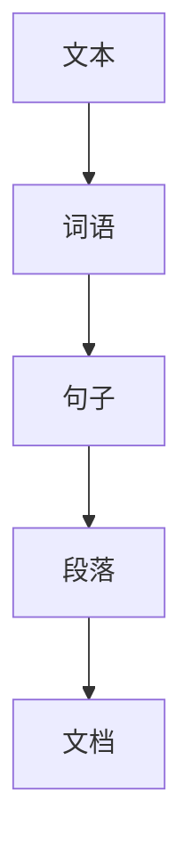
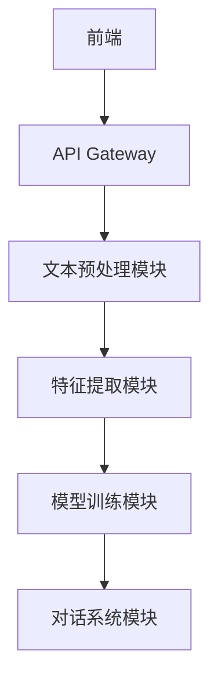

                 


# 《构建企业级自然语言处理平台：从文本分析到对话系统》

---

## 关键词：
- 自然语言处理（NLP）
- 企业级平台
- 文本分析
- 对话系统
- 机器学习
- 深度学习

---

## 摘要：
本文详细探讨了构建企业级自然语言处理平台的关键技术，从文本分析到对话系统的实现，涵盖了核心概念、算法原理、系统架构及项目实战。通过分析NLP的核心算法，如词嵌入和序列模型，结合实际项目案例，展示了如何设计高可用性和可扩展性的NLP平台。文章最后总结了最佳实践和未来发展方向。

---

## 第一部分：企业级自然语言处理平台概述

### 第1章：自然语言处理与企业级平台概述

#### 1.1 自然语言处理的背景与现状

自然语言处理（NLP）是人工智能领域的重要分支，旨在让计算机能够理解、处理和生成人类语言。随着深度学习技术的发展，NLP在企业中的应用越来越广泛，如智能客服、文本分类、情感分析等。然而，构建企业级NLP平台仍面临诸多挑战，包括数据多样性、模型泛化能力不足、计算资源需求高等。

企业级NLP平台需要具备高可用性、可扩展性和稳定性，以支持大规模数据处理和多场景应用。本文将从文本分析和对话系统两个方面，详细探讨构建企业级NLP平台的关键技术。

#### 1.2 企业级NLP平台的构建目标

企业级NLP平台的核心目标是提供统一的文本处理接口，支持多种应用场景，并具备高可用性和可扩展性。具体目标包括：

1. **统一文本处理接口**：提供标准化的API，方便集成到各种业务系统中。
2. **支持多场景应用**：如智能客服、推荐系统、市场分析等。
3. **高可用性和可扩展性**：确保平台在高负载下稳定运行，并能扩展处理能力。

---

### 第2章：文本分析与对话系统的核心概念

#### 2.1 文本分析的基本概念

文本分析是NLP的基础，主要包括以下步骤：

1. **文本预处理**：
   - **分词**：将文本分割成单词或短语。例如，将“Hello world”分割成“Hello”和“world”。
   - **词干提取**：去除单词的词缀，保留词干。例如，将“cats”转换为“cat”。
   - **停用词处理**：移除常见但无意义的词汇，如“is”、“and”等。

2. **文本特征提取**：
   - **TF-IDF**：计算词语在文档中的重要性。
   - **Word2Vec**：将词语映射为向量表示。
   - **句法分析**：分析句子的语法结构，如主语、谓语等。

3. **文本分类与情感分析**：
   - **文本分类**：将文本归类到预定义的类别中，如垃圾邮件分类。
   - **情感分析**：判断文本的情感倾向，如正面、负面或中性。

文本分析的核心在于提取有用的信息，并将其转化为可计算的形式，以便后续处理。

#### 2.2 对话系统的原理

对话系统是NLP的高级应用，旨在实现人与计算机之间的自然对话。常见的对话系统类型包括：

1. **基于规则的对话系统**：
   - 通过预定义的规则和模板生成回复。例如，当用户询问“天气如何？”时，系统会根据预设规则返回当前天气信息。

2. **基于检索的对话系统**：
   - 从预存的语料库中检索最相关的回答。例如，使用预训练的对话历史匹配最接近的回复。

3. **基于生成模型的对话系统**：
   - 使用生成模型（如GPT）生成回复。这种方法能够处理复杂的问题，但生成的内容可能存在不连贯或不准确的情况。

对话系统的实现涉及自然语言理解（NLU）和自然语言生成（NLG）两个主要环节。NLU负责理解用户输入的意图，而NLG负责生成合适的回复。

#### 2.3 NLP核心概念的ER实体关系图

下图展示了NLP核心概念之间的关系：



---

## 第二部分：NLP核心算法与数学模型

### 第3章：词嵌入与序列模型

#### 3.1 词嵌入算法

词嵌入是将词语映射为低维向量的技术，常用的算法包括Word2Vec、GloVe和FastText。

1. **Word2Vec**：
   - **Skip-Gram模型**：预测当前词的前一个词或后一个词。
   - **目标函数**：
     $$ \text{minimize} \sum_{i=1}^{n} \sum_{j=i-1}^{i+1} \text{loss}(w_i, w_j) $$

2. **GloVe**：
   - 基于全局词频统计，优化词向量。
   - **目标函数**：
     $$ \text{minimize} \sum_{i<j} \theta \cdot \text{log}(\text{count}(i,j)) $$

3. **FastText**：
   - 将词语分解为子词，生成词向量。
   - 适用于处理罕见词和新词。

#### 3.2 词嵌入的数学模型

词嵌入的数学模型可以通过以下公式表示：

$$ P(w_i | w_{i+k}) = \text{softmax}(W_{w_i}^T W_{w_{i+k}}) $$

其中，$W_{w_i}$是词语$w_i$的嵌入向量，$W_{w_{i+k}}$是词语$w_{i+k}$的嵌入向量。

---

#### 3.3 序列模型（如RNN、LSTM）

序列模型用于处理顺序数据，如文本序列。常用的模型包括RNN和LSTM。

1. **RNN模型**：
   - 状态更新公式：
     $$ h_t = \tanh(W_h h_{t-1} + U_x x_t) $$
   - 输出层：
     $$ y_t = W_o h_t + b_o $$

2. **LSTM模型**：
   - 门控机制：
     $$ f_t = \sigma(W_f [h_{t-1}, x_t]) $$
     $$ i_t = \sigma(W_i [h_{t-1}, x_t]) $$
     $$ o_t = \tanh(W_o [h_{t-1}, x_t]) $$
     $$ c_t = f_t \cdot c_{t-1} + i_t \cdot x_t $$

LSTM通过门控机制有效捕捉长距离依赖关系，适用于处理长序列数据。

---

## 第三部分：系统分析与架构设计方案

### 第4章：企业级NLP平台的系统架构

#### 4.1 问题场景介绍

企业级NLP平台需要支持多种应用场景，包括智能客服、文本分类、情感分析等。平台需要具备高可用性、可扩展性和稳定性，以应对大规模数据处理和多场景应用。

#### 4.2 系统功能设计

系统功能设计包括以下几个模块：

1. **文本预处理模块**：
   - 实现分词、词干提取、停用词处理等功能。
2. **特征提取模块**：
   - 提供TF-IDF、Word2Vec等特征提取方法。
3. **模型训练模块**：
   - 支持多种NLP模型的训练和优化。
4. **对话系统模块**：
   - 实现基于规则、检索和生成的对话系统。

#### 4.3 系统架构设计

系统架构设计如下：



前端通过API Gateway调用文本预处理模块，处理后的文本特征传递给模型训练模块，生成模型用于对话系统模块生成回复。

#### 4.4 系统接口设计

系统接口设计包括以下几个部分：

1. **文本预处理接口**：
   - 输入：原始文本
   - 输出：分词结果、词干提取结果
2. **特征提取接口**：
   - 输入：预处理后的文本
   - 输出：TF-IDF向量、Word2Vec向量
3. **模型训练接口**：
   - 输入：特征向量、标签
   - 输出：训练好的模型

#### 4.5 系统交互设计

系统交互设计如下：

```mermaid
sequenceDiagram
    participant 用户
    participant 前端
    participant 后端
    participant 模型服务
    用户 -> 前端：输入查询
    前端 -> 后端：调用API
    后端 -> 模型服务：处理请求
    模型服务 -> 后端：返回结果
    后端 -> 前端：返回结果
    前端 -> 用户：显示结果
```

---

## 第四部分：项目实战

### 第5章：构建企业级NLP平台

#### 5.1 环境搭建

项目实战部分首先需要搭建开发环境，包括安装Python、TensorFlow、Keras等库。

#### 5.2 核心实现

核心实现包括文本预处理、特征提取、模型训练和对话系统实现。

1. **文本预处理**：
   ```python
   def preprocess(text):
       # 分词
       words = word_tokenize(text)
       # 词干提取
       stems = [stemmer.stem(word) for word in words]
       return stems
   ```

2. **特征提取**：
   ```python
   def tfidf_vectorizer(texts):
       vectorizer = TfidfVectorizer()
       return vectorizer.fit_transform(texts)
   ```

3. **模型训练**：
   ```python
   model = Sequential()
   model.add(LSTM(128, input_shape=(None, input_dim)))
   model.add(Dense(1, activation='sigmoid'))
   model.compile(loss='binary_crossentropy', optimizer='adam', metrics=['accuracy'])
   ```

4. **对话系统实现**：
   ```python
   def generate_response(prompt):
       response = model.generate_response(prompt)
       return response
   ```

#### 5.3 案例分析

以智能客服为例，展示平台的实际应用。用户输入问题，平台通过预处理、特征提取和模型训练生成回复。

#### 5.4 项目小结

项目小结部分总结了整个项目的实现过程，强调了文本预处理、特征提取和模型训练的重要性。

---

## 第五部分：最佳实践

### 第6章：企业级NLP平台的最佳实践

#### 6.1 小结

本文详细探讨了构建企业级自然语言处理平台的关键技术，从文本分析到对话系统的实现，涵盖了核心概念、算法原理、系统架构及项目实战。

#### 6.2 注意事项

在构建企业级NLP平台时，需要注意以下几点：
1. 数据质量和多样性。
2. 模型的可解释性和可扩展性。
3. 安全性和隐私保护。

#### 6.3 拓展阅读

推荐阅读以下书籍和论文：
1. 《深度学习》—— Ian Goodfellow
2. 《自然语言处理入门》—— 李航

---

## 作者信息

作者：AI天才研究院/AI Genius Institute  
联系邮箱：contact@aignitius.com  
GitHub链接：https://github.com/aignitius

---

通过以上步骤，您可以系统地构建一个企业级自然语言处理平台，从文本分析到对话系统，实现智能化的文本处理和交互。

