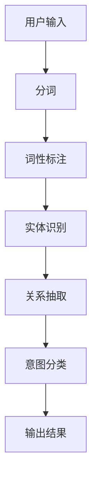
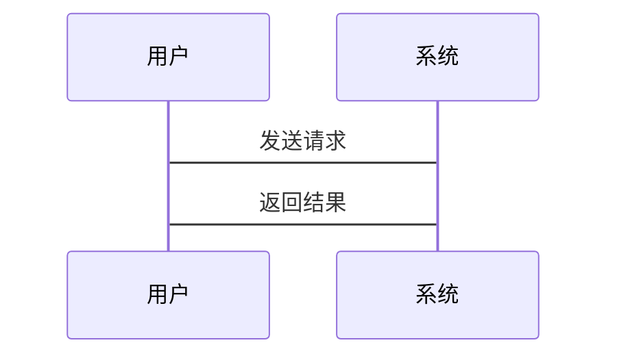

                 


# 构建企业级自然语言理解系统：跨语言语义理解与意图识别

> 关键词：自然语言理解，跨语言，语义理解，意图识别，企业级系统

> 摘要：本文详细探讨了构建企业级自然语言理解系统的关键步骤，重点分析了跨语言语义理解和意图识别的技术原理。文章从背景介绍、核心概念、算法原理、系统架构到项目实战，层层递进，为企业级NLU系统的开发提供了全面的指导和实践参考。

---

# 第一部分：背景与核心概念

## 第1章：企业级自然语言理解系统概述

### 1.1 问题背景与目标

#### 1.1.1 自然语言理解的定义与挑战
自然语言理解（Natural Language Understanding, NLU）是人工智能领域的核心技术，旨在使计算机能够理解和解析人类语言的含义。然而，跨语言语义理解增加了复杂性，因为不同语言的语义结构和文化背景差异可能导致理解错误。

#### 1.1.2 企业级NLU系统的必要性
企业级系统需要处理多种语言和复杂的用户请求，因此需要高效的NLU系统来支持客户服务、信息检索和自动化流程。

#### 1.1.3 跨语言语义理解的重要性
跨语言语义理解能够帮助企业在多语言环境中提供统一的服务，提升用户体验和效率。

### 1.2 核心概念与边界

#### 1.2.1 自然语言理解的定义与属性
- **定义**：NLU系统通过分析文本内容，提取语义信息，生成计算机可理解的结构。
- **属性**：准确性、实时性、可扩展性。

#### 1.2.2 跨语言处理的核心要素
- **多语言支持**：支持多种语言的文本处理。
- **语义对齐**：在不同语言间建立语义关联。
- **文化适应**：考虑不同语言的文化背景。

#### 1.2.3 意图识别的实现方式
- **基于规则**：使用预定义的规则匹配意图。
- **基于统计**：利用模式识别技术提取意图。
- **基于深度学习**：使用神经网络模型学习意图。

## 第2章：跨语言语义理解与意图识别

### 2.1 跨语言语义理解的核心原理

#### 2.1.1 跨语言模型的训练方法
- **多语言预训练**：使用多种语言数据进行预训练。
- **语言无关特征提取**：提取语言无关的语义特征。

#### 2.1.2 語言间语义关联的计算
- **语义相似度计算**：使用余弦相似度等方法衡量语义相似性。
- **跨语言映射**：通过映射模型将不同语言的语义向量对齐。

#### 2.1.3 跨语言数据的处理流程
1. 数据收集：获取多语言文本数据。
2. 数据清洗：去除噪声数据。
3. 数据标注：标注语义信息。
4. 数据训练：训练跨语言模型。

### 2.2 意图识别的实现方式

#### 2.2.1 基于规则的意图识别
- **规则定义**：制定特定的关键词或句式规则。
- **优点**：简单易懂，适用于特定场景。
- **缺点**：难以应对复杂语义。

#### 2.2.2 基于统计的意图识别
- **统计方法**：利用频率统计或模式匹配识别意图。
- **优点**：灵活性高，适用于多种场景。
- **缺点**：依赖于大量数据，准确率有限。

#### 2.2.3 基于深度学习的意图识别
- **模型选择**：使用LSTM、Transformer等深度学习模型。
- **优点**：准确率高，适应能力强。
- **缺点**：计算资源消耗大。

---

# 第二部分：核心概念与联系

## 第3章：自然语言理解的核心原理

### 3.1 NLU系统的核心组件

#### 3.1.1 词法分析
- **分词**：将文本分割成词或短语。
- **词性标注**：识别词的语法属性。

#### 3.1.2 句法分析
- **句法树构建**：分析句子结构。
- **依存关系分析**：识别词语间的依存关系。

#### 3.1.3 语义分析
- **实体识别**：识别文本中的实体。
- **关系抽取**：提取实体间的关系。
- **语义角色标注**：标注语义角色。

### 3.2 語言模型与理解模型的关系

#### 3.2.1 語言模型的作用
- **生成概率**：计算词序列的概率。
- **上下文理解**：通过上下文理解语义。

#### 3.2.2 理解模型的实现
- **编码器-解码器结构**：编码输入，解码输出。
- **注意力机制**：关注重要信息。

#### 3.2.3 两者的协同工作
- **协同训练**：语言模型和理解模型联合优化。
- **动态调整**：根据上下文动态调整理解模型。

## 第4章：跨语言语义理解的实体关系图

### 4.1 实体关系图的构建

#### 4.1.1 实体识别
- **跨语言实体识别**：识别多语言文本中的实体。
- **实体映射**：建立不同语言实体的对应关系。

#### 4.1.2 实体关系抽取
- **跨语言关系抽取**：抽取不同语言实体间的关系。
- **关系对齐**：对齐不同语言的关系。

#### 4.1.3 实体网络构建
- **构建跨语言实体网络**：将不同语言的实体和关系连接起来。
- **网络可视化**：通过图谱展示跨语言实体关系。

### 4.2 意图识别的ER图架构

#### 4.2.1 用户意图实体
- **用户意图**：用户的实际需求。
- **意图属性**：意图的特征属性。

#### 4.2.2 意图关系实体
- **意图间关系**：不同意图之间的关系。
- **意图场景**：意图所处的场景。

#### 4.2.3 意图场景实体
- **场景描述**：描述意图发生的场景。
- **场景分类**：对场景进行分类。

---

# 第三部分：算法原理与数学模型

## 第5章：跨语言模型的训练算法

### 5.1 基于BERT的跨语言模型训练

#### 5.1.1 BERT模型的结构
- **编码器堆叠**：多层编码器堆叠结构。
- **自注意力机制**：计算词与词之间的关系。

#### 5.1.2 跨语言预训练策略
- **多语言预训练**：使用多种语言数据进行预训练。
- **跨语言对比学习**：通过对比学习增强跨语言语义对齐。

#### 5.1.3 跨语言微调方法
- **跨语言微调**：在特定任务上进行微调。
- **语言适应层**：添加语言适应层以适应特定语言。

### 5.2 意图识别的算法流程

#### 5.2.1 意图分类的特征提取
- **文本表示**：将文本转换为向量表示。
- **特征选择**：选择对意图分类有帮助的特征。

#### 5.2.2 意图分类的模型选择
- **线性模型**：如SVM、逻辑回归。
- **深度学习模型**：如LSTM、Transformer。

#### 5.2.3 意图分类的评估指标
- **准确率**：正确分类的比例。
- **召回率**：实际正确的分类占所有相关案例的比例。
- **F1分数**：准确率和召回率的调和平均。

## 第6章：数学模型与公式

### 6.1 語言模型的数学表达

#### 6.1.1 语言模型的熵公式
$$ H = -\sum p_i \log p_i $$

#### 6.1.2 語言模型的交叉熵损失
$$ CE = -\sum y_i \log p(y_i) $$

#### 6.1.3 語言模型的困惑度计算
$$ \text{Perplexity} = \exp\left(\frac{1}{N} \sum -\log p(x_i)\right) $$

### 6.2 意图识别的损失函数

#### 6.2.1 分类问题的损失函数
$$ L = -\sum y_i \log p(y_i) $$

#### 6.2.2 意图识别的交叉熵损失
$$ CE = -\sum y_i \log p(y_i) $$

#### 6.2.3 意图识别的F1分数计算
$$ F1 = 2 \frac{P \cdot R}{P + R} $$

---

# 第四部分：系统分析与架构设计

## 第7章：企业级NLU系统的架构设计

### 7.1 系统功能设计

#### 7.1.1 领域模型设计
- **实体识别模块**：识别文本中的实体。
- **关系抽取模块**：抽取实体间的关系。
- **意图分类模块**：分类用户的意图。

#### 7.1.2 系统架构图


#### 7.1.3 系统交互流程


### 7.2 系统接口设计

#### 7.2.1 接口定义
- **输入接口**：接收用户输入的文本。
- **输出接口**：返回解析后的结构化数据。

#### 7.2.2 接口协议
- **HTTP API**：RESTful API。
- **WebSocket**：实时通信。

---

# 第五部分：项目实战

## 第8章：跨语言语义理解系统实现

### 8.1 环境安装

#### 8.1.1 安装Python
```bash
python --version
pip install --upgrade pip
```

#### 8.1.2 安装依赖库
```bash
pip install transformers torch
```

### 8.2 核心实现

#### 8.2.1 数据预处理
```python
def preprocess(text):
    return text.lower().split()
```

#### 8.2.2 模型训练
```python
import torch
from transformers import BertTokenizer, BertModel

tokenizer = BertTokenizer.from_pretrained('bert-base-multilingual')
model = BertModel.from_pretrained('bert-base-multilingual')
```

#### 8.2.3 意图分类
```python
def predict_intent(text):
    inputs = tokenizer(text, return_tensors='pt')
    outputs = model(**inputs)
    return outputs.last_hidden_state
```

### 8.3 案例分析

#### 8.3.1 实际案例
```python
text = "Can you help me book a flight to Paris?"
inputs = tokenizer(text, return_tensors='pt')
outputs = model(**inputs)
print(outputs.last_hidden_state)
```

#### 8.3.2 代码分析
- **输入处理**：将文本转换为模型可接受的输入格式。
- **模型推理**：通过模型获取语义表示。
- **结果解析**：解析模型输出，生成最终结果。

---

# 第六部分：最佳实践

## 第9章：总结与展望

### 9.1 小结
- **核心概念**：NLU系统、跨语言处理、意图识别。
- **算法原理**：BERT模型、意图分类算法。
- **系统架构**：分层架构、模块化设计。

### 9.2 注意事项
- **数据质量**：确保数据的多样性和准确性。
- **模型选择**：根据具体任务选择合适的模型。
- **性能优化**：优化模型和系统的性能。

### 9.3 拓展阅读
- **推荐书籍**：《Deep Learning》、《自然语言处理入门》。
- **推荐论文**：关注最新的NLP研究论文。

---

作者：AI天才研究院/AI Genius Institute & 禅与计算机程序设计艺术 /Zen And The Art of Computer Programming

