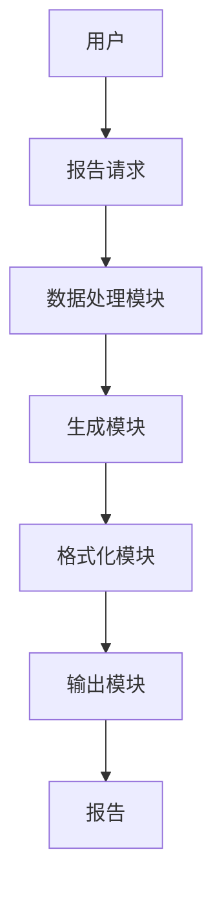
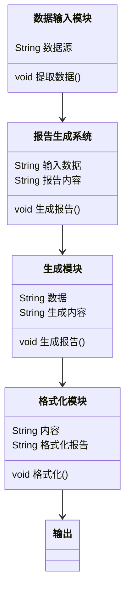

                 


# 《构建企业级自然语言生成报告系统：自动化业务报告》

## 关键词：
企业级系统、自然语言生成、业务报告、自动化、机器学习、深度学习、系统架构

## 摘要：
本文详细探讨了构建企业级自然语言生成报告系统的全过程，涵盖从问题背景到系统实现的各个方面。通过分析传统业务报告生成的痛点，引出自然语言生成技术的应用，详细讲解了核心算法原理、系统架构设计以及项目实战案例。文章还提供了代码示例和系统优化建议，帮助读者掌握构建高效自动化业务报告系统的技巧。

---

## 第一部分：背景介绍

### 第1章：问题背景与需求分析

#### 1.1 问题背景
自然语言生成（Natural Language Generation, NLG）技术近年来在企业级应用中展现出巨大潜力。传统的业务报告生成流程通常依赖人工操作，效率低下且成本高昂。企业需要频繁生成大量报告，如财务报告、市场分析、项目进度报告等，这些报告的内容往往高度相似，但生成过程却耗时耗力。

#### 1.2 问题描述
- **传统报告生成的痛点**：人工编写报告效率低，且容易出错；数据更新不及时，导致报告内容滞后；格式和内容难以统一，影响企业形象。
- **自然语言生成技术的优势**：能够快速生成结构化报告，提高效率；实时更新数据，确保报告内容的准确性；统一格式和风格，提升企业形象。

#### 1.3 问题解决
构建一个企业级自然语言生成报告系统，利用深度学习技术自动生成报告，解决传统方法的痛点。系统需要具备以下功能：
- 数据输入与解析
- 自动生成报告内容
- 格式化输出
- 实时更新与维护

#### 1.4 边界与外延
- **系统边界**：本系统仅负责生成报告内容，不涉及数据源的采集和存储。
- **技术外延**：自然语言生成技术还可应用于其他领域，如智能客服、新闻自动生成等。
- **功能扩展**：未来可以扩展报告生成的多样性，支持多种语言和格式。

#### 1.5 核心概念与组成
- **核心概念**：自然语言生成、机器学习、深度学习
- **系统组成**：数据输入模块、生成模块、格式化模块、输出模块

---

## 第二部分：核心概念与联系

### 第2章：自然语言生成技术的核心原理

#### 2.1 预训练模型与生成机制
自然语言生成技术依赖于预训练模型，如BERT、GPT等。这些模型通过大量数据的预训练，掌握了语言的结构和语义信息，能够生成符合上下文的文本。

- **生成机制**：基于Transformer的解码器结构，通过自注意力机制生成上下文相关的文本。
- **模型训练**：使用大规模数据进行无监督预训练，再通过有监督微调任务进行优化。

#### 2.2 模型属性与特征对比
不同模型在生成效果和效率上存在差异，选择合适的模型需要考虑以下因素：
- 模型参数量：参数越多，生成效果越好，但计算资源消耗也越大。
- 训练数据量：数据量越大，模型越稳定。
- 生成速度：基于Transformer的模型生成速度较慢，适合实时生成场景。

| 模型名称 | 参数量 | 生成速度 | 生成效果 |
|----------|--------|----------|----------|
| GPT-3    | 175B   | 较慢     | 优秀     |
| BERT      | 110M   | 中等     | 良好     |
| PEGASUS   | 250M   | 较快     | 良好     |

#### 2.3 ER实体关系图架构
实体关系图（Entity-Relationship Diagram）用于描述系统的数据结构，帮助我们更好地理解系统的组成和数据流动。



---

### 第3章：算法原理与实现

#### 3.1 模型训练流程
- **数据预处理**：清洗数据，提取关键信息。
- **模型训练**：使用预训练好的模型进行微调。
- **模型调优**：通过调整超参数优化生成效果。

#### 3.2 生成机制
- **解码策略**：使用贪心解码或随机采样生成文本。
- **采样方法**：通过调整温度参数控制生成的多样性和确定性。

#### 3.3 算法实现代码
以下是一个简单的自然语言生成模型的实现代码：

```python
import torch
import torch.nn as nn
import torch.optim as optim

class SimpleGenerator(nn.Module):
    def __init__(self, vocab_size, embedding_dim, hidden_dim):
        super(SimpleGenerator, self).__init__()
        self.embedding = nn.Embedding(vocab_size, embedding_dim)
        self.lstm = nn.LSTM(embedding_dim, hidden_dim, batch_first=True)
        self.fc = nn.Linear(hidden_dim, vocab_size)
    
    def forward(self, input, hidden):
        embedded = self.embedding(input)
        output, hidden = self.lstm(embedded, hidden)
        output = self.fc(output[:, -1, :])
        return output, hidden

# 初始化模型和优化器
vocab_size = 10000
embedding_dim = 256
hidden_dim = 512
model = SimpleGenerator(vocab_size, embedding_dim, hidden_dim)
optimizer = optim.Adam(model.parameters(), lr=0.001)
criterion = nn.CrossEntropyLoss()

# 训练过程
for epoch in range(num_epochs):
    for batch in batches:
        optimizer.zero_grad()
        input, target = batch
        output, _ = model(input, None)
        loss = criterion(output, target)
        loss.backward()
        optimizer.step()
```

#### 3.4 数学公式
自然语言生成模型的损失函数可以表示为：

$$ \mathcal{L} = -\sum_{i=1}^{n} \log P(y_i | y_{<i}) $$

其中，$y_i$表示生成的第$i$个词，$P(y_i | y_{<i})$表示在已生成前$i-1$个词的条件下，生成第$i$个词的概率。

---

## 第三部分：系统分析与架构设计

### 第4章：系统分析

#### 4.1 需求分析
- **功能需求**：支持多种数据源输入，生成多种格式的报告。
- **性能需求**：系统需要高效处理大规模数据，生成速度快。
- **可扩展性需求**：系统应支持功能扩展，如多语言生成。

#### 4.2 领域模型设计
领域模型通过抽象和简化问题，帮助我们更好地理解系统的功能需求。



#### 4.3 系统架构设计
系统架构采用分层设计，包括数据输入层、生成层、格式化层和输出层。


---

### 第5章：系统架构设计

#### 5.1 系统架构图
系统架构图展示了各模块之间的交互关系。

```mermaid
graph TD
    User --> API Gateway
    API Gateway --> Data Processing
    Data Processing --> Generator
    Generator --> Formatter
    Formatter --> Output
```

#### 5.2 接口设计
系统通过API接口实现模块之间的通信。

- **数据处理接口**：接收输入数据并进行预处理。
- **生成接口**：调用生成模型生成报告内容。
- **格式化接口**：将生成内容格式化为指定格式。

#### 5.3 交互流程
系统交互流程如下：

1. 用户提交报告生成请求。
2. 数据输入模块接收请求并提取数据。
3. 数据处理模块对数据进行清洗和结构化。
4. 生成模块基于处理后的数据生成报告内容。
5. 格式化模块将生成的内容转换为指定格式。
6. 输出模块将最终报告返回给用户。

---

## 第四部分：项目实战

### 第6章：项目实战

#### 6.1 环境安装
需要安装以下依赖：
- PyTorch
- Transformers
- Mermaid

#### 6.2 核心实现
以下是生成模块的核心代码：

```python
from transformers import GPT2LMHeadModel, GPT2Tokenizer

model_name = 'gpt2-medium'
tokenizer = GPT2Tokenizer.from_pretrained(model_name)
model = GPT2LMHeadModel.from_pretrained(model_name)

def generate_report(prompt, max_length=500):
    inputs = tokenizer(prompt, return_tensors='pt')
    outputs = model.generate(**inputs, max_length=max_length, do_sample=True)
    report = tokenizer.decode(outputs[0], skip_special_tokens=True)
    return report
```

#### 6.3 案例分析
以财务报告生成为例：
- 输入：公司2023年Q1的财务数据。
- 输出：自动生成财务报告，包括收入、支出、利润分析等内容。

#### 6.4 代码解读
- **数据处理**：将输入数据结构化，提取关键字段。
- **生成报告**：调用生成模型，基于结构化数据生成自然语言文本。
- **格式化输出**：将生成的内容转换为符合公司格式要求的报告。

---

## 第五部分：总结与展望

### 第7章：总结与展望

#### 7.1 最佳实践
- **模型选择**：根据具体需求选择合适的模型。
- **数据质量**：确保输入数据的准确性和完整性。
- **系统优化**：通过并行计算优化生成速度。

#### 7.2 小结
本文详细介绍了构建企业级自然语言生成报告系统的全过程，从问题背景到系统实现，为读者提供了全面的技术指导。

#### 7.3 注意事项
- 系统上线前需进行充分的测试，确保稳定性和可靠性。
- 定期更新模型，保持生成内容的准确性和时效性。

#### 7.4 拓展阅读
- 推荐阅读《Deep Learning》、《自然语言处理入门》等书籍，深入了解自然语言生成技术的原理和应用。

---

## 作者：AI天才研究院/AI Genius Institute & 禅与计算机程序设计艺术 /Zen And The Art of Computer Programming

---

以上是《构建企业级自然语言生成报告系统：自动化业务报告》的完整目录和内容框架，涵盖了从背景到实现的各个方面，结合了理论分析和实践案例，为读者提供了全面的技术指导。

