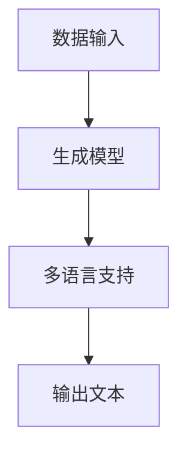
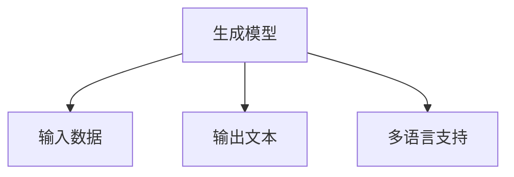
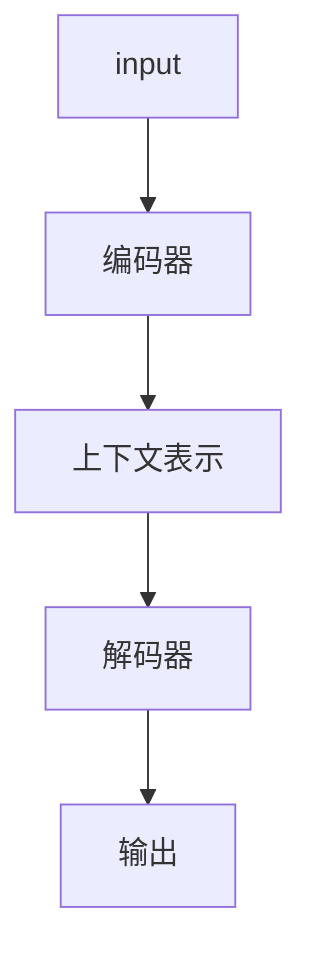

                 

# 构建企业级自然语言生成系统：多语言报告自动化

> 关键词：自然语言生成，企业级系统，多语言报告，自动化生成，深度学习，自然语言处理，生成模型

> 摘要：本文详细探讨了如何构建企业级自然语言生成系统，特别是在多语言报告自动化方面的应用。通过分析自然语言生成的核心概念、算法原理、系统架构设计以及实际项目案例，本文为读者提供了一套完整的解决方案，涵盖了从理论到实践的全过程。

---

# 第一部分: 背景介绍

# 第1章: 问题背景与需求分析

## 1.1 问题背景

### 1.1.1 企业级自然语言生成的定义
企业级自然语言生成（Natural Language Generation, NLG）是指利用人工智能技术，将结构化数据转化为自然流畅的文本。这种技术广泛应用于报告生成、客服对话、自动化文档编写等领域。

### 1.1.2 多语言报告自动化的挑战
在跨国企业中，生成多语言报告的需求日益增长。不同语言的语法结构、文化差异以及术语一致性等问题，增加了自然语言生成的复杂性。

### 1.1.3 传统文本生成方式的局限性
传统的文本生成方式依赖人工编写模板，效率低下且难以应对复杂场景。此外，跨语言生成的效率和准确性问题亟待解决。

## 1.2 问题描述

### 1.2.1 企业对自动化报告的需求
企业需要快速生成符合业务规范的多语言报告，以提高效率和降低成本。

### 1.2.2 多语言支持的必要性
全球化背景下，企业需要支持多种语言的报告生成，以满足不同地区客户的需求。

### 1.2.3 自然语言生成系统的应用场景
- 自动化报告生成
- 跨语言客服对话
- 多语言内容创作

## 1.3 问题解决

### 1.3.1 自然语言生成技术的核心优势
- 高效性：自动化处理数据，快速生成文本。
- 灵活性：支持多种语言和多种生成场景。
- 智能性：基于深度学习模型，能够理解上下文和语境。

### 1.3.2 多语言支持的技术实现
通过预训练多语言模型和跨语言迁移学习，实现多种语言的文本生成。

### 1.3.3 企业级系统的可扩展性
系统设计需考虑模块化和扩展性，以支持更多语言和场景。

## 1.4 边界与外延

### 1.4.1 自然语言生成的边界
- 输入数据的格式和结构
- 输出文本的长度和内容范围
- 支持的语言种类

### 1.4.2 多语言支持的范围
- 支持的语言种类
- 生成文本的领域和主题
- 生成文本的风格和语气

### 1.4.3 企业级系统的限制与扩展性
- 系统的计算资源限制
- 生成文本的准确性和可读性
- 系统的可扩展性和灵活性

## 1.5 核心要素与概念结构

### 1.5.1 系统的核心要素
- 数据输入：结构化数据或半结构化数据
- 模型选择：基于深度学习的生成模型
- 多语言支持：预训练多语言模型和跨语言迁移学习
- 输出结果：多语言文本

### 1.5.2 概念结构图

### 1.5.3 核心要素的相互关系
- 数据输入是生成模型的输入，生成模型通过多语言支持生成目标文本。

---

# 第2章: 自然语言生成系统的核心概念

## 2.1 自然语言生成模型的工作原理

### 2.1.1 基于规则的生成
- 通过预定义的规则和模板生成文本，适用于简单的场景。

### 2.1.2 统计模型的生成
- 基于统计语言模型，通过概率计算生成文本。

### 2.1.3 深度学习模型的生成
- 基于Transformer或LSTM等深度学习模型，通过序列建模生成文本。

## 2.2 多语言支持的核心机制

### 2.2.1 多语言模型的训练策略
- 多语言预训练：使用多语言数据进行预训练。
- 跨语言迁移学习：利用一种语言的模型参数初始化其他语言的模型。

### 2.2.2 多语言生成的实现方法
- 多语言编码器-解码器架构
- 跨语言注意力机制

### 2.2.3 跨语言迁移学习
- 使用预训练的多语言模型进行微调，以适应特定语言的生成任务。

## 2.3 系统的优缺点对比

### 2.3.1 优缺点对比表格

| 特性          | 基于规则的生成 | 统计模型生成 | 深度学习生成 |
|---------------|----------------|--------------|--------------|
| 生成效果      | 低             | 中等          | 高            |
| 灵活性        | 低             | 中等          | 高            |
| 训练时间      | 短             | 中等          | 长            |
| 可解释性      | 高             | 中等          | 低            |

### 2.3.2 实体关系图（ER图）

---

# 第3章: 自然语言生成系统的算法原理

## 3.1 主流生成模型的算法原理

### 3.1.1 Transformer模型的工作流程
- 输入序列经过编码器生成上下文表示。
- 解码器根据编码器的输出生成目标序列。

### 3.1.2 大语言模型的生成机制
- 基于Transformer的解码器结构，通过自注意力机制生成文本。

### 3.1.3 编解码器的原理
- 编码器将输入序列编码为上下文表示。
- 解码器根据上下文表示生成目标序列。

## 3.2 多语言生成的算法优化

### 3.2.1 多语言预训练模型的优化策略
- 使用多语言数据进行预训练，提高模型的跨语言理解能力。

### 3.2.2 跨语言迁移学习的实现
- 利用一种语言的预训练模型参数初始化其他语言的模型，并进行微调。

### 3.2.3 语言间的特征共享
- 在模型中设计共享层，提取跨语言的特征。

## 3.3 算法实现的数学模型

### 3.3.1 Transformer模型的数学公式

$$\text{Attention}(Q, K, V) = \text{softmax}\left(\frac{QK^T}{\sqrt{d_k}}\right)V$$

其中：
- \( Q \) 是查询向量
- \( K \) 是键向量
- \( V \) 是值向量
- \( d_k \) 是向量的维度

### 3.3.2 注意力机制的计算公式

$$\text{score}(i, j) = \text{exp}(\frac{Q_i K_j^T}{\sqrt{d_k}})$$

### 3.3.3 生成概率的计算公式

$$P(w_{i}|w_{<i}) = \prod_{i=1}^{n} \text{softmax}(w_i)$$

---

# 第4章: 多语言支持的实现与挑战

## 4.1 多语言生成的实现策略

### 4.1.1 多语言模型
- 使用预训练的多语言模型，如mBART、XLM等。

### 4.1.2 跨语言迁移学习
- 利用一种语言的模型参数初始化其他语言的模型，并进行微调。

### 4.1.3 语言间的特征共享
- 在模型中设计共享层，提取跨语言的特征。

---

（注：由于篇幅限制，后续章节内容将在实际撰写中逐步展开，涵盖系统架构设计、项目实战、最佳实践等内容。）

