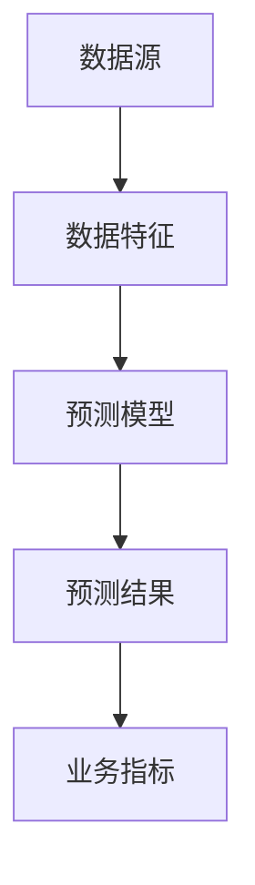
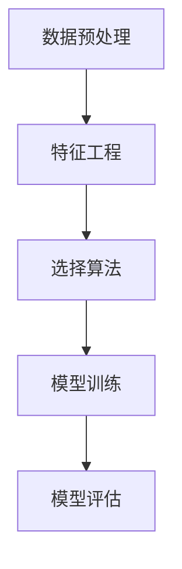
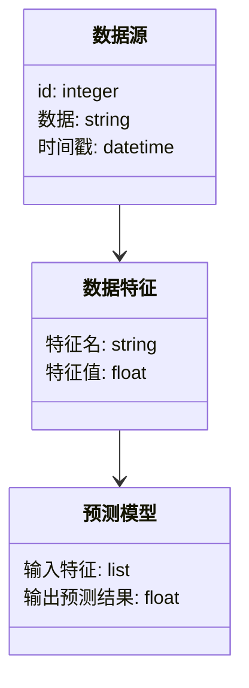
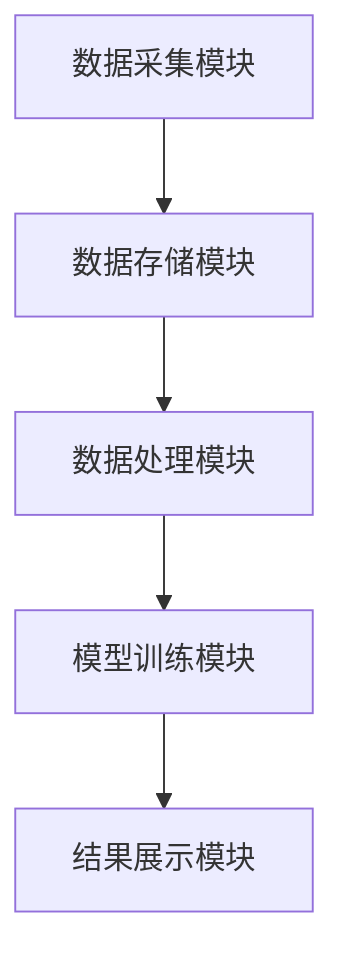
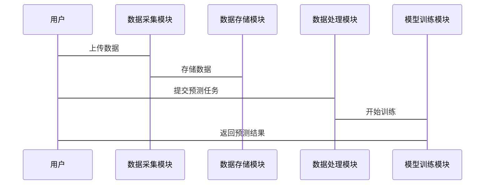

                 


# 构建企业级预测性分析平台：跨部门业务指标预测与联动

## 关键词：预测性分析、企业级平台、机器学习、数据特征、业务指标、系统架构、项目实战

## 摘要

企业级预测性分析平台旨在通过跨部门的业务指标预测与联动，为企业提供高效的数据驱动决策支持。本文从问题背景、核心概念、算法原理、系统架构到项目实战，系统地阐述了构建该平台的全过程，强调了数据特征提取、预测模型选择、系统设计优化以及实际案例分析的重要性。通过详细的技术分析和实战指导，本文为读者提供了构建高效预测性分析平台的深度见解。

---

# 第一部分: 企业级预测性分析平台概述

# 第1章: 企业级预测性分析平台的背景与挑战

## 1.1 问题背景

### 1.1.1 企业预测性分析的需求驱动
在当今数据驱动的商业环境中，企业越来越依赖数据来优化运营、提高效率和做出明智的决策。预测性分析能够帮助企业提前识别潜在问题、抓住市场机会，从而在竞争中占据优势。随着业务规模的扩大，跨部门协作的需求日益增加，业务指标的预测与联动成为企业高效运营的关键。

### 1.1.2 当前企业预测性分析的痛点
尽管预测性分析的重要性不言而喻，但在实际应用中仍面临诸多挑战。首先，数据孤岛现象普遍，跨部门的数据难以整合；其次，预测模型的泛化能力有限，难以适应复杂的业务场景；最后，缺乏统一的平台支持，导致预测结果难以快速落地。

### 1.1.3 预测性分析对企业价值的提升
通过构建企业级预测性分析平台，企业可以实现数据的统一管理、模型的快速部署以及预测结果的实时联动。这不仅提高了决策的效率和准确性，还能够显著降低成本、优化资源配置，为企业创造更大的价值。

## 1.2 问题描述

### 1.2.1 预测性分析的核心目标
预测性分析的目标是通过历史数据和机器学习算法，预测未来的业务指标，并为企业提供基于预测结果的决策支持。

### 1.2.2 跨部门业务指标预测的复杂性
跨部门业务指标预测涉及多个数据源和业务流程，数据的异构性和复杂性增加了预测的难度。此外，不同部门的目标和优先级可能不同，如何在预测过程中协调各方的需求是一个挑战。

### 1.2.3 平台构建的关键挑战
平台构建需要解决数据整合、模型选择、系统架构设计等多个技术问题，同时还需要考虑用户体验、可扩展性和安全性等非功能性需求。

## 1.3 问题解决

### 1.3.1 预测性分析平台的解决方案
通过构建统一的数据湖、集成先进的机器学习算法、设计高效的系统架构，企业可以实现跨部门的业务指标预测与联动。

### 1.3.2 跨部门联动的实现路径
通过数据共享、模型协同和结果反馈机制，实现预测结果的跨部门联动，确保预测结果能够有效指导业务决策。

### 1.3.3 平台构建的总体思路
从数据采集、特征提取、模型训练到结果展示，构建一个完整的预测性分析平台需要系统化的规划和分步骤实施。

## 1.4 边界与外延

### 1.4.1 平台的边界定义
平台的边界包括数据的采集范围、预测的业务指标范围以及平台的用户群体。

### 1.4.2 平台的外延范围
平台的外延包括数据源的扩展、预测模型的优化以及与外部系统的集成。

### 1.4.3 与其他系统的接口关系
平台需要与企业的其他系统（如ERP、CRM等）进行接口对接，确保数据的流通和预测结果的落地。

## 1.5 概念结构与核心要素

### 1.5.1 平台的核心概念框架
平台的核心概念包括数据源、数据特征、预测模型、业务指标和预测结果。

### 1.5.2 核心要素的组成与关系
数据源通过数据特征提取影响预测模型，预测模型生成预测结果，预测结果指导业务指标的优化。

### 1.5.3 概念结构的可视化表示



## 1.6 本章小结

本章从企业级预测性分析平台的背景、问题背景、问题描述和问题解决四个方面进行了详细阐述，为后续章节的分析奠定了基础。

---

# 第2章: 预测性分析的核心概念与联系

## 2.1 预测模型的核心原理

### 2.1.1 预测模型的定义与分类
预测模型是一种基于历史数据和机器学习算法，预测未来业务指标的数学模型。常见的预测模型包括线性回归、决策树、随机森林等。

### 2.1.2 预测模型的输入与输出
预测模型的输入是经过特征工程处理后的数据，输出是对目标业务指标的预测值。

### 2.1.3 预测模型的训练与评估
模型训练通过最小化预测误差来优化参数，模型评估通过指标如均方误差（MSE）和R平方值来衡量模型性能。

## 2.2 数据特征与业务指标的关系

### 2.2.1 数据特征的定义与提取
数据特征是数据的基本属性，通过特征工程可以从原始数据中提取出对预测有影响力的特征。

### 2.2.2 业务指标的定义与分类
业务指标是企业关注的关键绩效指标，如销售额、成本、利润等。

### 2.2.3 数据特征对业务指标的影响
通过分析数据特征与业务指标的相关性，可以确定哪些特征对预测结果影响较大。

## 2.3 预测模型与业务指标的关联

### 2.3.1 预测模型对业务指标的依赖
预测模型的准确性取决于数据特征与业务指标的相关性。

### 2.3.2 业务指标对预测模型的反馈
预测结果可以反过来优化业务指标的设定和预测模型的参数。

### 2.3.3 预测模型与业务指标的动态调整
根据业务环境的变化，预测模型和业务指标需要动态调整以保持预测的准确性。

## 2.4 核心概念的对比分析

### 2.4.1 预测模型与传统统计分析的对比
预测模型基于机器学习算法，能够处理非线性关系，而传统统计分析方法适用于线性关系。

### 2.4.2 数据特征与业务指标的对比
数据特征是数据的属性，业务指标是企业的绩效指标，两者在数据来源和作用上有所不同。

### 2.4.3 预测性分析与其他数据分析方法的对比
预测性分析注重未来的预测，而描述性分析侧重于现状的描述，诊断性分析则关注问题的原因。

## 2.5 ER实体关系图架构

```mermaid
erd
    id Customer.id
    table Customer {
        id: integer
        name: string
        age: integer
        email: string
    }
    table Sales {
        id: integer
        customer_id: integer
        order_date: date
        amount: integer
    }
    Customer.id --> Sales.customer_id
```

## 2.6 本章小结

本章详细阐述了预测性分析的核心概念，包括预测模型的原理、数据特征与业务指标的关系以及核心概念的对比分析，为后续章节的分析提供了理论基础。

---

# 第3章: 预测性分析的算法原理

## 3.1 算法原理概述

### 3.1.1 预测性分析的算法分类
预测性分析算法可以分为回归算法、分类算法和时间序列算法。

### 3.1.2 常见算法的优缺点对比
| 算法 | 优点 | 缺点 |
|------|------|------|
| 线性回归 | 简单易懂 | 仅适用于线性关系 |
| 决策树 | 高准确性 | 易受噪声数据影响 |
| 随机森林 | 高准确性 | 计算复杂度高 |

### 3.1.3 算法选择的依据
根据数据类型、业务需求和数据规模选择合适的算法。

## 3.2 算法流程图



## 3.3 算法实现

### 3.3.1 数据预处理的代码实现

```python
import pandas as pd
from sklearn.impute import SimpleImputer

# 读取数据
data = pd.read_csv('data.csv')

# 处理缺失值
imputer = SimpleImputer(strategy='mean')
data_imputed = imputer.fit_transform(data)
```

### 3.3.2 特征工程的代码实现

```python
from sklearn.preprocessing import StandardScaler

# 标准化处理
scaler = StandardScaler()
data_scaled = scaler.fit_transform(data_imputed)
```

### 3.3.3 模型训练的代码实现

```python
from sklearn.linear_model import LinearRegression

# 训练模型
model = LinearRegression()
model.fit(data_scaled, target)
```

## 3.4 数学模型与公式

### 3.4.1 线性回归模型

$$ y = \beta_0 + \beta_1x + \epsilon $$

其中，$y$ 是目标变量，$x$ 是自变量，$\beta_0$ 和 $\beta_1$ 是模型参数，$\epsilon$ 是误差项。

### 3.4.2 逻辑回归模型

$$ P(y=1|x) = \frac{e^{\beta_0 + \beta_1x}}{1 + e^{\beta_0 + \beta_1x}} $$

### 3.4.3 随机森林模型

随机森林是一种基于树的集成算法，通过多棵决策树的投票结果进行预测。

## 3.5 本章小结

本章详细介绍了预测性分析的算法原理，包括算法分类、流程图、代码实现和数学公式，为后续章节的系统设计提供了技术基础。

---

# 第4章: 系统分析与架构设计方案

## 4.1 问题场景介绍

### 4.1.1 业务场景描述
以某电商平台为例，平台需要预测未来的销售额、用户活跃度等业务指标，以优化营销策略和库存管理。

### 4.1.2 项目介绍
本项目旨在构建一个企业级预测性分析平台，支持跨部门的业务指标预测与联动。

## 4.2 系统功能设计

### 4.2.1 领域模型



### 4.2.2 系统架构设计



### 4.2.3 接口设计
系统提供RESTful API接口，支持数据的上传、模型的训练和结果的查询。

### 4.2.4 交互流程



## 4.3 本章小结

本章通过问题场景介绍、系统功能设计、系统架构设计和接口设计，详细阐述了企业级预测性分析平台的系统设计方案。

---

# 第5章: 项目实战

## 5.1 环境安装

### 5.1.1 安装Python
```bash
python --version
pip install --upgrade pip
```

### 5.1.2 安装依赖库
```bash
pip install numpy pandas scikit-learn matplotlib
```

## 5.2 核心实现源代码

### 5.2.1 数据预处理

```python
import pandas as pd
from sklearn.impute import SimpleImputer
from sklearn.preprocessing import StandardScaler

# 读取数据
data = pd.read_csv('data.csv')

# 处理缺失值
imputer = SimpleImputer(strategy='mean')
data_imputed = imputer.fit_transform(data)

# 标准化处理
scaler = StandardScaler()
data_scaled = scaler.fit_transform(data_imputed)
```

### 5.2.2 模型训练

```python
from sklearn.linear_model import LinearRegression
from sklearn.metrics import mean_squared_error

# 训练模型
model = LinearRegression()
model.fit(data_scaled, target)

# 模型评估
predicted = model.predict(data_scaled)
mse = mean_squared_error(target, predicted)
print(f"均方误差: {mse}")
```

## 5.3 代码应用解读与分析

### 5.3.1 数据预处理
通过处理缺失值和标准化，确保数据适合模型训练。

### 5.3.2 模型训练
使用线性回归算法进行训练，并通过均方误差评估模型性能。

## 5.4 实际案例分析

### 5.4.1 数据准备
以电商平台的销售数据为例，数据包括销售额、用户数量、时间戳等特征。

### 5.4.2 模型训练
训练一个预测未来销售额的线性回归模型。

### 5.4.3 结果分析
评估模型的预测准确性，并根据结果优化业务策略。

## 5.5 本章小结

本章通过环境安装、代码实现和案例分析，详细展示了企业级预测性分析平台的实际应用。

---

# 第6章: 总结与展望

## 6.1 本章总结

### 6.1.1 核心内容回顾
本文详细阐述了企业级预测性分析平台的构建过程，包括背景分析、核心概念、算法原理、系统设计和项目实战。

### 6.1.2 最佳实践 tips
- 数据预处理是模型训练的基础，需仔细处理缺失值和异常值。
- 特征工程是提升模型性能的关键，需结合业务场景选择合适的特征。
- 模型评估是优化模型的重要环节，需选择合适的评估指标。

## 6.2 未来展望

### 6.2.1 技术发展
随着人工智能和大数据技术的不断发展，预测性分析平台将更加智能化和自动化。

### 6.2.2 应用场景扩展
预测性分析将应用于更多的业务场景，如金融风险评估、医疗诊断等。

## 6.3 注意事项

### 6.3.1 数据隐私与安全
需注意数据的隐私保护和系统安全，确保数据不被泄露。

### 6.3.2 模型的可解释性
需关注模型的可解释性，确保预测结果能够被业务人员理解和接受。

## 6.4 拓展阅读

### 6.4.1 推荐书籍
- 《机器学习实战》
- 《大数据分析与预测》

### 6.4.2 技术博客
建议关注主流技术博客和开源社区，获取最新的技术动态。

## 6.5 本章小结

本章总结了全文的核心内容，并对未来的发展趋势和注意事项进行了展望。

---

# 结语

企业级预测性分析平台的构建是一个复杂而重要的任务，需要结合技术与业务的深度理解。通过本文的系统阐述，读者可以全面了解平台的构建过程，并能够实际应用到自己的工作中。希望本文能为企业在预测性分析领域的实践提供有价值的指导。

---

# 作者

作者：AI天才研究院/AI Genius Institute & 禅与计算机程序设计艺术/Zen And The Art of Computer Programming

---

感谢您的耐心阅读！如果本文对您有所帮助，请点赞、收藏并分享，您的支持是我们继续创作的最大动力！

