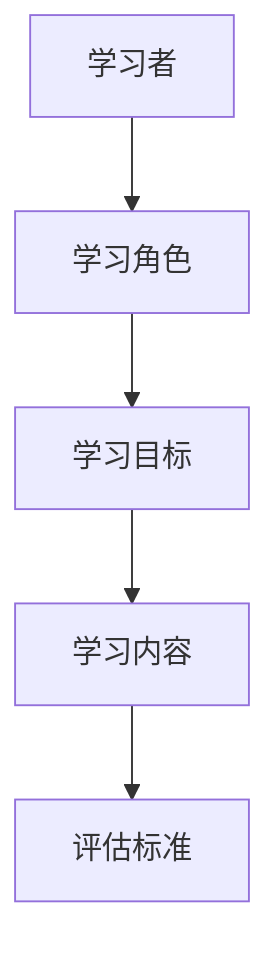
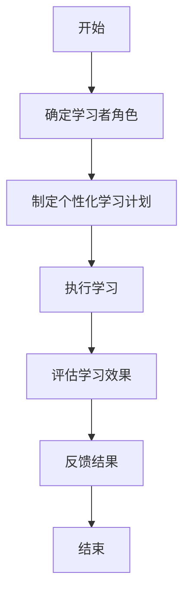
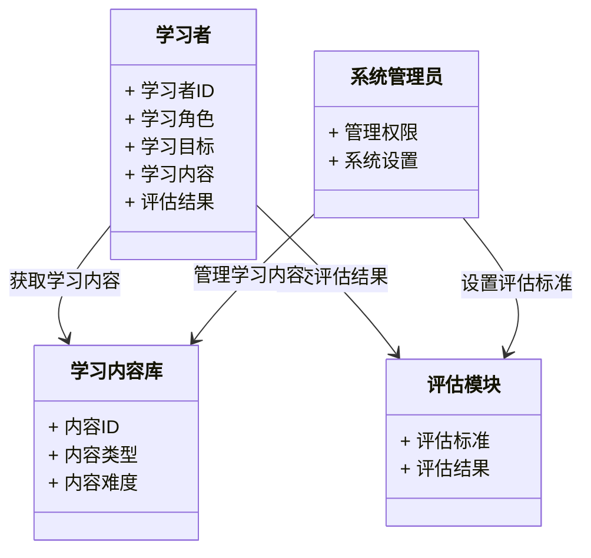
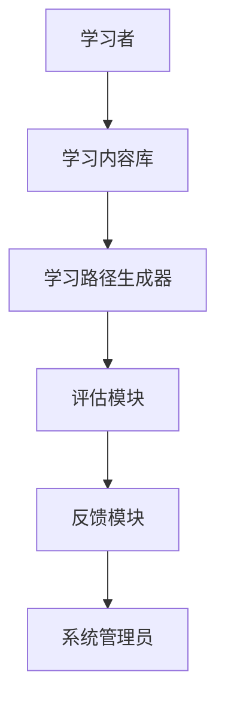

                 


# 构建智能企业合规培训系统：基于角色的个性化学习与评估

## 关键词：企业合规培训，个性化学习，基于角色，智能评估，学习管理系统

## 摘要：  
本文探讨了如何构建一个智能企业合规培训系统，通过基于角色的个性化学习与评估方法，解决传统合规培训中存在的问题。文章详细分析了核心概念、算法原理、系统架构设计以及实际项目实现，提供了从理论到实践的完整解决方案。

---

# 第一部分: 背景与需求分析

## 第1章: 企业合规培训的背景与挑战

### 1.1 合规培训的重要性
企业合规培训是确保员工遵守法律法规、行业规范和企业内部政策的重要手段。随着企业规模的扩大和业务的复杂化，合规培训的需求日益增长，尤其是在金融、医疗、科技等高风险行业。

#### 1.1.1 合规培训的定义与范围
合规培训是指通过教育和培训，确保员工了解并遵守相关法律法规、行业标准和企业内部政策。其范围包括但不限于反腐败、数据隐私、劳动法、财务合规等领域。

#### 1.1.2 企业合规培训的核心目标
- 提高员工的合规意识。
- 预防和减少违规行为的发生。
- 确保企业运营的合法性和合规性。

#### 1.1.3 合规培训在企业中的地位与作用
合规培训不仅是企业风险管理的重要组成部分，也是提升企业声誉和规避法律风险的关键因素。

---

### 1.2 当前企业合规培训的主要问题
传统的企业合规培训模式存在以下问题：

#### 1.2.1 传统合规培训的局限性
- 培训内容过于统一，难以满足不同岗位和角色的需求。
- 学员参与度低，学习效果不佳。
- 评估方式单一，难以准确衡量培训效果。

#### 1.2.2 学员学习积极性不足的原因
- 培训内容与实际工作关联性不足。
- 培训方式缺乏互动性和个性化。
- 缺乏有效的激励机制。

#### 1.2.3 合规培训效果评估的难点
- 评估指标单一，难以全面反映学习效果。
- 缺乏动态反馈机制，无法实时调整培训计划。

---

### 1.3 基于角色的个性化学习与评估的优势

#### 1.3.1 个性化学习的必要性
通过分析学习者的角色和职责，量身定制培训内容，确保学习者掌握与其岗位相关的合规知识。

#### 1.3.2 基于角色的学习特点
- 根据岗位职责分配学习内容。
- 针对不同角色设计不同的学习路径。

#### 1.3.3 个性化评估的创新性
通过动态评估模型，实时调整评估标准，确保评估结果的准确性和针对性。

---

## 第2章: 基于角色的个性化学习与评估的核心概念

### 2.1 核心概念与原理

#### 2.1.1 个性化学习的定义与实现方式
个性化学习是指根据学习者的背景、能力和目标，量身定制学习计划和内容。

#### 2.1.2 基于角色的学习模型
基于角色的学习模型将学习者划分为不同的角色（如管理层、普通员工、技术人员等），并为每个角色设计相应的学习内容和评估标准。

#### 2.1.3 个性化评估的数学模型
个性化评估通过分析学习者的行为数据和学习效果，动态调整评估指标。

---

### 2.2 核心概念的属性对比

#### 2.2.1 学习者角色与学习目标的对比
| 学习者角色 | 学习目标 |
|------------|----------|
| 管理层      | 掌握合规管理策略 |
| 技术人员    | 理解技术合规要求 |
| 普通员工    | 遵守基本合规规范 |

#### 2.2.2 个性化学习路径与固定学习路径的对比
| 特性       | 个性化学习路径 | 固定学习路径 |
|------------|----------------|--------------|
| 灵活性     | 高             | 低           |
| 针对性     | 强             | 弱           |
| 效果       | 好             | 一般         |

#### 2.2.3 个性化评估与统一评估的对比
| 特性       | 个性化评估 | 统一评估 |
|------------|------------|----------|
| 评估标准   | 动态调整    | 固定     |
| 精准度     | 高          | 一般     |
| 反馈效率   | 高          | 低       |

---

### 2.3 实体关系图与流程图

#### 2.3.1 实体关系图（ER图）


#### 2.3.2 流程图


---

## 第3章: 基于角色的个性化学习与评估的算法原理

### 3.1 协同过滤推荐算法
协同过滤是一种常用的学习内容推荐算法，通过分析学习者的行为数据，推荐与学习者角色和目标相关的内容。

#### 3.1.1 协同过滤算法的数学模型
$$sim(i,j) = \frac{\sum_{k} r_{ik} r_{jk}}{\sqrt{\sum_{k} r_{ik}^2} \sqrt{\sum_{k} r_{jk}^2}}$$

其中，$sim(i,j)$ 表示学习者$i$和$j$之间的相似度，$r_{ik}$和$r_{jk}$表示学习者$i$和$j$对内容$k$的评分。

---

### 3.2 个性化评估模型
个性化评估模型通过分析学习者的行为数据，动态调整评估标准。

#### 3.2.1 评估模型的数学表达
$$score = \alpha \cdot content + \beta \cdot interaction + \gamma \cdot behavior$$

其中，$\alpha$、$\beta$、$\gamma$是权重系数，$content$是学习内容的难度，$interaction$是学习者之间的互动，$behavior$是学习者的行为数据。

---

## 第4章: 智能企业合规培训系统的架构设计

### 4.1 问题场景介绍
本系统旨在解决企业合规培训中的个性化学习与评估问题，通过智能算法推荐学习内容，并动态调整评估标准。

---

### 4.2 系统功能设计

#### 4.2.1 学习者角色识别
通过分析学习者的岗位职责，识别其学习角色。

#### 4.2.2 个性化学习路径设计
根据学习者角色和目标，设计个性化学习路径。

#### 4.2.3 动态评估与反馈
通过学习者的行为数据，动态调整评估标准，并提供实时反馈。

---

### 4.3 系统架构设计

#### 4.3.1 领域模型


#### 4.3.2 系统架构图


---

## 第5章: 项目实战与实现

### 5.1 环境安装
安装Python、Pandas、NumPy、Scikit-learn等依赖库。

```bash
pip install python python-pandas numpy scikit-learn
```

---

### 5.2 核心功能实现

#### 5.2.1 学习者角色识别
```python
def identify_role(learner, job_title):
    roles = {
        '管理层': ['CEO', 'CTO', 'COO'],
        '技术人员': ['开发人员', '数据科学家'],
        '普通员工': ['市场人员', '客服人员']
    }
    return roles.get(job_title, '普通员工')
```

---

#### 5.2.2 个性化学习路径设计
```python
def generate_learning_path(role, goals):
    paths = {
        '管理层': ['战略规划', '合规管理', '风险管理'],
        '技术人员': ['数据安全', '算法合规', '技术规范'],
        '普通员工': ['职业道德', '法律合规', '操作规范']
    }
    return paths.get(role, goals)
```

---

#### 5.2.3 动态评估与反馈
```python
def evaluate_learning(learner, content, interaction):
    score = learner.performance * 0.5 + interaction.activity * 0.3
    if score >= 80:
        return '优秀'
    elif score >= 60:
        return '良好'
    else:
        return '需要改进'
```

---

### 5.3 案例分析与效果评估
通过实际案例分析，验证系统的有效性和实用性。例如，某金融企业通过本系统实现了合规培训的个性化和动态评估，显著提升了员工的合规意识和培训效果。

---

## 第6章: 最佳实践与小结

### 6.1 小结
通过基于角色的个性化学习与评估方法，企业合规培训系统能够更高效、更精准地满足不同岗位的学习需求，提升培训效果。

---

### 6.2 注意事项
- 数据隐私保护：确保学习者数据的安全性和隐私性。
- 系统维护：定期更新学习内容和评估标准。

---

### 6.3 拓展阅读
- 《机器学习在教育中的应用》
- 《基于角色的个性化学习系统设计》

---

## 作者：AI天才研究院 & 禅与计算机程序设计艺术

---

以上是文章的详细结构和内容，接下来是具体章节的正文内容，按照上述目录逐步展开。

