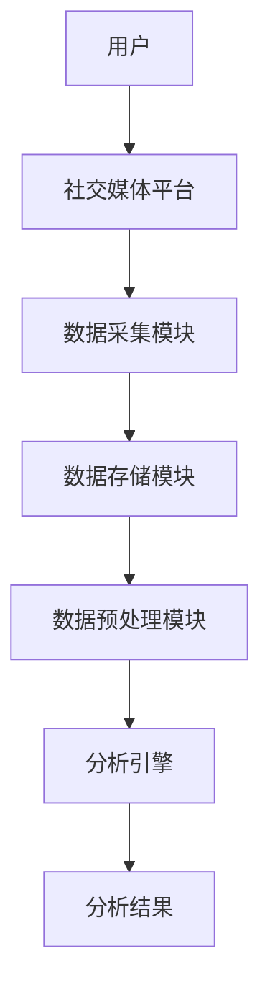
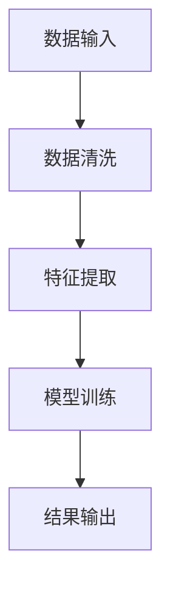
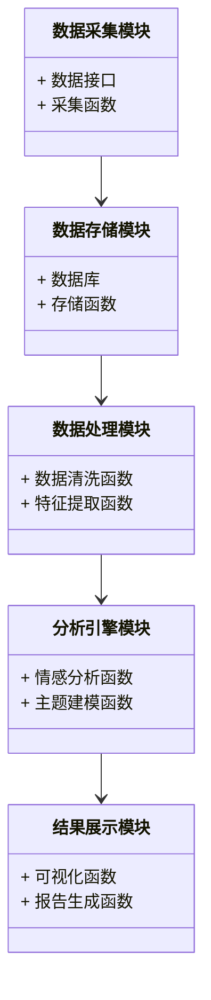
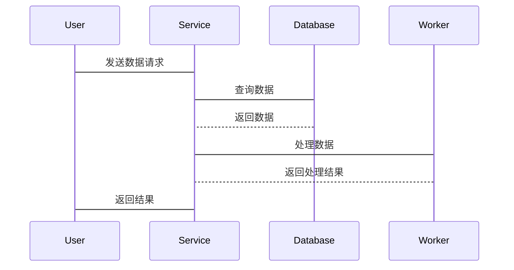

                 


# 构建智能企业市场调研系统：社交媒体聆听与趋势分析

## 关键词：社交媒体聆听、趋势分析、市场调研系统、大数据分析、人工智能

## 摘要：  
随着社交媒体的普及，企业市场调研的方式也在不断进化。传统的市场调研方法逐渐被基于社交媒体数据的智能化系统所取代。本文将详细探讨如何构建一个智能企业市场调研系统，通过社交媒体聆听和趋势分析，帮助企业实时捕捉市场动态，洞察消费者需求，优化市场策略。文章将从问题背景、核心概念、算法原理、系统架构到项目实战，全面解析智能市场调研系统的构建过程，并结合实际案例进行深入分析。

---

# 第1章: 问题背景与目标

## 1.1 问题背景

### 1.1.1 传统市场调研的局限性  
传统市场调研依赖问卷调查、焦点小组访谈等方式，存在数据采集成本高、覆盖范围有限、实时性差等问题。此外，消费者在社交媒体上的行为数据未被充分利用，导致市场调研结果不够全面。

### 1.1.2 社交媒体数据的价值与潜力  
社交媒体数据是企业了解消费者行为和市场趋势的重要来源。通过分析社交媒体上的文本、图片、视频等数据，企业可以实时获取消费者的真实反馈，挖掘潜在的市场机会。

### 1.1.3 智能化市场调研的需求与趋势  
随着大数据和人工智能技术的发展，企业对智能化市场调研的需求日益增加。通过自动化数据采集、智能分析和实时反馈，企业可以更高效地进行市场决策。

## 1.2 问题描述

### 1.2.1 市场调研的核心目标  
市场调研的核心目标是帮助企业了解市场环境、消费者需求和竞争对手动态，从而制定科学的市场策略。

### 1.2.2 社交媒体数据的复杂性  
社交媒体数据具有非结构化、多样化、实时性等特点，如何高效采集、处理和分析这些数据是智能化市场调研系统面临的挑战。

### 1.2.3 智能化市场调研系统的必要性  
智能化市场调研系统可以自动化处理社交媒体数据，提取有价值的信息，帮助企业快速做出市场决策。

## 1.3 问题解决

### 1.3.1 智能化市场调研的解决方案  
通过结合大数据和人工智能技术，构建一个智能化市场调研系统，实现对社交媒体数据的实时采集、分析和反馈。

### 1.3.2 社交媒体聆听的核心技术  
社交媒体聆听技术包括数据采集、自然语言处理、情感分析等，能够帮助企业从社交媒体数据中提取关键信息。

### 1.3.3 趋势分析的实现路径  
趋势分析通过统计学习和主题建模等方法，识别市场趋势，预测未来的发展方向。

## 1.4 系统边界与外延

### 1.4.1 系统的功能边界  
系统的功能边界包括数据采集、数据处理、趋势分析和结果展示。

### 1.4.2 系统的适用范围  
系统适用于多个行业，如消费品、科技、金融等，帮助企业在市场调研中获取实时数据。

### 1.4.3 系统的扩展性与可维护性  
系统设计应具备良好的扩展性和可维护性，支持未来数据源的增加和算法的优化。

## 1.5 核心概念与组成

### 1.5.1 核心概念的定义与属性  
- 数据采集：从社交媒体平台获取原始数据。
- 数据处理：清洗、转换和标注数据。
- 情感分析：识别文本中的情感倾向。
- 主题建模：发现数据中的主题分布。

### 1.5.2 系统组成模块  
- 数据采集模块：负责从社交媒体平台获取数据。
- 数据处理模块：对数据进行清洗和预处理。
- 分析引擎模块：包括情感分析和主题建模等算法。
- 结果展示模块：以可视化方式呈现分析结果。

### 1.5.3 模块之间的关系与依赖  
数据采集模块将数据传递给数据处理模块，处理后的数据输入分析引擎模块，分析结果展示在结果展示模块。

---

# 第2章: 核心概念与联系

## 2.1 核心概念原理

### 2.1.1 文本挖掘  
文本挖掘是从大量文本数据中提取有用信息的过程，常用于发现隐藏的模式和关联。

### 2.1.2 情感分析  
情感分析是识别文本中的情感倾向，帮助企业了解消费者对产品或服务的满意度。

### 2.1.3 主题建模  
主题建模通过统计方法发现数据中的主题分布，帮助识别市场趋势。

## 2.2 核心概念属性对比

| 核心概念  | 数据来源 | 数据类型 | 主要目标 |
|------------|----------|----------|----------|
| 数据采集 | 社交媒体 | 文本、图片、视频 | 获取原始数据 |
| 数据处理 | 数据库 | 结构化数据 | 清洗和预处理 |
| 情感分析 | 文本数据 | 非结构化数据 | 识别情感倾向 |
| 主题建模 | 文本数据 | 非结构化数据 | 发现主题分布 |

## 2.3 ER实体关系图



---

# 第3章: 算法原理与实现

## 3.1 算法原理

### 3.1.1 文本挖掘  
文本挖掘包括文本清洗、分词、关键词提取等步骤，帮助提取有用信息。

### 3.1.2 情感分析  
情感分析基于机器学习模型，通过训练数据学习情感倾向，对新文本进行分类。

### 3.1.3 主题建模  
主题建模使用LDA（Latent Dirichlet Allocation）等算法，发现数据中的主题分布。

## 3.2 算法流程图



## 3.3 数学模型与公式

### 3.3.1 情感分析模型  
情感分析模型通常使用分类算法，如逻辑回归或支持向量机。以下是逻辑回归的简单公式：

$$ P(y=1|x) = \frac{1}{1 + e^{-\beta x}} $$

其中，$x$ 是输入特征，$\beta$ 是模型参数。

### 3.3.2 主题建模公式  
LDA模型的概率公式为：

$$ P(w_i | \theta_j) = \theta_j^{(w_i)} $$

其中，$\theta_j$ 是主题 $j$ 的概率分布，$w_i$ 是词 $i$。

---

# 第4章: 系统分析与架构设计方案

## 4.1 系统功能设计

### 4.1.1 领域模型



### 4.1.2 系统架构设计


### 4.1.3 系统接口设计  
系统提供RESTful API接口，供其他系统调用。

### 4.1.4 系统交互设计



---

# 第5章: 项目实战

## 5.1 实战环境与工具

### 5.1.1 环境搭建  
安装Python、Jupyter Notebook、Pandas、Scikit-learn、NLTK等工具。

## 5.2 核心实现代码

```python
import pandas as pd
from sklearn.feature_extraction.text import TfidfVectorizer
from sklearn.model_selection import train_test_split
from sklearn.linear_model import LogisticRegression
from sklearn.metrics import accuracy_score
import nltk
nltk.download('stopwords')

# 数据加载
data = pd.read_csv('data.csv')

# 数据清洗
def clean_text(text):
    return ' '.join(nltk.word_tokenize(text.lower()))

data['clean_text'] = data['text'].apply(clean_text)

# 特征提取
vectorizer = TfidfVectorizer(max_features=5000)
X = vectorizer.fit_transform(data['clean_text'])

# 模型训练
X_train, X_test, y_train, y_test = train_test_split(X, data['label'], test_size=0.2)
model = LogisticRegression()
model.fit(X_train, y_train)

# 模型评估
y_pred = model.predict(X_test)
print(accuracy_score(y_test, y_pred))
```

## 5.3 实战案例分析

### 5.3.1 案例背景  
以消费电子产品为例，分析社交媒体上的用户评论。

### 5.3.2 数据采集  
从Twitter和Reddit获取相关评论数据。

### 5.3.3 数据分析  
使用情感分析模型识别用户对产品的满意度。

### 5.3.4 结果展示  
生成可视化报告，展示情感分布和主要主题。

## 5.4 项目小结  
通过实战案例，验证了系统在实际应用中的可行性和有效性。

---

# 第6章: 最佳实践与小结

## 6.1 小结  
本文详细介绍了智能企业市场调研系统的构建过程，包括核心概念、算法原理、系统架构和项目实战。

## 6.2 注意事项  
在实际应用中，需要注意数据隐私和安全问题，确保合规性。

## 6.3 拓展阅读  
建议读者进一步学习大数据和人工智能技术，探索更多应用场景。

---

# 作者：AI天才研究院 & 禅与计算机程序设计艺术

---

**本文通过系统化的方法，详细解析了智能企业市场调研系统的构建过程，帮助企业利用社交媒体数据，快速捕捉市场动态，制定科学的市场策略。**

