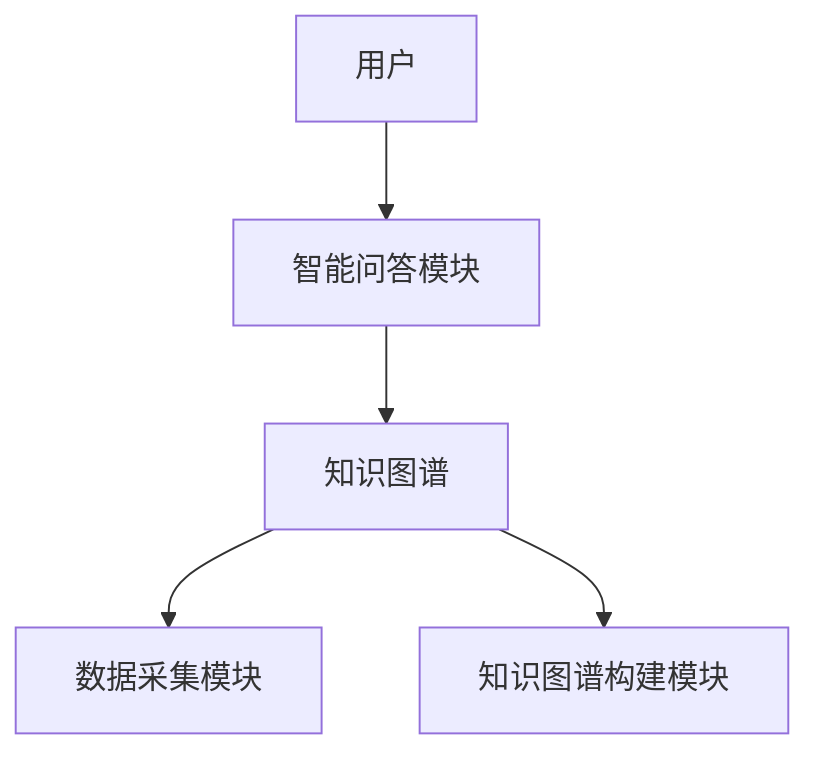

                 


# 构建智能企业知识管理平台：知识图谱与智能问答

> **关键词**：知识图谱、智能问答、企业知识管理、自然语言处理、数据挖掘、知识工程  
> 
> **摘要**：  
> 本文详细探讨了构建智能企业知识管理平台的核心技术，重点分析了知识图谱与智能问答系统的结合与应用。文章首先介绍了知识图谱和智能问答的基本概念与重要性，然后深入讲解了知识图谱的构建过程，包括数据预处理、实体识别、关系抽取等关键步骤。接着，详细分析了智能问答系统的核心技术，包括问题理解、答案生成以及多轮对话管理。随后，文章探讨了知识图谱与智能问答的结合，展示了如何通过知识图谱提升问答系统的准确性和智能性。最后，结合实际项目案例，总结了构建智能企业知识管理平台的关键点和未来发展方向。

---

## 第1章: 智能企业知识管理平台的背景与概念

### 1.1 企业知识管理的背景

随着企业规模的不断扩大和业务的复杂化，知识管理的重要性日益凸显。传统的企业知识管理方式依赖于文件存储和人工整理，存在知识分散、利用率低、难以快速检索等问题。在数字化转型的背景下，企业需要一种更高效的知识管理方式，以支持快速决策、知识共享和智能辅助。

#### 1.1.1 知识管理的重要性
- 知识是企业核心竞争力的源泉。
- 知识管理能够提高员工的工作效率和创新能力。
- 知识管理能够降低知识流失的风险，确保企业知识的传承。

#### 1.1.2 传统知识管理的局限性
- 数据分散，难以统一管理和检索。
- 知识孤岛现象严重，部门间知识共享不足。
- 人工整理效率低下，难以应对海量数据。

#### 1.1.3 智能化知识管理的需求
- 实现知识的自动化整理和结构化存储。
- 提供智能检索和问答功能，快速获取所需知识。
- 支持自然语言处理技术，提升用户体验。

### 1.2 知识图谱与智能问答的定义

#### 1.2.1 知识图谱的定义与特点
知识图谱是一种以图结构形式表示知识的语义网络。它通过实体和关系的形式，将分散的知识点连接起来，形成一个庞大的知识网络。知识图谱具有以下特点：
- **结构化**：数据以实体和关系的形式存储，便于计算机理解和处理。
- **语义化**：通过语义信息，能够理解实体之间的关联关系。
- **动态性**：支持实时更新和扩展，适应不断变化的知识需求。

#### 1.2.2 智能问答的定义与特点
智能问答是一种基于自然语言处理技术，能够理解和回答用户问题的系统。智能问答系统通过分析用户的问题，结合上下文和背景知识，生成准确的答案。其特点包括：
- **智能化**：能够理解自然语言，支持复杂问题的解答。
- **交互性**：支持多轮对话，提供更贴近人类的交互体验。
- **个性化**：根据用户需求和背景，提供个性化的答案。

#### 1.2.3 知识图谱与智能问答的关系
知识图谱为智能问答提供了丰富的语义信息，而智能问答则为知识图谱提供了应用场景。两者的结合能够显著提升问答系统的准确性和智能性。

### 1.3 企业知识管理平台的目标与价值

#### 1.3.1 提高知识利用效率
通过结构化的知识存储和智能检索，企业能够快速获取所需知识，提高工作效率。

#### 1.3.2 支持智能决策
知识图谱和智能问答系统能够为企业决策提供数据支持和语义理解，帮助企业在复杂环境中做出明智决策。

#### 1.3.3 降低知识流失风险
通过知识图谱的形式存储企业知识，能够有效防止知识因人员变动而流失，确保企业知识的长期积累和传承。

---

## 第2章: 知识图谱的构建过程

### 2.1 数据收集与预处理

#### 2.1.1 数据来源与采集方法
知识图谱的数据来源多样，包括企业文档、数据库、外部知识库等。数据采集方法包括爬虫技术、API调用和人工录入。

#### 2.1.2 数据清洗与标准化
数据清洗是去除噪声数据、重复数据和冗余数据的过程。标准化则是将数据格式统一，便于后续处理。

#### 2.1.3 数据格式转换
将数据转换为适合知识图谱存储的格式，例如RDF（Resource Description Framework）或图数据库的格式。

### 2.2 实体识别与关系抽取

#### 2.2.1 实体识别技术
实体识别是通过自然语言处理技术，从文本中提取出具体实体（如人名、地名、组织名等）的过程。常用技术包括基于规则的识别和基于机器学习的识别。

#### 2.2.2 关系抽取技术
关系抽取是识别文本中实体之间的关系，例如“公司A成立于时间B”。常用技术包括基于模式匹配和基于语义理解的方法。

#### 2.2.3 实体消歧与链接
实体消歧是解决同名实体的歧义问题，例如“苹果”可以指公司或水果。实体链接则是将实体与知识图谱中的节点进行匹配。

### 2.3 知识图谱的存储与管理

#### 2.3.1 图数据库的选择
常见的图数据库包括Neo4j、RDF4J等。选择图数据库时需要考虑性能、扩展性和易用性。

#### 2.3.2 知识图谱的建模
知识图谱的建模需要设计实体类型和关系类型。例如，实体类型可以是“公司”、“产品”，关系类型可以是“属于”、“生产”。

#### 2.3.3 知识图谱的扩展与维护
知识图谱需要定期更新和扩展，以适应企业知识的动态变化。

---

## 第3章: 智能问答系统的核心技术

### 3.1 问题理解与解析

#### 3.1.1 问题分类
根据问题类型（如事实性问题、描述性问题）进行分类，有助于选择合适的答案生成方法。

#### 3.1.2 问题解析
问题解析的目标是将自然语言问题转换为计算机可以理解的形式，例如SQL查询或图查询。

#### 3.1.3 问题表示
问题表示是将问题转化为图结构中的路径查询或语义向量，以便在知识图谱中进行匹配。

### 3.2 答案抽取与生成

#### 3.2.1 基于知识图谱的答案抽取
通过在知识图谱中进行路径匹配或语义搜索，找到与问题相关的实体和关系，生成答案。

#### 3.2.2 基于自然语言处理的答案生成
使用自然语言生成技术，例如基于模板的回答生成和基于模型的自动生成。

#### 3.2.3 多轮对话管理
多轮对话管理是智能问答系统的重要组成部分，它能够根据上下文信息生成连贯的回答。

### 3.3 智能问答系统的优化

#### 3.3.1 精准匹配与模糊匹配
精准匹配是基于关键词的匹配，模糊匹配是基于语义理解的匹配。

#### 3.3.2 知识图谱的语义理解
通过语义分析技术，提升问答系统的理解能力，例如使用WordNet进行词义消歧。

#### 3.3.3 系统的可解释性
可解释性是智能问答系统的重要特性，它能够帮助用户理解答案的来源和依据。

---

## 第4章: 知识图谱与智能问答的结合

### 4.1 知识图谱在智能问答中的应用

#### 4.1.1 提供语义支持
知识图谱为智能问答系统提供了丰富的语义信息，帮助系统理解问题的背景和上下文。

#### 4.1.2 提升答案准确性
通过在知识图谱中进行精确的实体匹配和关系推理，智能问答系统能够生成更准确的答案。

#### 4.1.3 支持复杂查询
知识图谱的结构化特性使得智能问答系统能够支持复杂的查询，例如跨领域的问题。

### 4.2 智能问答对知识图谱的反哺

#### 4.2.1 知识图谱的动态更新
智能问答系统可以通过用户反馈不断优化知识图谱，例如通过实体关联的动态调整。

#### 4.2.2 知识图谱的扩展
智能问答系统可以基于用户的提问，自动扩展知识图谱中的实体和关系。

---

## 第5章: 智能企业知识管理平台的系统设计

### 5.1 系统架构设计

#### 5.1.1 系统功能模块
- 数据采集模块：负责数据的采集和预处理。
- 知识图谱构建模块：负责实体识别、关系抽取和图谱存储。
- 智能问答模块：负责问题理解、答案生成和结果输出。
- 用户界面模块：提供人机交互界面，方便用户使用。

#### 5.1.2 系统架构图


### 5.2 系统接口设计

#### 5.2.1 数据接口
- 数据采集接口：支持多种数据格式的输入。
- 知识图谱接口：提供基于REST的API，供其他模块调用。

#### 5.2.2 用户接口
- Web界面：提供简洁易用的操作界面。
- API接口：支持开发者集成到其他系统中。

### 5.3 系统实现

#### 5.3.1 数据采集与预处理
```python
import requests
from bs4 import BeautifulSoup

def fetch_data(url):
    response = requests.get(url)
    soup = BeautifulSoup(response.text, 'html.parser')
    data = []
    for item in soup.find_all('div', class_='item'):
        title = item.find('h2').text
        content = item.find('p').text
        data.append({'title': title, 'content': content})
    return data
```

#### 5.3.2 知识图谱构建
```python
from neo4j import GraphDatabase

def create_graph(data):
    driver = GraphDatabase.driver('bolt://localhost:7687', auth=('neo4j', 'password'))
    session = driver.session()
    try:
        for item in data:
            session.run('CREATE (:Entity {name: $title})', title=item['title'])
            session.run('CREATE (:Content {text: $content})', content=item['content'])
            session.run('MATCH (a:Entity), (b:Content) WHERE a.name = $title AND b.text = $content CREATE (a)-[:CONTAINS]->(b)', title=item['title'], content=item['content'])
        return True
    except Exception as e:
        return False
```

---

## 第6章: 项目实战与案例分析

### 6.1 项目背景与目标

#### 6.1.1 项目背景
某企业希望通过构建智能知识管理平台，提高内部知识的利用效率，支持智能决策。

#### 6.1.2 项目目标
- 构建企业知识图谱，整合分散的知识资源。
- 实现智能问答功能，支持员工快速获取所需知识。

### 6.2 系统实现

#### 6.2.1 环境搭建
- 安装Python和相关库（如requests、BeautifulSoup、neo4j）。
- 安装图数据库（如Neo4j）。

#### 6.2.2 核心代码实现
```python
from neo4j.exceptions import ServiceUnavailable
import json

def main():
    data = fetch_data('http://example.com/knowledge')
    if create_graph(data):
        print("知识图谱构建成功")
    else:
        print("知识图谱构建失败")

if __name__ == '__main__':
    main()
```

### 6.3 案例分析

#### 6.3.1 知识图谱的应用
通过构建企业知识图谱，企业能够快速找到相关知识，例如查找某个产品的相关信息。

#### 6.3.2 智能问答的应用
智能问答系统能够根据用户的问题，快速生成准确的答案，例如解答技术问题或政策咨询。

---

## 第7章: 结语与展望

### 7.1 结语
本文详细探讨了构建智能企业知识管理平台的核心技术，包括知识图谱的构建和智能问答系统的实现。通过知识图谱与智能问答的结合，企业能够实现知识的高效管理和智能利用。

### 7.2 未来展望
随着人工智能技术的不断发展，智能企业知识管理平台将更加智能化和个性化。未来的研究方向包括：
- 更加高效的实体识别和关系抽取技术。
- 更加智能的问答系统，支持多语言和多领域的应用。
- 知识图谱的动态更新和自适应学习。

---

**作者：AI天才研究院/AI Genius Institute & 禅与计算机程序设计艺术 /Zen And The Art of Computer Programming**

