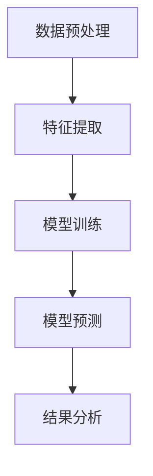
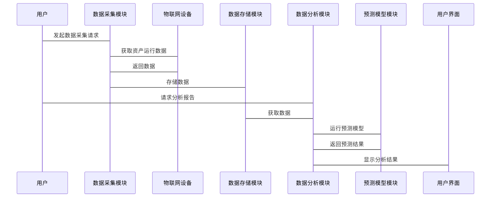

                 


# 构建智能企业资产管理平台：全生命周期成本优化与预测性维护

> 关键词：企业资产管理，预测性维护，成本优化，全生命周期管理，智能平台，机器学习

> 摘要：随着企业数字化转型的深入推进，智能企业资产管理平台成为提升企业运营效率和降低成本的关键工具。本文将详细介绍如何构建这样一个平台，涵盖从背景介绍到系统实现的全过程，包括预测性维护的算法原理和成本优化的数学模型，最终实现企业资产管理的智能化和高效化。

---

## 第一部分：智能企业资产管理平台概述

### 第1章：企业资产管理的背景与挑战

#### 1.1 企业资产管理的背景
企业资产管理（Enterprise Asset Management，EAM）是企业管理中的重要组成部分，涉及对企业资产的全生命周期管理，包括规划、采购、使用、维护和处置等环节。随着企业规模的不断扩大和技术的进步，传统的资产管理方式已难以满足现代企业的需求。

##### 1.1.1 传统资产管理的局限性
- **数据分散**：传统资产管理依赖于多个部门和系统，数据分散，难以整合和分析。
- **被动维护**：传统维护方式通常是基于固定的维护周期或故障发生后进行，缺乏预测性。
- **成本高昂**：由于缺乏预测和优化，企业在维护和管理上的成本较高。

##### 1.1.2 智能化资产管理的需求
随着物联网（IoT）、大数据和人工智能（AI）技术的发展，企业可以通过智能化的资产管理平台实现预测性维护、成本优化和高效决策。

##### 1.1.3 数字化转型对企业资产管理的影响
数字化转型推动企业从传统管理模式向智能化、数据驱动的管理模式转变，资产管理也不例外。通过智能化平台，企业可以实时监控资产状态，预测潜在问题，并优化资源分配。

#### 1.2 企业资产管理的核心概念与联系
企业资产管理是一个复杂的系统工程，涉及多个核心概念和模块。

##### 1.2.1 资产全生命周期管理
资产全生命周期管理（Asset Lifecycle Management）是指从资产的规划、采购、使用、维护到处置的全过程管理。通过智能化平台，企业可以实现对资产全生命周期的实时监控和优化。

##### 1.2.2 资产管理的边界与外延
- **边界**：资产管理的边界通常包括企业的核心资产，如设备、设施、 IT 设备等。
- **外延**：外延包括与资产相关的业务流程、人员、供应商和外部服务提供商。

##### 1.2.3 资产管理的核心要素与组成
资产全生命周期管理的核心要素包括：
- **数据采集**：通过传感器、物联网设备等采集资产运行数据。
- **数据分析**：利用大数据和人工智能技术对数据进行分析，提取有价值的信息。
- **预测性维护**：基于数据分析结果，预测资产潜在故障，提前进行维护。
- **成本优化**：通过分析资产使用和维护成本，优化资源配置，降低运营成本。

### 第2章：智能企业资产管理平台的核心概念与联系

#### 2.1 智能企业资产管理平台的定义与特点
智能企业资产管理平台（Intelligent Enterprise Asset Management Platform，IEAMP）是一种基于大数据、物联网和人工智能技术的智能化管理平台，旨在实现资产的全生命周期管理、预测性维护和成本优化。

##### 2.1.1 智能化资产管理的定义
智能化资产管理是指通过智能化技术（如物联网、大数据和人工智能）对资产进行实时监控、预测性维护和优化管理，以提高资产利用率和降低管理成本。

##### 2.1.2 平台的核心特点
- **实时监控**：通过物联网设备实时采集资产运行数据。
- **预测性维护**：基于机器学习算法预测资产潜在故障。
- **数据驱动决策**：利用数据分析结果优化资产管理和维护策略。

##### 2.1.3 智能化与传统资产管理的对比
| 对比维度 | 传统资产管理 | 智能化资产管理 |
|----------|---------------|----------------|
| 数据来源 | 离散数据，依赖人工记录 | 实时数据，物联网设备采集 |
| 维护策略 | 被动维护，基于固定周期 | 主动维护，基于预测模型 |
| 决策依据 | 历史数据，经验驱动 | 实时数据，数据驱动 |
| 成本 | 较高，缺乏优化 | 较低，优化资源配置 |

#### 2.2 核心概念之间的关系
##### 2.2.1 资产全生命周期管理与预测性维护的关系
资产全生命周期管理是预测性维护的基础。通过实时监控资产运行状态，预测性维护可以在资产出现问题前进行维护，从而延长资产寿命，降低维护成本。

##### 2.2.2 成本优化与预测性维护的协同作用
预测性维护通过减少突发故障和优化维护计划，降低维护成本。成本优化则通过分析资产使用和维护数据，进一步优化资源配置，降低整体成本。

##### 2.2.3 数据驱动的决策支持
智能化资产管理平台通过数据分析提供决策支持，帮助企业做出更明智的资产管理决策。

---

## 第二部分：预测性维护的算法原理

### 第3章：预测性维护的算法原理

#### 3.1 预测性维护的基本原理
预测性维护（Predictive Maintenance）是通过分析资产运行数据，预测潜在故障，提前进行维护的一种方法。

##### 3.1.1 预测性维护的定义
预测性维护是基于实时数据和历史数据，利用机器学习算法预测资产的健康状态和潜在故障。

##### 3.1.2 常见的预测算法
- **回归分析**：用于预测资产的剩余寿命。
- **分类算法**：用于分类资产的健康状态。
- **时间序列分析**：用于预测资产的未来状态。

##### 3.1.3 数据预处理与特征提取
- **数据预处理**：清洗数据，处理缺失值和异常值。
- **特征提取**：从原始数据中提取有用的特征，如设备振动、温度、压力等。

#### 3.2 基于机器学习的预测模型
##### 3.2.1 算法选择与实现
常用的机器学习算法包括支持向量机（SVM）、随机森林（Random Forest）和XGBoost等。

##### 3.2.2 算法流程图（Mermaid）


##### 3.2.3 数学模型与公式
以回归分析为例，模型可以表示为：
$$ y = \beta_0 + \beta_1x_1 + \beta_2x_2 + \epsilon $$
其中，$y$ 是目标变量（如资产寿命），$x_1, x_2$ 是特征变量，$\epsilon$ 是误差项。

---

## 第三部分：成本优化的数学模型与算法

### 第4章：成本优化的数学模型与算法

#### 4.1 成本优化的基本原理
成本优化（Cost Optimization）是通过分析资产使用和维护数据，优化资源配置，降低整体成本。

##### 4.1.1 成本优化的定义
成本优化是通过数据分析和优化算法，找到最优的资源配置方案，以最小化成本。

##### 4.1.2 成本优化的目标
- 降低维护成本
- 提高资产利用率
- 优化库存管理

#### 4.2 基于线性回归的成本优化模型
##### 4.2.1 线性回归模型
$$ \text{总成本} = a \cdot \text{资源消耗} + b $$
其中，$a$ 是斜率，$b$ 是截距。

##### 4.2.2 模型实现与优化
通过最小二乘法（Least Squares）优化模型参数：
$$ \text{最小化} \sum_{i=1}^{n} (y_i - (a x_i + b))^2 $$

##### 4.2.3 案例分析与结果解读
通过分析历史维护数据，建立成本优化模型，预测未来的维护成本，并优化维护计划。

---

## 第四部分：系统分析与架构设计方案

### 第5章：系统分析与架构设计方案

#### 5.1 项目背景
随着企业规模的扩大，资产管理的复杂性增加，传统的资产管理方式已难以满足需求。通过构建智能企业资产管理平台，企业可以实现资产的全生命周期管理、预测性维护和成本优化。

#### 5.2 系统功能设计（领域模型mermaid类图）
```mermaid
classDiagram
    class 资产管理平台 {
        +资产信息
        +维护计划
        +成本数据
        +预测模型
        +决策支持
    }
    class 用户界面 {
        +实时监控
        +维护管理
        +成本分析
        +预测报告
    }
    资产管理平台 <--| 用户界面
```

#### 5.3 系统架构设计（mermaid架构图）


#### 5.4 系统接口设计
- **数据采集接口**：与物联网设备连接，采集资产运行数据。
- **数据分析接口**：与机器学习模型连接，进行数据处理和分析。
- **用户界面接口**：提供给用户实时监控、维护管理和成本分析等功能。

#### 5.5 系统交互mermaid序列图


---

## 第五部分：项目实战

### 第6章：项目实战

#### 6.1 环境安装
- **Python环境**：安装Python 3.8及以上版本。
- **机器学习库**：安装scikit-learn、xgboost、pandas等。
- **可视化工具**：安装Matplotlib、Seaborn等。

#### 6.2 系统核心实现源代码
##### 6.2.1 数据预处理代码
```python
import pandas as pd
import numpy as np

# 读取数据
data = pd.read_csv('asset_data.csv')

# 处理缺失值
data = data.dropna()

# 处理异常值
data = data[~(data['vibration'].std() > 3)]
```

##### 6.2.2 预测模型实现代码
```python
from sklearn.ensemble import RandomForestRegressor
from sklearn.metrics import mean_squared_error

# 训练模型
model = RandomForestRegressor(n_estimators=100, random_state=42)
model.fit(X_train, y_train)

# 预测结果
y_pred = model.predict(X_test)

# 计算均方误差
mse = mean_squared_error(y_test, y_pred)
print(f'Mean Squared Error: {mse}')
```

#### 6.3 代码应用解读与分析
通过代码实现预测性维护和成本优化模型，分析资产运行数据，预测潜在故障，并优化维护计划。

#### 6.4 案例分析与详细讲解
以某企业设备为例，分析如何通过平台实现预测性维护和成本优化，降低维护成本。

#### 6.5 项目小结
通过项目实战，验证了智能企业资产管理平台的有效性和实用性，为企业资产管理提供了新的思路和方法。

---

## 第六部分：最佳实践与未来展望

### 第7章：最佳实践与未来展望

#### 7.1 最佳实践 tips
- 数据是关键，确保数据的准确性和完整性。
- 结合企业的实际情况，选择合适的算法和模型。
- 定期更新模型，确保预测结果的准确性。

#### 7.2 小结
智能企业资产管理平台通过预测性维护和成本优化，帮助企业实现资产的全生命周期管理，降低运营成本，提高资产利用率。

#### 7.3 注意事项
- 数据隐私和安全问题需要重视。
- 模型需要定期更新和优化。
- 人员培训和团队协作是成功实施的关键。

#### 7.4 拓展阅读
- 《机器学习实战》
- 《大数据分析与应用》
- 《企业信息化管理》

---

## 结语
构建智能企业资产管理平台是一个复杂但值得投入的过程。通过智能化技术的应用，企业可以实现资产的全生命周期管理、预测性维护和成本优化，从而提高运营效率和降低成本。未来，随着技术的不断发展，智能企业资产管理平台将变得更加智能和高效，为企业创造更大的价值。

---

**作者：AI天才研究院/AI Genius Institute & 禅与计算机程序设计艺术 /Zen And The Art of Computer Programming**

