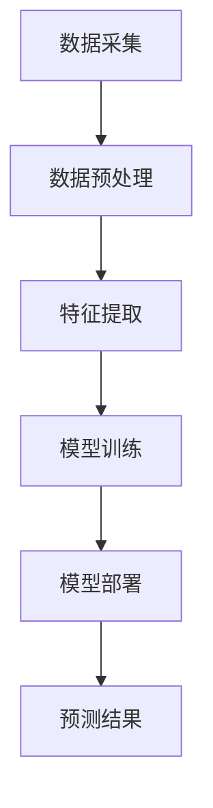
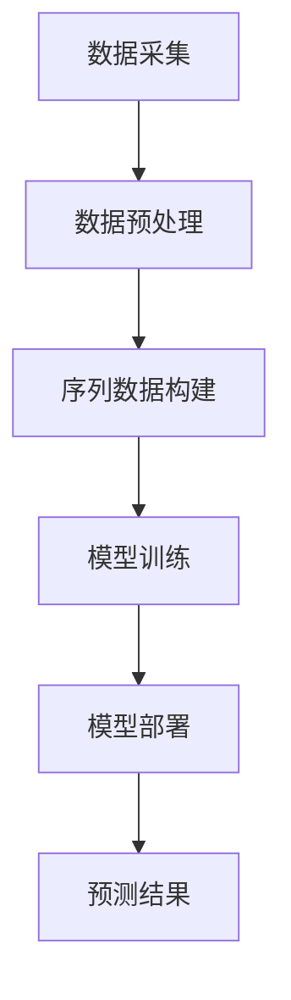
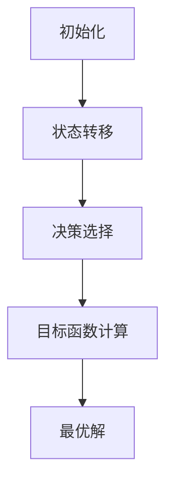
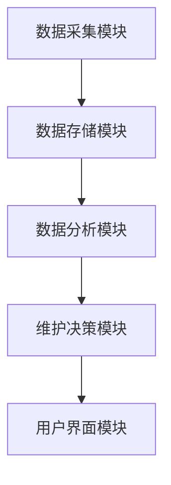
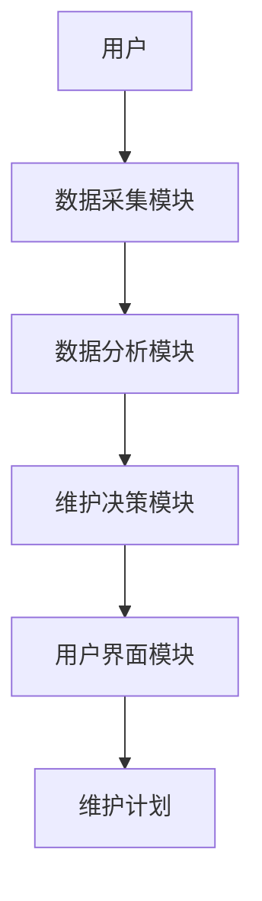

                 


# 构建智能企业资产管理平台：预测性维护与资源优化

> 关键词：智能资产管理平台，预测性维护，资源优化，机器学习，深度学习，系统架构

> 摘要：随着企业数字化转型的深入推进，资产管理已成为企业运营的核心环节之一。本文将详细探讨如何构建智能企业资产管理平台，重点分析预测性维护与资源优化的核心概念、算法原理、系统架构及项目实现。通过理论与实践相结合的方式，为读者提供一套完整的解决方案，帮助企业实现高效、智能的资产管理。

---

## 第1章: 背景介绍

### 1.1 问题背景

#### 1.1.1 传统资产管理的痛点
企业在资产管理过程中面临以下痛点：
- **高成本**：传统维护方式可能导致高昂的维护成本，尤其是在设备故障后进行紧急维修。
- **低效率**：缺乏数据支持的维护计划可能导致资源浪费和维护周期延长。
- **低可靠性**：无法准确预测设备故障，可能导致意外停机和生产损失。

#### 1.1.2 数字化转型对企业资产管理的需求
随着工业4.0和物联网技术的发展，企业需要通过数字化手段提升资产管理效率。预测性维护和资源优化成为实现高效资产管理的关键技术。

#### 1.1.3 预测性维护与资源优化的必要性
通过预测性维护，企业可以在设备故障前采取预防性措施，减少停机时间。资源优化则帮助企业合理分配维护资源，降低运营成本。

### 1.2 问题描述

#### 1.2.1 资产管理的核心问题
资产管理的核心问题包括：
- 如何高效采集和处理设备数据。
- 如何准确预测设备故障并制定最优维护计划。
- 如何优化资源分配，提高维护效率。

#### 1.2.2 资产全生命周期管理的挑战
资产全生命周期管理涉及设备的采购、使用、维护和报废等阶段。预测性维护和资源优化需要覆盖设备生命周期的各个环节，确保每个阶段的高效管理。

#### 1.2.3 预测性维护与资源优化的目标
目标是通过数据分析和优化算法，实现设备故障的早期预警，降低维护成本，提高设备利用率和企业生产效率。

### 1.3 问题解决

#### 1.3.1 预测性维护的实现路径
- 数据采集：通过传感器实时采集设备运行数据。
- 数据分析：利用机器学习模型对数据进行分析，预测设备故障。
- 维护决策：基于预测结果制定维护计划。

#### 1.3.2 资源优化的策略选择
- 资源分配：通过优化算法合理分配维护人员、备件等资源。
- 维护计划：优化维护时间表，避免资源浪费。

#### 1.3.3 技术与管理的结合
- 技术层面：采用先进的数据分析和优化算法。
- 管理层面：制定合理的维护策略和资源分配计划。

### 1.4 边界与外延

#### 1.4.1 预测性维护的边界
- 数据采集范围：仅限于设备运行数据。
- 预测范围：仅针对设备故障预测。

#### 1.4.2 资源优化的适用范围
- 维护资源：包括人员、备件、工具等。
- 维护计划：包括定期维护和应急维护。

#### 1.4.3 平台的扩展性与可维护性
- 扩展性：平台应支持新增设备和新算法的接入。
- 可维护性：系统架构设计应便于维护和升级。

### 1.5 概念结构与核心要素

#### 1.5.1 资产管理平台的组成
- 数据采集模块：负责采集设备数据。
- 数据分析模块：负责数据分析和故障预测。
- 维护决策模块：负责制定维护计划。
- 资源优化模块：负责优化维护资源分配。

#### 1.5.2 预测性维护的核心要素
- 数据采集：传感器数据的实时采集。
- 数据分析：机器学习模型的训练和部署。
- 维护决策：基于预测结果制定维护计划。

#### 1.5.3 资源优化的关键指标
- 维护成本：维护费用的降低。
- 维护效率：维护时间的缩短。
- 设备利用率：设备的高效运转。

### 1.6 本章小结
本章通过分析传统资产管理的痛点，提出了智能企业资产管理平台的建设目标和实现路径。预测性维护和资源优化是实现高效资产管理的关键技术，需要在数据采集、分析和决策制定等方面进行全面考虑。

---

## 第2章: 预测性维护的核心概念

### 2.1 预测性维护的原理

#### 2.1.1 预测性维护的定义
预测性维护是一种基于设备运行数据的分析，提前预测设备故障并进行维护的策略。

#### 2.1.2 数据采集与分析
- 数据采集：通过传感器实时采集设备运行数据，如温度、振动、压力等。
- 数据分析：利用机器学习算法对数据进行分析，识别设备的异常状态。

#### 2.1.3 故障预测模型
- 模型训练：基于历史数据训练故障预测模型。
- 模型部署：将模型部署到生产环境，实时预测设备故障。

### 2.2 预测性维护的方法

#### 2.2.1 基于统计分析的方法
- 统计分析：通过分析设备运行数据的统计特征，识别异常情况。
- 示例：均值、方差等统计指标的计算。

#### 2.2.2 基于机器学习的方法
- 机器学习模型：如支持向量机（SVM）、随机森林（Random Forest）等。
- 示例：利用历史故障数据训练分类模型，预测设备故障。

#### 2.2.3 基于深度学习的方法
- 深度学习模型：如循环神经网络（RNN）、长短期记忆网络（LSTM）等。
- 示例：利用时间序列数据训练模型，预测设备故障时间。

### 2.3 预测性维护与传统维护的对比

#### 2.3.1 维护策略的差异
- 传统维护：基于定期检查或故障后维护。
- 预测性维护：基于数据分析和预测结果进行维护。

#### 2.3.2 维护成本的对比
- 传统维护：可能导致高维护成本和意外停机。
- 预测性维护：降低维护成本，减少停机时间。

#### 2.3.3 维护效果的评估
- 效果指标：故障率、维护成本、设备利用率等。

### 2.4 核心概念原理

#### 2.4.1 数据采集与预处理
- 数据采集：通过传感器实时采集设备运行数据。
- 数据预处理：清洗数据、归一化处理等。

#### 2.4.2 故障预测模型的构建
- 数据特征提取：提取设备运行数据的特征。
- 模型训练：基于特征训练故障预测模型。

#### 2.4.3 维护决策的优化
- 预测结果分析：基于模型预测结果制定维护计划。
- 维护策略优化：根据实际情况调整维护计划。

### 2.5 概念属性特征对比表格

| 特性 | 预测性维护 | 传统维护 |
|------|------------|----------|
| 数据来源 | 实时传感器数据 | 定期检查或故障后数据 |
| 方法 | 基于数据分析和机器学习 | 基于经验或定期检查 |
| 成本 | 降低维护成本 | 可能较高 |
| 效率 | 提高维护效率 | 可能较低 |
| 准确性 | 高 | 低 |

---

## 第3章: 预测性维护的算法原理

### 3.1 基于机器学习的故障预测模型

#### 3.1.1 算法流程图


#### 3.1.2 算法实现
- 数据预处理：清洗数据，处理缺失值和异常值。
- 特征提取：提取设备运行数据的关键特征。
- 模型训练：使用随机森林或支持向量机等算法训练分类模型。
- 模型部署：将训练好的模型部署到生产环境，实时预测设备故障。

#### 3.1.3 代码实现
```python
import pandas as pd
from sklearn.ensemble import RandomForestClassifier
from sklearn.model_selection import train_test_split

# 数据加载
data = pd.read_csv('equipment_data.csv')

# 数据预处理
data.dropna(inplace=True)
data['label'] = data['status'].apply(lambda x: 1 if x == '故障' else 0)

# 特征提取
features = data.drop('label', axis=1)
target = data['label']

# 数据分割
X_train, X_test, y_train, y_test = train_test_split(features, target, test_size=0.2)

# 模型训练
model = RandomForestClassifier(n_estimators=100)
model.fit(X_train, y_train)

# 模型评估
print(model.score(X_test, y_test))
```

#### 3.1.4 算法优缺点
- 优点：预测准确性高，能够处理复杂的数据模式。
- 缺点：需要大量数据支持，模型训练时间较长。

### 3.2 基于深度学习的故障预测模型

#### 3.2.1 算法流程图


#### 3.2.2 算法实现
- 数据预处理：清洗数据，处理缺失值和异常值。
- 序列数据构建：将设备运行数据转化为时间序列数据。
- 模型训练：使用LSTM网络训练时间序列模型。
- 模型部署：将训练好的模型部署到生产环境，实时预测设备故障。

#### 3.2.3 代码实现
```python
import numpy as np
from tensorflow.keras.models import Sequential
from tensorflow.keras.layers import LSTM, Dense

# 数据加载
data = np.load('equipment_data.npy')

# 数据分割
train_data = data[:int(len(data)*0.8)]
test_data = data[int(len(data)*0.8):]

# 模型构建
model = Sequential()
model.add(LSTM(64, input_shape=(train_data.shape[1], 1)))
model.add(Dense(1, activation='sigmoid'))
model.compile(loss='binary_crossentropy', optimizer='adam', metrics=['accuracy'])

# 模型训练
model.fit(train_data, epochs=10, batch_size=32)

# 模型评估
print(model.predict(test_data))
```

---

## 第4章: 资源优化的数学模型与算法

### 4.1 资源优化的目标与约束

#### 4.1.1 资源分配问题
- 优化目标：最大化设备利用率，最小化维护成本。
- 约束条件：维护时间、维护人员数量、备件库存等。

### 4.2 线性规划模型

#### 4.2.1 数学模型
$$
\text{minimize} \quad c^T x \\
\text{subject to} \quad A x \leq b \\
$$
其中，$c$为成本向量，$x$为决策变量，$A$为约束矩阵，$b$为约束向量。

#### 4.2.2 求解方法
- 单纯形法：用于求解线性规划问题。
- 对偶规划：将问题转化为对偶问题求解。

### 4.3 动态规划算法

#### 4.3.1 算法流程图


#### 4.3.2 算法实现
- 状态定义：定义设备的状态和资源分配的状态。
- 状态转移：根据状态转移方程计算新的状态。
- 决策选择：选择最优的资源分配策略。

### 4.4 资源优化的数学模型与代码实现

#### 4.4.1 线性规划代码实现
```python
import numpy as np
from scipy.optimize import linprog

# 定义目标函数
c = np.array([1, 1])

# 定义约束条件
A = np.array([[1, 0], [0, 1]])
b = np.array([10, 20])

# 求解线性规划问题
result = linprog(c, A, b, bounds=(0, None), method='highs')

# 输出结果
print(result.x)
```

#### 4.4.2 动态规划代码实现
```python
def dynamic_planning():
    # 状态初始化
    states = [0, 1, 2, 3]
    # 状态转移
    transitions = {
        0: [1, 2],
        1: [2, 3],
        2: [3],
        3: []
    }
    # 决策选择
    decisions = {
        0: 'allocate',
        1: 'deallocate'
    }
    # 目标函数计算
    def calculate_cost(decision):
        return 1 if decision == 'allocate' else 0
    # 最优解
    optimal_decision = max(decisions.items(), key=lambda x: calculate_cost(x[1]))
    return optimal_decision

print(dynamic_planning())
```

---

## 第5章: 系统架构设计与实现

### 5.1 系统架构设计

#### 5.1.1 需求分析
- 数据采集：实时采集设备运行数据。
- 数据分析：对数据进行分析和预测。
- 维护决策：基于预测结果制定维护计划。

#### 5.1.2 功能设计
- 数据采集模块：负责采集设备运行数据。
- 数据分析模块：负责数据分析和故障预测。
- 维护决策模块：负责制定维护计划和资源优化。

#### 5.1.3 系统架构


#### 5.1.4 接口设计
- 数据接口：设备数据的输入接口。
- 维护计划接口：维护计划的输出接口。
- 用户界面：供用户查看和管理维护计划。

#### 5.1.5 交互设计


### 5.2 系统实现

#### 5.2.1 系统实现代码
```python
class AssetManagementSystem:
    def __init__(self):
        self.data_collector = DataCollector()
        self.data_analyzer = DataAnalyzer()
        self.maintenance_planner = MaintenancePlanner()
    
    def run(self):
        while True:
            data = self.data_collector.collect_data()
            self.data_analyzer.analyze_data(data)
            plan = self.maintenance_planner.plan_maintenance()
            print("Maintenance Plan:", plan)
```

---

## 第6章: 项目实战与优化

### 6.1 环境配置与安装

#### 6.1.1 环境配置
- 操作系统：Linux/Windows
- 开发工具：PyCharm/VS Code
- 依赖库：Python、TensorFlow、Scikit-learn

#### 6.1.2 数据准备
- 数据集下载：从公开数据集获取设备运行数据。
- 数据预处理：清洗数据，处理缺失值和异常值。

### 6.2 核心代码实现

#### 6.2.1 数据采集代码
```python
import serial

class DataCollector:
    def collect_data(self):
        ser = serial.Serial('COM3', 9600)
        data = ser.readline().decode()
        ser.close()
        return data
```

#### 6.2.2 数据分析代码
```python
import pandas as pd
from sklearn.ensemble import RandomForestClassifier

class DataAnalyzer:
    def analyze_data(self, data):
        df = pd.DataFrame(data)
        model = RandomForestClassifier()
        model.fit(df.drop('label', axis=1), df['label'])
        return model
```

#### 6.2.3 维护计划代码
```python
class MaintenancePlanner:
    def plan_maintenance(self, model):
        # 假设数据已预处理
        prediction = model.predict(test_data)
        return prediction
```

### 6.3 案例分析与优化

#### 6.3.1 案例分析
- 数据采集：采集设备运行数据。
- 数据分析：训练故障预测模型。
- 维护计划：基于预测结果制定维护计划。

#### 6.3.2 优化策略
- 模型优化：调整机器学习模型的参数，提高预测准确性。
- 资源优化：优化维护计划，减少维护成本。

### 6.4 项目总结

#### 6.4.1 项目成果
- 成功构建智能企业资产管理平台。
- 实现预测性维护和资源优化功能。

#### 6.4.2 经验与教训
- 数据质量对模型预测准确性的影响。
- 系统架构设计对系统性能的影响。

#### 6.4.3 拓展与展望
- 研究更先进的预测算法。
- 优化系统架构，提高系统性能。

---

## 第7章: 总结与展望

### 7.1 总结
本文详细介绍了智能企业资产管理平台的构建过程，重点分析了预测性维护与资源优化的核心概念、算法原理、系统架构及项目实现。通过理论与实践相结合的方式，为读者提供了一套完整的解决方案。

### 7.2 展望
未来，随着人工智能和物联网技术的不断发展，智能企业资产管理平台将更加智能化和高效化。研究者将致力于开发更先进的预测算法和优化策略，进一步提升资产管理的效率和效果。

---

## 作者：AI天才研究院 & 禅与计算机程序设计艺术

