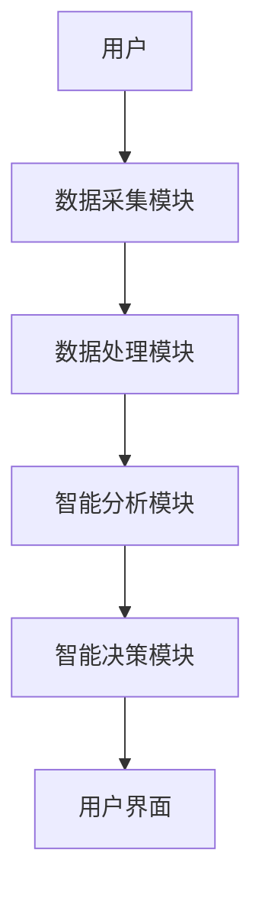

                 

# 构建智能企业资源规划(ERP)系统：AI的深度集成

## 关键词：企业资源规划（ERP）、人工智能（AI）、深度集成、智能系统、系统架构

## 摘要：  
随着人工智能技术的飞速发展，企业资源规划（ERP）系统正在经历一场深刻的变革。通过AI的深度集成，ERP系统能够实现更高效的业务流程管理、更精准的决策支持以及更智能化的用户体验。本文将详细探讨AI如何与ERP系统深度融合，从算法原理到系统架构设计，从项目实战到最佳实践，全面解析构建智能ERP系统的关键技术和实际应用。

---

# 第1章：企业资源规划（ERP）系统概述

## 1.1 ERP系统的基本概念

### 1.1.1 ERP系统的定义与特点

企业资源规划（ERP）系统是一种集成化的管理信息系统，旨在整合企业内部的人、财、物、产、供、销等各个核心业务模块，通过数据共享和流程协同，实现企业资源的高效管理和优化配置。ERP系统的特点包括：

1. **集成性**：将企业的各个业务模块整合到一个系统中，打破信息孤岛。
2. **实时性**：提供实时数据更新和业务处理能力。
3. **灵活性**：能够根据企业需求进行定制化配置。
4. **扩展性**：支持企业业务的扩展和多样化需求。

### 1.1.2 ERP系统的核心模块与功能

ERP系统的核心模块通常包括：

- **财务管理**：包括会计核算、财务报表、预算管理等功能。
- **采购管理**：从供应商采购原材料、零部件等，管理采购订单和供应商信息。
- **生产管理**：规划生产计划、监控生产过程、管理库存等。
- **销售管理**：管理客户订单、销售合同、客户关系等。
- **库存管理**：实时监控库存状况，优化库存周转率。
- **人力资源管理**：管理员工信息、考勤、薪资等。

### 1.1.3 ERP系统的发展历程

ERP系统的发展经历了多个阶段：

1. **传统ERP阶段**：以功能模块化和数据共享为核心，强调流程管理和数据整合。
2. **智能化ERP阶段**：引入人工智能技术，实现预测分析、智能推荐和自动化决策。
3. **云端ERP阶段**：基于云计算技术，提供弹性扩展和按需付费的模式。
4. **AI深度集成ERP阶段**：AI技术与ERP系统深度融合，实现智能化、自动化和个性化管理。

## 1.2 人工智能（AI）技术概述

### 1.2.1 AI技术的基本概念与特点

人工智能（AI）是指通过计算机模拟人类智能的技术，包括学习、推理、自我改进等能力。AI技术的特点包括：

1. **数据驱动**：依赖大量数据进行训练和优化。
2. **自动化**：能够自动完成特定任务，减少人工干预。
3. **适应性**：能够根据数据变化进行自适应调整。
4. **智能化**：能够进行复杂的推理和决策。

### 1.2.2 AI技术的核心算法与应用场景

AI技术的核心算法包括：

- **机器学习**：通过数据训练模型，实现分类、回归、聚类等任务。
- **深度学习**：基于人工神经网络，实现图像识别、自然语言处理等任务。
- **自然语言处理（NLP）**：理解和生成人类语言，应用于智能客服、文本分析等场景。

### 1.2.3 AI技术在企业中的潜在价值

AI技术在企业中的潜在价值包括：

- **提高效率**：通过自动化流程和智能决策减少人工干预。
- **优化成本**：通过预测分析和资源优化降低企业运营成本。
- **提升用户体验**：通过个性化推荐和智能交互提供更好的用户体验。
- **增强竞争力**：通过数据驱动的决策和创新提升企业市场竞争力。

## 1.3 ERP系统与AI技术的结合背景

### 1.3.1 企业数字化转型的需求

随着全球经济的快速发展和市场竞争的加剧，企业需要更加高效和灵活的管理系统来应对复杂的业务环境。数字化转型成为企业提升竞争力的重要手段，而ERP系统作为企业信息化的核心工具，成为数字化转型的关键支撑。

### 1.3.2 AI技术对企业效率提升的作用

AI技术能够通过数据挖掘、预测分析和自动化流程帮助企业实现更高效的业务管理。例如，通过AI技术可以实现销售预测、库存优化、生产调度等，显著提升企业运营效率。

### 1.3.3 智能ERP系统的概念与目标

智能ERP系统是指将AI技术与传统ERP系统深度融合，通过智能化的算法和数据驱动的决策，实现企业资源的最优配置和业务流程的智能化管理。智能ERP系统的目标是为企业提供更加智能、高效和个性化的管理解决方案。

## 1.4 本章小结

本章从ERP系统的基本概念和发展历程出发，介绍了AI技术的核心算法和应用场景，并分析了ERP系统与AI技术结合的背景和价值。通过本章的介绍，读者可以了解智能ERP系统的基本概念和构建智能ERP系统的必要性。

---

# 第2章：智能ERP系统的核心概念与技术

## 2.1 智能ERP系统的核心概念

### 2.1.1 智能ERP系统的组成与结构

智能ERP系统的组成包括：

- **数据层**：包括企业内部数据、外部数据源和AI模型所需的数据。
- **算法层**：包括机器学习模型、深度学习模型和自然语言处理模型。
- **应用层**：包括智能预测、智能推荐、智能决策等应用模块。

### 2.1.2 智能ERP系统的核心模块与功能

智能ERP系统的核心模块包括：

- **智能预测模块**：基于历史数据和市场趋势，预测销售、库存和生产需求。
- **智能推荐模块**：根据客户需求和历史行为，推荐个性化的产品和服务。
- **智能决策模块**：基于实时数据和预测结果，优化资源配置和业务流程。

### 2.1.3 智能ERP系统的性能指标与评估方法

智能ERP系统的性能指标包括：

- **预测准确率**：模型预测结果与实际结果的接近程度。
- **响应时间**：系统处理请求的时间。
- **资源利用率**：系统对资源的使用效率。
- **用户满意度**：用户对系统功能和性能的满意度。

## 2.2 AI在ERP系统中的应用场景

### 2.2.1 智能预测与决策

智能预测与决策是AI在ERP系统中的重要应用，主要应用于销售预测、库存优化和生产调度。例如，通过机器学习模型预测销售需求，优化库存管理和生产计划。

### 2.2.2 智能流程优化

智能流程优化是通过AI技术对业务流程进行优化，减少冗余步骤，提高流程效率。例如，通过自然语言处理技术优化客户服务流程，提高客户满意度。

### 2.2.3 智能数据处理与分析

智能数据处理与分析是通过AI技术对海量数据进行处理和分析，提取有价值的信息，支持企业的决策。例如，通过深度学习模型分析市场趋势，制定精准的营销策略。

## 2.3 智能ERP系统的性能指标与评估方法

### 2.3.1 系统响应时间

系统响应时间是指系统处理用户请求所需的时间。对于智能ERP系统来说，响应时间越短，用户体验越好。

### 2.3.2 数据处理能力

数据处理能力是指系统对海量数据的处理和分析能力。智能ERP系统需要处理来自多个业务模块的大量数据，因此需要高效的算法和优化的架构。

### 2.3.3 智能算法的准确率与效率

智能算法的准确率是指算法预测结果与实际结果的接近程度。准确率越高，系统的决策越精准。算法的效率是指系统处理数据的速度，效率越高，系统的响应时间越短。

## 2.4 本章小结

本章详细介绍了智能ERP系统的核心概念和AI在ERP系统中的应用场景，包括智能预测与决策、智能流程优化和智能数据处理与分析。通过本章的介绍，读者可以了解智能ERP系统的核心技术和实现方法。

---

# 第3章：智能ERP系统的算法原理与数学模型

## 3.1 常见AI算法简介

### 3.1.1 机器学习算法

机器学习算法包括监督学习、无监督学习和半监督学习。监督学习通过标签数据进行训练，无监督学习通过无标签数据进行训练，半监督学习结合两者。常见的机器学习算法包括线性回归、支持向量机（SVM）、随机森林等。

### 3.1.2 深度学习算法

深度学习算法基于人工神经网络，通过多层神经网络结构进行特征提取和模型训练。常见的深度学习算法包括卷积神经网络（CNN）、循环神经网络（RNN）、长短期记忆网络（LSTM）等。

### 3.1.3 自然语言处理算法

自然语言处理算法包括分词、句法分析、实体识别、情感分析等。常见的NLP算法包括词袋模型（BOW）、TF-IDF、Word2Vec等。

## 3.2 基于AI的ERP预测模型

### 3.2.1 线性回归模型

线性回归模型是一种简单的机器学习模型，用于预测连续型变量。其数学公式为：

$$ y = \beta_0 + \beta_1x + \epsilon $$

其中，$y$是目标变量，$\beta_0$是截距，$\beta_1$是回归系数，$x$是自变量，$\epsilon$是误差项。

### 3.2.2 支持向量机（SVM）模型

支持向量机（SVM）是一种监督学习算法，用于分类和回归问题。其目标是找到一个超平面，使得正负样本被正确分类。SVM的数学公式为：

$$ \text{目标函数} = \sum_{i=1}^n \xi_i + \frac{1}{2} \sum_{i=1}^n \alpha_i^2 $$

其中，$\xi_i$是松弛变量，$\alpha_i$是拉格朗日乘子。

### 3.2.3 随机森林模型

随机森林模型是一种集成学习算法，通过构建多个决策树并进行投票或平均，提高模型的准确率和泛化能力。随机森林的数学公式为：

$$ y = \text{median}(\{f_i(x)\}) $$

其中，$f_i(x)$是第$i$棵决策树的输出，$\text{median}$是中位数。

## 3.3 算法实现的数学模型

### 3.3.1 线性回归的数学公式

线性回归的数学公式为：

$$ y = \beta_0 + \beta_1x + \epsilon $$

其中，$\beta_0$和$\beta_1$是需要通过训练数据估计的参数，$x$是输入变量，$y$是输出变量，$\epsilon$是误差项。

### 3.3.2 支持向量机的数学公式

支持向量机的数学公式为：

$$ \text{目标函数} = \sum_{i=1}^n \xi_i + \frac{1}{2} \sum_{i=1}^n \alpha_i^2 $$

其中，$\xi_i$是松弛变量，$\alpha_i$是拉格朗日乘子。

### 3.3.3 随机森林的实现原理

随机森林的实现原理是通过构建多个决策树，并对每个决策树进行投票或平均，得到最终的预测结果。随机森林的数学公式为：

$$ y = \text{median}(\{f_i(x)\}) $$

其中，$f_i(x)$是第$i$棵决策树的输出，$\text{median}$是中位数。

## 3.4 本章小结

本章详细介绍了常见AI算法的原理和数学模型，包括线性回归、支持向量机和随机森林等。通过这些算法，智能ERP系统能够实现智能预测、智能推荐和智能决策等功能。

---

# 第4章：智能ERP系统的系统架构与设计

## 4.1 系统模块划分

### 4.1.1 数据采集模块

数据采集模块负责从企业内部和外部获取数据，包括订单数据、库存数据、销售数据等。数据采集模块通常通过API接口或数据库连接获取数据。

### 4.1.2 数据处理模块

数据处理模块负责对采集到的数据进行清洗、转换和预处理，确保数据的准确性和一致性。数据处理模块通常包括数据清洗、数据转换、数据归约等步骤。

### 4.1.3 智能分析模块

智能分析模块负责对处理后的数据进行分析和建模，生成预测结果和决策建议。智能分析模块通常包括特征提取、模型训练、模型预测等步骤。

## 4.2 系统架构图

以下是一个智能ERP系统的系统架构图：

其中，用户通过用户界面与系统交互，数据采集模块负责采集数据，数据处理模块负责处理数据，智能分析模块负责分析数据，智能决策模块负责生成决策建议。

## 4.3 系统架构设计

### 4.3.1 数据流与业务流程

数据流是指数据在系统中的流动过程，业务流程是指企业的业务流程在系统中的实现。智能ERP系统的数据流和业务流程需要紧密配合，确保数据的准确性和业务的高效性。

### 4.3.2 智能模块与传统模块的结合

智能ERP系统需要将智能模块与传统ERP模块相结合，例如将智能预测模块与销售模块相结合，实现销售预测和库存优化。

### 4.3.3 系统的可扩展性与灵活性

智能ERP系统需要具备良好的可扩展性和灵活性，能够根据企业的业务需求进行定制化配置和功能扩展。

## 4.4 本章小结

本章详细介绍了智能ERP系统的系统模块划分和系统架构设计，包括数据采集模块、数据处理模块、智能分析模块等。通过本章的介绍，读者可以了解智能ERP系统的整体架构和实现方法。

---

# 第5章：智能ERP系统的项目实战

## 5.1 项目背景与目标

### 5.1.1 项目背景

本项目旨在通过AI技术与ERP系统的深度集成，实现企业资源的智能化管理，提高企业的运营效率和市场竞争力。

### 5.1.2 项目目标

项目目标包括：

- 实现销售预测功能，优化库存管理和生产计划。
- 实现智能推荐功能，提升客户满意度和销售额。
- 实现智能决策功能，优化资源配置和业务流程。

## 5.2 项目环境与工具

### 5.2.1 开发环境

开发环境包括：

- 操作系统：Linux或Windows。
- 开发工具：PyCharm、Jupyter Notebook等。
- 数据库：MySQL、MongoDB等。

### 5.2.2 AI框架与工具

AI框架与工具包括：

- 机器学习框架：Scikit-learn、XGBoost等。
- 深度学习框架：TensorFlow、Keras等。
- 自然语言处理工具：spaCy、NLTK等。

## 5.3 项目核心实现

### 5.3.1 数据采集与预处理

数据采集与预处理是项目的核心步骤，包括数据清洗、数据转换和数据归约。例如，通过清洗数据去除重复数据和缺失值，通过转换数据将文本数据转换为数值数据，通过归约数据降低数据维度。

### 5.3.2 智能算法实现

智能算法实现是项目的核心部分，包括特征提取、模型训练和模型预测。例如，通过特征提取提取销售数据的关键特征，通过模型训练训练机器学习模型，通过模型预测生成销售预测结果。

### 5.3.3 系统集成与测试

系统集成与测试是项目的重要步骤，包括模块集成、功能测试和性能测试。例如，通过模块集成将智能预测模块与销售模块集成，通过功能测试测试系统的功能是否正常，通过性能测试测试系统的响应时间和吞吐量。

## 5.4 项目小结

本章详细介绍了智能ERP系统的项目实战，包括项目背景与目标、项目环境与工具、项目核心实现等。通过本章的介绍，读者可以了解智能ERP系统在实际项目中的实现过程和方法。

---

# 第6章：智能ERP系统的最佳实践与小结

## 6.1 最佳实践

### 6.1.1 数据质量管理

数据质量管理是智能ERP系统成功的关键，需要确保数据的准确性和完整性。建议企业定期进行数据清洗和数据验证，确保数据的质量。

### 6.1.2 模型优化与调参

模型优化与调参是提高模型准确率和效率的重要步骤，建议企业通过交叉验证和网格搜索等方法进行模型优化。

### 6.1.3 系统安全与隐私保护

系统安全与隐私保护是智能ERP系统的重要组成部分，建议企业在系统设计和实现过程中注重数据安全和用户隐私保护。

## 6.2 项目总结与展望

### 6.2.1 项目总结

本项目通过AI技术与ERP系统的深度集成，实现了企业资源的智能化管理，提高了企业的运营效率和市场竞争力。项目的核心成果包括智能预测模块、智能推荐模块和智能决策模块的实现。

### 6.2.2 项目展望

未来，随着AI技术的不断发展，智能ERP系统将更加智能化和个性化。例如，通过引入强化学习算法，实现更加复杂的决策和优化；通过引入边缘计算技术，实现更加实时和高效的业务处理。

## 6.3 本章小结

本章总结了智能ERP系统的最佳实践，包括数据质量管理、模型优化与调参和系统安全与隐私保护等。同时，对未来智能ERP系统的发展进行了展望，提出了进一步的研究方向和技术挑战。

---

# 结语

智能ERP系统的构建是一个复杂而富有挑战性的任务，需要结合ERP系统的业务需求和AI技术的特点，通过深度集成和协同工作，实现企业的智能化管理。本文从ERP系统的基本概念到AI技术的应用，从算法原理到系统架构设计，从项目实战到最佳实践，全面解析了构建智能ERP系统的关键技术和实现方法。希望本文能够为企业的数字化转型和智能化管理提供有益的参考和指导。

---

# 作者：AI天才研究院/AI Genius Institute & 禅与计算机程序设计艺术 /Zen And The Art of Computer Programming

---

**本文为AI天才研究院原创文章，转载请注明出处。**

