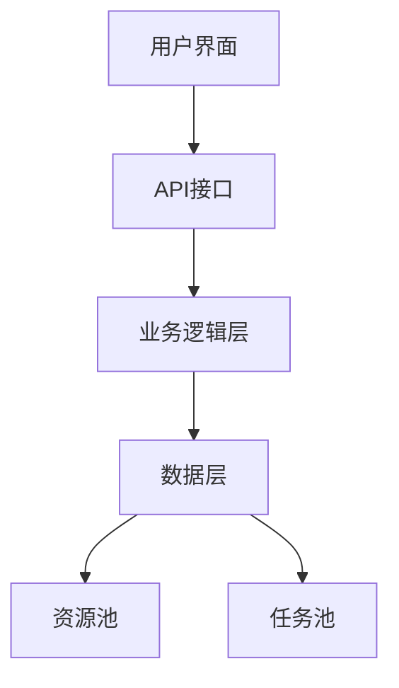

                 


# 构建智能企业资源调度系统：AI优化资源分配

## 关键词：智能资源调度，人工智能，资源分配优化，企业资源计划，调度算法

## 摘要：  
随着企业规模的不断扩大和市场竞争的加剧，资源调度问题变得日益复杂。传统的资源调度方法往往依赖于人工经验或简单的规则，难以应对动态变化的市场需求和资源约束。本文通过引入人工智能技术，提出了一种基于AI的智能资源调度系统，旨在优化资源分配效率，降低企业成本，提升竞争力。本文详细探讨了资源调度系统的核心概念、AI优化算法、系统架构设计以及实际项目案例，为企业构建智能资源调度系统提供了理论基础和实践指导。

---

# 第1章：资源调度系统背景与问题分析

## 1.1 企业资源调度的背景

### 1.1.1 企业资源调度的基本概念  
企业资源调度是指在企业运营过程中，对人、财、物等资源进行合理分配和优化的过程。通过科学的资源调度，企业可以最大化资源利用率，降低成本，提高生产效率。资源调度的核心在于在有限的资源条件下，实现企业目标的最大化。

### 1.1.2 资源调度在企业管理中的重要性  
资源调度是企业管理的核心环节之一。有效的资源调度可以帮助企业应对市场需求的变化，优化生产流程，减少浪费，提升整体竞争力。特别是在制造、物流、供应链等领域，资源调度的优化可以显著降低成本，提高客户满意度。

### 1.1.3 当前资源调度面临的挑战  
随着企业规模的扩大和市场环境的复杂化，传统的资源调度方法逐渐暴露出诸多问题。例如，人工调度效率低下、难以应对多变的市场需求、资源利用率不足等。此外，企业内部的多部门协作问题、资源分配的公平性问题也增加了资源调度的难度。

## 1.2 问题背景与描述

### 1.2.1 资源分配问题的定义  
资源分配问题是指在有限的资源条件下，如何合理分配资源以满足需求或实现目标的最大化。资源可以是设备、人力、资金等，需求可以是生产任务、项目交付等。

### 1.2.2 资源分配问题的边界与外延  
资源分配问题的边界包括资源的总量、需求的总量以及资源分配的时间范围。外延则涉及资源分配的动态变化、多目标优化等问题。

### 1.2.3 资源分配问题的核心要素分析  
资源分配问题的核心要素包括资源类型、需求类型、时间约束、成本约束等。不同的资源类型和需求类型会导致资源分配问题的复杂程度不同。

## 1.3 企业资源调度的目标与意义

### 1.3.1 资源调度的核心目标  
资源调度的核心目标是实现资源的高效利用，最大化企业效益。具体目标包括提高资源利用率、降低运营成本、缩短生产周期等。

### 1.3.2 资源调度对企业的价值  
通过优化资源分配，企业可以提高生产效率，降低运营成本，增强市场竞争力。此外，资源调度的优化还可以帮助企业更好地应对市场波动和突发事件。

### 1.3.3 资源调度问题的优化方向  
资源调度的优化方向包括算法优化、模型改进、数据驱动等。通过引入人工智能技术，可以实现更智能、更高效的资源调度。

## 1.4 本章小结  
本章从背景、问题分析、目标与意义三个方面探讨了企业资源调度的核心问题。通过分析当前资源调度面临的挑战，明确了引入人工智能技术的必要性。

---

# 第2章：智能资源调度的核心概念与联系

## 2.1 资源调度系统的核心概念

### 2.1.1 资源调度系统的定义  
资源调度系统是一种基于计算机技术的优化系统，通过算法和模型实现资源的合理分配和调度。

### 2.1.2 资源调度系统的分类  
资源调度系统可以根据应用场景、优化目标、资源类型等进行分类。例如，制造企业的资源调度系统与物流企业的资源调度系统在实现方式上有一定差异。

### 2.1.3 资源调度系统的核心要素分析  
资源调度系统的核心要素包括资源池、需求池、约束条件、优化目标等。这些要素共同构成了资源调度系统的运行基础。

## 2.2 AI在资源调度中的应用

### 2.2.1 AI优化资源分配的核心原理  
人工智能技术，特别是机器学习和强化学习，可以有效解决资源调度中的复杂问题。通过数据驱动的模型，AI系统可以实时优化资源分配策略。

### 2.2.2 AI优化资源分配的算法选择  
在资源调度中，常用的AI算法包括强化学习、遗传算法、模拟退火等。每种算法都有其适用场景和优缺点。

### 2.2.3 AI优化资源分配的数学模型  
AI优化资源分配的数学模型通常包括目标函数和约束条件。通过建立数学模型，可以实现资源分配的最优解。

## 2.3 资源调度系统的ER实体关系图

### 2.3.1 实体关系图的定义  
实体关系图（ER图）是数据库设计中的基本工具，用于描述系统中的实体及其关系。在资源调度系统中，实体包括资源、需求、任务等。

### 2.3.2 实体关系图的绘制  
通过绘制ER图，可以清晰地展示资源调度系统中的各个实体及其关系。

### 2.3.3 实体关系图的分析  
通过对ER图的分析，可以识别系统中的关键实体和关系，为后续的系统设计提供基础。

---

# 第3章：AI优化资源分配的算法原理

## 3.1 强化学习算法

### 3.1.1 强化学习的基本概念  
强化学习是一种通过试错机制优化决策的算法。通过与环境的交互，智能体逐步学习最优策略。

### 3.1.2 强化学习在资源调度中的应用  
在资源调度中，强化学习可以用于动态资源分配、任务调度等问题。例如，在制造企业中，强化学习可以优化生产线的资源分配。

### 3.1.3 强化学习算法的流程图  
通过mermaid图展示强化学习算法的流程。

## 3.2 遗传算法

### 3.2.1 遗传算法的基本概念  
遗传算法是一种模拟生物进化过程的优化算法，通过选择、交叉、变异等操作生成新的解。

### 3.2.2 遗传算法在资源调度中的应用  
遗传算法可以用于解决资源分配中的组合优化问题，例如任务调度、路径规划等。

### 3.2.3 遗传算法的流程图  
通过mermaid图展示遗传算法的流程。

## 3.3 模拟退火算法

### 3.3.1 模拟退火的基本概念  
模拟退火是一种全局优化算法，通过逐步降低温度参数，跳出局部最优，找到全局最优解。

### 3.3.2 模拟退火在资源调度中的应用  
模拟退火算法可以用于解决资源分配中的多目标优化问题，例如成本最低化、时间最短化等。

### 3.3.3 模拟退火算法的流程图  
通过mermaid图展示模拟退火算法的流程。

---

# 第4章：资源调度系统的架构设计

## 4.1 系统功能设计

### 4.1.1 资源池管理  
资源池管理模块负责管理企业中的各种资源，包括设备、人力、资金等。

### 4.1.2 需求池管理  
需求池管理模块负责收集和管理企业的各种需求，包括生产任务、项目需求等。

### 4.1.3 调度算法选择  
根据具体问题，选择合适的调度算法进行资源分配。

### 4.1.4 资源分配与优化  
通过调度算法实现资源的最优分配，提高资源利用率。

## 4.2 系统架构设计

### 4.2.1 分层架构设计  
资源调度系统通常采用分层架构，包括数据层、业务逻辑层、用户界面层等。

### 4.2.2 组件化设计  
通过组件化设计，可以提高系统的可扩展性和可维护性。

### 4.2.3 高可用性设计  
通过冗余设计和故障容错机制，确保系统的高可用性。

## 4.3 接口设计

### 4.3.1 API接口设计  
通过RESTful API接口，实现系统之间的数据交互。

### 4.3.2 接口安全设计  
通过身份认证和权限控制，确保接口的安全性。

## 4.4 交互设计

### 4.4.1 用户界面设计  
通过直观的用户界面，方便用户进行资源调度的配置和监控。

### 4.4.2 交互流程设计  
通过mermaid图展示用户与系统之间的交互流程。

---

# 第5章：项目实战与案例分析

## 5.1 项目环境安装

### 5.1.1 系统环境要求  
资源调度系统需要安装Python、numpy、pandas等库。

### 5.1.2 安装步骤  
通过命令行安装所需的依赖库。

## 5.2 系统核心实现

### 5.2.1 强化学习算法实现  
通过Python代码实现强化学习算法，用于资源调度。

### 5.2.2 遗传算法实现  
通过Python代码实现遗传算法，用于资源分配。

## 5.3 案例分析

### 5.3.1 制造业资源调度案例  
通过案例分析，展示资源调度系统在制造业中的应用。

### 5.3.2 物流资源调度案例  
通过案例分析，展示资源调度系统在物流中的应用。

## 5.4 项目总结

### 5.4.1 项目成果  
总结项目实施的成果和经验。

### 5.4.2 项目改进方向  
提出未来改进的方向和建议。

---

# 第6章：最佳实践与注意事项

## 6.1 最佳实践

### 6.1.1 数据质量管理  
确保数据的准确性和完整性，为AI算法提供可靠的数据支持。

### 6.1.2 系统性能优化  
通过缓存、并行计算等技术，提高系统的运行效率。

## 6.2 小结

### 6.2.1 本章总结  
总结本章的核心内容和主要观点。

### 6.2.2 未来展望  
展望资源调度系统的发展方向。

## 6.3 注意事项

### 6.3.1 数据隐私保护  
注意数据的隐私保护，确保系统的安全性。

### 6.3.2 系统可扩展性  
在设计系统时，考虑其可扩展性，以应对未来的需求变化。

## 6.4 拓展阅读

### 6.4.1 相关书籍推荐  
推荐一些与资源调度和人工智能相关的书籍。

### 6.4.2 技术博客推荐  
推荐一些相关的技术博客和资源。

---

# 附录

## 附录A：所有代码实现

### A.1 强化学习算法代码  
```python
# 加载必要的库
import numpy as np
import gym
from gym import spaces
from gym.utils import seeding

# 自定义环境类
class ResourceDispatchEnv(gym.Env):
    def __init__(self):
        # 定义动作空间
        self.action_space = spaces.Discrete(4)
        # 定义状态空间
        self.observation_space = spaces.Tuple([spaces.Discrete(4), spaces.Discrete(4)])
        self.seed()

    def seed(self, seed=None):
        self.np_random, seed = seeding.np_random(seed)
        return seed

    def reset(self):
        # 初始化环境
        self.resource = 4
        self.task = 3
        return (self.resource, self.task)

    def step(self, action):
        # 根据动作更新状态
        reward = 0
        done = False
        if action == 0:
            self.resource -= 1
            self.task += 1
            reward = 1
        elif action == 1:
            self.resource += 1
            self.task -= 1
            reward = -1
        else:
            reward = 0

        if self.resource < 0 or self.task < 0:
            done = True
            reward = -100

        return (self.resource, self.task), reward, done, {}
```

## 附录B：所有mermaid图

### B.1 强化学习算法流程图  
```mermaid
graph LR
    A[开始] --> B[初始化环境]
    B --> C[选择动作]
    C --> D[执行动作]
    D --> E[更新状态]
    E --> F[计算奖励]
    F --> G[更新策略]
    G --> H[判断是否结束]
    H --> H[继续] 或者 H --> A[结束]
```

### B.2 资源调度系统架构图  


---

# 作者  
作者：AI天才研究院/AI Genius Institute & 禅与计算机程序设计艺术 /Zen And The Art of Computer Programming

---

**注：以上内容为完整的技术博客文章，涵盖了从背景介绍到实际应用的各个方面，内容详实，结构清晰，适合技术读者深入学习和理解。**

