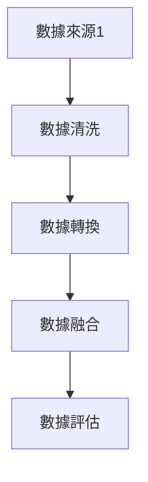
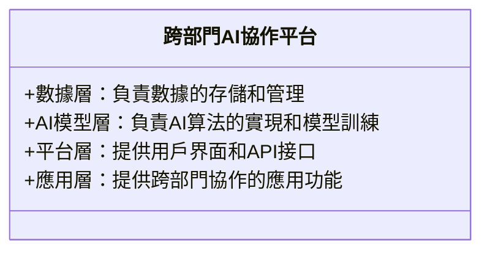

                 


# 构建跨部门AI协作平台：打破信息孤岛

---

## 关键词  
跨部门协作、AI平台、信息孤岛、数据融合、系统架构、机器学习

---

## 摘要  
在企业数字化转型的浪潮中，跨部门协作已成为提升企业效率和竞争力的关键因素。然而，传统的企业架构中，各部门之间往往存在信息孤岛，导致协作效率低下、资源浪费和决策滞后。为了解决这一问题，构建一个基于人工智能的跨部门协作平台变得尤为重要。本文将从背景、核心概念、算法原理、系统架构到项目实战，全面探讨如何通过AI技术打破信息孤岛，构建高效的跨部门协作平台。  

---

## 第1章: 背景介紹

### 1.1 跨部門協作的問題背景

#### 1.1.1 信息孤島的現狀與影響
信息孤島是指不同部门之间由于数据格式、权限、系统架构等差异，导致数据无法有效共享和利用的现象。这种现象在企业中普遍存在，尤其是在传统信息化系统中，各部门往往使用不同的数据库、软件和接口标准，使得跨部门协作变得复杂且低效。  

信息孤岛的影响包括：  
1. **数据冗余**：同一数据在不同部门中可能存储多次，导致数据不一致和资源浪费。  
2. **协作效率低下**：跨部门协作时，数据获取和处理需要多次人工干预，耗费大量时间。  
3. **决策滞后**：由于数据无法快速共享，导致决策过程缓慢，错失市场机会。  

#### 1.1.2 跨部門協作效率低下的原因  
跨部門協作效率低下的主要原因包括：  
- **数据孤岛**：各部门数据孤立，无法快速共享和整合。  
- **沟通不畅**：部门间缺乏有效的沟通机制和工具，导致信息传递不及时。  
- **系统不兼容**：各部门使用的系统和接口标准不统一，导致数据无法直接共享。  

#### 1.1.3 跨部門AI協作平台的提出  
跨部門AI協作平台的提出，旨在通过AI技术解决信息孤岛问题，实现跨部门数据的高效共享和协作。该平台的核心目标是：  
1. 提供统一的数据共享接口，支持多部門數據的整合与分析。  
2. 利用AI算法自动处理跨部门协作中的数据融合、模型训练和决策支持。  
3. 提供可视化界面，方便各部门用户快速获取所需信息并进行协作。  

---

### 1.2 跨部門AI協作平台的核心概念與聯系

#### 1.2.1 跨部門數據共享的實現方式  
跨部門數據共享的實現方式包括：  
1. **數據標準化**：统一各部门的数据格式和编码标准，确保数据可共享。  
2. **數據融合**：通过数据清洗、轉換和融合算法，将各部门数据整合为统一的数据集。  
3. **數據授權**：建立数据权限管理机制，确保数据共享的安全性和合规性。  

#### 1.2.2 AI模型在協作中的作用  
AI模型在跨部門協作中的作用包括：  
1. **數據分析**：通过对跨部門數據的分析，发现数据中的隐含关联和模式。  
2. **自動化處理**：利用AI算法自动处理数据融合、模型训练和预测等任务。  
3. **決策支持**：基于AI模型的分析结果，提供决策支持和建议。  

#### 1.2.3 平台的架構與功能特性  
跨部門AI協作平台的架構包括：  
- **數據層**：负责数据的采集、存储和管理。  
- **AI模型層**：负责AI算法的实现和模型训练。  
- **平台層**：提供用户界面和API接口，方便各部门用户和系统接入。  
- **應用層**：提供跨部門協作的應用功能，如數據共享、報告生成等。  

---

## 第2章: 跨部門AI協作平台的核心概念與聯系

### 2.1 核心概念原理

#### 2.1.1 跨部門數據共享的實現方式  
跨部門數據共享的实现方式包括：  
- **數據清洗**：清除冗余数据和不一致数据。  
- **數據轉換**：将各部门数据转换为统一格式。  
- **數據融合**：将各部门数据整合为统一的数据集。  

#### 2.1.2 跨部門AI協作平台的核心功能  
跨部門AI協作平台的核心功能包括：  
- **數據共享**：提供跨部門數據共享的接口和权限管理。  
- **AI分析**：利用AI算法对跨部門數據进行分析和预测。  
- **決策支持**：基于分析结果提供决策支持和建议。  

#### 2.1.3 平台的邊界與外延  
平台的邊界包括：  
- **數據範圍**：限定在企业内部的跨部門數據。  
- **功能範圍**：主要提供數據共享和AI分析功能。  
- **用户範圍**：限企業內部員工使用。  

---

### 2.2 核心概念對比表

#### 2.2.1 跨部門協作平台與傳統信息化系統的對比  

| **特性**         | **跨部門協作平台**                     | **傳統信息化系統**                     |
|------------------|--------------------------------------|--------------------------------------|
| **數據共享**     | 支持跨部門數據共享                    | 数据孤島，部門之間数据共享困难       |
| **功能**         | 提供AI驅動的協作功能                 | 功能局限于部門内部分析和处理          |
| **用戶交互**     | 提供統一的用戶界面                    | 各部門使用不同的軟件和界面            |

#### 2.2.2 AI驅動的協作與人工驅動的協作對比  

| **特性**         | **AI驅動的協作**                     | **人工驅動的協作**                     |
|------------------|--------------------------------------|--------------------------------------|
| **效率**         | 高效，AI自動處理數據                | 低效，需要人工干預                  |
| **准確性**       | 高，基於數據分析                     | 可能存在人為錯誤                     |
| **可擴展性**     | 強大，可快速處理大量數據             | 有限，受人為能力限制                |

#### 2.2.3 內部數據孤島與外部數據孤島的對比  

| **特性**         | **內部數據孤島**                     | **外部數據孤島**                     |
|------------------|--------------------------------------|--------------------------------------|
| **數據來源**     | 企業內部不同部門                     | 企業外部的合作伙伴或第三方數據源      |
| **數據權限**     | 部門內數據權限                      | 受限於外部合同和數據共享協議         |
| **數據格式**     | 格式多樣，部門間差異大               | 格式多樣，可能與企業數據格式不一致    |

---

### 2.3 ER實體關係圖  

```mermaid
erDiagram
    actor 跨部門用戶 {
        +id : 整數
        +名稱 : 文本
        +角色 : 文本
    }
    actor AI模型 {
        +id : 整數
        +名稱 : 文本
        +版本 : 文本
    }
    actor 平台 {
        +id : 整數
        +名稱 : 文本
        +功能模塊 : 文本
    }
    跨部門用戶 --> AI模型 : 使用
    跨部門用戶 --> 平台 : 交互
    AI模型 --> 平台 : 集成
```

---

## 第3章: 跨部門AI協作平台的算法原理與數學模型

### 3.1 跨部門數據融合算法

#### 3.1.1 跨部門數據融合的挑戰  
跨部門數據融合的挑戰包括：  
- **數據格式差異**：各部门数据格式不一致，需要进行数据清洗和轉換。  
- **數據權限問題**：各部门数据權限不同，需要建立数据授權机制。  
- **數據一致性保障**：需要确保融合后的数据一致性和完整性。  

#### 3.1.2 跨部門數據融合算法原理  
跨部門數據融合算法的原理包括：  
1. **數據清洗**：清除冗余数据和不一致数据。  
2. **數據轉換**：将各部门数据转换为统一格式。  
3. **數據融合**：将各部门数据整合为统一的数据集。  

#### 3.1.3 融合算法的mermaid流程圖  



---

### 3.2 跨部門數據融合算法的實現

#### 3.2.1 数据清洗的Python代碼  

```python
def data_cleaning(data):
    # 清除冗余數據
    cleaned_data = data.dropna()
    return cleaned_data
```

#### 3.2.2 数据融合的Python代碼  

```python
def data_fusion(data1, data2):
    # 統一數據格式
    data1['id'] = data1['id'].astype(str)
    data2['id'] = data2['id'].astype(str)
    # 合併數據
    fused_data = pd.merge(data1, data2, on='id', how='outer')
    return fused_data
```

---

### 3.3 跨部門數據融合的數學模型  

$$
\text{數據融合} = \sum_{i=1}^{n} \text{清洗}(data_i) + \sum_{j=1}^{m} \text{轉換}(data_j)
$$  

其中，$n$ 表示部門數，$m$ 表示數據格式類型數。  

---

## 第4章: 跨部門AI協作平台的系統分析與架構設計

### 4.1 系統功能設計  

#### 4.1.1 系統功能模塊  



---

### 4.2 系統架構設計  

```mermaid
graph TD
    平台 --> 跨部門用戶 : 使用
    平台 --> AI模型 : 集成
    跨部門用戶 --> 平台 : 交互
    AI模型 --> 平台 : 分析結果
```

---

## 第5章: 跨部門AI協作平台的項目實戰

### 5.1 環境安裝  

```bash
pip install numpy pandas scikit-learn
```

---

### 5.2 核心代碼實現  

```python
import pandas as pd
from sklearn.model_selection import train_test_split
from sklearn.linear_model import LinearRegression

# 数据加载
data = pd.read_csv('data.csv')

# 数据清洗
data_cleaned = data.dropna()

# 数据分割
X = data_cleaned[['feature1', 'feature2']]
y = data_cleaned['target']

# 模型訓練
X_train, X_test, y_train, y_test = train_test_split(X, y, test_size=0.2)
model = LinearRegression()
model.fit(X_train, y_train)

# 模型預測
y_pred = model.predict(X_test)
```

---

## 第6章: 最佳實踐與小結

### 6.1 小結  
跨部門AI協作平台的核心在于數據共享和AI驅動的協作。通过数据融合算法和AI模型的集成，可以有效打破信息孤岛，提升企業的協作效率和決策能力。  

### 6.2 注意事项  
- 在實現跨部門數據共享時，需注意數據權限和數據安全問題。  
- 在選擇AI算法時，需根據具體業務需求選擇合適的算法。  
- 在系統架構設計時，需考慮系統的可擴展性和可維護性。  

---

## 作者  
作者：AI天才研究院/AI Genius Institute & 禪與计算机程序设计艺术 /Zen And The Art of Computer Programming  

---

# 完结

