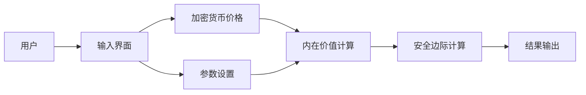
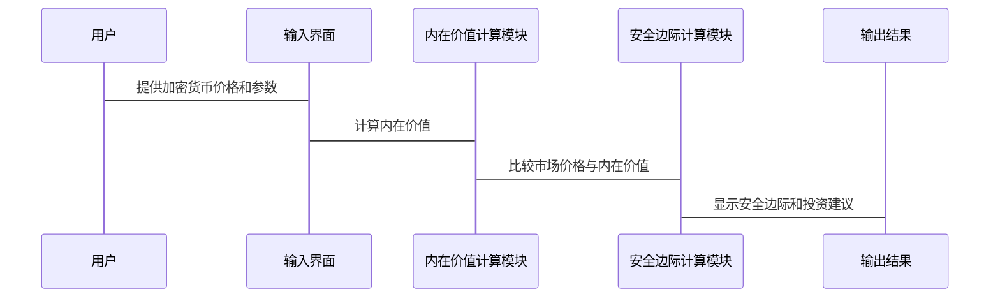

                 


# 《格雷厄姆安全边际概念在加密货币市场中的应用》

> 关键词：格雷厄姆安全边际，加密货币，投资策略，价值评估，风险管理

> 摘要：本文深入探讨了格雷厄姆的安全边际概念在加密货币市场中的应用，分析了其核心原理、数学模型、系统设计及实际案例，为投资者提供了一套基于安全边际的加密货币投资策略。

---

## 第1章: 安全边际概念的背景与基础

### 1.1 安全边际的基本定义与历史背景

#### 1.1.1 格雷厄姆投资理论的核心理念
格雷厄姆的安全边际概念源于其价值投资理论，强调以低于内在价值的价格购买资产，以降低投资风险并确保长期收益。其核心理念包括：
1. **内在价值**：资产的真实价值由其未来现金流的现值决定。
2. **安全边际**：购买价格应低于内在价值，以提供安全缓冲。

#### 1.1.2 安全边际概念的起源与发展
安全边际概念由本杰明·格雷厄姆提出，旨在应对市场波动和不确定性。它通过在资产价格与内在价值之间建立“缓冲区”，确保投资者在市场下跌时仍能获利。

#### 1.1.3 安全边际在传统投资中的应用
在传统股票投资中，安全边际通过比较市场价格与内在价值来确定投资机会。例如，若某股票的内在价值为$50，市场价格为$40，则安全边际为$10。

### 1.2 加密货币市场的特点与挑战

#### 1.2.1 加密货币市场的基本特性
加密货币市场具有以下特点：
1. **去中心化**：交易不受传统金融机构控制。
2. **高波动性**：价格波动剧烈，市场参与者情绪化。
3. **技术创新**：依赖区块链技术，存在技术风险。

#### 1.2.2 加密货币市场的波动性与风险
加密货币市场的高波动性导致价格在短时间内大幅波动，增加了投资的不确定性和风险。例如，比特币价格在2021年1月达到$41,000，6月跌至$30,000，波动幅度达27%。

#### 1.2.3 加密货币市场的参与者与生态
市场参与者包括机构投资者、散户、矿工和开发者。市场生态涉及交易所、钱包、智能合约等，技术复杂性高。

### 1.3 安全边际与加密货币投资的契合点

#### 1.3.1 安全边际在价值评估中的作用
安全边际通过比较市场价格与内在价值，帮助投资者识别被低估的加密货币。例如，若比特币的内在价值为$40,000，市场价格为$35,000，则存在$5,000的安全边际。

#### 1.3.2 加密货币市场的不确定性与安全边际的应用
市场波动和不确定性使得安全边际在加密货币投资中尤为重要。通过安全边际，投资者可以在市场下跌时仍保持盈利。

#### 1.3.3 安全边际与加密货币投资策略的结合
将安全边际应用于加密货币投资策略，需考虑市场波动、资产流动性等因素。例如，投资者可设定买入价格低于内在价值一定比例（如20%）。

---

## 第2章: 安全边际的核心概念与数学模型

### 2.1 安全边际的核心概念解析

#### 2.1.1 安全边际的定义与公式
安全边际（Safety Margin）的计算公式为：
$$ \text{安全边际} = \text{内在价值} - \text{市场价格} $$

#### 2.1.2 安全边际的计算方法
1. **内在价值评估**：通过现金流折现法（DCF）计算资产的内在价值。
2. **市场价格比较**：比较市场价格与内在价值，确定安全边际。

#### 2.1.3 安全边际与投资风险的关系
安全边际越大，投资风险越小。例如，若安全边际为20%，则市场下跌20%时，投资仍不会亏损。

### 2.2 安全边际的数学模型与公式

#### 2.2.1 安全边际计算的公式推导
通过DCF模型计算内在价值，公式为：
$$ \text{内在价值} = \sum_{t=1}^{n} \frac{\text{现金流}}{(1 + r)^t} $$
其中，\( r \) 为折现率，\( n \) 为投资期限。

#### 2.2.2 安全边际与资产价值的关系
安全边际是内在价值与市场价格的差值，表示为：
$$ \text{安全边际} = \text{内在价值} - \text{市场价格} $$

#### 2.2.3 安全边际的动态调整模型
根据市场变化，动态调整安全边际。例如，若市场上涨，内在价值提高，则安全边际可能缩小。

### 2.3 加密货币市场的安全边际评估模型

#### 2.3.1 加密货币市场的安全边际计算框架
1. 计算加密货币的内在价值。
2. 比较市场价格与内在价值，确定安全边际。

#### 2.3.2 市场波动对安全边际的影响
市场波动可能导致内在价值变化，影响安全边际。例如，比特币价格波动可能导致内在价值调整。

#### 2.3.3 安全边际的动态调整与优化
根据市场变化，动态调整安全边际。例如，若市场下跌，内在价值降低，则需重新计算安全边际。

---

## 第3章: 安全边际在加密货币投资中的应用策略

### 3.1 安全边际在加密货币价值评估中的应用

#### 3.1.1 加密货币的内在价值评估
通过DCF模型计算加密货币的内在价值，考虑其未来现金流。

#### 3.1.2 安全边际与加密货币价格的关系
安全边际越大的加密货币，投资风险越小。例如，若比特币的内在价值为$40,000，市场价格为$35,000，则安全边际为$5,000。

#### 3.1.3 市场波动对安全边际的影响
市场波动可能导致内在价值变化，影响安全边际。例如，比特币价格波动可能导致内在价值调整。

### 3.2 安全边际在加密货币投资策略中的应用

#### 3.2.1 基于安全边际的买入策略
投资者应以低于内在价值的价格买入加密货币。例如，若以太坊的内在价值为$2,000，市场价格为$1,800，则存在$200的安全边际。

#### 3.2.2 安全边际与风险管理
通过安全边际，投资者可以降低投资风险。例如，设定安全边际为20%，则市场下跌20%时，投资仍不会亏损。

#### 3.2.3 安全边际的动态调整
根据市场变化，动态调整安全边际。例如，若市场上涨，内在价值提高，则需重新计算安全边际。

---

## 第4章: 系统分析与架构设计

### 4.1 问题场景介绍

#### 4.1.1 项目介绍
设计一个基于安全边际的加密货币投资系统，帮助投资者评估加密货币的价值。

#### 4.1.2 系统功能设计
1. 用户界面：允许用户输入加密货币的价格和参数。
2. 内在价值计算：使用DCF模型计算内在价值。
3. 安全边际计算：比较市场价格与内在价值，确定安全边际。

### 4.2 系统架构设计

#### 4.2.1 系统架构图


#### 4.2.2 系统功能模块
1. 输入界面：接收用户输入。
2. 内在价值计算模块：使用DCF模型计算内在价值。
3. 安全边际计算模块：比较市场价格与内在价值，确定安全边际。
4. 结果输出模块：显示安全边际和投资建议。

### 4.3 接口设计

#### 4.3.1 API接口
1. 输入接口：接收加密货币价格和参数。
2. 输出接口：返回安全边际和投资建议。

#### 4.3.2 数据流
用户输入 --> API接口 --> 计算模块 --> 输出结果。

### 4.4 交互流程

#### 4.4.1 交互流程图


---

## 第5章: 项目实战与案例分析

### 5.1 环境配置

#### 5.1.1 技术栈
1. Python 3.8+
2. Jupyter Notebook
3. Matplotlib库

#### 5.1.2 数据来源
使用加密货币价格数据，如CoinMarketCap。

### 5.2 核心实现

#### 5.2.1 Python代码实现
```python
import pandas as pd
import numpy as np

def calculate_intrinsic_value(cash_flows, discount_rate):
    return np.npv(discount_rate, cash_flows)

def calculate_safety_margin(intrinsic_value, market_price):
    return intrinsic_value - market_price

# 示例数据
cash_flows = [1000, 1200, 1500, 2000]
discount_rate = 0.08

intrinsic_value = calculate_intrinsic_value(cash_flows, discount_rate)
market_price = 3000
safety_margin = calculate_safety_margin(intrinsic_value, market_price)

print(f"内在价值: {intrinsic_value}")
print(f"市场价格: {market_price}")
print(f"安全边际: {safety_margin}")
```

#### 5.2.2 代码解读
1. `calculate_intrinsic_value`：计算内在价值，使用现金流折现法。
2. `calculate_safety_margin`：计算安全边际，比较市场价格与内在价值。
3. 示例数据：假设现金流和折现率，计算内在价值和安全边际。

### 5.3 案例分析

#### 5.3.1 案例介绍
以比特币为例，假设其现金流和折现率，计算内在价值和安全边际。

#### 5.3.2 实际应用
根据计算结果，给出投资建议。例如，若安全边际为正，则建议买入。

### 5.4 结果展示

#### 5.4.1 计算结果
假设比特币的内在价值为$40,000，市场价格为$35,000，则安全边际为$5,000。

#### 5.4.2 投资建议
由于安全边际为正，建议投资者以$35,000的价格买入比特币。

---

## 第6章: 总结与展望

### 6.1 总结
本文深入探讨了格雷厄姆的安全边际概念在加密货币市场中的应用，分析了其核心原理、数学模型、系统设计及实际案例。通过安全边际，投资者可以降低投资风险，提高投资收益。

### 6.2 最佳实践 tips
1. 保持对市场波动的关注。
2. 动态调整安全边际。
3. 结合多种投资策略。

### 6.3 展望
未来，随着加密货币市场的成熟，安全边际的应用将更加广泛。投资者可以通过技术进步和数据分析进一步优化投资策略。

---

## 作者：AI天才研究院/AI Genius Institute & 禅与计算机程序设计艺术/Zen And The Art of Computer Programming

---

这篇文章详细探讨了格雷厄姆的安全边际概念在加密货币市场中的应用，通过理论分析和实际案例，为投资者提供了科学的投资策略。希望本文能为加密货币市场的投资者提供有价值的参考。

