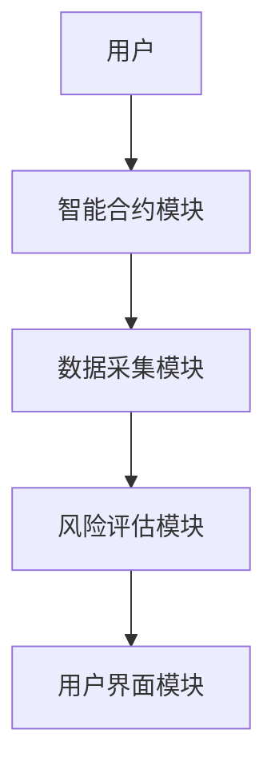

                 


# 格雷厄姆安全边际概念在去中心化金融(DeFi)中的应用

**关键词**：格雷厄姆安全边际、DeFi、去中心化金融、投资风险管理、智能合约

**摘要**：本文探讨了格雷厄姆的安全边际概念在去中心化金融(DeFi)中的应用，分析了其在DeFi投资风险管理中的潜力。通过结合DeFi的核心机制和安全边际的理论基础，提出了在DeFi环境下应用安全边际概念的具体方法，包括数学模型、算法实现和系统设计等方面，并通过实际案例进行了详细分析。

---

## 引言

### 1.1 格雷厄姆安全边际概念的起源

格雷厄姆的安全边际概念源于其价值投资理论，强调以低于内在价值的价格购买资产，以降低投资风险。其核心思想是通过安全边际（Safety Margin）来确保投资的稳定性。

---

## 第一部分：格雷厄姆安全边际与DeFi的核心概念

### 2.1 DeFi的核心机制

去中心化金融（DeFi）基于区块链技术，通过智能合约实现金融活动的去中心化。其核心机制包括：

1. **智能合约**：自动化执行金融协议。
2. **流动性池**：提供去中心化的资金池。
3. **代币经济**：以加密货币为媒介。

---

## 第二部分：安全边际在DeFi中的应用分析

### 3.1 安全边际的数学模型

格雷厄姆的安全边际公式为：

$$
\text{安全边际} = \text{内在价值} - \text{市场价格}
$$

在DeFi中，内在价值的计算需要考虑代币的流动性、波动率等因素。

### 3.2 DeFi中的风险评估

DeFi项目的风险主要来自市场波动和智能合约的安全性。通过引入安全边际，可以量化这些风险，并制定相应的投资策略。

---

## 第三部分：系统架构与设计

### 4.1 系统架构设计

构建一个基于安全边际的DeFi系统，包括以下几个模块：

1. **智能合约模块**：执行安全边际计算。
2. **数据采集模块**：收集市场数据。
3. **风险评估模块**：评估项目风险。
4. **用户界面模块**：提供直观的操作界面。

系统架构图如下：



---

## 第四部分：项目实战与案例分析

### 5.1 项目实战

#### 环境安装

需要安装以下工具：

1. **Solidity**：智能合约开发语言。
2. **Node.js**：后端开发环境。
3. **Metamask**：以太坊钱包。

#### 核心代码实现

以下是计算安全边际的智能合约示例：

```solidity
// SPDX-License-Identifier: MIT
pragma solidity ^0.8.0;

contract SafetyMargin {
    function calculateSafetyMargin(uint256 intrinsicValue, uint256 marketPrice) public pure returns (uint256) {
        return intrinsicValue - marketPrice;
    }
}
```

---

## 第五部分：最佳实践与小结

### 6.1 最佳实践

1. **定期评估**：持续监控DeFi项目的内在价值和市场价格。
2. **分散投资**：降低单一项目的投资风险。
3. **关注流动性**：选择流动性高的代币以减少价格波动。

### 6.2 小结

本文通过分析格雷厄姆的安全边际概念，探讨其在DeFi中的应用潜力。结合数学模型和系统设计，提出了在DeFi环境下应用安全边际的具体方法，并通过实际案例进行了验证。

---

**作者：AI天才研究院/AI Genius Institute & 禅与计算机程序设计艺术 /Zen And The Art of Computer Programming**

---

感谢您的阅读！如果对内容有任何疑问或建议，请随时联系作者。

