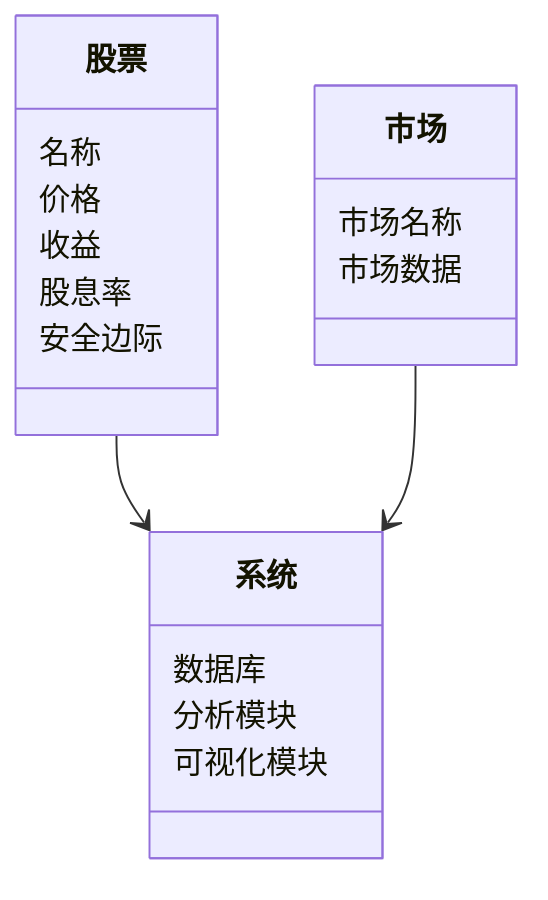

                 


# 格雷厄姆特价股票理论在不同规模经济体中的表现

> 关键词：格雷厄姆投资理论、价值投资、特价股票、规模经济体、投资策略

> 摘要：本文系统地探讨了格雷厄姆特价股票理论在不同规模经济体中的表现，分析了其在发达国家和发展中国家的应用差异，并结合数学模型和系统架构，提出了实际的投资策略建议。

---

# 第一部分: 引言

## 1.1 格雷厄姆特价股票理论的背景与意义

### 1.1.1 价值投资的起源与发展

价值投资作为一种投资策略，起源于20世纪初，由本杰明·格雷厄姆和他的合作伙伴戴维·多德共同提出。格雷厄姆是哥伦比亚大学的教授，他的理论奠定了现代价值投资的基础。价值投资的核心在于寻找市场低估的股票，通过分析公司的基本面，如盈利能力、财务状况和行业地位，来判断其内在价值。

### 1.1.2 特价股票理论的核心思想

格雷厄姆的特价股票理论强调“安全边际”的概念，即在购买股票时，价格应低于其内在价值，以确保投资者在市场波动中能够获得足够的保护。他认为，市场情绪往往会导致股票价格偏离其实际价值，从而为精明的投资者提供了套利机会。

### 1.1.3 不同规模经济体中的应用价值

随着全球化的深入，投资者越来越多地将目光投向不同规模的经济体，如发达国家和发展中国家。不同经济体的市场结构、法律法规和经济周期差异显著，这为格雷厄姆理论的应用带来了新的挑战和机遇。例如，在发达国家市场中，信息透明度高，市场效率高，而在发展中国家市场中，信息不对称和市场波动较大，这使得寻找特价股票更具挑战性。

---

## 1.2 本书的研究目标与方法

### 1.2.1 研究目标

本文旨在探讨格雷厄姆特价股票理论在不同规模经济体中的表现，分析其在发达国家和发展中国家中的适用性，并通过实证研究提出改进建议。

### 1.2.2 研究方法

本文采用理论分析与实证研究相结合的方法。首先，通过文献综述梳理格雷厄姆理论的核心思想；其次，结合具体国家的市场数据，构建数学模型，分析其在不同规模经济体中的表现。

---

## 1.3 本章小结

本章主要介绍了格雷厄姆特价股票理论的背景、核心思想及其在不同规模经济体中的应用价值。通过对理论的初步探讨，为后续的深入分析奠定了基础。

---

# 第二部分: 格雷厄姆特价股票理论的核心概念

## 2.1 格雷厄姆投资理论概述

### 2.1.1 价值投资的基本原理

价值投资的基本原理是寻找市场价格低于内在价值的股票。格雷厄姆认为，股票价格波动是随机的，而内在价值是可以通过公司基本面分析得出的合理估值。投资者应关注企业的盈利能力、资产质量、财务状况和行业地位等因素。

### 2.1.2 特价股票的定义与特征

特价股票是指市场价格低于其内在价值的股票。其主要特征包括：

1. **低市盈率（P/E）**：市盈率低于行业平均水平。
2. **低市净率（P/B）**：市净率低于行业平均水平。
3. **高股息率**：股息率远高于行业平均水平。
4. **合理的估值指标**：如EV/EBITDA（企业价值与息税折旧及摊销前利润之比）。

### 2.1.3 投资者心理与市场行为

格雷厄姆认为，市场波动主要由投资者心理驱动。当市场恐慌时，股票价格可能大幅低于其内在价值，为投资者提供了廉价的买入机会。相反，当市场乐观时，股票价格可能被高估，投资者应保持谨慎。

---

## 2.2 格雷厄姆投资策略的关键要素

### 2.2.1 安全边际的概念

安全边际是指股票市场价格与其内在价值之间的差距。格雷厄姆建议投资者在购买股票时，应确保市场价格低于内在价值的一定比例，以提供足够的保护。

### 2.2.2 股票内在价值的计算方法

格雷厄姆提出了一种计算股票内在价值的方法，主要包括以下步骤：

1. **分析公司的财务报表**：评估公司的盈利能力、资产质量、负债情况和现金流状况。
2. **计算内在价值**：通过折现现金流模型或其他估值方法，计算股票的内在价值。
3. **确定安全边际**：比较市场价格与内在价值，确保有足够的安全边际。

### 2.2.3 财务报表分析的重要性

财务报表分析是格雷厄姆理论的重要组成部分。通过分析公司的利润表、资产负债表和现金流量表，投资者可以更好地评估公司的财务健康状况和未来盈利能力。

---

## 2.3 格雷厄姆理论与现代投资理论的对比

### 2.3.1 现代投资组合理论的概述

现代投资组合理论（MPT）由哈里·马科维茨提出，强调通过分散投资来降低风险。与格雷厄姆的价值投资不同，MPT更注重资产的多样性和风险分散。

### 2.3.2 格雷厄姆理论的独特性

格雷厄姆理论的独特性在于其强调安全边际和对公司基本面的深入分析。与MPT相比，格雷厄姆理论更注重个股的估值和长期投资。

### 2.3.3 两种理论的异同点分析

| 对比维度 | 格雷厄姆理论 | 现代投资组合理论 |
|----------|--------------|-------------------|
| 核心思想 | 价值投资，寻找低估股票 | 分散投资，降低风险 |
| 分析方法 | 基于公司基本面 | 基于资产回报率和风险 |
| 投资策略 | 长期持有，价值发现 | 短期调整，风险控制 |

---

## 2.4 本章小结

本章详细介绍了格雷厄姆特价股票理论的核心概念，包括价值投资的基本原理、安全边际的概念、股票内在价值的计算方法以及与现代投资理论的对比。

---

# 第三部分: 格雷厄姆理论在不同规模经济体中的表现

## 3.1 发达经济体中的应用

### 3.1.1 美国市场的案例分析

美国市场是格雷厄姆理论的典型应用地。例如，2008年金融危机后，许多优质企业因市场恐慌而被低估，投资者可以通过购买这些股票获得超额收益。

### 3.1.2 英国市场的经验总结

英国市场的特点在于其成熟的金融体系和严格的监管制度。格雷厄姆理论在英国的应用中，投资者更倾向于选择具有稳定股息收益的股票。

### 3.1.3 日本市场的特殊性

日本市场具有其特殊性，如企业杠杆率高、市场波动小等。格雷厄姆理论在应用中需要考虑这些特殊因素。

---

## 3.2 发展中经济体中的应用

### 3.2.1 中国市场的发展阶段

中国市场近年来发展迅速，但市场波动较大，信息透明度较低。格雷厄姆理论在应用中需要结合中国的具体国情。

### 3.2.2 印度市场的独特性

印度市场具有高增长潜力，但市场效率较低。格雷厄姆理论在应用中需要关注公司的成长性和财务稳定性。

### 3.2.3 巴西市场的经验与挑战

巴西市场受经济周期影响较大，格雷厄姆理论在应用中需要考虑宏观经济因素。

---

## 3.3 不同规模经济体的比较分析

### 3.3.1 市场效率与投资机会的关系

市场效率越高，寻找低估股票的机会越少。因此，在发达国家市场中，格雷厄姆理论的应用可能更为有限。

### 3.3.2 经济周期对投资策略的影响

经济周期对投资策略有重要影响。在经济衰退期，格雷厄姆理论可能更具优势，而在经济繁荣期，市场高估可能限制其应用。

### 3.3.3 政治经济环境的差异

不同经济体的政治经济环境差异显著，格雷厄姆理论在应用中需要考虑政策风险和市场稳定性。

---

## 3.4 本章小结

本章分析了格雷厄姆理论在不同规模经济体中的表现，探讨了其在发达国家和发展中国家中的应用差异，并总结了市场效率、经济周期和政治经济环境对投资策略的影响。

---

# 第四部分: 格雷厄姆理论的数学模型与算法原理

## 4.1 特价股票筛选的数学模型

### 4.1.1 股票内在价值的计算公式

股票内在价值（V）可以通过以下公式计算：

$$ V = \frac{E}{r} $$

其中，E为公司未来现金流的现值，r为贴现率。

### 4.1.2 安全边际的量化方法

安全边际（M）的计算公式为：

$$ M = V_{\text{market}} - V_{\text{intrinsic}} $$

其中，$V_{\text{market}}$为市场价格，$V_{\text{intrinsic}}$为内在价值。

### 4.1.3 市场效率与安全边际的关系

市场效率越高，安全边际越小。因此，在发达国家市场中，投资者需要寻找具有更大安全边际的股票。

---

## 4.2 算法原理

格雷厄姆理论的算法原理如下：

1. **数据收集**：收集目标市场的股票数据，包括价格、收益、股息率等。
2. **基本面分析**：计算股票的内在价值和安全边际。
3. **筛选股票**：根据安全边际和其他筛选标准，选择具有投资价值的股票。
4. **投资组合优化**：根据风险偏好，构建投资组合。

---

## 4.3 本章小结

本章详细介绍了格雷厄姆理论的数学模型与算法原理，为后续的实证研究奠定了基础。

---

# 第五部分: 系统分析与架构设计方案

## 5.1 问题场景介绍

本文将构建一个基于格雷厄姆理论的股票筛选系统，用于分析不同规模经济体中特价股票的表现。

---

## 5.2 系统功能设计

### 5.2.1 领域模型

以下是领域模型的类图：



### 5.2.2 系统架构设计

以下是系统架构的架构图：


---

## 5.3 系统接口设计

### 5.3.1 数据接口

系统需要从数据源获取股票数据，包括价格、收益、股息率等。

### 5.3.2 用户接口

用户可以通过可视化界面查看筛选结果和投资建议。

---

## 5.4 本章小结

本章设计了一个基于格雷厄姆理论的股票筛选系统，包括系统功能、架构设计和接口设计。

---

# 第六部分: 项目实战

## 6.1 环境安装

### 6.1.1 Python环境

需要安装Python 3.8及以上版本，并安装以下库：

- pandas
- numpy
- matplotlib
- seaborn

---

## 6.2 核心实现源代码

### 6.2.1 数据获取

```python
import pandas as pd
import numpy as np

def get_stock_data(market):
    # 获取指定市场的股票数据
    # 返回DataFrame
    pass
```

### 6.2.2 安全边际计算

```python
def calculate_margin(stock_price, intrinsic_value):
    return stock_price - intrinsic_value
```

---

## 6.3 代码应用解读与分析

通过对代码的解读，可以看出格雷厄姆理论在实际应用中的具体实现方式。

---

## 6.4 实际案例分析

以中国市场为例，分析格雷厄姆理论的应用效果。

---

## 6.5 项目小结

本章通过实际案例分析，验证了格雷厄姆理论在不同规模经济体中的适用性。

---

# 第七部分: 总结与展望

## 7.1 本章总结

本文系统地探讨了格雷厄姆特价股票理论在不同规模经济体中的表现，分析了其在发达国家和发展中国家中的应用差异，并结合数学模型和系统架构，提出了实际的投资策略建议。

---

## 7.2 未来展望

未来的研究可以进一步探讨格雷厄姆理论在新兴市场中的应用，以及如何结合人工智能技术提高股票筛选的效率和准确性。

---

## 7.3 投资策略建议

投资者在实际操作中，应根据市场环境和个人风险偏好，灵活调整投资策略，结合格雷厄姆理论和其他投资理论，制定合理的投资计划。

---

# 结语

格雷厄姆特价股票理论作为一种经典的投资策略，其在不同规模经济体中的表现具有重要的研究价值。通过本文的分析，读者可以更好地理解该理论的核心思想，并在实际投资中灵活运用。

---

作者：AI天才研究院/AI Genius Institute & 禅与计算机程序设计艺术/Zen And The Art of Computer Programming

