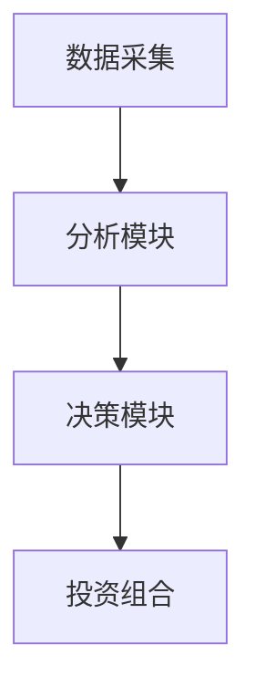

                 


# 格雷厄姆特价股票理论在共享经济产业中的应用

> 关键词：格雷厄姆投资理论，共享经济，价值投资，特价股票，数学模型，系统架构

> 摘要：本文探讨了如何将格雷厄姆的价值投资理论应用于共享经济产业，通过分析共享经济的特点，构建数学模型，并设计投资系统，提供实际案例分析。

---

# 第1章 格雷厄姆特价股票理论的核心思想

## 1.1 价值投资的鼻祖：本杰明·格雷厄姆

格雷厄姆是价值投资的先驱，主张以低于内在价值的价格购买股票。他的理论强调安全边际，即买入价格与内在价值的差距，以降低投资风险。

## 1.2 特价股票的定义与特征

特价股票是指市场价格低于内在价值的股票，具有高分红率、低市盈率等特征，通常被视为被市场低估的投资机会。

---

# 第2章 共享经济的定义与产业特点

## 2.1 共享经济的概念与发展

共享经济通过技术平台，将闲置资源进行共享，提升资源利用率。其模式包括P2P平台、使用权租赁等，涵盖交通、住宿、办公等多个领域。

## 2.2 共享经济的核心特征

共享经济具有去中心化、高效匹配资源、降低交易成本等特点，但面临信任缺失、监管难题等挑战。

---

# 第3章 格雷厄姆理论在共享经济中的应用策略

## 3.1 企业价值评估方法

使用格雷厄姆的内在价值公式，结合共享经济企业的收入、利润和资产，评估其市场价值。

$$ \text{内在价值} = \frac{\text{息税前利润}}{\text{资本成本}} $$

## 3.2 价值投资策略

寻找被低估的共享经济企业，关注市盈率（P/E）和市净率（P/B）等指标，确保买入价格低于内在价值。

---

# 第4章 数学模型与算法原理

## 4.1 投资价值评估模型

构建数学模型，计算企业的内在价值，考虑收入、利润和资产等因素：

$$ V = \frac{R}{k} $$

其中，V为内在价值，R为年收入，k为资本成本。

## 4.2 风险评估与控制方程

使用方差和标准差评估投资风险，构建风险调整后的投资组合：

$$ \text{风险调整收益} = R - \lambda \sigma $$

---

# 第5章 系统分析与架构设计

## 5.1 问题场景介绍

设计一个投资系统，用于评估和优化共享经济企业的投资组合。

## 5.2 系统架构设计

- 数据采集模块：收集企业财务数据。
- 分析模块：计算内在价值和风险指标。
- 决策模块：优化投资组合。

系统架构图：



---

# 第6章 项目实战与案例分析

## 6.1 环境安装与配置

使用Python和Pandas进行数据分析，安装相关库：

```bash
pip install pandas numpy matplotlib
```

## 6.2 核心代码实现

计算内在价值和风险的Python代码：

```python
import pandas as pd

def calculate_intrinsic_value(revenue, cost_of_capital):
    return revenue / cost_of_capital

def calculate_risk(returns):
    returns.std()

# 示例数据
data = pd.DataFrame({'returns': [0.1, -0.05, 0.15, 0.08, -0.02]})
iv = calculate_intrinsic_value(1000000, 0.1)
risk = calculate_risk(data['returns'])
```

---

# 第7章 总结与展望

## 7.1 总结

格雷厄姆的理论为共享经济投资提供了有效的工具，通过价值评估和风险控制，投资者可以优化投资组合。

## 7.2 展望

未来，结合人工智能和大数据，格雷厄姆理论在共享经济中的应用将更加精准和高效。

---

作者：AI天才研究院 & 禅与计算机程序设计艺术

