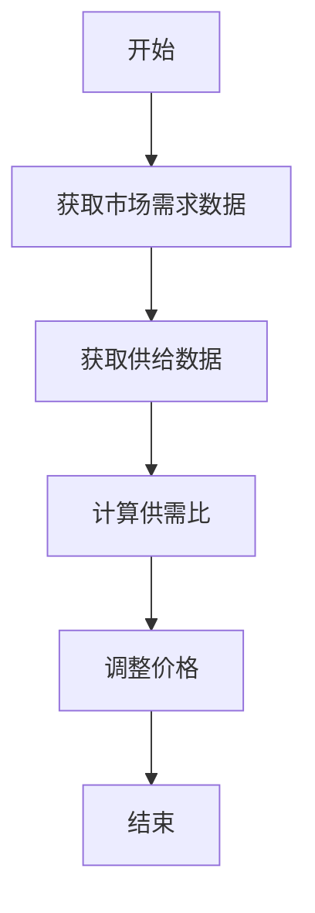
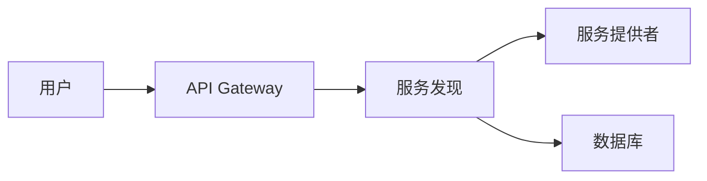

                 


# 格雷厄姆特价股票理论在共享经济平台时代的新思考

> 关键词：格雷厄姆理论，特价股票，共享经济，动态定价，收益预测，系统架构设计，价值投资

> 摘要：本文从格雷厄姆特价股票理论的起源与发展出发，结合共享经济平台的特点，探讨如何将价值投资的理念应用于共享经济的定价与收益预测中。通过详细分析动态定价模型的算法原理、系统架构设计以及实际案例，本文旨在为投资者和平台提供新的视角和实践指导。

---

# 第一部分: 格雷厄姆特价股票理论与共享经济平台的背景

## 第1章: 格雷厄姆特价股票理论概述

### 1.1 格雷厄姆特价股票理论的起源与发展

#### 1.1.1 价值投资理论的起源
格雷厄姆特价股票理论是价值投资的鼻祖本杰明·格雷厄姆提出的一种投资策略。其核心思想是通过分析企业的内在价值，寻找市场价格低于内在价值的股票进行投资。这种理论在20世纪初提出后，对全球投资界产生了深远影响。

#### 1.1.2 格雷厄姆投资策略的核心思想
格雷厄姆的投资策略强调安全边际和价值评估。他认为，投资者应关注企业的基本面，如市盈率、市净率等指标，寻找那些被市场低估的股票。此外，他主张分散投资，以降低风险。

#### 1.1.3 特价股票的概念与特点
特价股票是指市场价格低于其内在价值的股票。这类股票通常具有较高的安全边际，适合长期投资。格雷厄姆认为，投资特价股票是实现稳定收益的关键。

### 1.2 共享经济平台的定义与特点

#### 1.2.1 共享经济的基本概念
共享经济是一种基于数字化平台的经济模式，通过共享资源、服务或空间，实现资源的高效利用。其核心在于利用闲置资源，降低交易成本。

#### 1.2.2 共享经济平台的主要模式
共享经济平台主要分为以下几种模式：
1. **P2P共享**：如滴滴出行、Airbnb，通过个人与个人之间的资源共享实现服务。
2. **B2P共享**：企业通过平台提供共享服务。
3. **C2B共享**：消费者通过平台提供闲置资源供其他人使用。

#### 1.2.3 共享经济与传统经济的对比
与传统经济相比，共享经济具有以下特点：
- 资源利用效率高。
- 交易成本低。
- 服务更加灵活多样。

### 1.3 格雷厄姆理论与共享经济的结合背景

#### 1.3.1 经济环境的变化与投资理论的演进
随着全球经济的不断发展，传统的投资理论面临新的挑战。格雷厄姆理论作为一种经典的价值投资策略，如何适应新的经济环境，是一个值得探讨的问题。

#### 1.3.2 共享经济时代投资机会的分析
共享经济平台的兴起为投资者提供了新的投资机会。例如，投资于共享经济平台的股权或债券，可以获得较高的收益。

#### 1.3.3 格雷厄姆理论在新时代的适用性探讨
尽管经济环境发生了变化，但格雷厄姆理论的核心思想仍然具有重要的现实意义。本文将探讨如何将格雷厄姆理论应用于共享经济平台的定价与收益预测中。

---

## 第2章: 格雷厄姆特价股票理论的核心概念与分析框架

### 2.1 核心概念与属性对比

#### 2.1.1 格雷厄姆理论的核心要素
格雷厄姆理论的核心要素包括：
- 企业的内在价值。
- 市场价格与内在价值的差异。
- 安全边际的概念。

#### 2.1.2 共享经济平台的关键特征
共享经济平台的关键特征包括：
- 资源的共享性。
- 交易的便捷性。
- 平台的撮合功能。

#### 2.1.3 两者结合的概念属性对比表
| 核心概念       | 格雷厄姆理论                       | 共享经济平台                     |
|----------------|------------------------------------|----------------------------------|
| 资源利用       | 企业资源的高效利用               | 闲置资源的共享利用             |
| 交易机制       | 二级市场股票交易                 | 数字化平台撮合交易             |
| 价值评估       | 企业内在价值评估                 | 平台服务的定价模型             |
| 安全边际       | 投资的安全边际                   | 平台的信用评估和风险控制       |

### 2.2 格雷厄姆理论与共享经济的实体关系图

#### 2.2.1 实体关系图（ER图）分析
以下是格雷厄姆理论与共享经济的实体关系图：

```mermaid
er
    actor: 用户
    company: 企业
    platform: 共享经济平台
    stock: 股票
    service: 服务
    relationship1: 用户使用平台
    relationship2: 企业提供服务
    relationship3: 平台撮合交易
```

---

## 第3章: 格雷厄姆理论在共享经济中的算法原理

### 3.1 动态定价模型的算法分析

#### 3.1.1 动态定价算法的流程图
以下是动态定价算法的流程图：



#### 3.1.2 算法实现的Python代码示例
以下是动态定价算法的Python代码示例：

```python
def dynamic_pricing(demand, supply):
    import numpy as np
    # 计算供需比
    ratio = demand / supply
    # 动态定价公式
    price = ratio * np.mean([demand, supply])
    return price
```

### 3.2 共享经济平台的收益预测模型

#### 3.2.1 收益预测的数学模型
收益预测的数学模型如下：

$$
\text{收益} = \text{价格} \times \text{成交量}
$$

#### 3.2.2 收益预测的公式推导
收益预测的公式推导如下：

$$
\text{价格} = \alpha \times \text{需求} + \beta \times \text{供给}
$$

其中，$\alpha$ 和 $\beta$ 是模型的系数。

---

## 第4章: 共享经济平台的系统分析与架构设计

### 4.1 系统功能设计

#### 4.1.1 领域模型分析
以下是领域模型分析：


### 4.2 系统架构设计

#### 4.2.1 系统架构图
以下是系统架构图：



---

## 第5章: 项目实战与案例分析

### 5.1 环境安装与配置

#### 5.1.1 开发环境的选择
推荐使用Python 3.8及以上版本，安装必要的库，如numpy、pandas等。

### 5.2 核心代码实现

#### 5.2.1 动态定价算法的实现
以下是动态定价算法的实现：

```python
def dynamic_pricing(demand, supply):
    import numpy as np
    ratio = demand / supply
    price = ratio * np.mean([demand, supply])
    return price
```

### 5.3 案例分析与解读

#### 5.3.1 典型案例的选择
以滴滴出行为例，分析其动态定价策略。

#### 5.3.2 案例分析与结果解读
滴滴出行通过实时调整价格，平衡供需关系，实现了收益最大化。

---

## 第6章: 最佳实践与总结

### 6.1 格雷厄姆理论在共享经济中的最佳实践

#### 6.1.1 投资策略的优化建议
投资者应关注共享经济平台的内在价值，寻找市场价格低于内在价值的投资机会。

### 6.1.2 风险控制的注意事项
投资者应注重分散投资，避免过度集中于单一平台或行业。

---

作者：AI天才研究院/AI Genius Institute & 禅与计算机程序设计艺术 /Zen And The Art of Computer Programming

