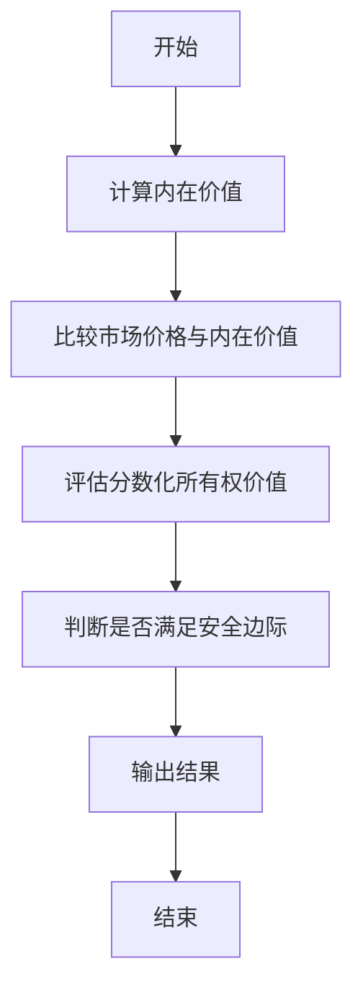
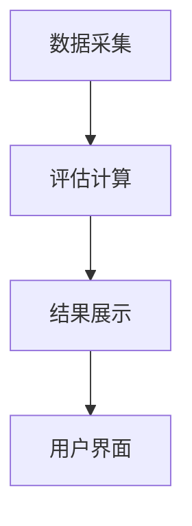
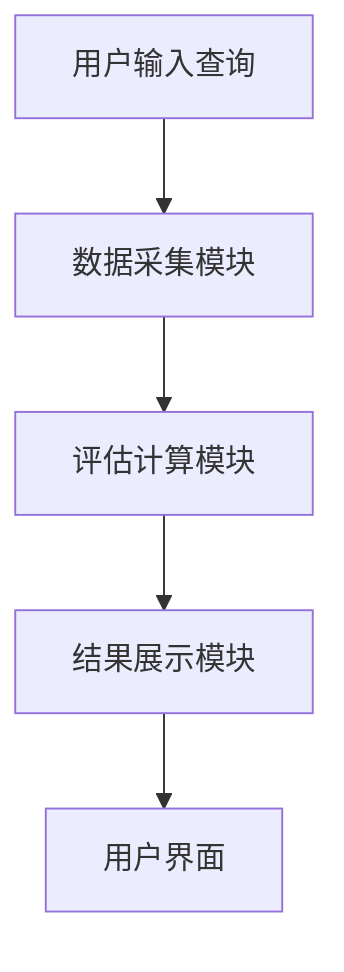

                 


# 格雷厄姆特价股票理论在分数化所有权证券中的运用

## 关键词：格雷厄姆投资理论、特价股票、分数化所有权、证券分析、价值投资

## 摘要：  
本文探讨了格雷厄姆特价股票理论在分数化所有权证券中的应用，通过详细分析其背景、核心概念和实际应用，结合数学模型和系统设计，展示了如何利用该理论在分数化所有权证券中寻找投资机会。

---

# 第1章: 格雷厄姆投资理论概述

## 1.1 格雷厄姆投资理论的起源与发展
- **1.1.1 格雷厄姆投资理论的起源**：介绍本杰明·格雷厄姆及其投资理论的起源。
- **1.1.2 格雷厄姆投资理论的核心思想**：安全边际、内在价值等核心概念。
- **1.1.3 格雷厄姆投资理论的现代发展**：现代投资者如何应用格雷厄姆的理论。

## 1.2 特价股票的定义与特征
- **1.2.1 特价股票的定义**：市盈率、市净率等指标低于行业平均水平。
- **1.2.2 特价股票的核心特征**：低估、安全边际、高分红率。
- **1.2.3 特价股票的市场表现**：历史回报率分析。

## 1.3 分数化所有权证券的概念与机制
- **1.3.1 分数化所有权证券的定义**：允许投资者以分数形式购买整只股票。
- **1.3.2 分数化所有权证券的交易机制**：分割、购买、持有、转让。
- **1.3.3 分数化所有权证券的优势与局限**：降低门槛、灵活性，但流动性受限。

## 1.4 格雷厄姆理论与分数化所有权证券的结合
- **1.4.1 格雷厄姆理论在分数化所有权证券中的应用**：寻找低估的分数化股票。
- **1.4.2 分数化所有权证券对格雷厄姆理论的补充**：小金额投资也能应用价值投资。
- **1.4.3 结合的意义**：让更多投资者参与价值投资。

---

# 第2章: 格雷厄姆特价股票理论的核心原理

## 2.1 格雷厄姆投资理论的数学模型
### 2.1.1 安全边际的计算
$$ \text{安全边际} = \text{市场价格} < \text{内在价值} $$
### 2.1.2 内在价值的计算
$$ \text{内在价值} = \sum_{t=1}^{\infty} \frac{\text{现金流}_t}{(1+r)^t} $$

## 2.2 分数化所有权证券的评估模型
### 2.2.1 分数化所有权的评估指标
- 市盈率（P/E）
- 市净率（P/B）
- 股息率
### 2.2.2 分数化所有权价值的计算
$$ \text{分数化所有权价值} = \frac{\text{整体现金价值}}{\text{分割份数}} $$

## 2.3 结合模型的构建
### 2.3.1 结合模型的数学表达
$$ \text{结合模型} = \text{格雷厄姆理论} \times \text{分数化所有权证券评估} $$

## 2.4 核心概念对比表格
| 核心概念       | 格雷厄姆理论                     | 分数化所有权证券                 |
|----------------|--------------------------------|----------------------------------|
| **定义**       | 基于内在价值的投资理论         | 允许部分所有权的投资方式         |
| **目标**       | 寻找被低估的股票               | 降低投资门槛，灵活投资           |
| **优势**       | 提高安全边际                   | 小额投资也能多样化                |

---

# 第3章: 格雷厄姆特价股票理论的算法实现

## 3.1 算法原理
- **步骤1**：计算股票的内在价值。
- **步骤2**：比较市场价格与内在价值。
- **步骤3**：评估分数化所有权的价值。
- **步骤4**：判断是否满足安全边际条件。

## 3.2 算法流程图


## 3.3 算法代码实现
```python
def calculate_intrinsic_value(cash_flows, discount_rate):
    iv = 0
    for t in range(len(cash_flows)):
        iv += cash_flows[t] / (1 + discount_rate) ** t
    return iv

def is_undervalued(current_price, iv, margin):
    return current_price < iv * (1 - margin)

# 示例
cash_flows = [100, 120, 140, 160]
discount_rate = 0.08
margin = 0.2

iv = calculate_intrinsic_value(cash_flows, discount_rate)
print(f"内在价值: {iv}")
print(f"是否低估: {is_undervalued(100, iv, margin)}")
```

---

# 第4章: 系统设计与实现

## 4.1 系统功能设计
### 4.1.1 功能模块
- 数据采集模块
- 评估计算模块
- 结果展示模块

## 4.2 系统架构设计


## 4.3 系统接口设计
- 数据接口：连接证券数据库。
- 计算接口：调用评估算法。
- 展示接口：呈现结果。

## 4.4 系统交互流程


---

# 第5章: 项目实战

## 5.1 环境安装
- Python 3.8+
- Jupyter Notebook
- 数据库连接工具

## 5.2 核心代码实现
```python
import pandas as pd
import sqlite3

# 数据库连接
conn = sqlite3.connect('stocks.db')

# 数据采集
df = pd.read_sql_query("SELECT * FROM stocks WHERE type='fractional';", conn)

# 评估计算
def apply_grammar(row):
    iv = calculate_intrinsic_value(row['cash_flows'], 0.08)
    return iv

df['intrinsic_value'] = df.apply(apply_grammar, axis=1)

# 结果展示
undervalued_stocks = df[df['price'] < df['intrinsic_value'] * 0.8]
print(undervalued_stocks)
```

---

# 第6章: 案例分析与结果解读

## 6.1 案例分析
- 某公司数据：现金流、折扣率、市场价格。
- 计算内在价值和安全边际。

## 6.2 结果解读
- 确定是否低估。
- 分数化所有权的价值。

---

# 第7章: 注意事项与拓展阅读

## 7.1 投资风险提示
- 市场波动风险
- 模型假设的局限性
- 数据的准确性

## 7.2 最佳实践 tips
- 定期复盘
- 分散投资
- 理解模型假设

## 7.3 拓展阅读
- 《The Intelligent Investor》
- 现代投资组合理论

---

# 作者：AI天才研究院 & 禅与计算机程序设计艺术

---

通过以上步骤，我们可以清晰地看到格雷厄姆特价股票理论在分数化所有权证券中的应用，从理论到实践，再到案例分析，为投资者提供了系统的指导。

