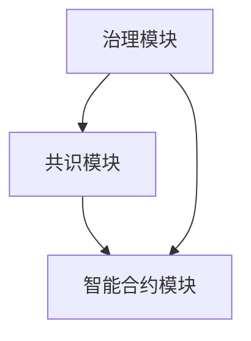
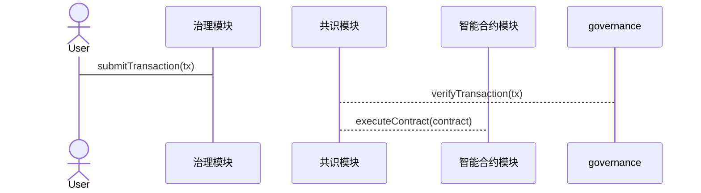

                 


# 《格雷厄姆特价股票理论在去中心化自治协议(DAP)时代的新思考》

---

## 关键词：
- 格雷厄姆特价股票理论
- 去中心化自治协议（DAP）
- 价值投资
- 区块链技术
- 数学模型

---

## 摘要：
本文结合格雷厄姆特价股票理论与去中心化自治协议（DAP）的特点，提出DAP时代下的价值投资新模型。通过分析DAP的核心机制，探讨其对传统价值评估方法的影响，并提出适用于DAP环境的数学模型和投资策略。同时，通过具体案例分析，展示了如何在DAP环境下实现价值投资的优化与创新。

---

# 第一部分: 格雷厄姆特价股票理论与去中心化自治协议（DAP）的结合

## 第1章: 格雷厄姆特价股票理论概述

### 1.1 格雷厄姆特价股票理论的核心思想

#### 1.1.1 价值投资的基本原理
格雷厄姆的价值投资理论强调以低于内在价值的价格购买优质资产。内在价值是基于资产未来现金流的折现值。这种理论在传统金融中广泛应用，但随着去中心化自治协议（DAP）的兴起，其适用性需要重新审视。

#### 1.1.2 股票内在价值的计算方法
格雷厄姆的内在价值公式为：
$$ V = \frac{E}{k} $$
其中，\( V \) 是内在价值，\( E \) 是年收益，\( k \) 是安全边际率。该公式强调安全边际的重要性，即以低于内在价值的价格买入资产。

#### 1.1.3 格雷厄姆投资策略的现代应用
尽管格雷厄姆的理论是经典的，但在DAP时代，其应用需要考虑去中心化、透明度和治理机制等因素。

### 1.2 格雷厄姆投资理论的数学模型

#### 1.2.1 内在价值公式
$$ V = \frac{E}{k} $$
该公式是格雷厄姆理论的核心，用于评估资产的内在价值。

#### 1.2.2 安全边际的计算
安全边际是内在价值与市场价格之间的差额，公式为：
$$ \text{安全边际} = V - P $$
其中，\( V \) 是内在价值，\( P \) 是市场价格。

### 1.3 格雷厄姆投资策略的优缺点

#### 1.3.1 优势分析
- **长期稳定**：格雷厄姆策略注重长期投资，避免短期波动的干扰。
- **低风险**：通过安全边际的计算，降低了投资风险。

#### 1.3.2 局限性分析
- **适应性差**：传统价值投资理论在面对DAP等新兴金融工具时，缺乏直接的适用性。
- **信息不对称**：DAP环境下的信息透明度和治理机制可能影响内在价值的计算。

---

## 第2章: 去中心化自治协议（DAP）的基本原理

### 2.1 DAP的核心概念

#### 2.1.1 去中心化治理机制
DAP通过智能合约实现去中心化治理，避免传统金融体系中的中心化机构干预。

#### 2.1.2 自治组织的运行规则
DAP依赖区块链技术，确保所有交易和治理行为的透明性和不可篡改性。

#### 2.1.3 DAP与传统金融体系的对比
| 特性 | DAP | 传统金融 |
|------|------|----------|
| 治理方式 | 去中心化 | 中心化 |
| 透明度 | 高 | 低 |
| 成本 | 低 | 高 |

### 2.2 DAP的数学模型与算法

#### 2.2.1 基于DAP的共识算法
DAP依赖于共识算法（如PoW、PoS）来维护网络的运行和交易的合法性。共识算法的效率和安全性直接影响DAP的内在价值。

#### 2.2.2 智能合约的执行流程
智能合约是DAP的核心，通过预设的条件自动执行交易。其执行流程包括：
1. **触发条件**：用户发起交易请求。
2. **验证**：共识算法验证交易的有效性。
3. **执行**：智能合约自动执行交易。
4. **记录**：交易记录在区块链上。

#### 2.2.3 DAP中的激励机制
DAP通过代币激励机制鼓励参与者（如矿工、验证节点）参与网络的维护和治理。激励机制的设计直接影响DAP的流动性和稳定性。

---

## 第3章: DAP时代下价值投资的新思考

### 3.1 DAP对价值投资的影响

#### 3.1.1 DAP如何改变资产定价
DAP的去中心化和透明性改变了传统金融中的信息不对称问题，使得资产定价更加公允。

#### 3.1.2 去中心化对投资策略的影响
DAP的去中心化治理机制使得投资者需要重新考虑其投资决策的依据和策略。

#### 3.1.3 DAP中的价值评估模型
DAP时代下的价值评估模型需要考虑去中心化治理、共识算法效率、智能合约的可执行性等因素。模型公式为：
$$ V_{\text{DAP}} = V_{\text{传统}} \times f(\text{DAP特性}) $$
其中，\( f(\text{DAP特性}) \) 是一个反映DAP特性的函数。

### 3.2 DAP时代下的投资策略调整

#### 3.2.1 格雷厄姆策略的适用性分析
在DAP时代，格雷厄姆策略需要结合DAP的特性进行调整，尤其是在安全边际和内在价值的计算上。

#### 3.2.2 DAP环境下的风险管理
DAP环境下的风险管理需要考虑智能合约漏洞、网络攻击等传统金融中较少涉及的风险因素。

#### 3.2.3 新型投资工具的出现
DAP催生了新型投资工具，如去中心化金融（DeFi）中的流动性挖矿、yield farming等，这些工具需要新的投资策略来应对。

---

## 第4章: DAP时代下的数学模型与算法

### 4.1 DAP中的价值评估模型

#### 4.1.1 基于DAP的内在价值公式
$$ V_{\text{DAP}} = \frac{E}{k} \times f(\text{DAP特性}) $$
其中，\( f(\text{DAP特性}) \) 是一个反映DAP特性的函数，可能包括治理机制、共识算法效率等。

#### 4.1.2 DAP特性对内在价值的影响
DAP特性对内在价值的影响可以通过以下表格进行分析：

| 特性 | 影响方向 | 影响程度 |
|------|----------|----------|
| 治理机制 | 正向 | 高 |
| 共识算法效率 | 正向 | 中 |
| 智能合约可执行性 | 正向 | 高 |

### 4.2 DAP中的共识算法与价值关联

#### 4.2.1 基于DAP的共识机制
共识算法的效率直接影响DAP的交易处理能力，从而影响其内在价值。

#### 4.2.2 共识算法对资产价格的影响
高效的共识算法可以提高DAP的流动性和稳定性，从而提高其内在价值。

#### 4.2.3 算法的数学推导与验证
以PoS共识算法为例，其验证过程可以通过以下步骤进行：
1. **节点选择**：随机选择验证节点。
2. **交易验证**：验证节点验证交易的有效性。
3. **共识达成**：所有节点达成共识，确认交易有效。

---

## 第5章: DAP系统的系统分析与架构设计

### 5.1 系统架构设计

#### 5.1.1 DAP系统的模块划分
DAP系统主要由以下几个模块组成：
- 治理模块：负责系统的治理和决策。
- 共识模块：负责交易的验证和共识达成。
- 智能合约模块：负责智能合约的执行和管理。

#### 5.1.2 系统功能设计
- 治理功能：包括提案提交、投票决策等。
- 共识功能：包括交易验证、区块生成等。
- 智能合约功能：包括合约部署、执行、监控等。

#### 5.1.3 系统架构图（Mermaid图）


### 5.2 系统接口设计

#### 5.2.1 核心接口定义
- `submitTransaction(tx):` 提交交易。
- `verifyTransaction(tx):` 验证交易。
- `executeContract(contract):` 执行智能合约。

#### 5.2.2 接口交互流程


#### 5.2.3 接口安全设计
- **权限控制**：通过智能合约实现细粒度的权限管理。
- **加密技术**：使用加密算法保护交易数据的安全性。

---

## 第6章: DAP时代下的投资策略实现与实战

### 6.1 实战环境搭建

#### 6.1.1 DAP平台的选择与安装
选择一个支持智能合约和去中心化治理的DAP平台，如Ethereum、Polkadot等。

#### 6.1.2 智能合约开发环境配置
安装Solidity编译器和相关开发工具，如MetaMask、Remix IDE等。

#### 6.1.3 数据分析工具准备
安装数据分析工具，如Python的Pandas、Matplotlib库，用于分析DAP的交易数据和市场趋势。

### 6.2 核心代码实现

#### 6.2.1 智能合约代码示例
以下是一个简单的智能合约示例，用于实现投票功能：
```solidity
// SPDX-License-Identifier: MIT
pragma solidity ^0.8.0;

contract Governance {
    mapping(address => uint256) private balances;
    uint256 public totalSupply;

    function deposit(uint256 amount) public {
        balances[msg.sender] += amount;
        totalSupply += amount;
    }

    function vote(uint256 proposalId, bool support) public {
        require(balances[msg.sender] > 0, "No balance");
        // 实现投票逻辑
    }
}
```

#### 6.2.2 价值评估算法实现
以下是一个基于DAP特性的价值评估算法实现：
```python
def calculate_intrinsic_value(DAP_traits):
    traditional_intrinsic = E / k
    DAP_adjustment = 1.0
    for trait in DAP_traits:
        if trait == 'efficient_governance':
            DAP_adjustment *= 1.2
        elif trait == 'high_consensus_efficiency':
            DAP_adjustment *= 1.15
    return traditional_intrinsic * DAP_adjustment
```

#### 6.2.3 投票机制实现
以下是一个简单的投票机制实现：
```python
def vote(proposal, support):
    if balances[msg.sender] > 0:
        if support:
            proposal.support_count += 1
        else:
            proposal反对_count += 1
```

### 6.3 实战案例分析

#### 6.3.1 案例背景
假设我们有一个DAP平台，旨在优化去中心化治理流程。

#### 6.3.2 案例分析
通过分析该平台的治理机制、共识算法效率和智能合约可执行性，计算其内在价值。

#### 6.3.3 实战总结
通过实战，我们验证了DAP时代下价值评估模型的有效性，并提出了改进建议。

---

## 第7章: 总结与展望

### 7.1 总结
本文结合格雷厄姆特价股票理论与DAP的特点，提出了DAP时代下的价值投资新模型。通过分析DAP的核心机制，探讨其对传统价值评估方法的影响，并提出适用于DAP环境的数学模型和投资策略。

### 7.2 展望
未来的研究可以进一步探讨DAP环境下的风险管理、智能合约的安全性以及去中心化治理机制的优化。

### 7.3 最佳实践 tips
- **风险管理**：DAP环境下的投资需要特别注意智能合约漏洞和网络攻击。
- **长期投资**：DAP的去中心化特性使得长期投资更加重要。
- **持续学习**：DAP技术和价值投资理论都在不断演变，需要持续学习和适应。

---

## 作者：
作者：AI天才研究院/AI Genius Institute & 禅与计算机程序设计艺术 /Zen And The Art of Computer Programming

---

通过以上结构化的内容，您可以逐步展开每个章节，详细阐述每个部分的内容，确保文章的完整性和深度。每个章节和子章节都需要结合DAP和格雷厄姆理论，确保内容的连贯性和专业性。希望这篇文章对您有所帮助！

