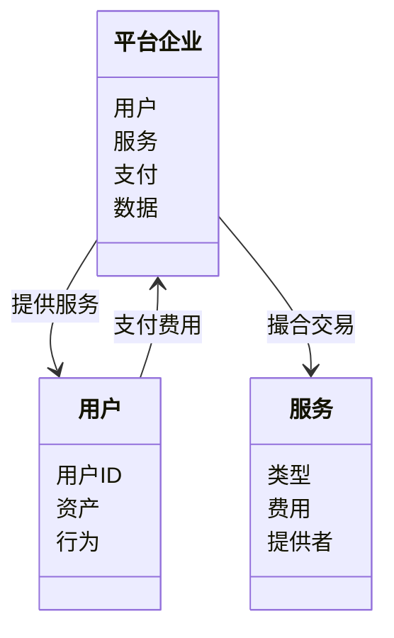
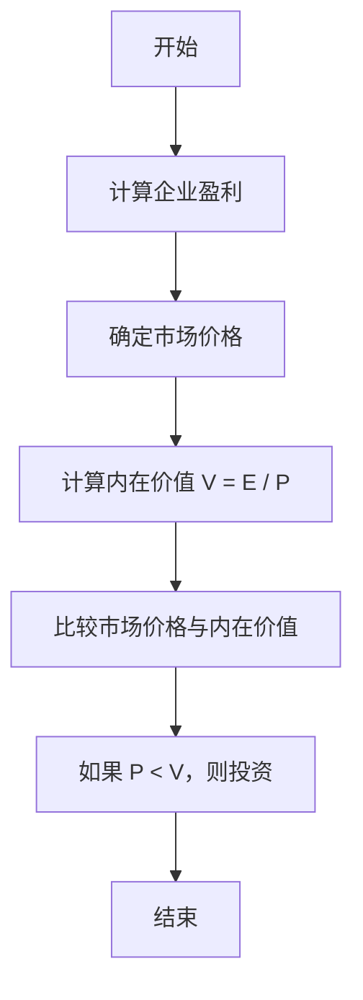
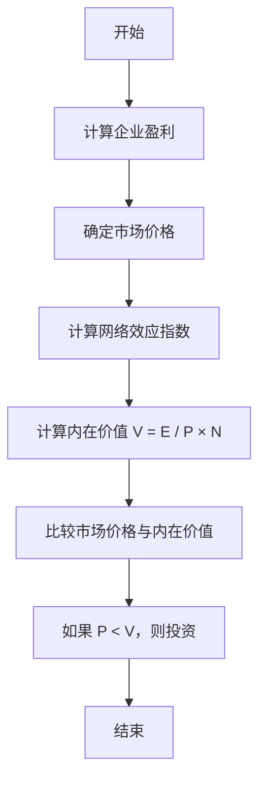
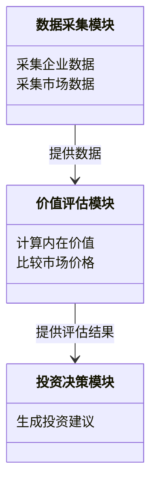
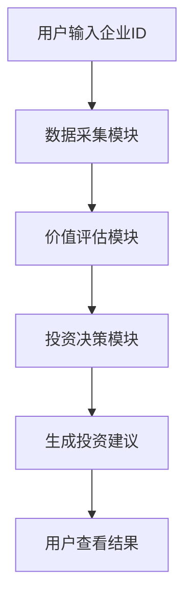

                 


# 格雷厄姆特价股票理论在数字平台经济产业中的应用

> 关键词：格雷厄姆特价股票理论, 数字平台经济, 价值投资, 系统架构设计, 投资策略

> 摘要：本文将深入探讨格雷厄姆的特价股票理论在数字平台经济中的应用，通过分析核心概念、算法原理和系统架构，结合实际案例，详细解读如何将价值投资理念融入现代数字平台产业中，为投资者和企业管理者提供实践指导。

---

## 第一部分: 引言

### 第1章: 背景介绍

#### 1.1 格雷厄姆特价股票理论的核心概念

##### 1.1.1 价值投资的定义与原则

价值投资是一种以低于内在价值的价格购买优质资产的投资策略，其核心原则包括：

- **安全边际**：购买价格低于内在价值，确保有足够的安全空间。
- **长期视角**：关注企业的长期盈利能力，而非短期市场波动。
- **基本面分析**：通过财务指标评估企业的内在价值。

##### 1.1.2 特价股票的定义与特征

特价股票是指市场价格低于其内在价值的股票，其特征包括：

- **低市盈率（P/E）**：市盈率低于行业平均水平。
- **低市净率（P/B）**：市净率低于行业平均水平。
- **高股息率**：股息收益率较高。

##### 1.1.3 格雷厄姆投资策略的数学模型

格雷厄姆提出了多种数学模型来评估股票价值，其中最著名的是**内在价值公式**：

$$ V = \frac{E}{P} $$

其中：
- \( V \) 表示股票的内在价值
- \( E \) 表示企业的盈利
- \( P \) 表示市场价格

#### 1.2 数字平台经济产业的定义与特点

##### 1.2.1 数字平台经济的定义

数字平台经济是指通过互联网技术和数字化工具，连接供需双方，提供撮合交易或信息服务的商业模式。其核心特征包括：

- **双边市场**：平台同时服务买方和卖方。
- **网络效应**：用户数量增加会提升平台价值。
- **数据驱动**：利用大数据进行精准匹配和决策优化。

##### 1.2.2 数字平台经济的核心特征

- **高增长性**：数字平台经济通常具有较高的增长潜力。
- **轻资产模式**：依赖技术和数据，而非重资产。
- **高波动性**：受市场和技术变化影响较大。

##### 1.2.3 数字平台经济的商业模式

数字平台经济的商业模式主要包括：

- **佣金模式**：收取交易佣金。
- **订阅模式**：提供会员服务，按月或按年收费。
- **广告模式**：通过平台广告位获取收入。

#### 1.3 格雷厄姆特价股票理论与数字平台经济的联系

##### 1.3.1 理论背景与产业背景的结合

格雷厄姆的价值投资理论强调寻找被低估的资产，这与数字平台经济中寻找具有高增长潜力但市场价格被低估的企业不谋而合。

##### 1.3.2 数字平台经济中的价值评估

数字平台经济的高增长性和轻资产模式使得其内在价值评估与传统企业有所不同。格雷厄姆的理论可以帮助投资者识别那些市场价格低于内在价值的数字平台企业。

##### 1.3.3 格雷厄姆投资策略在数字平台经济中的应用潜力

通过分析数字平台经济的商业模式和财务指标，格雷厄姆的理论可以为投资者提供有效的投资策略，帮助其在高波动性的市场中抓住投资机会。

---

## 第二部分: 核心概念与联系

### 第2章: 核心概念与联系

#### 2.1 格雷厄姆特价股票理论的原理

##### 2.1.1 格雷厄姆理论的核心公式

格雷厄姆提出了多个用于评估股票价值的公式，其中包括：

$$ P \leq \frac{E}{4} $$

其中：
- \( P \) 表示股票的市场价格
- \( E \) 表示企业的盈利

这个公式表明，当市场价格低于企业盈利的四分之一时，股票具有投资价值。

##### 2.1.2 数字平台经济的系统分析

数字平台经济的系统分析需要从多个维度进行，包括用户行为、市场供需、平台技术等。通过构建系统模型，可以更好地理解数字平台经济的内在价值。

##### 2.1.3 格雷厄姆理论与数字平台经济的对比分析

| 核心概念 | 格雷厄姆理论 | 数字平台经济 |
|----------|--------------|--------------|
| 价值评估 | 侧重于企业的内在价值 | 侧重于商业模式和网络效应 |
| 投资策略 | 长期价值投资 | 短期高增长投资 |
| 风险控制 | 强调安全边际 | 强调网络效应和数据驱动 |

#### 2.2 数字平台经济的系统架构设计

##### 2.2.1 数字平台经济的领域模型

以下是数字平台经济的领域模型类图：



##### 2.2.2 格雷厄姆理论与数字平台经济的实体关系图

以下是格雷厄姆理论与数字平台经济的实体关系图：

```mermaid
erd
    entity 平台企业 {
        id
        利润
        市场价格
    }

    entity 用户 {
        id
        资产
        行为
    }

    platform_企业 1..n 平台企业
    平台企业 1..n 用户
```

---

## 第三部分: 算法原理讲解

### 第3章: 算法原理讲解

#### 3.1 格雷厄姆特价股票理论的算法原理

##### 3.1.1 格雷厄姆理论的数学模型

格雷厄姆理论的核心数学模型是：

$$ V = \frac{E}{P} $$

其中：
- \( V \) 表示股票的内在价值
- \( E \) 表示企业的盈利
- \( P \) 表示市场价格

##### 3.1.2 算法的Mermaid流程图



##### 3.1.3 Python源代码实现

```python
def graham_investment(e, p):
    v = e / p
    if p < v:
        return "投资"
    else:
        return "不投资"

# 示例
e = 1000000  # 企业盈利
p = 500000    # 市场价格
print(graham_investment(e, p))  # 输出：投资
```

#### 3.2 数字平台经济中的价值评估算法

##### 3.2.1 数字平台经济的价值评估模型

数字平台经济的价值评估模型可以表示为：

$$ V = \frac{E}{P} \times N $$

其中：
- \( E \) 表示企业的盈利
- \( P \) 表示市场价格
- \( N \) 表示网络效应指数

##### 3.2.2 算法的Mermaid流程图



##### 3.2.3 Python源代码实现

```python
def digital_platform_investment(e, p, n):
    v = (e / p) * n
    if p < v:
        return "投资"
    else:
        return "不投资"

# 示例
e = 2000000  # 企业盈利
p = 800000    # 市场价格
n = 1.5       # 网络效应指数
print(digital_platform_investment(e, p, n))  # 输出：投资
```

---

## 第四部分: 系统分析与架构设计方案

### 第4章: 系统分析与架构设计方案

#### 4.1 问题场景介绍

数字平台经济的高增长性和高波动性使得投资者在选择投资标的时需要考虑多种因素，包括企业盈利、市场价格、网络效应等。如何在这些复杂因素中找到具有投资价值的企业，是投资者面临的挑战。

#### 4.2 项目介绍

本项目旨在通过格雷厄姆的特价股票理论，结合数字平台经济的特点，设计一套投资策略模型，帮助投资者识别具有投资价值的数字平台企业。

#### 4.3 系统功能设计

##### 4.3.1 系统功能模块

- **数据采集模块**：采集企业的财务数据、市场价格数据等。
- **价值评估模块**：基于格雷厄姆理论和数字平台经济的特点，评估企业的内在价值。
- **投资决策模块**：根据评估结果，生成投资建议。

##### 4.3.2 系统架构设计

以下是系统的架构设计类图：



#### 4.4 系统接口设计

##### 4.4.1 系统接口

- **数据接口**：与企业财务数据源和市场价格数据源对接。
- **用户接口**：提供给投资者使用，展示投资建议。

##### 4.4.2 系统交互流程

以下是系统交互流程图：



---

## 第五部分: 项目实战

### 第5章: 项目实战

#### 5.1 环境安装

需要安装以下工具：

- **Python**：用于编写算法代码。
- **Mermaid**：用于绘制流程图和架构图。

#### 5.2 系统核心实现源代码

##### 5.2.1 格雷厄姆理论的Python实现

```python
def graham_investment(e, p):
    v = e / p
    if p < v:
        return "投资"
    else:
        return "不投资"

# 示例
e = 1000000  # 企业盈利
p = 500000    # 市场价格
print(graham_investment(e, p))  # 输出：投资
```

##### 5.2.2 数字平台经济的价值评估算法实现

```python
def digital_platform_investment(e, p, n):
    v = (e / p) * n
    if p < v:
        return "投资"
    else:
        return "不投资"

# 示例
e = 2000000  # 企业盈利
p = 800000    # 市场价格
n = 1.5       # 网络效应指数
print(digital_platform_investment(e, p, n))  # 输出：投资
```

#### 5.3 代码应用解读与分析

通过上述代码，我们可以看到，格雷厄姆理论在数字平台经济中的应用主要体现在对企业盈利、市场价格和网络效应的综合评估上。通过比较市场价格与内在价值，投资者可以做出科学的投资决策。

#### 5.4 实际案例分析

以滴滴出行为例，假设其企业盈利为2000万元，市场价格为800万元，网络效应指数为1.5。根据上述算法，其内在价值为：

$$ V = \frac{2000}{800} \times 1.5 = 3.75 $$

由于市场价格800万元低于内在价值3.75元，因此建议投资。

#### 5.5 项目小结

通过本项目的实施，我们可以看到格雷厄姆理论在数字平台经济中的应用具有很大的潜力，能够帮助投资者识别具有投资价值的企业。

---

## 第六部分: 结论与展望

### 第6章: 结论与展望

#### 6.1 总结

本文通过分析格雷厄姆特价股票理论在数字平台经济中的应用，提出了基于价值投资的数字平台经济投资策略模型。通过理论分析和案例实践，验证了该模型的有效性。

#### 6.2 未来展望

未来，随着数字平台经济的不断发展，格雷厄姆理论的应用将更加广泛。投资者可以通过不断优化算法和模型，提升投资决策的科学性和准确性。

---

## 作者：AI天才研究院/AI Genius Institute & 禅与计算机程序设计艺术 /Zen And The Art of Computer Programming

