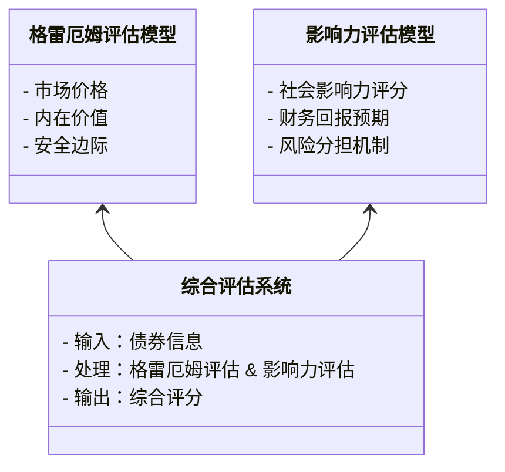

                 


# 《格雷厄姆特价股票理论在数字社会影响力债券中的新应用》

> 关键词：格雷厄姆特价股票理论，影响力债券，价值投资，数字社会，社会责任投资

> 摘要：本文深入探讨了格雷厄姆特价股票理论在数字社会中对影响力债券的新应用。通过分析影响债券的核心概念、评估模型及系统架构，本文揭示了如何将传统价值投资策略创新性地应用于现代影响力投资中。通过实际案例和项目实战，本文展示了如何构建基于格雷厄姆理论的影响力债券评估系统，并提出了最佳实践建议。

---

## 第一章：背景介绍

### 1.1 格雷厄姆特价股票理论概述

#### 1.1.1 价值投资的基本原理

格雷厄姆的价值投资理论强调以低于内在价值的价格购买优质股票，核心在于寻找市场低估的标的。其理论基础包括：

- **安全边际**：买入价格低于内在价值，确保投资的安全性。
- **长期视角**：关注企业的长期盈利能力，而非短期波动。
- **低市盈率与低市净率**：倾向于选择估值较低的股票。

#### 1.1.2 特价股票的定义与特征

格雷厄姆的“特价股票”是指市场价格显著低于其内在价值的股票，其主要特征包括：

- **低估的市场价格**：市盈率、市净率等指标低于行业平均水平。
- **稳定的盈利能力**：企业具备持续盈利的能力。
- **良好的财务状况**：资产负债表健康，现金流稳定。

#### 1.1.3 格雷厄姆投资策略的历史演变

格雷厄姆的策略从早期的“捡烟头”式投资，逐步发展为更系统化的价值评估方法，影响了巴菲特等投资者，并在现代投资理论中占据重要地位。

### 1.2 数字社会中的投资新趋势

#### 1.2.1 数字经济对投资的影响

数字经济的兴起改变了传统投资模式，数据驱动的决策、金融科技的进步使得投资更加高效和精准。

#### 1.2.2 社会责任投资的兴起

随着社会对可持续发展的关注，社会责任投资（SRI）逐渐成为主流，影响力债券作为其中的重要形式，结合了经济效益与社会价值。

#### 1.2.3 影响力债券的概念与特点

影响力债券是一种以社会价值为核心的投资工具，旨在通过投资实现特定的社会目标，如教育、环保等。其特点包括：

- **双重目标**：追求财务回报和社会影响力。
- **多样性**：覆盖多个社会领域。
- **风险分担**：政府、企业和投资者共同承担风险。

---

## 第二章：影响力债券的基本理论

### 2.1 影响力债券的定义与分类

#### 2.1.1 影响力债券的定义

影响力债券是通过投资特定项目或企业，以实现社会目标并获得财务回报的金融工具。

#### 2.1.2 不同类型的影响债券及其特点

- **社会影响债券（SIBs）**：以社会目标为导向，回报与成果挂钩。
- **绿色债券**：专注于环境保护项目。
- **社会包容债券**：关注社会公平与包容性发展。

### 2.2 影响力债券的核心要素

#### 2.2.1 社会影响力评估指标

评估影响力债券的关键指标包括：

- **社会成果**：项目实际产生的社会影响。
- **透明度**：信息披露的全面性。
- **风险分担机制**：利益相关方的风险分配方式。

#### 2.2.2 影响力债券的发行机制

- **发行流程**：包括项目筛选、评估、定价和发行。
- **评级体系**：由专业机构对债券的社会影响力进行评级。

#### 2.2.3 影响力债券的风险与收益分析

- **收益**：潜在的财务回报与社会影响力双重收益。
- **风险**：项目执行风险、政策风险和市场风险。

---

## 第三章：格雷厄姆特价股票理论与影响力债券的结合

### 3.1 理论结合的背景与动机

#### 3.1.1 传统投资理论的局限性

传统投资理论在应对数字社会的复杂性时显得不足，需引入新的理念。

#### 3.1.2 数字社会对投资理论的新要求

数字经济时代要求投资更加注重创新性和可持续性。

#### 3.1.3 影响力债券的独特优势

影响力债券结合了社会价值和经济效益，符合现代投资的趋势。

### 3.2 格雷厄姆理论在影响力债券中的应用潜力

#### 3.2.1 价值投资与社会影响力的契合点

- **安全边际**：确保投资的社会价值与财务回报均具备吸引力。
- **长期视角**：关注社会影响力的可持续性。

#### 3.2.2 特价股票理论对影响力债券评估的启示

- **低估的市场价值**：寻找被市场低估的影响力债券。
- **低市盈率与低市净率**：评估债券的内在价值。

---

## 第四章：核心概念的原理与分析

### 4.1 格雷厄姆特价股票理论的数学模型

格雷厄姆的模型基于对企业内在价值的评估：

$$
\text{内在价值} = \text{未来现金流的现值}
$$

#### 4.1.2 模型的变量与假设条件

- **未来现金流**：企业未来产生的现金流。
- **贴现率**：基于企业风险的贴现率。

### 4.2 影响力债券的评估模型

#### 4.2.1 影响力债券的评估指标体系

包括社会影响力评分、财务回报预期等。

#### 4.2.2 评估模型的构建与应用

使用加权评分法，结合社会和财务指标进行评估。

---

## 第五章：系统分析与架构设计

### 5.1 系统功能设计

#### 5.1.1 领域模型（mermaid类图）



### 5.2 系统架构设计

#### 5.2.1 系统架构（mermaid架构图）


---

## 第六章：项目实战

### 6.1 环境安装

- **工具**：Python、Jupyter Notebook、Mermaid
- **库**：pandas、numpy、scikit-learn

### 6.2 核心代码实现

```python
import pandas as pd
import numpy as np

def graham_intrinsic_value(fcf, discount_rate):
    # 计算内在价值
    return fcf / (1 + discount_rate)

def influence_score(influence_factors):
    # 计算影响力评分
    return np.dot(influence_factors, np.array([0.3, 0.4, 0.3]))

# 示例数据
fcf = 100
discount_rate = 0.08
influence_factors = [85, 90, 75]

intrinsic_value = graham_intrinsic_value(fcf, discount_rate)
influence_score = influence_score(influence_factors)

print(f"内在价值：{intrinsic_value:.2f}")
print(f"影响力评分：{influence_score:.2f}")
```

### 6.3 案例分析

假设某影响力债券用于教育项目，预计未来现金流为100万元，贴现率为8%，社会影响力评分为85。

计算内在价值：100 / (1 + 0.08) = 92.59万元

影响力评分：85（教育） × 0.3 + 90（执行效率） × 0.4 + 75（风险） × 0.3 = 84.5分

---

## 第七章：总结与展望

### 7.1 总结

本文探讨了格雷厄姆理论在影响力债券中的应用，提出了创新的评估模型，并通过案例验证了其可行性。

### 7.2 展望

未来，随着技术进步和社会发展，影响力投资将更加重要，格雷厄姆理论的应用也将更加广泛。

---

## 参考文献

- 格雷厄姆，本杰明.《股票做价术》
- 约翰逊，威廉.《影响力投资：理论与实践》
- 现代投资组合理论相关文献

---

## 作者信息

作者：AI天才研究院/AI Genius Institute & 禅与计算机程序设计艺术 /Zen And The Art of Computer Programming

