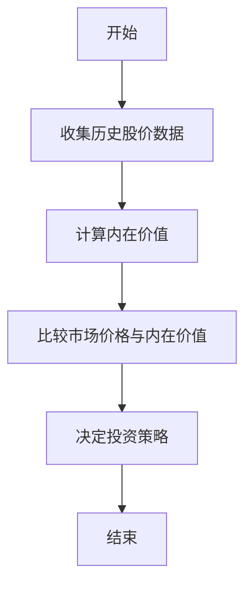
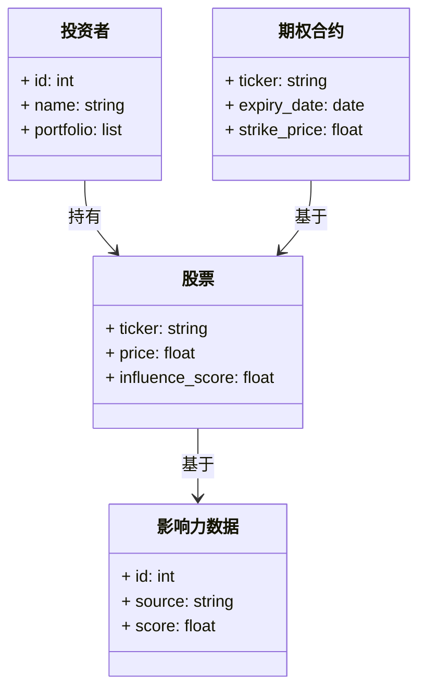

                 


# 格雷厄姆特价股票理论在数字社会影响力期权中的新应用

## 关键词：格雷厄姆理论、影响力期权、数字社会、价值投资、算法实现

## 摘要：本文探讨了格雷厄姆价值投资理论在数字社会背景下的新应用，特别是其在影响力期权中的潜力。通过分析数字社会的特点、影响力期权的特性，结合格雷厄姆的选股方法，提出了一种新的投资策略，并详细介绍了其数学模型和算法实现。

---

## 第一部分: 格雷厄姆特价股票理论与数字社会影响力期权的背景介绍

### 第1章: 格雷厄姆投资理论的起源与核心思想

#### 1.1 格雷厄姆价值投资理论的起源
- **投资理论的演进历程**：从早期的道氏理论到现代的量化投资，价值投资始终是核心流派之一。
- **格雷厄姆的核心理念**：寻找市场低估的股票，关注安全边际，注重内在价值而非市场波动。

#### 1.2 数字社会与影响力期权的基本概念
- **数字社会的定义**：以互联网和社交媒体为基础的社会形态，影响力成为关键资源。
- **影响力期权的定义**：基于数字影响力的投资工具，反映了社交媒体对股票价值的影响。

#### 1.3 格雷厄姆理论与影响力期权的结合背景
- **传统股票投资的局限性**：市场波动大，难以预测。
- **数字社会中的投资机会**：社交媒体影响力成为新的价值指标。
- **现代应用潜力**：格雷厄姆理论在数字时代的新应用。

---

## 第二部分: 核心概念与联系

### 第2章: 核心概念的原理与联系

#### 2.1 格雷厄姆理论的核心原理
- **价值投资公式**：内在价值 = 股东权益 + 流动资产 - 流动负债。
- **市场先生的角色**：市场波动为投资者提供了机会。

#### 2.2 影响力期权的数学模型与属性特征
- **影响力指数计算**：基于社交媒体数据的影响力评分。
- **期权定价模型**：结合影响力指数和传统期权定价公式。

#### 2.3 格雷厄姆理论与影响力期权的ER实体关系图
```mermaid
erDiagram
    投资者
    数字平台
    市场监管机构
    股票
    影响力数据
    期权合约
    投资者 --> 股票: 持有
    数字平台 --> 影响力数据: 收集
    期权合约 --> 股票: 基于
    市场监管机构 --> 期权合约: 监管
```

---

## 第三部分: 格雷厄姆理论在影响力期权中的算法原理

### 第3章: 格雷厄姆理论与影响力期权的算法实现

#### 3.1 格雷厄姆理论的算法流程


#### 3.2 影响力期权的预测
```python
import pandas as pd
import numpy as np
from sklearn.linear_model import LinearRegression

# 假设数据集包含社交媒体影响力评分和股票价格
data = pd.DataFrame({
    '影响力评分': [70, 80, 65, 90, 85],
    '股票价格': [100, 110, 90, 130, 120]
})

# 使用线性回归模型预测影响力评分对股票价格的影响
model = LinearRegression()
model.fit(data[['影响力评分']], data['股票价格'])

# 预测新的影响力评分对应的股票价格
new_influence = np.array([[75]])
predicted_price = model.predict(new_influence)
print(f'预测股票价格为: {predicted_price[0]:.2f}')
```

---

## 第四部分: 系统分析与架构设计方案

### 第4章: 系统架构设计

#### 4.1 应用场景介绍
- **数据来源**：社交媒体平台、股票市场数据。
- **用户需求**：投资者需要基于影响力数据的投资建议。

#### 4.2 系统功能设计


#### 4.3 系统架构图


---

## 第五部分: 项目实战

### 第5章: 项目实战

#### 5.1 环境安装
- **工具安装**：Python、Pandas、Scikit-learn、Mermaid。

#### 5.2 核心代码实现
```python
import pandas as pd
from sklearn.linear_model import LinearRegression
from sklearn.metrics import mean_squared_error

# 数据加载
data = pd.read_csv('influence.csv')

# 模型训练
model = LinearRegression()
model.fit(data[['influence_score']], data['stock_price'])

# 预测与评估
predictions = model.predict(data[['influence_score']])
print(f'均方误差: {mean_squared_error(data["stock_price"], predictions)}')
```

#### 5.3 案例分析
- **案例选择**：选择具有高社交媒体影响力的公司。
- **数据分析**：计算影响力评分与股价的相关性。
- **结果解读**：验证模型的预测准确性。

---

## 第六部分: 最佳实践

### 第6章: 最佳实践

#### 6.1 小结
- 格雷厄姆理论在数字社会中的应用潜力巨大，特别是在影响力期权领域。
- 组合分析与实时数据监控是提升投资效果的关键。

#### 6.2 注意事项
- 数据质量：确保社交媒体数据的准确性和代表性。
- 风险管理：合理控制投资风险，避免过度依赖模型预测。

#### 6.3 拓展阅读
- 推荐阅读格雷厄姆的《 Intelligent Investor》。
- 关注最新的影响力经济和金融科技动态。

---

## 作者：AI天才研究院/AI Genius Institute & 禅与计算机程序设计艺术 /Zen And The Art of Computer Programming

---

**摘要**：本文通过详细分析格雷厄姆价值投资理论在数字社会中的应用，特别是其在影响力期权中的新应用，展示了如何利用传统投资理论应对现代金融挑战。通过结合影响力评分、期权定价模型和机器学习算法，本文提出了一种创新的投资策略，为投资者提供了新的思路和工具。

