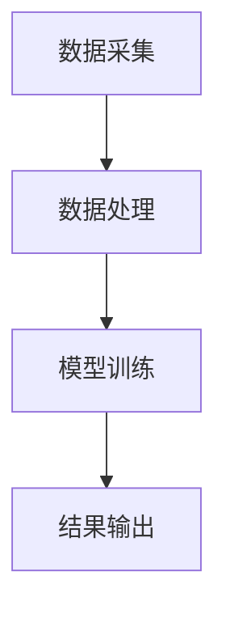
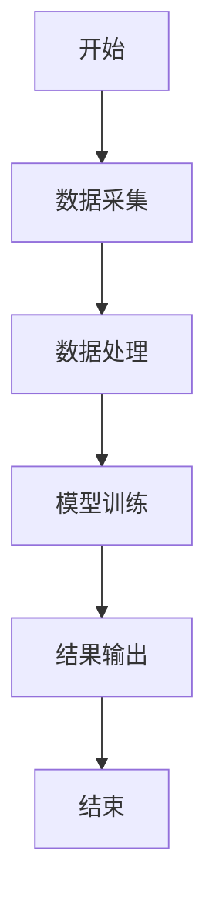

                 

# 格雷厄姆特价股票理论在社会企业家投资中的运用

## 关键词：格雷厄姆投资理论，社会企业家，价值投资，安全边际，社会价值评估

## 摘要：本文探讨了格雷厄姆特价股票理论在社会企业家投资中的应用，通过分析社会企业家的特征和财务结构，结合格雷厄姆的安全边际和内在价值理论，提出了一种新的投资策略，旨在实现经济效益与社会价值的双重目标。

---

# 第一部分：格雷厄姆投资理论基础

## 第1章：格雷厄姆投资理论概述

### 1.1 格雷厄姆投资理论的核心概念

#### 1.1.1 价值投资的定义与特征
价值投资是一种以低于内在价值的价格购买优质资产的投资策略。格雷厄姆强调，投资者应关注企业的基本面，寻找被市场低估的投资标的。

#### 1.1.2 格雷厄姆的安全边际理论
安全边际是指股票的内在价值与市场价格之间的差距。通过安全边际，投资者可以在市场波动中降低风险，确保投资的稳健性。

#### 1.1.3 股票的内在价值与市场价值
内在价值是基于企业财务状况和未来盈利能力计算出的理论价值，而市场价值则是由供需关系决定的。格雷厄姆认为，内在价值是投资决策的核心依据。

### 1.2 格雷厄姆的投资原则

#### 1.2.1 质价比（P/E Ratio）与投资决策
质价比是衡量股票价值的重要指标。格雷厄姆建议投资者选择质价比低于行业平均水平的股票，以确保投资的安全性。

#### 1.2.2 低市盈率股票的投资机会
低市盈率股票通常具有较高的内在价值，是价值投资的理想选择。格雷厄姆通过筛选低市盈率股票，实现了长期稳定的收益。

#### 1.2.3 避免情绪化投资的重要性
格雷厄姆强调，投资者应避免受市场情绪的影响，坚持理性投资，以实现长期的财富增长。

## 第2章：格雷厄姆特价股票筛选方法

### 2.1 特价股票的定义与筛选标准

#### 2.1.1 特价股票的定义
特价股票是指市场价格低于内在价值的股票。格雷厄姆通过多维度分析，筛选出具有投资潜力的特价股票。

#### 2.1.2 格雷厄姆筛选特价股票的五种标准
1. **低市盈率**：市盈率低于行业平均水平。
2. **低市净率**：市净率低于行业平均水平。
3. **高股息率**：股息率高于行业平均水平。
4. **财务健康**：企业财务状况稳健，无重大财务风险。
5. **行业地位**：企业处于具有发展潜力的行业，并且具有竞争优势。

#### 2.1.3 特价股票的市场周期性分析
格雷厄姆指出，特价股票的出现具有周期性，通常在市场低迷期出现较多。投资者应关注市场周期，抓住投资机会。

### 2.2 格雷厄姆的多因素分析法

#### 2.2.1 财务报表分析与股票筛选
格雷厄姆通过分析企业的财务报表，评估企业的盈利能力、财务状况和成长潜力，从而筛选出具有投资价值的股票。

#### 2.2.2 市盈率、市净率与股息率的综合分析
格雷厄姆认为，市盈率、市净率和股息率是衡量股票价值的重要指标。通过综合分析这些指标，可以更准确地评估股票的内在价值。

#### 2.2.3 行业分析与公司基本面评估
格雷厄姆强调，行业分析和公司基本面评估是筛选特价股票的重要步骤。投资者应选择具有竞争优势和成长潜力的行业中的优质企业。

## 第3章：格雷厄姆投资理论的数学模型与公式

### 3.1 格雷厄姆的内在价值计算公式

#### 3.1.1 内在价值公式
$$
内在价值 = \frac{E}{(Y - r)}
$$
其中，$E$ 是企业的年收益，$Y$ 是预期收益增长率，$r$ 是资本成本。

#### 3.1.2 案例分析：如何计算某公司的内在价值
假设某公司年收益为 $100万，预期收益增长率为 10%，资本成本为 8%，则其内在价值为：
$$
内在价值 = \frac{100}{(1.1 - 0.08)} = \frac{100}{1.02} \approx 98.04万
$$

### 3.2 安全边际的数学模型

#### 3.2.1 安全边际公式
$$
安全边际 = 内在价值 - 市场价格
$$

#### 3.2.2 如何通过安全边际选择投资标的
假设某股票的内在价值为 $100，市场价格为 $80，则其安全边际为 $20。投资者可以考虑买入该股票，因为安全边际较大，投资风险较低。

### 3.3 质价比的计算与应用

#### 3.3.1 质价比公式
$$
P/E = \frac{市场价格}{每股收益}
$$

#### 3.3.2 质价比在投资决策中的应用
假设某股票的市场价格为 $50，每股收益为 $5，则其质价比为：
$$
P/E = \frac{50}{5} = 10
$$
如果行业平均水平的质价比为 15，则该股票具有较高的投资价值。

---

# 第二部分：社会企业家与投资的结合

## 第4章：社会企业家的定义与特征

### 4.1 社会企业家的定义

#### 4.1.1 社会企业家的定义与特征
社会企业家是以社会使命为导向的企业家，旨在通过商业活动实现社会价值和经济效益的双重目标。与传统企业家相比，社会企业家更关注社会责任和可持续发展。

#### 4.1.2 社会企业家与传统企业的区别
传统企业以经济效益为核心目标，而社会企业家则强调社会价值和可持续发展。社会企业家在商业模式、治理结构和价值创造方式上具有独特性。

## 第5章：社会企业家的财务特征与投资分析

### 5.1 社会企业家的财务透明度

#### 5.1.1 财务报表分析与社会价值评估
社会企业家的财务报表需要反映其社会价值和经济效益。投资者可以通过分析财务报表，评估企业的盈利能力、财务健康和成长潜力。

#### 5.1.2 社会企业家的财务指标与投资决策
社会企业家的财务指标与传统企业相似，但需要额外关注社会责任指标，如社会责任报告、员工福利和社会贡献等。

### 5.2 社会企业家的治理结构

#### 5.2.1 股权结构与治理模式
社会企业家的股权结构通常较为分散，强调股东的长期利益和社会责任。治理模式注重透明度和参与性，确保社会价值的实现。

#### 5.2.2 社会责任报告与投资者信任
社会企业家需要定期发布社会责任报告，向投资者展示其在社会价值创造方面的努力和成果。这有助于建立投资者的信任和长期合作关系。

## 第6章：社会企业家投资的伦理与道德考量

### 6.1 投资的社会责任与伦理

#### 6.1.1 投资的社会责任
投资者在选择社会企业家时，应关注其商业模式和治理结构是否符合社会责任和可持续发展的要求。

#### 6.1.2 投资的道德考量
社会企业家的投资决策需要考虑其对社会和环境的影响，避免短期利益驱动，追求长期的可持续发展。

---

# 第三部分：格雷厄姆理论在社会企业家投资中的应用

## 第7章：社会价值评估与投资策略

### 7.1 社会价值评估的定义与方法

#### 7.1.1 社会价值评估的定义
社会价值评估是指通过量化和社会化的方式，评估企业在社会价值创造方面的贡献。

#### 7.1.2 社会价值评估的方法
1. **社会责任指标**：评估企业对社会责任的履行情况。
2. **社会影响力评估**：评估企业在社会和环境方面的影响力。
3. **社会价值创造评估**：评估企业在社会价值创造方面的努力和成果。

### 7.2 社会价值评估与投资决策

#### 7.2.1 社会价值评估在投资决策中的应用
投资者可以通过社会价值评估，筛选出具有社会价值创造潜力的企业，实现经济效益与社会价值的双重目标。

#### 7.2.2 格雷厄姆理论与社会价值评估的结合
格雷厄姆的内在价值理论可以与社会价值评估相结合，形成一种新的投资策略，帮助投资者在社会企业家中筛选出具有投资价值的标的。

---

# 第四部分：系统架构与案例分析

## 第8章：系统架构与算法设计

### 8.1 系统架构设计

#### 8.1.1 系统功能模块
1. **数据采集**：收集企业的财务数据、社会责任数据等。
2. **数据处理**：对数据进行清洗、转换和分析。
3. **模型训练**：基于格雷厄姆理论和社交价值评估，建立投资模型。
4. **结果输出**：输出投资建议和风险评估报告。

#### 8.1.2 系统架构图

### 8.2 算法设计与实现

#### 8.2.1 算法原理
基于格雷厄姆的安全边际理论和社会价值评估，建立一个多目标优化模型，实现经济效益与社会价值的双重优化。

#### 8.2.2 算法流程图

## 第9章：案例分析与实际应用

### 9.1 案例分析

#### 9.1.1 案例背景
某社会企业家专注于可持续发展，致力于减少碳排放和推动社会公平。

#### 9.1.2 数据分析
通过分析该企业的财务数据和社会责任报告，评估其内在价值和市场价值。

#### 9.1.3 投资决策
基于格雷厄姆理论和社会价值评估，建议投资者买入该股票，因其具有较高的安全边际和社会价值创造潜力。

### 9.2 实际应用

#### 9.2.1 投资策略
投资者可以采用格雷厄姆的安全边际理论，结合社会价值评估，筛选出具有投资价值的社会企业家。

#### 9.2.2 风险管理
投资者应关注市场周期和社会风险，合理配置资产，分散投资风险。

---

# 结论

## 10.1 主要观点总结
格雷厄姆的特价股票理论在社会企业家投资中具有重要的应用价值。通过结合社会价值评估和传统财务分析，投资者可以在实现经济效益的同时，推动社会价值的创造。

## 10.2 未来研究方向
未来的研究可以进一步探索技术与伦理的结合，推动社会企业家投资的创新与发展。

---

## 作者：AI天才研究院/AI Genius Institute & 禅与计算机程序设计艺术 /Zen And The Art of Computer Programming

---

感谢您的阅读！希望这篇文章能为您提供有价值的投资思路和实践指导。

