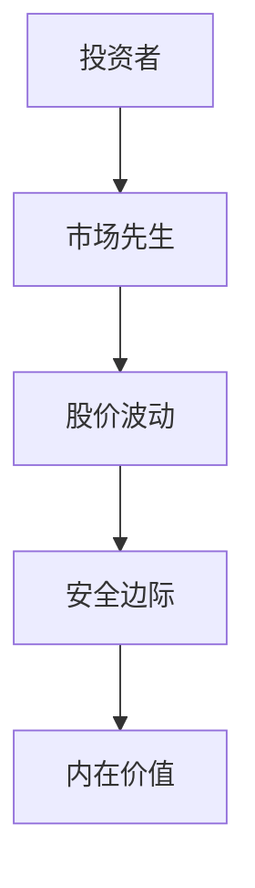
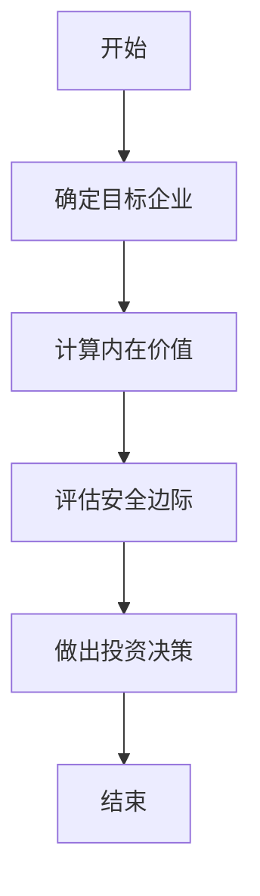
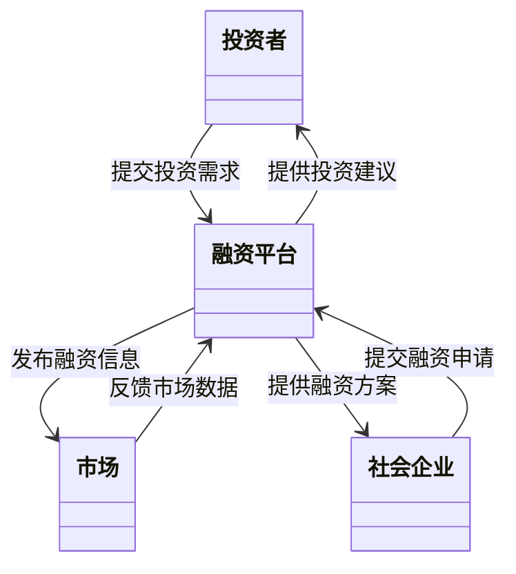
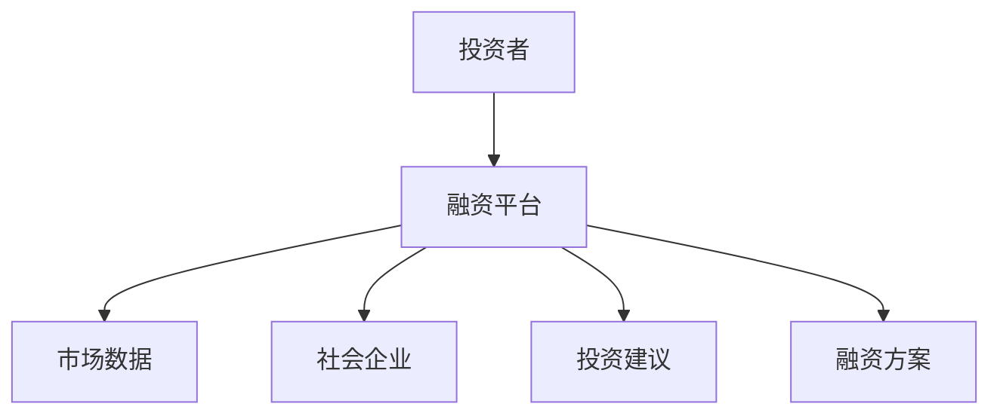
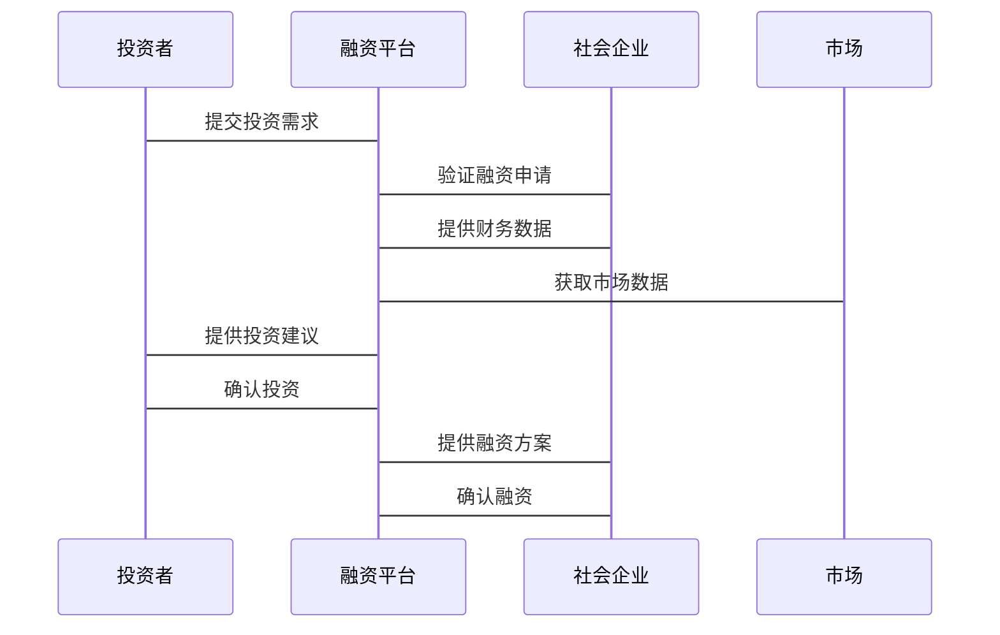

                 


---

# 格雷厄姆特价股票理论在社会企业融资中的运用

> 关键词：格雷厄姆投资理论，社会企业，融资，价值投资，特价股票

> 摘要：本文探讨了格雷厄姆的价值投资理论在社会企业融资中的应用，通过分析特价股票的核心概念、算法模型及系统设计，展示了如何将格雷厄姆理论与社会企业融资相结合，以实现可持续投资和社会价值的双重目标。

---

## 第一部分: 格雷厄姆特价股票理论与社会企业融资概述

### 第1章: 格雷厄姆特价股票理论基础

#### 1.1 格雷厄姆投资理论的起源与核心思想
格雷厄姆是价值投资的鼻祖，其理论强调以低于内在价值的价格买入股票。他提出的核心思想包括：
- **内在价值**：企业未来现金流的现值，是衡量股票价值的标准。
- **安全边际**：买入价格与内在价值的差距，确保投资的安全性。
- **市场先生**：市场情绪波动对企业估值的影响。

#### 1.2 社会企业的定义与特点
社会企业是以创造社会价值为核心目标的企业，其特点包括：
- **社会使命**：致力于解决社会问题。
- **财务可持续性**：通过商业运作实现自我造血。
- **透明度**：信息公开，接受社会监督。

#### 1.3 格雷厄姆理论与社会企业融资的结合
社会企业在融资过程中，同样需要考虑投资回报和社会影响力的双重目标。格雷厄姆的理论为社会企业提供了一种以价值为导向的融资方式，帮助企业在获得资金的同时实现可持续发展。

---

### 第2章: 格雷厄姆特价股票理论的核心概念与联系

#### 2.1 核心概念原理
- **内在价值**：通过DCF模型计算企业未来现金流的现值，确定其合理估值。
- **安全边际**：买入价格低于内在价值，以降低市场波动带来的风险。
- **市场先生**：市场情绪的波动会影响股价，但长期来看，股价会回归其内在价值。

#### 2.2 核心概念属性特征对比表格
| 概念       | 特点                                         |
|------------|----------------------------------------------|
| 内在价值   | 企业未来现金流的现值，独立于市场波动         |
| 安全边际   | 买入价格与内在价值的差距，提供安全保护         |
| 市场先生    | 市场情绪的波动性，影响短期股价，但不影响长期价值 |

#### 2.3 ER实体关系图（Mermaid流程图）


---

### 第3章: 格雷厄姆特价股票理论的数学模型与公式

#### 3.1 内在价值计算公式
$$ V = \frac{E}{1 + r} $$
其中，\( V \) 是内在价值，\( E \) 是未来现金流，\( r \) 是折现率。

#### 3.2 安全边际计算公式
$$ M = V - P $$
其中，\( M \) 是安全边际，\( V \) 是内在价值，\( P \) 是市场价格。

#### 3.3 投资决策模型


---

## 第二部分: 社会企业融资中的系统分析与架构设计

### 第4章: 系统分析与架构设计

#### 4.1 问题场景介绍
社会企业在融资过程中，通常面临以下问题：
- 投资者难以准确评估其社会价值。
- 股价波动较大，市场先生的影响显著。
- 缺乏专门的融资工具和评估体系。

#### 4.2 系统功能设计（Mermaid类图）


#### 4.3 系统架构设计（Mermaid架构图）


#### 4.4 系统接口设计和交互流程


---

## 第三部分: 项目实战与总结

### 第5章: 项目实战

#### 5.1 环境安装
- 安装Python和相关库（numpy, pandas, matplotlib）。
- 安装Mermaid工具和Markdown编辑器。

#### 5.2 核心代码实现
```python
import numpy as np
import pandas as pd

def calculate_intrinsic_value(future_cash_flows, discount_rate):
    return np.sum(future_cash_flows / (1 + discount_rate) ** np.arange(len(future_cash_flows)))

def calculate_margin_of_safety(intrinsic_value, market_price):
    return intrinsic_value - market_price

# 示例数据
future_cash_flows = [100, 200, 300]  # 未来三年现金流
discount_rate = 0.05
intrinsic_value = calculate_intrinsic_value(future_cash_flows, discount_rate)
market_price = 250
margin_of_safety = calculate_margin_of_safety(intrinsic_value, market_price)

print(f"内在价值: {intrinsic_value}")
print(f"安全边际: {margin_of_safety}")
```

#### 5.3 代码解读与分析
- `calculate_intrinsic_value`函数计算内在价值，使用未来现金流的折现值求和。
- `calculate_margin_of_safety`函数计算安全边际，评估投资的安全性。

#### 5.4 实际案例分析
假设某社会企业未来三年现金流分别为100万、200万、300万，折现率为5%，市场价为250万。计算得出内在价值为350万，安全边际为100万，表明投资具有较高的安全性。

---

### 第6章: 总结

#### 6.1 最佳实践
- 投资者应关注企业的内在价值和社会影响力。
- 社会企业应建立透明的财务和运营体系，吸引价值投资者。
- 融资平台需开发专门的评估工具，帮助投资者和企业实现双赢。

#### 6.2 小结
格雷厄姆的价值投资理论为社会企业融资提供了一种新的视角，通过内在价值和安全边际的评估，投资者可以在追求财务回报的同时，支持社会企业发展，实现可持续投资的目标。

#### 6.3 注意事项
- 投资者需谨慎评估市场波动和企业风险。
- 社会企业需确保财务数据的透明性和真实性。
- 融资平台应注重技术开发和数据分析能力，提供精准的投资建议。

#### 6.4 拓展阅读
- 《The Intelligent Investor》——本杰明·格雷厄姆
- 《社会企业的融资模式创新》——相关学术研究

---

作者：AI天才研究院/AI Genius Institute & 禅与计算机程序设计艺术 /Zen And The Art of Computer Programming

