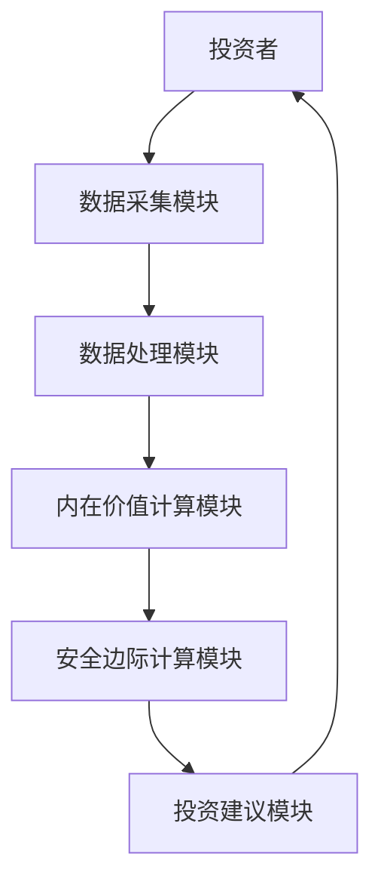

                 


# 格雷厄姆特价股票理论在风险投资中的运用

## 关键词：格雷厄姆，价值投资，安全边际，风险投资，内在价值，估值模型

## 摘要：  
格雷厄姆特价股票理论是价值投资的重要基石，其核心理念在于寻找被市场低估的股票，并通过安全边际的计算来降低投资风险。本文将深入探讨格雷厄姆理论在风险投资中的应用，结合数学模型和实际案例，分析其在筛选投资标的、评估内在价值以及制定投资策略中的作用。通过系统化的方法，本文旨在为风险投资者提供一种基于格雷厄姆理论的科学投资框架，帮助其在复杂多变的市场环境中做出明智的投资决策。

---

## 第一章: 格雷厄姆特价股票理论的背景与发展

### 1.1 格雷厄姆投资理论的背景  
本杰明·格雷厄姆（Benjamin Graham）被誉为“价值投资之父”，他的投资理念深刻影响了全球的投资者。格雷厄姆的核心思想是：股票不仅仅是一个交易工具，更应该被视为企业的部分所有权。他强调，投资者应关注企业的内在价值，而非市场的短期波动。  

#### 格雷厄姆的生平与贡献  
格雷厄姆于1894年出生于纽约，曾是华尔街著名投资家，后转向学术界，成为哥伦比亚大学商学院的教授。他与戴维·多德（David Dodd）合著的《证券分析》（1934年）奠定了价值投资的理论基础。  

#### 格雷厄姆理论的核心思想  
格雷厄姆提出，股票的内在价值是其未来现金流的现值。他强调，投资者应以低于内在价值的价格买入股票，并在市场恐慌时寻找被低估的投资机会。  

---

### 1.2 格雷厄姆特价股票理论的核心概念  

#### 安全边际  
安全边际是格雷厄姆理论中的核心概念，指股票的市场价格与内在价值之间的差距。安全边际越大，投资的风险越小。  

$$ \text{安全边际} = \text{内在价值} - \text{市场价格} $$  

#### 内在价值  
内在价值是股票在未来现金流的现值。格雷厄姆认为，内在价值可以通过对企业财务状况、盈利能力和发展前景的分析来估算。  

$$ \text{内在价值} = \sum_{t=1}^{n} \frac{\text{未来现金流}}{(1 + r)^t} $$  

#### 低市盈率与低市净率股票  
格雷厄姆偏好市盈率（P/E）和市净率（P/B）低于行业平均水平的股票，因为这些股票通常具有较高的安全边际。  

---

## 第二章: 格雷厄姆特价股票理论在风险投资中的应用

### 2.1 风险投资的核心要素  

#### 风险投资的定义与特点  
风险投资是指将资金投入高成长性企业，通过企业的增值实现投资收益。与传统投资相比，风险投资具有高风险、高回报的特点。  

#### 风险投资与传统投资的区别  
- **传统投资**：注重企业的当前盈利和估值，关注市场波动。  
- **风险投资**：注重企业的未来增长潜力，关注团队、技术和发展空间。  

---

### 2.2 格雷厄姆理论在风险投资中的适用性  

#### 安全边际在风险投资中的重要性  
在风险投资中，安全边际可以帮助投资者识别被低估的企业，降低投资风险。  

#### 内在价值评估的风险  
由于风险投资中的企业未来现金流难以准确预测，内在价值的估算具有较高的不确定性。  

#### 估值误差的影响  
格雷厄姆强调，即使存在估值误差，安全边际也能为投资者提供保护。  

---

## 第三章: 格雷厄姆理论与风险投资的结合

### 3.1 风险投资中的安全边际策略  

#### 安全边际的计算方法  
投资者可以通过比较企业的内在价值和市场价值来计算安全边际。  

$$ \text{安全边际} = \text{内在价值} - \text{市场价值} $$  

#### 安全边际的应用  
- 在市场恐慌时，寻找安全边际较大的股票。  
- 在市场繁荣时，避免买入安全边际过低的股票。  

---

### 3.2 格雷厄姆理论在风险投资中的策略  

#### 股票筛选标准  
- **低市盈率**：P/E < 行业平均值。  
- **低市净率**：P/B < 行业平均值。  
- **高股息率**：股息收益率高于行业平均水平。  

#### 组合管理策略  
- 分散投资：避免将资金集中在单一股票上。  
- 定期调整：根据市场变化和企业状况，及时调整投资组合。  

---

## 第四章: 系统分析与架构设计

### 4.1 系统功能设计  

#### 系统目标  
构建一个基于格雷厄姆理论的投资评估系统，帮助投资者筛选具有安全边际的股票。  

#### 功能模块  
- 数据采集：收集企业的财务数据和市场数据。  
- 内在价值计算：估算股票的内在价值。  
- 安全边际计算：计算股票的安全边际。  
- 投资建议：根据安全边际和估值结果，给出投资建议。  

---

### 4.2 系统架构设计  

#### 系统架构图  


#### 系统接口设计  
- 数据接口：与金融数据源对接，获取实时数据。  
- 用户接口：提供用户友好的界面，方便投资者使用。  

---

## 第五章: 项目实战

### 5.1 环境安装  

#### 系统环境  
- 操作系统：Linux/Windows/MacOS  
- 开发工具：Python、Jupyter Notebook  
- 数据源：金融数据库（如Yahoo Finance）  

#### 安装依赖  
```bash
pip install pandas numpy matplotlib
```

---

### 5.2 核心代码实现  

#### 内在价值计算  
```python
import pandas as pd
import numpy as np

def calculate_intrinsic_value(revenue, profit_margin, discount_rate):
    cash_flow = revenue * profit_margin
    intrinsic_value = cash_flow / (1 + discount_rate)
    return intrinsic_value

revenue = 1000000  # 示例收入
profit_margin = 0.1  # 示例利润率
discount_rate = 0.05  # 示例贴现率

iv = calculate_intrinsic_value(revenue, profit_margin, discount_rate)
print(f"内在价值：{iv}")
```

---

### 5.3 案例分析  

#### 案例背景  
某科技公司收入为100万美元，净利润率为10%，贴现率为5%。  

#### 计算过程  
```python
revenue = 1000000
profit_margin = 0.1
discount_rate = 0.05

iv = calculate_intrinsic_value(revenue, profit_margin, discount_rate)
print(f"内在价值：{iv}")
```

#### 结果分析  
内在价值为 $1,818.02。如果市场价格低于此值，则具有投资价值。  

---

## 第六章: 总结与注意事项

### 6.1 总结  
格雷厄姆特价股票理论为风险投资者提供了一种科学的投资方法。通过计算内在价值和安全边际，投资者可以在市场波动中找到被低估的投资机会。  

### 6.2 最佳实践  
- 定期更新投资组合，根据市场变化调整投资策略。  
- 结合技术分析和基本面分析，制定全面的投资计划。  

### 6.3 注意事项  
- 风险投资具有高风险，投资者需具备足够的市场知识和风险承受能力。  
- 格雷厄姆理论仅为参考，实际投资需结合市场环境和企业具体情况。  

---

## 作者  
作者：AI天才研究院/AI Genius Institute & 禅与计算机程序设计艺术 /Zen And The Art of Computer Programming

