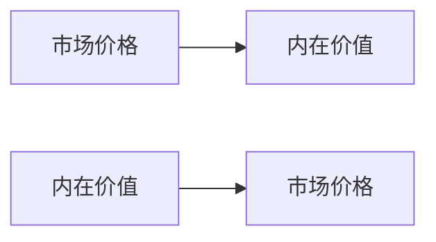
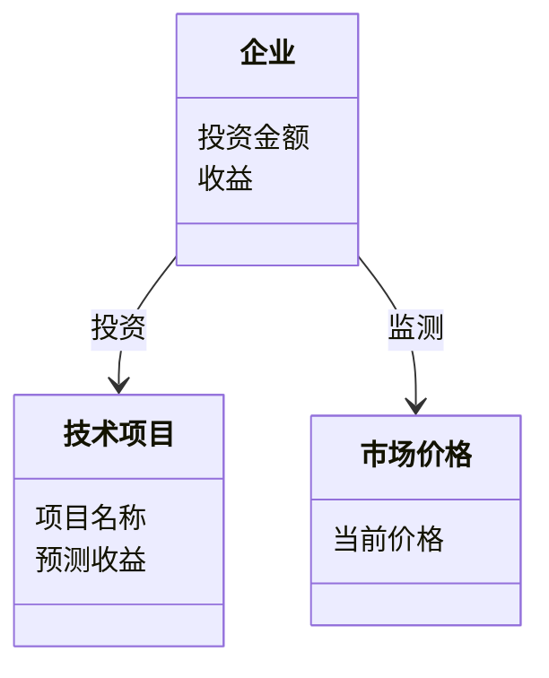
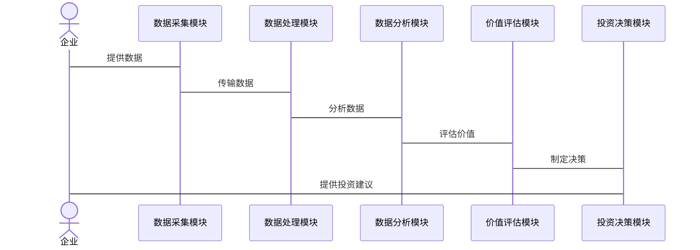

                 


# 格雷厄姆特价股票理论对公司数字化转型策略的影响

> 关键词：格雷厄姆投资理论，数字化转型，价值评估，大数据分析，人工智能，企业战略

> 摘要：本文探讨了格雷厄姆的特价股票理论如何影响公司的数字化转型策略。通过分析格雷厄姆理论的核心概念、数字化转型的背景与挑战，以及两者之间的联系，本文揭示了如何将价值投资的理念与现代数字技术相结合，为企业提供更具前瞻性的转型策略。结合数学模型、算法实现和系统架构设计，本文深入探讨了格雷厄姆理论在数字化转型中的实际应用，并通过案例分析和项目实战，为企业提供切实可行的指导。

---

## 第一部分: 格雷厄姆特价股票理论与数字化转型背景

### 第1章: 格雷厄姆特价股票理论概述

#### 1.1 格雷厄姆投资理论的核心概念
##### 1.1.1 价值投资的基本原理
格雷厄姆的价值投资理论强调以低于内在价值的价格购买股票，长期持有，等待市场的合理估值。其核心在于“安全边际”，即购买价格与内在价值之间的差距，以降低投资风险。内在价值的计算公式为：
$$
\text{内在价值} = \frac{\text{年收益}}{\text{预期收益率}}
$$
例如，如果一只股票的年收益为$10，预期收益率为10%，其内在价值为$100。如果市场价为$80，则该股票具有安全边际。

##### 1.1.2 特价股票的定义与特征
特价股票是指市场价格低于内在价值的股票。其特征包括：
1. **低估性**：市场价格低于内在价值。
2. **稳定性**：公司财务状况稳健，收益稳定。
3. **可计算性**：内在价值可以通过公式计算。

##### 1.1.3 格雷厄姆投资策略的历史演变
格雷厄姆的投资策略起源于20世纪30年代，经过时间的验证，其核心思想仍然适用于现代投资。其策略强调长期投资、分散投资和价值发现。

#### 1.2 数字化转型的背景与挑战
##### 1.2.1 数字化转型的定义与目标
数字化转型是指企业利用数字技术（如人工智能、大数据、云计算等）改变业务模式、流程、文化等，以适应新的商业环境。其目标包括提高效率、降低成本、增强客户体验等。

##### 1.2.2 企业数字化转型的驱动力
数字化转型的驱动力包括：
1. **技术进步**：如人工智能、大数据等技术的发展。
2. **市场竞争**：企业需要通过数字化转型保持竞争力。
3. **客户需求**：客户期望更高效、个性化的服务。

##### 1.2.3 数字化转型中的常见问题与挑战
企业在数字化转型中常面临以下问题：
1. **技术选型**：如何选择合适的技术架构。
2. **数据隐私**：如何保护客户数据。
3. **组织变革**：如何推动组织文化的转变。

#### 1.3 格雷厄姆理论与数字化转型的联系
##### 1.3.1 格雷厄姆理论对企业决策的影响
格雷厄姆理论强调价值投资，这与数字化转型中的价值评估密切相关。企业需要通过数据分析找到具有长期价值的项目。

##### 1.3.2 数字化转型中价值评估的重要性
在数字化转型中，企业需要评估技术项目的价值，这类似于股票投资中的价值评估。格雷厄姆的内在价值计算方法可以用于评估技术项目的潜在收益。

##### 1.3.3 格雷厄姆理论在现代企业中的应用
格雷厄姆理论在现代企业中的应用包括：
1. **投资决策**：通过价值评估选择技术项目。
2. **风险管理**：通过安全边际降低投资风险。

---

## 第二部分: 格雷厄姆特价股票理论的核心要素

### 第2章: 格雷厄姆特价股票理论的核心要素

#### 2.1 格雷厄姆投资模型的数学基础
##### 2.1.1 股票内在价值的计算公式
股票的内在价值可以通过以下公式计算：
$$
\text{内在价值} = \frac{\text{年收益}}{\text{预期收益率}}
$$
例如，如果年收益为$50，预期收益率为8%，则内在价值为$625。

##### 2.1.2 市场价格与内在价值的关系
市场价格与内在价值的关系可以用以下图示表示：


##### 2.1.3 格雷厄姆安全边际的数学模型
安全边际的计算公式为：
$$
\text{安全边际} = \text{内在价值} - \text{市场价格}
$$
如果内在价值为$100，市场价格为$80，则安全边际为$20。

#### 2.2 格雷厄姆投资策略的关键指标
##### 2.2.1 市盈率（P/E）分析
市盈率公式为：
$$
\text{市盈率} = \frac{\text{股价}}{\text{每股收益}}
$$
例如，股价为$50，每股收益为$5，则市盈率为10。

##### 2.2.2 市净率（P/B）分析
市净率公式为：
$$
\text{市净率} = \frac{\text{股价}}{\text{每股净资产}}
$$
例如，股价为$50，每股净资产为$25，则市净率为2。

##### 2.2.3 股息率与股息支付率
股息率公式为：
$$
\text{股息率} = \frac{\text{股息/股}}{\text{股价}}
$$
股息支付率公式为：
$$
\text{股息支付率} = \frac{\text{股息/股}}{\text{每股收益}}
$$

#### 2.3 格雷厄姆投资理论的优缺点
##### 2.3.1 格雷厄姆理论的优点
1. **注重安全边际**：降低投资风险。
2. **长期视角**：注重长期价值而非短期波动。
3. **可量化**：价值评估可以通过公式计算。

##### 2.3.2 格雷厄姆理论的局限性
1. **过于保守**：可能错过短期高增长的机会。
2. **依赖数据质量**：内在价值计算依赖于准确的财务数据。
3. **忽略市场情绪**：未考虑市场情绪对股价的影响。

##### 2.3.3 理论适用性的边界与条件
格雷厄姆理论适用于以下情况：
1. **市场低估阶段**：股价低于内在价值时。
2. **稳健型企业**：财务状况稳定的企业。
3. **长期投资**：适合长期投资者。

---

## 第三部分: 数字化转型中的价值评估与决策

### 第3章: 数字化转型中的价值评估与决策

#### 3.1 数字化转型中的价值评估模型
##### 3.1.1 价值评估的基本框架
数字化转型的价值评估框架包括以下几个步骤：
1. **确定目标**：明确转型的目标。
2. **数据采集**：收集相关数据。
3. **数据分析**：分析数据以评估价值。
4. **制定策略**：根据评估结果制定策略。

##### 3.1.2 格雷厄姆模型在数字化转型中的应用
格雷厄姆模型可以用于评估技术项目的潜在价值。例如，可以通过以下步骤评估一个AI项目的价值：
1. **计算内在价值**：通过收益和预期收益率计算内在价值。
2. **比较市场价格**：比较市场价格与内在价值。
3. **确定安全边际**：如果市场价格低于内在价值，且安全边际足够，可以投资该项目。

##### 3.1.3 数字化转型中的价值评估指标
常用的价值评估指标包括：
1. **投资回报率（ROI）**： ROI = （净收益 / 投资额） × 100%
2. **净现值（NPV）**： NPV = ∑ (CF_t / (1 + r)^t) - 初始投资
3. **内部收益率（IRR）**： IRR 是使 NPV 为零的折现率。

#### 3.2 数据驱动的决策方法
##### 3.2.1 数据分析在价值评估中的作用
数据分析可以帮助企业更准确地评估技术项目的潜在价值。例如，可以通过大数据分析预测市场需求，从而调整投资策略。

##### 3.2.2 大数据技术对企业决策的影响
大数据技术可以通过以下方式影响企业决策：
1. **数据收集**：收集大量数据以支持决策。
2. **数据处理**：清洗和整理数据。
3. **数据分析**：通过分析数据发现趋势和机会。
4. **数据可视化**：通过可视化工具展示分析结果。

##### 3.2.3 数据驱动的决策流程与工具
数据驱动的决策流程包括：
1. **数据收集**：使用爬虫、传感器等工具收集数据。
2. **数据清洗**：去除噪声数据。
3. **数据分析**：使用统计方法分析数据。
4. **数据可视化**：使用工具如Tableau、Power BI等展示数据。
5. **制定策略**：根据分析结果制定决策。

#### 3.3 数字化转型中的风险管理
##### 3.3.1 风险评估的基本方法
风险评估可以通过以下步骤进行：
1. **识别风险**：识别可能的风险因素。
2. **评估风险**：评估每个风险的影响程度。
3. **制定应对策略**：根据评估结果制定应对策略。

##### 3.3.2 格雷厄姆理论中的风险管理策略
格雷厄姆理论强调分散投资以降低风险。在数字化转型中，企业可以通过投资多个项目分散风险。

##### 3.3.3 数字化转型中的风险管理工具与技术
风险管理工具包括：
1. **风险评估模型**：如蒙特卡罗模拟。
2. **监控工具**：如实时监控系统。
3. **预警系统**：如异常检测系统。

---

## 第四部分: 格雷厄姆理论对数字化转型策略的影响

### 第4章: 格雷厄姆理论对数字化转型策略的影响

#### 4.1 格雷厄姆理论对企业战略的影响
##### 4.1.1 价值导向的企业战略
价值导向的企业战略强调通过创造价值来实现长期目标。例如，可以通过技术创新创造新的价值点。

##### 4.1.2 格雷厄姆理论对企业目标设定的启示
格雷厄姆理论启示企业应该设定长期目标，而非短期目标。例如，可以通过长期投资于技术创新来提高企业的核心竞争力。

##### 4.1.3 价值评估在企业战略中的应用
价值评估可以帮助企业确定哪些项目具有长期价值，从而优先投资这些项目。

#### 4.2 格雷厄姆理论与数字化技术的结合
##### 4.2.1 人工智能在价值评估中的应用
人工智能可以通过机器学习算法分析大量数据，帮助企业在数字化转型中发现潜在的价值点。

##### 4.2.2 大数据分析在投资决策中的作用
大数据分析可以通过分析市场趋势、竞争对手行为等，帮助企业在数字化转型中做出更明智的投资决策。

##### 4.2.3 数字化工具对格雷厄姆理论的优化
数字化工具可以通过自动化数据处理和分析，提高格雷厄姆理论的应用效率。

#### 4.3 格雷厄姆理论对数字化转型的长期影响
##### 4.3.1 数字化转型中的长期价值创造
通过格雷厄姆理论的指导，企业可以在数字化转型中创造长期价值，例如通过技术创新提高企业的核心竞争力。

##### 4.3.2 格雷厄姆理论对企业文化的影响
格雷厄姆理论强调长期投资和稳健经营，这种理念可以影响企业文化的形成，推动企业向长期价值导向转变。

##### 4.3.3 格雷厄姆理论与企业社会责任
格雷厄姆理论强调稳健经营，这与企业社会责任理念一致。例如，通过稳健经营实现可持续发展。

---

## 第五部分: 数学模型与算法实现

### 第5章: 数学模型与算法实现

#### 5.1 格雷厄姆价值评估模型的数学实现
##### 5.1.1 模型概述
格雷厄姆价值评估模型可以通过以下步骤实现：
1. **数据收集**：收集企业的财务数据。
2. **数据处理**：清洗和整理数据。
3. **内在价值计算**：使用公式计算内在价值。
4. **安全边际计算**：计算安全边际。
5. **投资决策**：根据安全边际决定是否投资。

##### 5.1.2 Python代码实现
以下是使用Python实现格雷厄姆价值评估模型的代码示例：
```python
def calculate_intrinsic_value(annual_profit, required_return):
    return annual_profit / required_return

def calculate_margin_of_safety(intrinsic_value, market_price):
    return intrinsic_value - market_price

# 示例数据
annual_profit = 1000000  # 年利润（美元）
required_return = 0.10    # 预期收益率
market_price = 800000     # 市场价格（美元）

intrinsic_value = calculate_intrinsic_value(annual_profit, required_return)
margin_of_safety = calculate_margin_of_safety(intrinsic_value, market_price)

print(f"内在价值: ${intrinsic_value}")
print(f"安全边际: ${margin_of_safety}")
```

#### 5.2 基于大数据的数字化转型分析算法
##### 5.2.1 算法概述
基于大数据的数字化转型分析算法可以通过以下步骤实现：
1. **数据收集**：收集企业的数字化转型相关数据。
2. **数据清洗**：清洗和整理数据。
3. **数据分析**：使用机器学习算法分析数据。
4. **价值评估**：评估技术项目的潜在价值。

##### 5.2.2 算法实现
以下是使用Python实现基于大数据的数字化转型分析算法的代码示例：
```python
import pandas as pd
from sklearn.linear_model import LinearRegression

# 示例数据
data = pd.DataFrame({
    '投资金额': [100, 200, 300, 400, 500],
    '收益': [150, 300, 450, 600, 750]
})

# 训练线性回归模型
model = LinearRegression()
model.fit(data[['投资金额']], data['收益'])

# 预测收益
predicted_revenue = model.predict([[600]])
print(f"预测收益: {predicted_revenue[0]}")
```

#### 5.3 算法原理与数学模型
##### 5.3.1 算法原理
基于大数据的数字化转型分析算法通过机器学习模型分析数据，预测技术项目的潜在收益。

##### 5.3.2 数学模型
线性回归模型的数学公式为：
$$
y = a x + b
$$
其中，$y$ 是收益，$x$ 是投资金额，$a$ 和 $b$ 是模型参数。

---

## 第六部分: 系统分析与架构设计方案

### 第6章: 系统分析与架构设计方案

#### 6.1 问题场景介绍
在数字化转型中，企业需要通过技术手段实现业务模式的转变。例如，一家传统制造企业可以通过引入物联网技术实现智能化生产。

#### 6.2 项目介绍
本项目旨在通过技术手段优化企业的生产流程，提高效率。

#### 6.3 系统功能设计
##### 6.3.1 领域模型
以下是领域模型的类图：


##### 6.3.2 系统架构设计
以下是系统架构设计的架构图：


##### 6.3.3 系统接口设计
以下是系统接口设计的接口图：


##### 6.3.4 系统交互设计
以下是系统交互设计的交互流程图：


---

## 第七部分: 项目实战

### 第7章: 项目实战

#### 7.1 环境安装
##### 7.1.1 系统环境
建议使用Python 3.8及以上版本。

##### 7.1.2 安装依赖
需要安装以下Python库：
```
pip install pandas scikit-learn mermaid
```

#### 7.2 系统核心实现源代码
##### 7.2.1 核心代码实现
以下是价值评估模型的Python代码：
```python
import pandas as pd
from sklearn.linear_model import LinearRegression

def calculate_intrinsic_value(annual_profit, required_return):
    return annual_profit / required_return

def calculate_margin_of_safety(intrinsic_value, market_price):
    return intrinsic_value - market_price

# 示例数据
annual_profit = 1000000  # 年利润（美元）
required_return = 0.10    # 预期收益率
market_price = 800000     # 市场价格（美元）

intrinsic_value = calculate_intrinsic_value(annual_profit, required_return)
margin_of_safety = calculate_margin_of_safety(intrinsic_value, market_price)

print(f"内在价值: ${intrinsic_value}")
print(f"安全边际: ${margin_of_safety}")
```

##### 7.2.2 代码应用解读与分析
上述代码实现了格雷厄姆价值评估模型的计算。通过输入年利润和预期收益率，计算内在价值和安全边际，从而判断是否投资。

#### 7.3 实际案例分析和详细讲解剖析
##### 7.3.1 案例背景
假设某企业计划投资一个AI项目，年利润为$1,000,000，预期收益率为10%，市场价格为$800,000。

##### 7.3.2 数据处理与分析
使用上述代码计算内在价值和安全边际：
$$
\text{内在价值} = \frac{1,000,000}{0.10} = 1,000,000
$$
$$
\text{安全边际} = 1,000,000 - 800,000 = 200,000
$$
由于安全边际为正，说明该股票具有投资价值。

##### 7.3.3 投资决策
基于计算结果，企业可以决定投资该项目。

#### 7.4 项目小结
通过上述案例分析，可以发现格雷厄姆理论在数字化转型中的应用价值。通过数学模型和算法实现，企业可以更科学地进行投资决策。

---

## 第八部分: 总结与展望

### 第8章: 总结与展望

#### 8.1 总结
格雷厄姆的特价股票理论在数字化转型中具有重要的指导意义。通过价值评估和风险管理，企业可以更科学地制定数字化转型策略，实现长期价值创造。

#### 8.2 最佳实践 tips
1. **数据驱动决策**：通过数据分析支持投资决策。
2. **风险管理**：通过分散投资降低风险。
3. **长期视角**：注重长期价值而非短期收益。

#### 8.3 小结
格雷厄姆理论与数字化转型的结合为企业提供了新的思路。通过数学模型和算法实现，企业可以更科学地进行投资决策。

#### 8.4 注意事项
1. **数据质量**：确保数据准确可靠。
2. **模型选择**：选择合适的算法模型。
3. **团队协作**：加强团队协作，确保项目顺利进行。

#### 8.5 拓展阅读
1. **《格雷厄姆投资经典》**：深入理解格雷厄姆投资理论。
2. **《大数据分析与应用》**：学习大数据技术在投资中的应用。
3. **《人工智能在金融中的应用》**：探索人工智能在投资决策中的应用。

---

## 作者：AI天才研究院/AI Genius Institute & 禅与计算机程序设计艺术 /Zen And The Art of Computer Programming

