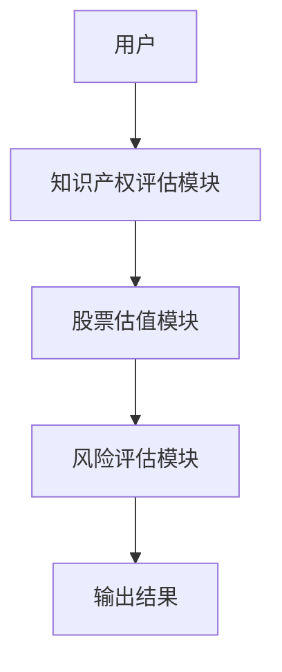

                 


# 《格雷厄姆特价股票理论对公司知识产权战略的影响》

---

## 关键词

- 格雷厄姆特价股票理论
- 知识产权战略
- 价值投资
- 企业价值评估
- 股票估值

---

## 摘要

本文探讨了格雷厄姆特价股票理论与公司知识产权战略之间的关系，分析了如何利用格雷厄姆的选股原则优化知识产权管理，以提升企业价值和投资吸引力。文章从理论基础、数学模型、系统架构到实际案例，全面解析了知识产权在企业估值中的作用，以及如何通过格雷厄姆的视角发现潜在投资机会。

---

## 第一部分：背景介绍

### 第1章：格雷厄姆特价股票理论概述

#### 1.1 格雷厄姆特价股票理论的核心概念

格雷厄姆的特价股票理论是价值投资的基石，强调以低于内在价值的价格购买股票。核心概念包括：

- **内在价值**：企业未来现金流的现值，是投资决策的基础。
- **安全边际**：买入价格低于内在价值，以降低投资风险。
- **低估股票**：市盈率、市净率等指标低于行业平均水平的股票。

#### 1.2 知识产权战略的基本概念

知识产权是企业核心竞争力的重要组成部分，包括专利、商标、版权等。其战略管理涉及：

- **知识产权评估**：量化专利、商标等资产的价值。
- **战略实施**：通过知识产权保护和运用，提升企业市场地位。
- **风险控制**：防范知识产权侵权和纠纷。

---

### 第2章：问题背景与问题描述

#### 2.1 问题背景

- 当前投资环境中，企业知识产权的价值越来越受到关注。
- 格雷厄姆的理论在现代企业战略中的应用有限，需结合新兴领域如知识产权进行创新。

#### 2.2 问题描述

- 知识产权如何影响企业价值？
- 格雷厄姆理论如何与现代知识产权战略结合？
- 知识产权在企业估值中的量化方法是什么？

---

## 第二部分：核心概念与联系

### 第3章：核心概念与联系

#### 3.1 核心概念原理

- **格雷厄姆理论**：基于基本面分析，寻找低估股票。
- **知识产权战略**：通过保护和运用知识产权，提升企业竞争力。

#### 3.2 概念对比与联系

| 概念       | 格雷厄姆理论                  | 知识产权战略                |
|------------|-----------------------------|-----------------------------|
| 核心目标   | 发现低估投资机会              | 提升企业市场竞争力           |
| 评估方法   | 市盈率、市净率                | 专利数量、法律保护力度       |
| 风险控制   | 安全边际                     | 知识产权侵权风险控制         |

#### 3.3 ER实体关系图

```mermaid
er
    class 知识产权 {
        专利号
        申请日期
        发明人
    }
    class 企业 {
        企业ID
        企业名称
        估值
    }
    知识产权 --> 企业
```

---

## 第三部分：算法原理讲解

### 第4章：算法原理

#### 4.1 格雷厄姆理论的数学模型

格雷厄姆的内在价值公式：

$$ V = \sum_{t=1}^{n} \frac{C_t}{(1+r)^t} $$

其中，\( V \) 为内在价值，\( C_t \) 为第 \( t \) 年的现金流，\( r \) 为折现率。

#### 4.2 知识产权价值评估的数学模型

使用现金流折现法评估知识产权价值：

$$ PV = \sum_{t=1}^{n} \frac{CF_t}{(1+k)^t} $$

其中，\( CF_t \) 为知识产权带来的现金流，\( k \) 为资本成本。

#### 4.3 机器学习模型

```python
from sklearn.linear_model import LinearRegression

# 假设X为知识产权相关特征，y为股票价格
model = LinearRegression()
model.fit(X, y)
```

---

## 第四部分：系统分析与架构设计

### 第5章：系统分析与架构设计

#### 5.1 系统功能设计

- **知识产权评估模块**：量化知识产权价值。
- **股票估值模块**：基于格雷厄姆理论进行估值。
- **风险评估模块**：评估知识产权相关风险。

#### 5.2 系统架构图



---

## 第五部分：项目实战

### 第6章：项目实战

#### 6.1 环境安装

- Python 3.8+
- Scikit-learn、Pandas、NumPy

#### 6.2 核心实现

```python
import pandas as pd
import numpy as np

# 数据加载
data = pd.read_csv('ip_data.csv')

# 计算内在价值
def calculate_intrinsic_value(enterprise_value, revenue, margin):
    return enterprise_value * (revenue * margin)

# 应用格雷厄姆理论筛选股票
def gray_gram_filter(data):
    selected = data[(data['市盈率'] < data['行业平均市盈率']) &
                    (data['市净率'] < data['行业平均市净率'])]
    return selected

# 示例应用
selected_stocks = gray_gram_filter(data)
print(selected_stocks)
```

---

## 第六部分：总结与最佳实践

### 第7章：总结与最佳实践

#### 7.1 总结

- 格雷厄姆理论为知识产权战略提供了新的视角。
- 知识产权在企业估值中的作用日益重要。
- 结合两者可优化投资决策。

#### 7.2 最佳实践 tips

- 定期评估知识产权价值。
- 结合行业趋势调整战略。
- 注意法律风险，确保合规性。

#### 7.3 拓展阅读

- 格雷厄姆的《 Intelligent Investor》
- 知识产权管理经典书籍

---

## 作者

作者：AI天才研究院/AI Genius Institute & 禅与计算机程序设计艺术 /Zen And The Art of Computer Programming

---

这篇文章通过系统分析和实际案例，详细探讨了格雷厄姆理论与知识产权战略的结合，为投资者和企业管理者提供了新的视角和工具。

