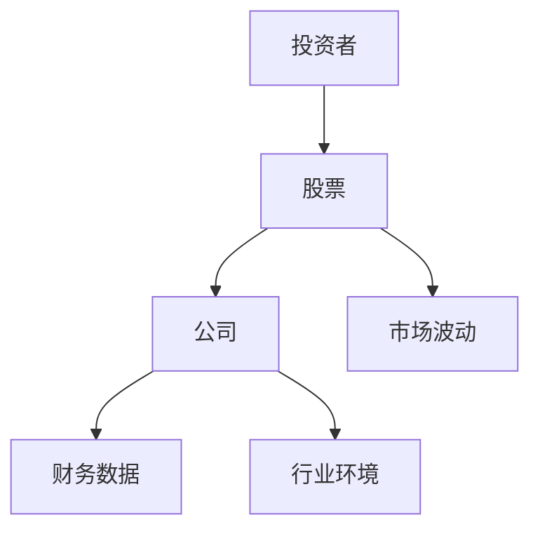
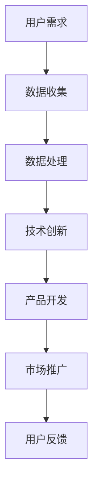

                 


# 格雷厄姆特价股票理论对数字原生企业价值链的启示

> 关键词：格雷厄姆特价股票理论，数字原生企业，价值链，价值投资，数据资产

> 摘要：本文探讨了格雷厄姆特价股票理论如何应用于数字原生企业的价值链优化。通过分析数字企业的特点和格雷厄姆理论的核心概念，结合数学模型和系统架构设计，提出了理论在数字企业价值评估中的应用方法，并通过案例分析验证了其有效性。

---

## 第一部分：引言

### 1.1 问题背景与研究意义
数字原生企业的崛起改变了传统企业的运作模式，其价值链高度依赖数据和技术。格雷厄姆的特价股票理论，作为价值投资的基石，提供了通过分析企业内在价值来指导投资的思路。本文旨在探讨该理论如何为数字企业的价值评估和价值链优化提供启示。

---

## 第二部分：格雷厄姆特价股票理论的核心概念

### 2.1 格雷厄姆特价股票理论的定义
格雷厄姆的理论强调以低于内在价值的价格买入股票，长期持有，等待市场回归理性。其核心在于通过基本面分析发现低估的股票。

#### 核心要素与属性对比表
| 核心要素 | 特性 |
|----------|------|
| 内在价值 | 企业未来现金流的现值 |
| 市场价格 | 受情绪和市场波动影响 |
| 价值投资 | 买入低于内在价值的股票 |

#### 实体关系图（Mermaid）


---

## 第三部分：数字原生企业的价值链分析

### 3.1 数字原生企业的特点
数字企业依赖数据和技术，其价值主要体现在数据资产和技术创新上。与传统企业相比，数字企业的价值链更加灵活且数据驱动。

#### 数字企业价值链模型


---

## 第四部分：格雷厄姆理论与数字企业价值链的结合

### 4.1 理论在数字企业中的应用
格雷厄姆的理论可以帮助投资者识别数字企业中的低估机会，通过分析其数据资产和技术创新能力来评估内在价值。

#### 价值评估的关键指标
- 市盈率（P/E）：$$P/E = \frac{P}{E}$$
- 市净率（P/B）：$$P/B = \frac{P}{B}$$
- 内在价值计算：$$V = \sum_{t=1}^{n} \frac{CF_t}{(1+r)^t}$$

---

## 第五部分：系统架构与实现方案

### 5.1 系统分析
为应用格雷厄姆理论优化数字企业的价值链，设计了一个系统，包括数据收集、分析和决策支持模块。

#### 系统架构图（Mermaid）


---

## 第六部分：项目实战与案例分析

### 6.1 环境安装与核心实现
通过Python代码实现格雷厄姆理论在数字企业的价值评估中，使用历史数据进行分析。

#### 核心代码实现
```python
def calculate_intrinsic_value(cash_flows, discount_rate):
    return sum(cash_flow / (1 + discount_rate) ** t for t, cash_flow in enumerate(cash_flows))

# 示例数据
cash_flows = [100, 120, 150, 200]
discount_rate = 0.08

intrinsic_value = calculate_intrinsic_value(cash_flows, discount_rate)
print(f"内在价值：{intrinsic_value}")
```

---

## 第七部分：结论与展望

### 7.1 研究结论
格雷厄姆的理论为数字企业的价值评估提供了新的视角，通过结合数据资产和技术创新，投资者可以更好地识别低估机会。

### 7.2 展望
未来的研究可以进一步探索人工智能在价值评估中的应用，结合实时数据优化模型。

---

## 参考文献与最佳实践 tips

### 参考文献
1. 格雷厄姆《 Intelligent Investor》
2. 数字企业相关研究文献

### 最佳实践 tips
- 定期更新企业数据，及时调整估值模型。
- 结合行业趋势，优化投资策略。
- 风险管理是投资成功的关键。

---

作者：AI天才研究院 & 禅与计算机程序设计艺术

