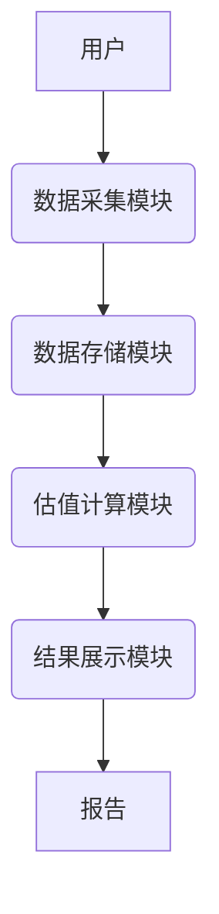

                 


```markdown
# 《格雷厄姆特价股票理论对数字原生企业估值的启示》

---

## 关键词：
- 格雷厄姆特价股票理论
- 数字原生企业
- 企业估值
- 金融模型
- 数字化转型

---

## 摘要：
本文探讨了格雷厄姆特价股票理论在数字原生企业估值中的应用，分析了数字原生企业的特殊性及其对传统估值方法的挑战，提出了结合现代金融工具优化后的估值模型，并通过实际案例和系统设计展示了理论的具体应用。文章旨在为投资者和企业管理者提供新的视角和方法，以应对数字时代的估值难题。

---

## 第1章：背景介绍

### 1.1 格雷厄姆特价股票理论的核心概念

#### 1.1.1 问题背景与问题描述
格雷厄姆特价股票理论由 Benjamin Graham 提出，是价值投资的基础。传统企业估值方法在数字时代面临挑战，尤其是数字原生企业的崛起，其高增长、轻资产、数据驱动的特点使得传统估值方法难以适用。

#### 1.1.2 格雷厄姆理论的起源与发展
格雷厄姆是价值投资之父，其理论强调安全边际和内在价值。核心在于识别被低估的股票，通过基本面分析和安全边际降低风险。

#### 1.1.3 格雷厄姆理论在现代金融中的应用
尽管格雷厄姆理论在传统金融中广泛应用，但其在数字原生企业的应用仍需调整，以适应其独特属性。

### 1.2 数字原生企业的定义与特点

#### 1.2.1 数字原生企业的概念与范畴
数字原生企业指从成立之初就基于数字技术的企业，如互联网公司、金融科技公司。其特点包括轻资产、数据驱动、高增长和高波动性。

#### 1.2.2 数字原生企业的核心属性与特征
- 依赖数据和算法
- 高增长和高研发投入
- 资产轻，客户获取成本高
- 估值高度依赖未来现金流预测

#### 1.2.3 数字原生企业的商业模式与盈利模式
- 订阅模式
- 平台模式
- 数据变现

---

## 第2章：格雷厄姆特价股票理论的核心原理

### 2.1 格雷厄姆特价股票理论的数学模型

#### 2.1.1 格雷厄姆估值模型的公式推导
格雷厄姆的内在价值公式：
$$
\text{内在价值} = \frac{\text{净利润} + \text{折旧和摊销} - \text{资本支出}}{\text{资本成本}}
$$

#### 2.1.2 格雷厄姆安全边际的概念与计算
安全边际 = 市场价格 × (1 - 折扣率)

#### 2.1.3 格雷厄姆投资策略的数学表达
$$
\text{投资价值} = \text{内在价值} \times (1 + \text{安全边际})
$$

### 2.2 格雷厄姆理论与数字原生企业的结合

#### 2.2.1 数字原生企业的估值特殊性
- 无形资产占比高
- 未来现金流预测难度大
- 市盈率和市销率常用，但存在不确定性

#### 2.2.2 格雷厄姆理论在数字企业中的适用性
- 强调安全边际
- 依赖未来现金流预测
- 数据驱动的估值模型

#### 2.2.3 数字企业估值中的关键指标
- 用户获取成本（CAC）
- 每用户平均收入（ARPU）
- 经济利润（Economic Profit）

---

## 第3章：数字原生企业的估值挑战与解决方案

### 3.1 数字原生企业的估值难点

#### 3.1.1 数据驱动的估值问题
数据质量、数据隐私和数据量对估值的影响。

#### 3.1.2 高增长与高波动性的平衡
高增长带来高预期，但波动性可能导致估值偏差。

#### 3.1.3 数字企业的无形资产评估
品牌价值、客户关系和数据资产的估值难度。

### 3.2 格雷厄姆理论的优化与调整

#### 3.2.1 传统格雷厄姆模型的局限性
- 低估无形资产
- 未充分考虑数据和算法的价值
- 无法应对高增长企业的高估值压力

#### 3.2.2 数字企业估值中的调整策略
- 结合市场数据和行业基准
- 调整内在价值公式，引入增长率因子
- 使用动态估值模型

#### 3.2.3 结合现代金融工具的改进方案
引入期权定价模型和蒙特卡洛模拟，增强估值的动态性和准确性。

---

## 第4章：格雷厄姆理论在数字企业估值中的具体应用

### 4.1 格雷厄姆模型的数字化改造

#### 4.1.1 数据收集与处理流程
- 数据清洗
- 数据标准化
- 数据特征提取

#### 4.1.2 数字化估值模型的构建
- 线性回归模型
- 时间序列分析
- 机器学习模型（如随机森林、神经网络）

#### 4.1.3 模型的验证与优化
- 回测分析
- 灵敏度分析
- 参数调优

### 4.2 数字企业估值的系统架构设计

#### 4.2.1 系统功能模块划分
- 数据采集模块
- 估值计算模块
- 结果展示与分析模块

#### 4.2.2 数据流与信息处理流程
$$
\text{数据} \rightarrow \text{清洗} \rightarrow \text{特征提取} \rightarrow \text{模型计算} \rightarrow \text{结果展示}
$$

#### 4.2.3 系统性能与扩展性考虑
- 高可用性设计
- 高扩展性架构
- 高效数据处理能力

---

## 第5章：案例分析与实际应用

### 5.1 成功案例分析

#### 5.1.1 某知名数字企业的估值实践
以某互联网公司为例，分析其估值过程和结果。

#### 5.1.2 格雷厄姆模型的应用效果
展示模型计算的内在价值和市场价值对比。

#### 5.1.3 估值结果与市场表现对比
比较实际股价与估值结果，验证模型的有效性。

### 5.2 失败案例分析

#### 5.2.1 估值偏差的原因
- 数据偏差
- 模型假设不合理
- 市场环境变化

#### 5.2.2 数字企业特殊性的影响
- 周期性波动
- 竞争加剧
- 技术快速迭代

#### 5.2.3 对未来估值的启示
- 更加关注数据质量和实时性
- 引入更多的市场反馈机制
- 定期更新估值模型

---

## 第6章：系统分析与架构设计方案

### 6.1 问题场景介绍

#### 6.1.1 数字企业估值的复杂性
- 数据源多样
- 业务模式复杂
- 市场变化快

#### 6.1.2 系统需求分析
- 实时数据处理
- 高效计算能力
- 用户友好界面

#### 6.1.3 用户角色与权限划分
- 投资者用户
- 管理员用户
- 数据分析师用户

### 6.2 系统功能设计

#### 6.2.1 数据采集模块
- 数据接口开发
- 数据爬取与清洗
- 数据存储与管理

#### 6.2.2 估值计算模块
- 模型选择与参数设置
- 计算引擎开发
- 结果存储与输出

#### 6.2.3 结果展示与分析模块
- 数据可视化
- 结果对比分析
- 报告生成与导出

### 6.3 系统架构设计

#### 6.3.1 系统架构图


#### 6.3.2 系统性能与扩展性
- 使用分布式架构
- 异步任务处理
- 容器化部署

---

## 第7章：项目实战

### 7.1 环境安装与配置

```bash
pip install numpy pandas scikit-learn matplotlib
```

### 7.2 核心实现源代码

```python
import numpy as np
import pandas as pd
from sklearn.ensemble import RandomForestRegressor

def calculate_intrinsic_value(financial_data):
    # 假设financial_data是包含必要财务指标的DataFrame
    # 使用随机森林回归模型进行预测
    model = RandomForestRegressor(n_estimators=100, random_forest=0.5)
    model.fit(financial_data[['revenue', 'profit', 'growth']], financial_data['value'])
    return model.predict([[revenue, profit, growth]])

# 示例数据
data = {
    'revenue': [100, 200, 300],
    'profit': [20, 30, 40],
    'growth': [0.1, 0.15, 0.2]
}
df = pd.DataFrame(data)
print(calculate_intrinsic_value(df))
```

### 7.3 实际案例分析与解读

#### 7.3.1 案例背景
以某互联网公司为例，分析其财务数据和市场表现。

#### 7.3.2 数据处理与模型训练
- 数据清洗
- 特征工程
- 模型训练

#### 7.3.3 结果分析与策略制定
- 估值结果对比
- 投资决策建议

### 7.4 项目小结

---

## 第8章：总结与展望

### 8.1 核心要点回顾
- 格雷厄姆理论的适用性
- 数字原生企业的估值挑战
- 数字化改造的必要性

### 8.2 未来展望
- 结合更多现代金融工具
- 开发更智能化的估值系统
- 探索数据科学与金融的结合

### 8.3 最佳实践 tips
- 定期更新模型
- 关注市场变化
- 保持数据的实时性

### 8.4 注意事项
- 数据质量至关重要
- 模型需结合实际
- 投资需谨慎

### 8.5 拓展阅读
- 推荐书籍：《证券分析》（Benjamin Graham）
- 推荐论文：《大数据在金融中的应用》
- 推荐工具：Python金融分析库（如Pandas, NumPy）

---

## 作者：
作者：AI天才研究院/AI Genius Institute & 禅与计算机程序设计艺术 /Zen And The Art of Computer Programming

---

感谢您的阅读！如需进一步探讨或获取更多资源，请随时联系！
```

