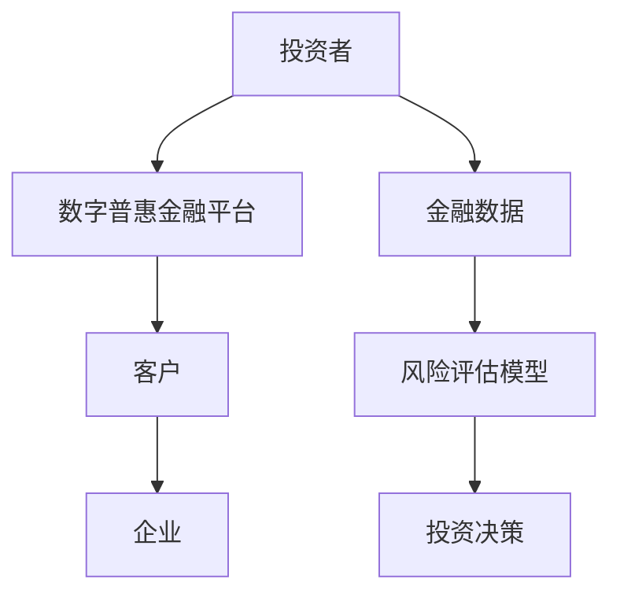
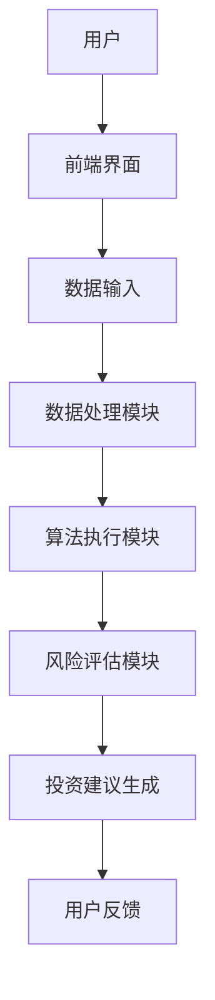
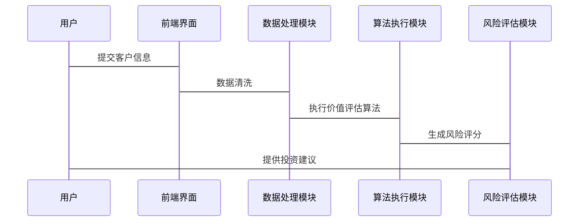

                 


```markdown
# 《格雷厄姆特价股票理论对数字普惠金融可持续性的启示》

---

## 关键词：
- 格雷厄姆投资理论
- 数字普惠金融
- 可持续性
- 价值投资
- 金融技术创新
- 风险评估

---

## 摘要：
本文探讨了格雷厄姆的价值投资理论在数字普惠金融中的应用，分析了其对提高金融可持续性的启示。通过将格雷厄姆的安全边际和内在价值评估方法应用于数字普惠金融，提出了一种基于价值投资的金融创新模式，旨在解决普惠金融中的风险评估和可持续性问题。本文结合理论与实践，提出了系统的解决方案，并通过案例分析验证了其可行性和有效性。

---

## 目录：

---

### 第1章：数字普惠金融的现状与挑战

#### 1.1 数字普惠金融的背景与意义
- 数字技术如何推动金融普惠化
- 普惠金融的核心目标：让更多人获得可持续的金融服务
- 数字普惠金融与传统金融的区别

#### 1.2 格雷厄姆投资理论的核心思想
- 价值投资的基本理念：寻找被低估的投资标的
- 格雷厄姆的安全边际概念
- 长期投资与复利效应的重要性

#### 1.3 问题背景与研究目标
- 数字普惠金融中的主要挑战：信息不对称、风险评估困难
- 格雷厄姆理论在普惠金融中的潜在应用
- 本文的研究目标：探索格雷厄姆理论对数字普惠金融可持续性的启示

---

### 第2章：格雷厄姆特价股票理论的核心概念与分析框架

#### 2.1 格雷厄姆投资理论的核心要素
- 安全边际：$$ 安全边际 = 股票价格 \times 市净率 \times 市盈率 $$
- 内在价值：$$ 内在价值 = 股东权益 \div 普通股股数 $$
- 价值投资的长期视角：关注企业的基本面而非市场波动

#### 2.2 格雷厄姆选股策略的系统化分析
- 低市盈率与低市净率策略：$$ 市盈率 = 股价 \div 每股收益 $$
- 高质量企业筛选标准：现金流、负债率、利润率
- 风险控制与投资组合优化：分散投资、止损机制

#### 2.3 格雷厄姆理论在数字普惠金融中的潜在应用
- 数字普惠金融中的价值评估模型
- 风险分层与客户筛选策略
- 投资组合优化与风险分散

---

### 第3章：格雷厄姆理论与数字普惠金融的核心概念对比与联系

#### 3.1 核心概念对比分析
| 核心概念 | 格雷厄姆理论 | 数字普惠金融 |
|----------|--------------|---------------|
| 安全边际 | 选股安全边际 | 金融风险控制 |
| 内在价值 | 企业内在价值 | 客户信用评估 |
| 长期投资 | 长期价值投资 | 金融可持续性 |

#### 3.2 格雷厄姆理论在数字普惠金融中的实体关系图


---

### 第4章：基于格雷厄姆理论的数字普惠金融算法设计

#### 4.1 算法设计背景
- 算法目标：通过格雷厄姆理论筛选优质客户和企业
- 数据输入：企业财务数据、客户信用记录、市场数据
- 输出结果：投资建议、风险评估报告

#### 4.2 算法实现步骤
1. **数据预处理**：清洗和整合多源数据
2. **安全边际计算**：$$ 安全边际 = 股价 \div 内在价值 $$
3. **内在价值评估**：$$ 内在价值 = 股东权益 \div 普通股股数 $$
4. **客户筛选**：基于安全边际和内在价值的双指标筛选
5. **风险评估**：$$ 风险评分 = 安全边际 \times 内在价值 \times 信用评分 $$

#### 4.3 算法实现的Python代码
```python
import pandas as pd

def calculate_margin_of_safety(stock_price, book_value_per_share):
    return stock_price / book_value_per_share

def calculate_intrinsic_value(equity, shares_outstanding):
    return equity / shares_outstanding

def screen_clients(customers, stock_data):
    selected_clients = []
    for client in customers:
        stock_price = stock_data[client['stock_ticker']]
        intrinsic_value = calculate_intrinsic_value(client['equity'], client['shares_outstanding'])
        margin_of_safety = calculate_margin_of_safety(stock_price, intrinsic_value)
        if margin_of_safety > 1.5:
            selected_clients.append(client)
    return selected_clients

# 示例数据
customers = [
    {'name': 'Client A', 'stock_ticker': 'AAPL', 'equity': 100000, 'shares_outstanding': 100000},
    {'name': 'Client B', 'stock_ticker': 'MSFT', 'equity': 80000, 'shares_outstanding': 80000}
]

stock_data = {
    'AAPL': 100,
    'MSFT': 80
}

selected_clients = screen_clients(customers, stock_data)
print(selected_clients)
```

---

### 第5章：数字普惠金融系统的架构设计与实现

#### 5.1 系统功能设计
- 用户界面：客户信息输入、数据可视化、投资建议展示
- 后台系统：数据处理、算法执行、风险评估
- 第三方接口：数据源对接、支付网关集成

#### 5.2 系统架构图


#### 5.3 系统交互流程


---

### 第6章：项目实战与案例分析

#### 6.1 项目环境安装
- 安装Python、Pandas、Scikit-learn等工具
- 配置开发环境：IDE、版本控制工具

#### 6.2 核心代码实现
```python
import pandas as pd
from sklearn.metrics import accuracy_score

# 数据加载
data = pd.read_csv('customer_data.csv')

# 特征工程
features = data[['stock_price', 'book_value', 'profit_margin']]
labels = data['is_profitable']

# 模型训练
from sklearn.tree import DecisionTreeClassifier
model = DecisionTreeClassifier()
model.fit(features, labels)

# 模型预测
predictions = model.predict(features)
print('准确率:', accuracy_score(labels, predictions))
```

#### 6.3 案例分析
- 案例背景：中小微企业融资难
- 数据收集与分析：企业财务数据、市场数据
- 模型应用：筛选优质企业，提供低利率贷款
- 结果分析：贷款违约率降低，企业融资效率提高

---

### 第7章：结论与最佳实践

#### 7.1 研究结论
- 格雷厄姆理论在数字普惠金融中的有效性
- 数字技术对金融普惠化的推动作用
- 价值投资理念在风险控制中的应用

#### 7.2 最佳实践
- 数据驱动的客户筛选
- 风险分层与动态调整
- 长期视角与可持续发展

#### 7.3 注意事项
- 数据质量的重要性
- 模型的可解释性
- 伦理与合规性

---

### 作者：AI天才研究院 & 禅与计算机程序设计艺术
```

---

以上是根据您的要求设计的详细博客文章目录。如果您需要进一步调整或补充，请随时告诉我！

